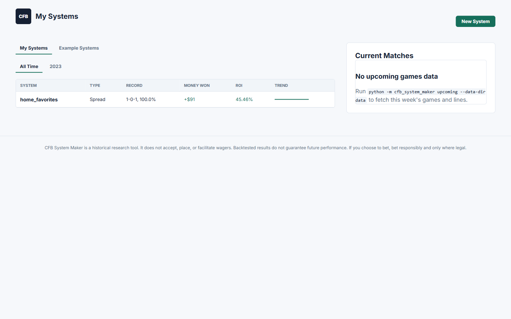

# CFB System Maker

Python CLI + Flask tool for backtesting college football betting systems against
historical CollegeFootballData (CFBD) games and betting lines. Build a saved
system, see its record/ROI/money-won at a glance, and drill into filters the
way Sports Insights Bet Labs does.



## Quick start

No CFBD token needed for this part — `sample` uses bundled sample data.

```powershell
git clone <this-repo-url>
cd cfb-site
python -m venv .venv
.\.venv\Scripts\Activate.ps1
pip install -r requirements.lock
python -m cfb_system_maker sample --data-dir data
python -m cfb_system_maker web --data-dir data
```

Open `http://127.0.0.1:5000`.

`sample` writes bundled 2023 sample games/lines to `data/` and prints two example
backtests to the console so you can sanity-check the pipeline without a token.

## Full data build (real CFBD data)

Real-data commands (`fetch`, `upcoming`, etc.) need a CFBD API token — see
[Configuration](#configuration) below for how to set it up.

Build the full historical dataset (2013 is the earliest season CFBD has betting
lines for):

```powershell
python -m cfb_system_maker fetch --season (2013..2025) --provider consensus --data-dir data
python -m cfb_system_maker build --season (2013..2025) --provider consensus --data-dir data
python -m cfb_system_maker enrich --data-dir data
```

- `fetch` pulls games + betting lines per season from CFBD and writes raw JSON to `data/raw/`.
- `build` joins games to lines and writes the processed table to `data/processed/games.csv`.
- `enrich` joins in running season-to-date features (and any `scrape`/`graphql`/`actionnetwork`
  data present) to produce `data/processed/features.json`. Run it after every `build`.

### Advanced: broader data sources

These are alternate/supplementary fetch paths — none of them feed `build`/`backtest`
directly (only `fetch`'s `games`/`lines` files do), but `enrich` picks up what they write.

```powershell
# Every CFBD REST endpoint the vendored client exposes, written to data/raw/
python -m cfb_system_maker scrape --season 2023 2024 --data-dir data
python -m cfb_system_maker scrape --season 2023 --only games lines sp
python -m cfb_system_maker scrape --season 2023 --include-per-game --fbs-only

# Bulk GraphQL pull (Patreon Tier 3 CFBD accounts only), written to data/graphql/
python -m cfb_system_maker graphql --season 2023 --data-dir data
python -m cfb_system_maker graphql --season 2023 --game-player-stats

# Action Network odds scrape, written to data/raw/actionnetwork/
python -m cfb_system_maker actionnetwork --season 2023 --data-dir data
```

## Weekly in-season refresh

Bring the dataset current during the season:

```powershell
python -m cfb_system_maker fetch --season 2026 --provider consensus --data-dir data
python -m cfb_system_maker build --season 2026 --provider consensus --data-dir data
python -m cfb_system_maker enrich --data-dir data
```

This re-pulls the current season's completed games/lines and refreshes
`features.json`. To also see this week's *upcoming* (unplayed) games with
posted lines on the dashboard's "Current Matches" panel, run:

```powershell
python -m cfb_system_maker upcoming --data-dir data
```

`upcoming` writes `data/processed/upcoming.csv` separately — it never touches
`games.csv`, so it doesn't replace the `fetch`/`build`/`enrich` refresh above.

## Backtest filters (CLI reference)

```powershell
python -m cfb_system_maker backtest --data-dir data --side home --favorite --min-spread -14 --max-spread -3.5
python -m cfb_system_maker backtest --data-dir data --side away --underdog --conference SEC
python -m cfb_system_maker backtest --data-dir data --bet-type total --total-side over
```

Available filters: `--bet-type`, `--side`, `--total-side`, `--season`, `--week`, `--team`,
`--conference`, `--provider`, `--favorite`, `--underdog`, `--home`, `--away`, `--fade`,
`--min-spread`, `--max-spread`, `--min-total`, `--max-total`, and `--holdout-season`
(prints an in-sample/holdout split instead of a single result). Use `--save <name>` /
`--load <name>` to persist systems to `data/systems/` (`<name>` must match
`[A-Za-z0-9_-]+` — letters, digits, underscore, hyphen only).

## Configuration

| Variable | Purpose | Default |
| --- | --- | --- |
| `CFB_DATA_DIR` | Default `--data-dir` for `web` | `data` |
| `CFB_WEB_HOST` | Default `--host` for `web` | `127.0.0.1` |
| `CFB_WEB_PORT` | Default `--port` for `web` | `5000` |

Explicit CLI flags (`--data-dir`, `--host`, `--port`) always win over these env vars.

`python -m cfb_system_maker web` serves via `waitress` (production-style) by default;
pass `--debug` to switch to the Flask dev server with the auto-reloader.

### CFBD API token

Real-data commands (`fetch`, `scrape`, `graphql`, `actionnetwork`, `upcoming`) need a
CFBD token, resolved in this order:

1. Environment variable `CFBD_API_KEY`, `CFBD-API`, or `BEARER_TOKEN`.
2. A gitignored `env.env` file in the repo root, with a line matching one of those
   exact key names:

   ```
   CFBD_API_KEY=your-token-here
   ```

`env.env` is never committed — it's already in `.gitignore`.

## Development

```powershell
python -m pytest
```

Runs the default suite (`pytest.ini` sets `addopts = -m "not slow"`), which excludes
tests marked `slow`:

- `tests/test_browser_smoke.py` — drives the filter modal editor UI with a real headless
  browser (Playwright) to catch uncaught JS errors that source-level tests can't see.
- `tests/test_search_benchmark.py` — representative-scale search benchmarks that need
  real built data and can take minutes.

Opt into either with `-m slow`:

```powershell
pip install playwright
playwright install chromium
python -m pytest -m slow tests/test_browser_smoke.py
```

The browser smoke test requires a built `data/` directory (`python -m cfb_system_maker
sample --data-dir data` is enough) — it skips itself if `data/processed/games.csv` is
missing.

## Disclaimer

CFB System Maker is a historical research tool. It does not accept, place, or facilitate
wagers. Backtested results do not guarantee future performance. If you choose to bet,
bet responsibly and only where legal.
