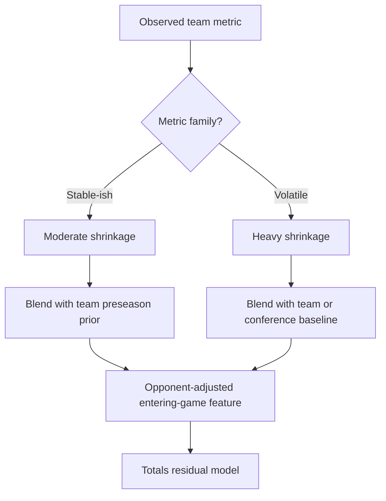
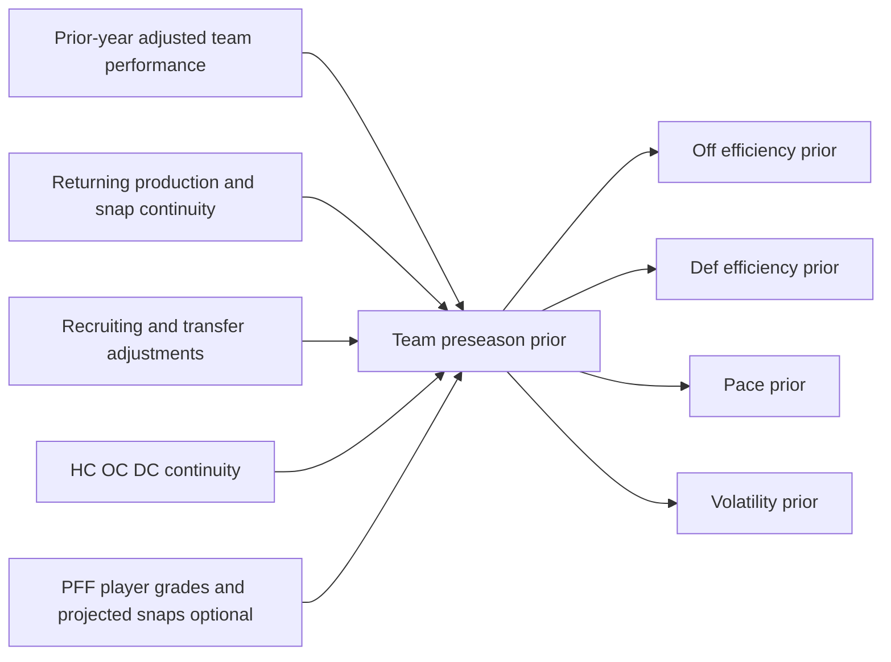
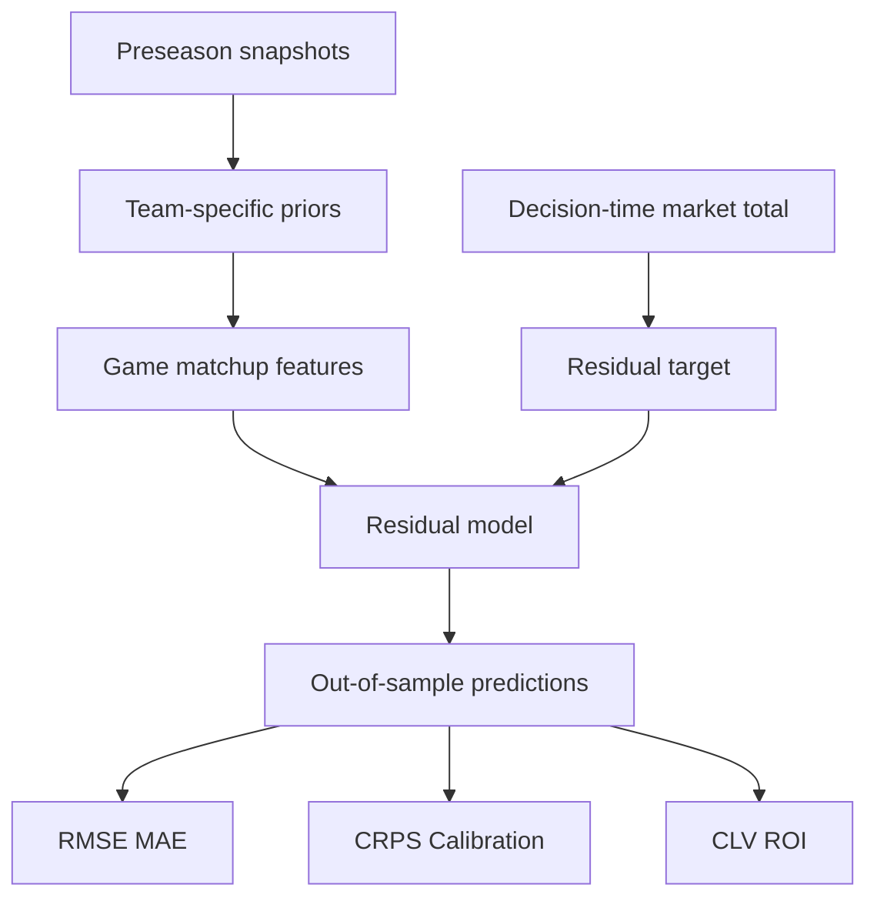

**Superseded by** [totals-modeling-guide.md](../../research/totals/docs/totals-modeling-guide.md)

# College Football Totals Modeling Notes: Regression, Preseason Priors, and Market-Residual Workflow

This document consolidates the conversation into a reusable reference focused on three linked modeling tasks: handling regression to the mean in college football totals, building team-specific preseason priors, and validating those priors in a market-residual betting workflow. The guidance is tailored to an FBS pregame totals model built with Python and DuckDB/MotherDuck using CFBD as the backbone and optionally PFF as a premium charting layer.[cite:43][cite:19][cite:20]

## Scope

The core premise is that most public or vendor football metrics are useful first as descriptive summaries and only secondarily as betting features. The existing project research found no direct FBS totals-market evidence showing that isolated tempo, EPA, roster, or matchup features beat the market on their own, so each feature should be treated as a testable input rather than an assumed edge.[cite:1][cite:2]

The document therefore centers on three practical goals:

- Regress unstable team signals toward the right mean.
- Create team-specific preseason priors that reflect current roster and staff reality.
- Test those priors only in a decision-time market-residual framework rather than against raw game totals alone.[cite:1][cite:2]

## Regression to the mean

Regression to the mean in college football totals should be implemented as partial pooling toward an appropriate prior, not as a vague narrative that a team is "due" to score more or less. In FBS, the appropriate prior is usually a team-specific preseason baseline blended with current-year opponent-adjusted evidence, with heavier shrinkage for volatile components like turnover margin, explosive-play rate, red-zone conversion, and special teams.[cite:1][cite:28]

A practical shrinkage equation is:

\[
\widehat{\theta}_{t,m}
=
w_{t,m} \cdot x_{t,m}
+
(1-w_{t,m}) \cdot \mu_{t,m}
\]

where \(x_{t,m}\) is the observed team metric, \(\mu_{t,m}\) is the relevant prior mean, and \(w_{t,m}\) increases with the number of informative opportunities. The project research specifically recommends shrinking early-season pace and efficiency toward conference or FBS means when teams have fewer than roughly four current-season games, while treating that threshold as a practical starting point rather than a universal law.[cite:1]

### Metric-specific shrinkage

Different totals-related metrics should regress to the mean at different speeds because they have different levels of repeatability and different opportunity counts.

| Metric family | Mean to regress toward | Recommended strength | Reason |
|---|---|---|---|
| Neutral pace / seconds per play | Team preseason pace, then conference-era mean | Moderate | Pace has some coaching persistence but also strong game-state and opponent effects.[cite:1][cite:27] |
| Offensive EPA/play | Team preseason offense and opponent-adjusted tier mean | Moderate | It contains real signal, but schedule and small samples distort early values.[cite:1] |
| Defensive EPA/play allowed | Team preseason defense and opponent-adjusted tier mean | Moderate-high | Defensive samples are noisier and more opponent-dependent.[cite:1] |
| Explosive-play rate | Team prior and FBS/conference mean | High | Rare events dominate short samples.[cite:1] |
| Turnover margin | Zero or expected turnover differential | Very high | Turnover performance regresses hard because realization has a large luck component.[cite:28][cite:38] |
| Fumble recovery rate | 50% baseline | Very high | Recovery is highly bounce-driven.[cite:28][cite:39] |
| Sack rate | Pressure rate plus conversion prior | Moderate | Sacks combine repeatable pressure with noisy conversion and QB style.[cite:1] |
| Special teams | Specialist prior plus tier mean | High early | Attempt volume is low and weather-sensitive.[cite:1] |

### Turnovers

Turnovers are the clearest case where raw outcomes should be decomposed into opportunity and realization. An NFL study found that teams with strong season-to-date turnover performance tend to regress toward the mean, which is useful as mechanism evidence but remains NFL evidence rather than direct FBS validation.[cite:28]

A useful college-football approximation is:

\[
\widehat{\text{Fumble recoveries}} = 0.50 \times \text{total fumbles}
\]

and then estimate interceptions from pass volume, pressure, and prior QB tendency rather than using raw interception count alone. ESPN's college-football turnover-luck framing similarly separates expected turnover margin from realized turnover margin using fumble-recovery expectations and interception-related baselines, which is directionally useful for feature design.[cite:39]

### Pace and rule-era adjustment

Raw plays per game is not a clean pace statistic because it mixes both teams' behavior, game script, turnovers, and overtime. Pace features should instead be based on neutral-state offensive and defensive pace calculated only through prior completed games.[cite:1]

That matters even more because 2023 NCAA timing changes altered the clock after first downs outside the final two minutes and were expected to reduce plays per game and game length. Official and media descriptions of the 2023 changes confirm the direction of the mechanical effect, while the project research summarizes early analysis estimating roughly 7.8% fewer plays and about 1.4% shorter games post-change.[cite:27][cite:29][cite:1]

## Team-specific preseason priors

A CFB preseason prior is a team-specific forecast of latent offense, defense, pace, and uncertainty before Week 1. For totals, a single generic team power rating is less useful than separate priors for offensive efficiency, defensive efficiency, neutral pace, explosive tendency, turnover propensity, special teams, and forecast uncertainty.[cite:55][cite:1]

### Main components

Start with prior-year opponent-adjusted performance, then rebuild it around the current roster and coaching staff rather than simply carrying last year's team average forward. ESPN's public description of preseason FPI is a useful conceptual template because it combines prior performance, returning starters, recruiting rankings, and coaching tenure in the preseason stage.[cite:60]

Recommended baseline priors:

- `preseason_off_eff_prior`
- `preseason_def_eff_prior`
- `preseason_neutral_pace_prior`
- `preseason_explosive_prior`
- `preseason_total_volatility_prior`

A simple starting structure is:

\[
P_{t,m}
=
0.70 \cdot A_{t-1,m}
+
0.20 \cdot A_{t-2,m}
+
0.10 \cdot A_{t-3,m}
\]

where \(A_{t-k,m}\) is the opponent-adjusted estimate for metric \(m\) from previous seasons. Those weights are implementation defaults rather than validated constants and should be replaced with fold-trained coefficients later.

### Roster reconstruction

Prior-year team performance is not the same thing as current-team quality, especially in the portal era. The prior should be rebuilt using returning production, projected snap continuity, transfer additions and losses, quarterback continuity, and coordinator continuity.[cite:1][cite:42]

A useful continuity-adjusted form is:

\[
\text{AdjustedPrior}_{t,m}
=
c_{t,m} \cdot \text{PriorPerf}_{t,m}
+
(1-c_{t,m}) \cdot \mu_{t,m}
\]

where \(c_{t,m}\) is a metric-specific continuity score and \(\mu_{t,m}\) is a replacement-level conference-tier or FBS-era baseline.

ESPN/Bill Connelly's 2026 returning-production construction uses position-weighted offense inputs rather than a simple starter count, with listed offensive weights of 39.6% for returning offensive-line snaps, 35.0% for receiver/tight-end receiving yards, 22.3% for QB passing yards, and 3.1% for running-back rushing yards.[cite:42] The published defensive construction uses 65.9% returning snaps, 19.2% tackles, and 14.9% tackles for loss.[cite:42]

For a totals model, those published weights are best treated as a benchmark rather than a final formula. The better approach is to fit your own target-specific weights for offensive efficiency, defensive efficiency, pace, and volatility in chronological training folds.

### Staff continuity

Coaching continuity should be modeled separately from roster continuity because a new offensive coordinator can change pace, pass rate, protection behavior, and red-zone decision-making quickly. ESPN's preseason FPI framework explicitly includes coaching tenure as one of its preseason ingredients, which supports including staff continuity in a preseason prior.[cite:60]

A simple staff adjustment is:

\[
\text{Prior}_{t,m}^{staff}
=
(1-\rho_m)\text{BasePrior}_{t,m}
+
\rho_m\mu_{\text{coach/scheme group},m}
\]

Use larger \(\rho_m\) values for pace-related priors than for broad talent priors because pace and style can change immediately with a new play caller.

### PFF-enhanced version

If a licensed PFF feed is historically point-in-time valid, the stronger version of a preseason prior comes from player-level reconstruction rather than last season's final team grade. PFF publicly documents its raw \(-2\) to \(+2\) play grading scale and 0-100 transformed grades, but not the full football aggregation formula, so these fields should be treated as vendor features to recalibrate rather than direct outcome estimates.[cite:3][cite:6]

A player-level shrinkage step is:

\[
\widetilde{G}_{p}
=
\frac{n_p}{n_p+k_{position}}G_p
+
\frac{k_{position}}{n_p+k_{position}}\mu_{position,role}
\]

Then the unit prior becomes a projected snap-share weighted average of shrunk player quality. This avoids common college-football errors such as carrying departed players inside last year's team grade or treating a thin-sample transfer as a stable signal.

## Market-residual workflow

The right evaluation target is not simply the game total points scored. The more useful target for betting research is the amount of information left unexplained by the decision-time market total.[cite:2]

Define the residual:

\[
R_{total} = T_{final} - T_{market,decision}
\]

Then fit a model of the form:

\[
R_{total} = f(X_{public}, X_{preseason}, X_{matchup}) + \epsilon
\]

The project research explicitly recommends a market-only baseline, a calibrated market-only regression, a regularized linear model, an opponent-adjusted rating model, and a market-residual model, all compared on the same game universe, timestamps, and line source.[cite:2]

### First feature set

A compact first feature set for the market-residual stage should include:

- Decision-time market total.
- Absolute spread as a team-strength asymmetry control.
- Home and away offensive priors.
- Home and away defensive priors.
- Home and away pace priors.
- Simple offense-vs-defense matchup terms.
- Combined pace prior.
- Clock-rule era flag.
- Neutral-site flag.
- Uncertainty measures for roster and staff turnover.[cite:1][cite:2]

Use interactions like:

\[
\text{HomeEfficiencyMatchup} = \text{HomeOffPrior} - \text{AwayDefPrior}
\]

\[
\text{AwayEfficiencyMatchup} = \text{AwayOffPrior} - \text{HomeDefPrior}
\]

\[
\text{CombinedPace} = \frac{\text{HomePacePrior} + \text{AwayPacePrior}}{2}
\]

### Validation protocol

Use expanding-window chronological testing. For example, 2017 should be trained only on 2012-2016, 2018 only on 2012-2017, and so on through the available history.[cite:2]

Within each outer test season:

1. Freeze all preseason roster, recruiting, transfer, and staff inputs as they were known before Week 1.
2. Fit preprocessing, scaling, shrinkage, and hyperparameters only on earlier seasons.
3. Score each game at a fixed, predeclared market timestamp.
4. Preserve predictions, edges, prices, and later closing-line outcomes for evaluation.
5. Pool only genuinely out-of-sample predictions when reporting performance.[cite:2][cite:57][cite:59]

The project research emphasizes that all comparisons must share the same game universe, timestamps, line source, and chronological test window, and that line-field fidelity itself should be audited before downstream claims are trusted.[cite:2]

### Success criteria

Track four distinct standards rather than collapsing everything into one score.

| Question | Metric | Meaning |
|---|---|---|
| Better final-total forecast? | MAE or RMSE on final total | Descriptive forecasting gain |
| Better residual forecast? | MAE or RMSE on market residual | Stronger evidence of incremental signal |
| Better probabilistic forecast? | CRPS or log loss | Better uncertainty and pricing |
| Better execution? | CLV and vig-adjusted ROI | Market and betting relevance |

The project research notes that nearly every model family under consideration has no direct published FBS totals evidence at the incremental-beyond-market, CLV, or profitable-after-vig levels, so residual accuracy and calibration should be treated as necessary but not sufficient standards.[cite:2]

## Recommended implementation order

The best first build is intentionally narrow and auditable.

1. Create a frozen preseason snapshot table by team-season with roster, recruiting, and staff inputs.[cite:40]
2. Build prior-year opponent-adjusted offense, defense, and neutral-pace summaries from CFBD play-by-play or advanced team metrics.[cite:43][cite:48]
3. Fit a simple ridge-based preseason prior model for offense, defense, and pace.
4. Generate market-residual targets from audited decision-time totals.[cite:2]
5. Compare market-only, market-plus-raw-prior, and market-plus-roster-adjusted-prior models in expanding windows.[cite:2]
6. Add PFF player-level reconstruction only after proving point-in-time coverage and showing early-season lift over simpler baselines.[cite:3][cite:6]

## Practical takeaway

The conversation's main modeling recommendation is to make preseason priors the anchor for early-season college football totals, then phase them out gradually as opponent-adjusted current-season evidence accumulates. Those priors should be roster-aware, staff-aware, era-aware, and tested only inside a strict market-residual backtest with identical timestamps, line definitions, and chronological validation windows.[cite:1][cite:2][cite:60]
