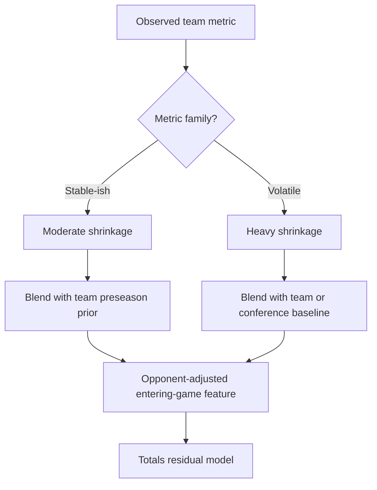
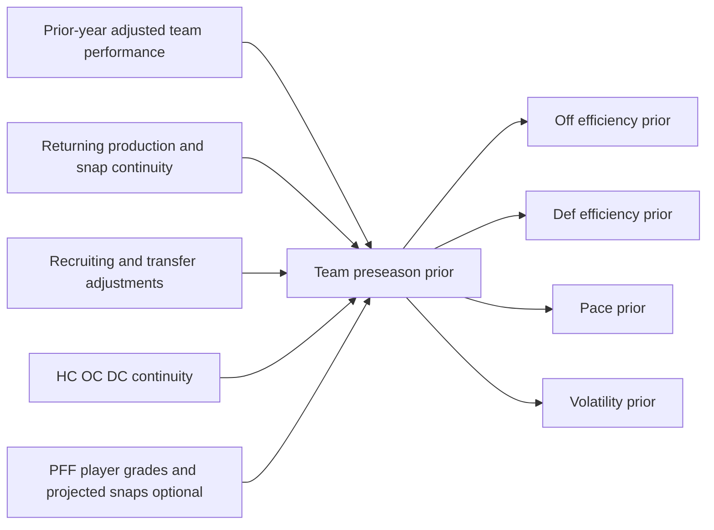
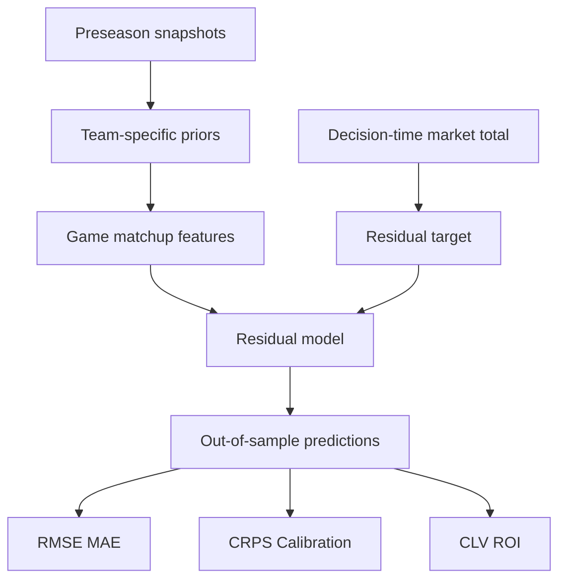

**Superseded by** [pff-methodology-research.md](../../docs/pff-methodology-research.md)

# Advanced Football Analytics Research: PFF and the Public Metric Stack

**Research cutoff:** September 8, 2026. This reference distinguishes publicly documented PFF methodology from PFF marketing claims and independent validation. PFF’s public methodology is substantially clearer for its basic grading scale than for college-specific coverage depth, reviewer agreement, revision policy, API semantics, or the formulas behind many premium endpoints. [pff](https://www.pff.com/grades)

**Bottom line:** treat PFF as a valuable proprietary charting layer—not ground truth, not automatically opponent-adjusted, and not inherently point-in-time. For FBS pregame betting, its highest plausible value is in **player availability, matchup-specific facets, returning-player reconstruction, and market-residual models**, rather than raw team-grade ranking.

## Evidence standard

Use six distinct outcome standards:

| Standard | Question answered | Betting relevance |
| --- | --- | --- |
| Descriptive validity | Does the metric summarize what happened? | Useful for diagnosis, insufficient for betting |
| Reliability | Would independent observers produce the same value? | Critical for manually charted inputs |
| Stability | Does it persist across samples or seasons? | Determines shrinkage needs |
| Predictive validity | Does it improve out-of-sample game forecasts? | Necessary, but not sufficient |
| Calibration | Are predicted probabilities/distributions correct? | Essential for pricing bets |
| CLV / profit | Does it beat a timestamped market after vig? | Required for a wagering claim |

No published independent validation found in searched sources for PFF college grades or PFF college signature statistics demonstrating incremental FBS spread, total, CLV, or profitable-after-vig performance over timestamped consensus lines. PFF’s own public validation and methodology discussion is primarily NFL-oriented, so any NFL-to-FBS inference below is explicitly a transfer hypothesis rather than direct college evidence. [pff](https://www.pff.com/college)

The existing project research likewise found no dedicated academic literature isolating individual FBS tempo or efficiency features against sportsbook totals with documented out-of-sample market-relative results. [pplxfilegitgateway-projectfiles-prod-use1.s3.us-east-1.amazonaws](https://pplxfilegitgateway-projectfiles-prod-use1.s3.us-east-1.amazonaws.com/projectfiles-prod/gateway-object-store/repos/files-9c31d208afc22c26bf62fd13679db659/downloads/ab3153975ee5005529e5115f37823eb84067c23d/FBS%20College%20Football%20Pregame%20Totals%20Betting%20System%20%20Research%20Report.md)

## PFF grades

PFF documents that it grades every player on every play on a raw \(-2\) to \(+2\) scale in 0.5-point increments, where zero represents expected performance. The raw evaluations are transformed into a 0–100 grade intended to summarize performance over a game or season. [pff](https://www.pff.com/news/nfl-quarterback-play-level-data)

| Item | Publicly documented | Practical interpretation |
| --- | --- | --- |
| Raw event grade | \(-2\) to \(+2\), increments of 0.5; zero is expected performance | Ordinal-ish human judgment at the play/facet level |
| Published grade | 0–100 | A transformed, sample-sensitive summary—not a raw arithmetic average |
| Scope | Every player, every play | Depends on video availability and charting confidence |
| Position/facet logic | Position-specific evaluation is marketed/documented at a high level | Exact decision rules are not fully public |
| Quality control | PFF and secondary outlets describe multiple-review/senior-review processes | Detailed audit rates and inter-rater reliability are not public |
| Opponent adjustment | No public evidence that headline grades are opponent-adjusted in the manner required for FBS schedule comparison | Assume raw grades require external opponent adjustment |

PFF’s public documentation says the 0–100 result derives from play-by-play grading, but it does not disclose a complete formula that would allow independent replication of the football conversion, aggregation weighting, normalization group, or small-sample treatment. [pff](https://www.pff.com/grades)

PFF-adjacent published descriptions say grades are normalized rather than simply averaged, and that season grades reflect the whole body of work rather than a mean of game grades. That concept is documented more explicitly in PFF’s soccer material than in its football methodology, so do not assume the football implementation is identical. [blog.fc.pff](https://www.blog.fc.pff.com/blog/pff-fc-grades-explained)

### Grader workflow

PFF publicly describes trained analysts assigning play-level grades, and public reporting has described a second analyst plus senior adjudication for discrepancies. However, public details are insufficient to calculate inter-rater agreement, percent of plays escalated, error rates by position, or agreement conditional on camera quality. [247sports](https://247sports.com/college/north-carolina-state/article/pack-football-focus-final-pff-grades-for-nc-state-vs-virginia-in-week-0-289320777/)

**No published independent validation found in searched sources** measuring PFF football grader reliability through a reproducible double-charting design such as weighted kappa, intraclass correlation, or blind replay grading.

That omission matters most where the assignment cannot be reliably inferred from broadcast video:

- Coverage responsibility in pattern-match, bracket, switch, banjo, and quarters structures.
- Offensive-line assignment during games, twists, slides, overloads, and free rushers.
- Blown coverage versus quarterback communication, disguise, or late rotation.
- Quarterback blame for timing, protection calls, throwaway decisions, and missed hot reads.
- Run-fit attribution when a defender intentionally exchanges gaps or occupies a blocker.

A PFF grade can still be informative in these situations, but its uncertainty should rise rather than being treated as a precise observation.

### College-specific limits

PFF markets college grades, player grades, EPA, success rate, pressure data, coverage data, rankings, and game-level analysis.  Public sources reviewed do not establish a complete FBS game-coverage census, a reproducible distinction between full grading and partial charting, equivalent treatment of FCS opponents, or a formal cross-division normalization method. [pff](https://www.pff.com/college)

**No published independent validation found in searched sources** showing that PFF’s 0–100 college grade scale is comparable across Power conferences, Group of Five teams, FCS opponents, or seasons with materially different talent distributions.

For your licensed feed, do not infer coverage completeness from the API’s existence. Build an explicit `game_coverage_audit` table from delivered endpoints:

```sql
create table pff_game_coverage_audit as
select
    season,
    week,
    game_id,
    home_team,
    away_team,
    count(distinct player_id) as players_with_grades,
    count(distinct case when snap_count > 0 then player_id end) as players_with_snaps,
    max(ingested_at) as latest_ingested_at
from pff_player_game
group by all;
```

Flag games with implausibly low participant counts, missing facets, missing opponent records, or post-hoc data-arrival patterns.

## PFF signature stats

PFF signature statistics are charted-event counts or rates. They are often more interpretable than headline grades, but they remain subject to definitions, charting judgment, participation denominators, and opponent/scheme confounding.

| Family | Typical unit | Level | What it measures | Main limitation | Better feature |
| --- | ---: | --- | --- | --- | --- |
| Pressure rate | Pressures / pass-rush opportunities | Player, unit, team | Frequency of charted pressure | Pressure definition and blocking responsibility are charted judgments | Opponent-adjusted pressure rate with snap uncertainty |
| Sacks, hits, hurries | Count or rate | Player, unit | Split of pressure outcomes | Sack conversion is volatile and QB-dependent | Pressure rate plus conditional sack conversion |
| Pressures allowed | Allowed / pass-blocking snaps | OL/player/team | Charted protection failures | Assignment ambiguity is greatest in OL play | Position- and protection-adjusted rate |
| Time to throw | Seconds | QB/team/play | Time from snap to release/sack event | Can reflect coverage, QB behavior, route concept, score state | Expected time-to-throw residual by concept/down-distance |
| aDOT | Air yards / targets | QB/receiver/team | Depth of intended targets | Not a QB arm-talent or receiver-separation measure | aDOT conditional on route/alignment/down |
| YPRR | Receiving yards / routes run | Receiver | Output per route | Routes are not targets; scheme and QB drive it | Opponent-, alignment-, and role-adjusted YPRR |
| Catchable-target rate | Catchable targets / targets | Receiver/QB | Charted catchability | Subjective boundary cases | Residual catch probability conditional on route/air yards |
| Contested-target rate | Contested targets / targets or opportunities | Receiver | Frequency of contested situations | Definition and target selection confound talent | Contested-catch residual after location/depth controls |
| YAC / tackles avoided | Yards after catch/contact, counts/rates | Ball carrier/receiver | Post-contact creation | Tackle attribution and blocking context matter | Expected-YAC residual by location and defender density |
| Missed-tackle rate | Missed tackles / tackle opportunities | Defender/team | Charted tackling failures | Opportunity definition and pursuit role vary | Shrunk, role-adjusted missed-tackle rate |
| Coverage snaps per target/reception | Snaps or routes covered per event | Defender | Target avoidance / production allowed | Low target volume can mean avoidance or untested role | Alignment-matched target-rate residual |
| Passer rating allowed | QB rating formula versus defender | Defender/team | Targeted passing output allowed | Not a pure coverage metric; QB/receiver/scheme dependent | Expected-completion and expected-EPA allowed residual |
| Kick/punt grade | 0–100 transformed grade | Kicker/punter | Charted execution | Weather, venue, return context, and sample size | Expected-points value by kick state |

Definitions must be verified against your PFF API dictionary rather than assumed from consumer-facing pages. PFF publicly documents the broad availability of pressure, coverage, EPA, success rate, and grades in college products, but complete endpoint-level denominator rules and charting specifications are not generally disclosed publicly. [pff](https://www.pff.com/college)

### PFF WAR and ratings

PFF markets player valuation concepts including wins above average / WAR in some products, but no public formula sufficient for independent replication was located in the searched sources. Treat a PFF WAR field as a proprietary model output until the license documentation specifies its baseline, sample period, position adjustment, opponent adjustment, and whether market-derived inputs enter the pipeline.

**No published independent validation found in searched sources** for a PFF college WAR measure against FBS pregame lines, totals, closing-line movement, or realized wagering profitability.

Likewise, do not assume any PFF “Elo-style” or team-strength rating is independent of public ratings or market information. Require vendor documentation answering:

1. Is it trained against score margin, EPA, win probability, player grades, or market spreads?
2. Are preseason priors used, and if so, do they incorporate recruiting, draft projections, public rankings, or betting lines?
3. Is it recomputed historically after the season?
4. Is it stored with a publication timestamp?
5. Are historical values backfilled after methodology changes?

If PFF cannot answer those questions contractually or technically, do not use the output as an independent model feature.

## Public play metrics

### EPA and success rate

EPA is the change in estimated expected points between the pre-play and post-play game states. A standard expression is:

\[
EPA_i = EP(s_{i+1}) - EP(s_i)
\]

where \(s_i\) is the pre-play game state and \(s_{i+1}\) is the next state.

EPA depends on the expected-points model, including its training sample, state variables, treatment of turnovers, scoring plays, end-of-half behavior, overtime, garbage time, and penalties. Consequently, an EPA value from CFBD, ESPN, PFF, and an independently trained model is not automatically comparable.

| Metric | Definition | Best use | Frequent misuse | Better construction |
| --- | --- | --- | --- | --- |
| EPA/play | Mean play-level point-value change | Efficiency with explosiveness included | Comparing values across vendors/models | Source-locked opponent-adjusted EPA residual |
| Success rate | Share of plays meeting a down-distance threshold | Consistency and drive sustainability | Treating it as a substitute for explosiveness | Joint model with EPA and explosive rate |
| Early-down EPA | EPA on 1st/2nd downs | Cleaner offensive intent | Assuming it is immune to score state | Neutral-state, opponent-adjusted early-down EPA |
| Dropback EPA | EPA on pass attempts/sacks/scrambles by definition | Passing-game output | Ignoring sack and scramble classification differences | Separate pass, scramble, pressure-conditioned components |
| EPA allowed | Opponent offensive EPA, sign reversed | Defensive results | Calling it a pure defensive player metric | Opponent- and field-position-adjusted defensive EPA |

WPA measures the change in win probability, not scoring strength. It is heavily shaped by leverage, game state, opponent quality, score margin, and the fact that late plays in close games have large leverage. It is generally poor as a pregame predictive feature compared with rate-based measures, except perhaps as a descriptive record of high-leverage performance.

### Havoc and trench metrics

The Football Outsiders-style public stack commonly includes havoc rate, line yards, stuff rate, second-level yards, open-field yards, and adjusted sack rate. Their value is decomposition: they attempt to distinguish line-of-scrimmage disruption from what happens after a runner clears the front.

| Metric | What it attempts to isolate | Failure mode | Better version |
| --- | --- | --- | --- |
| Havoc rate | TFLs, sacks, passes defended, forced fumbles or similar disruptions | Definition varies by source; turnover portions are noisy | Separate pressure, TFL, pass-breakup, and forced-fumble components |
| Line yards | Rushing value assigned near LOS | Allocation formula is stylized, not causal | Play-level run EPA with gap, personnel, and box controls |
| Stuff rate | Runs stopped at/behind line | Sensitive to play calling and short-yardage mix | Down-distance-adjusted stuff residual |
| Second-level yards | Yards after initial line segment | Blocking and defender quality co-determine outcome | Expected yards after LOS conditional on gap/box |
| Open-field yards | Longer-run value | Explosive runs dominate small samples | Shrunk tail-risk/explosive-run model |
| Adjusted sack rate | Sacks per pass attempt, often opponent-adjusted | Sacks depend on QB behavior and time to throw | Pressure rate plus conditional sack conversion |

Treat every branded metric as source-specific. Obtain the exact formula and denominator from the data provider before comparing it with another vendor’s identically named metric.

## Public ratings stack

| System | Core conditioning | Opponent adjustment | Preseason prior | Use in your model |
| --- | --- | --- | --- | --- |
| SP+ | Efficiency, explosiveness, field position, finishing drives, turnover-related components; exact current formula is proprietary | Yes, rating-system adjustment | Yes, including returning production/recruiting-style inputs | Strong market-visible benchmark; use only point-in-time archived values |
| FEI | Drive efficiency and opponent/context adjustments | Yes | Historically incorporates preseason information, but verify season-specific methodology | Alternative team-strength prior |
| ESPN FPI | Team-strength forecast in points above/below average | Yes | ESPN has described priors using prior performance, returning starters, coach continuity, recruiting, and transfers | Useful public benchmark; likely market-visible |
| Sagarin | Rating system variants based on results/margins and schedule | Yes | Verify current season methodology | Broad strength control |
| Massey | Family of rating systems; often least-squares/SRS-style | Usually yes | Varies by implementation | Reproducible baseline if you build your own |
| Elo | Sequential result-based rating | Implicit through opponent ratings | Typically an initialization prior | Transparent baseline, weak alone for early-season FBS |
| PFF team grades | Aggregated proprietary charted performance | Not publicly documented as opponent-adjusted | Not publicly documented | Add only after external opponent adjustment |

ESPN describes FPI as a team-strength measure in points above or below average, with projections derived from that rating.  Secondary public summaries describe FPI as EPA-based with Bayesian preseason priors involving prior seasons, returning starters, returning coach, recruiting, and transfers, but use ESPN’s current documentation or archived releases rather than relying on secondary descriptions for production implementation. [espn](https://www.espn.com/college-football/fpi)

SP+, FPI, FEI, Sagarin, Massey, and public Elo are likely highly correlated with market strength. Their most appropriate role is therefore as **controls** or as inputs in a market-residual study—not as evidence that you possess an independent edge.

## Tracking-derived metrics

CPOE, expected YAC, expected rushing yards, receiver-separation scores, and other expected-outcome models require spatial and temporal player-position inputs to distinguish difficult opportunities from easy ones. The NFL has proprietary/publicly distributed Next Gen Stats-style tracking outputs, but there is no public FBS-wide equivalent tracking dataset comparable in scope for the 2012–2025 history in your proposed panel.

Do not label a college completion metric “CPOE” unless you know its expected-completion model, features, training sample, and calibration procedure. A completion residual based only on air yards and down-distance is a useful model feature, but it is not equivalent to tracking-based CPOE.

## Pace and roster context

Pace should be expressed as a forecast of **plays or possessions in the matchup**, not as a raw team average. The 2023 NCAA timing-rule changes created a structural break: the project’s existing research cites early analysis estimating roughly 7.8% fewer plays and about 1.4% shorter games after the change. [pplxfilegitgateway-projectfiles-prod-use1.s3.us-east-1.amazonaws](https://pplxfilegitgateway-projectfiles-prod-use1.s3.us-east-1.amazonaws.com/projectfiles-prod/gateway-object-store/repos/files-9c31d208afc22c26bf62fd13679db659/downloads/ab3153975ee5005529e5115f37823eb84067c23d/fbs-totals-frontier-models.md)

Build neutral pace from play-level state filters:

```sql
case
  when abs(score_differential_preplay) <= 14
   and quarter in (1, 2, 3)
   and seconds_remaining_game > 900
  then 1 else 0
end as neutral_state_flag
```

Then estimate:

\[
\widehat{plays}_{game}
=

f(\text{offensive pace}_A,\text{defensive pace}_B,
  \text{offensive pace}_B,\text{defensive pace}_A,
  \text{spread},\text{clock-rule era},\text{weather})
\]

Recruiting composites, blue-chip ratios, returning production, returning snap share, coordinator continuity, portal additions/losses, and quarterback continuity are strongest as **preseason priors**. They are not clean in-season “new information” once the market has incorporated them.

The project research notes that returning-production measures are published preseason and should be archived as-of release because later revisions or re-scraping can produce retrospective leakage. [pplxfilegitgateway-projectfiles-prod-use1.s3.us-east-1.amazonaws](https://pplxfilegitgateway-projectfiles-prod-use1.s3.us-east-1.amazonaws.com/projectfiles-prod/gateway-object-store/repos/files-9c31d208afc22c26bf62fd13679db659/downloads/ab3153975ee5005529e5115f37823eb84067c23d/FBS%20College%20Football%20Pregame%20Totals%20Betting%20System%20%20Research%20Report.md)

## Failure modes

| Rank | Failure mode | Why it matters | Panel diagnostic |
| ---: | --- | --- | --- |
| 1 | Timestamp leakage | Final-season grades or updated weekly reports include future information | Assert `published_at <= decision_ts` for every feature |
| 2 | Line-timing error | Opener, screen, consensus, and close are different targets | Match each prediction to a recorded quote timestamp/book |
| 3 | Missing revision history | PFF values may change after initial publication | Hash every raw response; compare vintage-to-vintage diffs |
| 4 | Coverage heterogeneity | Low-quality broadcasts or non-marquee games can create differential measurement error | Model missingness and coverage flags; compare distributions by conference/network |
| 5 | Schedule confounding | Raw grades and rates inflate against weak opponents | Leave-one-opponent-out mixed-effects adjustment |
| 6 | Roster turnover | Prior-year team grade includes departed players | Reconstruct priors at player level using returning snaps |
| 7 | Small samples | Facet rates are unstable in 20 routes or 15 targets | Empirical-Bayes shrinkage plus posterior intervals |
| 8 | Scheme confounding | Player results can be role/scheme outcomes | Add coordinator, alignment, personnel, and usage effects |
| 9 | Market overlap | Publicly visible ratings may already be priced | Residualize outcome against timestamped market baseline |
| 10 | Multiple testing | Dozens of PFF facets invite selection bias | Feature registry, nested walk-forward, holdout season |
| 11 | Score-state contamination | Late-game behavior changes pace, play calling, and risk | Neutral-state filters and state-aware models |
| 12 | Vendor/schema drift | Definitions/columns change invisibly | Schema snapshots, value-distribution monitoring, version metadata |

### Stability caveat

Do not use a fixed number of games as a universal stabilization threshold without measuring it in your own feed. Grades, pressure, YPRR, missed tackles, coverage rates, EPA, and explosive-play rates have different denominators and different player-role dependence.

Estimate reliability empirically:

1. Partition each player-season into two balanced halves by eligible opportunity.
2. Compute the metric in each half.
3. Estimate split-half correlation by position and facet.
4. Apply the Spearman-Brown adjustment if the split design supports it.
5. Repeat by season, conference tier, and sample-size bin.
6. Convert reliability into shrinkage strength.

For a rate \(r_i\), use a Beta-Binomial or logistic-normal partial-pooling model. For grades or EPA-like continuous outcomes, use a hierarchical Normal model:

\[
\theta_i \sim \mathcal{N}(\mu_{\text{position, role}}, \tau^2)
\]

\[
\bar{y}_i \mid \theta_i \sim
\mathcal{N}\left(\theta_i,\frac{\sigma_i^2}{n_i}\right)
\]

This produces both an adjusted estimate and an uncertainty estimate instead of pretending that a player with 15 snaps is comparable to one with 500.

## Point-in-time panel

A valid historical panel must have an explicit **decision timestamp** for every prediction, such as Wednesday 12:00 ET or Saturday 10:00 ET.

### Required tables

```sql
pff_raw_snapshot(
  vendor_response_id,
  endpoint,
  entity_key,
  payload_json,
  published_at,
  ingested_at,
  payload_hash,
  api_version,
  schema_version
)

pff_feature_vintage(
  season, week, game_id, team_id, player_id,
  feature_name, feature_value,
  source_published_at,
  ingested_at,
  available_at,
  revision_number,
  payload_hash
)

market_quote(
  game_id, sportsbook, market_type,
  line, price_american,
  quote_ts, is_opener, is_close
)

model_decision(
  game_id, decision_ts,
  target_quote_ts,
  feature_cutoff_ts,
  model_version,
  prediction,
  recommended_price,
  wager_flag
)
```

### Construction rules

1. Define the forecast timestamp before extracting data.
2. Select only `available_at <= decision_ts` observations.
3. Use trailing, entering-game aggregates only.
4. Join player participation from the last snapshot known before the decision time.
5. Reconstruct current team strength from active/available players, not last year’s final team grade.
6. Store the exact raw PFF payload or vendor export used for every model run.
7. Freeze historical feature vintages; never regenerate old weeks from today’s endpoint without a vintage comparison.
8. Keep a separate final-results table that cannot join into feature creation.

### Leakage tests

A feature row fails if any of these conditions is true:

```sql
-- Future knowledge
available_at > decision_ts

-- Same-game contamination
feature_game_date >= predicted_game_date

-- Final leaderboard contamination
season_end_date > decision_ts
and endpoint_type = 'season_final'

-- Revised historical overwrite
ingested_at > decision_ts
and source_published_at is null

-- Incorrect line target
quote_ts > intended_bet_ts
```

If the license provides only end-of-season snapshots, do **not** backtest them as week-by-week features. Use them only for descriptive analysis, a post-season player-evaluation project, or a prospective-data collection system beginning now.

## PFF improvements

### 1. Opponent-adjust grades

Start with a mixed model at player-game or team-game level:

\[
g_{i,t}
=

\alpha
+
u_{\text{player}}
+
v_{\text{opponent}}
+
w_{\text{season}}
+
\beta X_{i,t}
+
\epsilon_{i,t}
\]

where \(g_{i,t}\) is raw or invertible pre-normalization-grade information if available, \(X\) includes role, alignment, down, distance, score state, and opportunity count.

If only 0–100 grades are available, model them cautiously as transformed outcomes; report that the adjustment is empirical rather than an exact reconstruction of PFF’s latent grade process.

**Validation:** compare raw and opponent-adjusted versions in an expanding-window forecast of future player-game output, team EPA, spread residual, total residual, and CLV. Retain it only if gains recur across at least two untouched outer seasons.

### 2. Returning-player reconstruction

Replace last year’s team grade with projected active-player quality:

\[
G_{\text{returning},T}
=

\frac{
\sum_{p \in T}
\widehat{s}_{p,T}
\cdot
\widetilde{g}_{p,\text{prior}}
\cdot
a_{p,T}
}{
\sum_{p \in T}
\widehat{s}_{p,T}
}
\]

where \(\widehat{s}_{p,T}\) is projected snap share, \(\widetilde{g}\) is shrunk/opponent-adjusted player grade, and \(a_{p,T}\) is availability probability.

For transfers, use historical individual performance, position-level recruiting prior, and projected role. For new starters with no usable history, shrink aggressively toward position, recruiting, and team-context priors.

### 3. Separate scheme and player

Estimate coordinator/scheme fixed effects and player random effects. Use indicators for offensive coordinator, defensive coordinator, personnel frequency, alignment, pace, neutral pass rate, blitz rate, and coverage family where available.

Do not interpret the player random effect as causal talent: coaches select players into roles, and roles affect charted opportunity.

### 4. Recalibrate to outcomes

Avoid entering a 0–100 PFF grade directly into a margin model as though the units are linear. Fit transformations exclusively within training folds:

\[
y_{\text{residual}}
=

f(\text{PFF facets},\text{public features},\text{market})
\]

where \(y_{\text{residual}}\) is either final margin minus market spread, total minus market total, or closing-line change from the decision quote. The model learns outcome-scale coefficients while preserving holdout integrity.

### 5. Propagate uncertainty

Pass both the mean and standard error/posterior variance of each aggregated grade into downstream models. A weak, low-sample secondary’s 85 grade should produce a different forecast than a 85 grade over 700 coverage snaps.

## Ten derived metrics

| Derived metric | Inputs | Formula / specification | Failure mode | Falsification test |
| --- | --- | --- | --- | --- |
| Returning-production grade | PFF player grades, snaps, roster/transfer status, projected depth chart | Snap-weighted, shrunk grades of returning/added players | Bad depth-chart projection | Does not beat prior-year team grade in Weeks 1–4 |
| Trench mismatch | PFF pass-block/run-block and pass-rush/run-defense grades, snaps | Offense unit estimate minus opponent defensive unit estimate, position-weighted | Scheme and protection confounding | No improvement in pressure, sack, rush-EPA, total-residual forecasts |
| Pressure differential | PFF pressures, pass-rush snaps, pressures allowed; CFBD dropbacks | Adjusted pressure-forced minus pressure-allowed | Different vendor denominator definitions | No gain over basic sack-rate features |
| Expected sack rate | Pressure differential plus historical QB/team sack conversion | \(\widehat{sack\ rate}=\widehat{pressure\ rate}\times \widehat{P}(sack\mid pressure)\) | Conversion is QB/style dependent | Worse held-out Brier/RMSE than direct sack model |
| QB pressure stability | PFF QB grades clean vs pressured, projected opponent pressure | Weighted conditional grade difference | Sample scarcity under pressure | Does not predict QB EPA/dropback versus clean-pocket grade alone |
| Alignment coverage mismatch | PFF WR YPRR/aDOT by slot/wide/inline; CB coverage production by alignment | Match role-specific receiver output to defender coverage vulnerability | Likely missing exact matchup assignment | No value beyond team pass EPA and market |
| Explosive variance forecast | CFBD explosive plays; PFF aDOT, missed tackles, pressure; pace | Distributional model for tail outcomes and total variance | Rare-event instability | Predicted variance uncorrelated with squared held-out total residuals |
| Pace-efficiency interaction | CFBD neutral pace, drives, EPA; PFF pressure/coverage facets | Forecast possessions times conditional points/possession | Possession count affected by turnovers and score state | Does not improve total CRPS over market-only model |
| Special-teams expected points | PFF kick/punt grades, CFBD field-position/drive outcomes | Estimate expected field-position and kick conversion contribution | Weather/venue and sparse attempts | No incremental value in special-teams EPA or total residual |
| Availability-adjusted unit grade | PFF player grades/snaps, injury/depth-chart availability | Reallocate unavailable starter shares to backup posterior estimates | Injury data is often incomplete and late | No benefit over starter-out indicator or team baseline |
| Market-residual grade | Timestamped market lines, SP+/FPI/public ratings, PFF features | Regress market or close on public controls; test PFF only on residual | Close can leak if used as a feature rather than target | No stable OOS residual/CLV improvement |
| Grade uncertainty abstention score | Posterior variance, roster uncertainty, vendor coverage flags, model disagreement | Estimate probability that forecast edge survives uncertainty | Can overfit threshold selection | No higher CLV/ROI or lower drawdown in selected subset |

## Market residual framework

The only defensible way to test whether PFF contributes an edge is to treat the market as the baseline forecast.

For spreads:

\[
M_{\text{final}}
=

\beta_0
+
\beta_1 L_{\text{market}}
+
\beta_2 X_{\text{public}}
+
\beta_3 X_{\text{PFF}}
+
\epsilon
\]

For totals:

\[
T_{\text{final}} - T_{\text{market}}
=

f(X_{\text{public}}, X_{\text{PFF}})+\epsilon
\]

For CLV:

\[
L_{\text{close}} - L_{\text{decision}}
=

g(X_{\text{public}}, X_{\text{PFF}})+\epsilon
\]

The target must match the trading decision. Predicting final margin is not predicting the close; predicting the close is not proving an edge at the final outcome; positive realized ROI can occur by chance even when no stable CLV exists.

## What the market knows

### Likely priced in

These inputs are widely visible, easy to summarize, and likely reflected in openers or rapid early-week movement:

- Prior-year record, scoring margin, win total expectations, and public rankings.
- Recruiting ratings, blue-chip ratios, returning-production lists, portal headlines, and returning quarterbacks.
- SP+, FPI, FEI, Sagarin, and other widely circulated rating systems.
- Major injuries, quarterback changes, suspensions, coach changes, and nationally reported depth-chart changes.
- Basic season-to-date EPA, success rate, pace, explosive plays, sacks, turnovers, and box-score trends.
- High-profile PFF grades and consumer-facing PFF rankings.

This is an inference from information visibility and market mechanics, not direct evidence that each feature is fully efficient. The project’s research found no direct FBS feature-level evidence proving that tempo, EPA, success rate, havoc, or roster features are fully priced in—or that they are not. [pplxfilegitgateway-projectfiles-prod-use1.s3.us-east-1.amazonaws](https://pplxfilegitgateway-projectfiles-prod-use1.s3.us-east-1.amazonaws.com/projectfiles-prod/gateway-object-store/repos/files-9c31d208afc22c26bf62fd13679db659/downloads/ab3153975ee5005529e5115f37823eb84067c23d/fbs-totals-frontier-models.md)

### Plausibly less priced

Potentially less commoditized features are those requiring expensive data, point-in-time archiving, careful roster reconstruction, and a model of interaction rather than a public leaderboard:

- Opponent-adjusted player-level PFF facet estimates.
- Availability-adjusted snap reallocation from starter to specific backup.
- Alignment-specific receiver-versus-coverage interaction features.
- Pressure-versus-sack decomposition with quarterback-specific conversion.
- Vintage-corrected PFF revisions and data-completeness flags.
- Cross-book lead/lag and stale-quote analysis using timestamped quotes.
- A well-specified uncertainty or abstention model.
- Market-residual predictions that isolate PFF contribution after public-rating and market controls.

These are hypotheses to test, not established advantages.

## Experiment plan

### Phase 0: Data audit

**Goal:** prove that every input is historically valid before modeling.

- Audit PFF endpoint completeness by season, week, conference, opponent level, and game broadcast tier.
- Archive all API payloads with ingestion and vendor timestamps.
- Audit ActionNetwork line timestamps against an independent odds-history sample where possible.
- Produce missingness, revision, and schema-drift reports.
- Freeze a pre-registered game universe and betting timestamp.

**Kill criterion:** discontinue historical PFF feature backtesting for any period where point-in-time availability cannot be demonstrated.

### Phase 1: Market baselines

Train chronological, expanding-window models using only:

- Decision-time spread/total and vig-adjusted price.
- Public ratings available at the same timestamp.
- Basic CFBD trailing and neutral-state features.
- Season/week/rule-era controls.

Evaluate final margin/total prediction, closing-line prediction, calibration, CLV, and vig-adjusted realized results separately.

The project’s existing research recommends a market-only calibration regression as a required baseline and identifies market-plus-residual models as the highest-priority modeling family. [pplxfilegitgateway-projectfiles-prod-use1.s3.us-east-1.amazonaws](https://pplxfilegitgateway-projectfiles-prod-use1.s3.us-east-1.amazonaws.com/projectfiles-prod/gateway-object-store/repos/files-9c31d208afc22c26bf62fd13679db659/downloads/ab3153975ee5005529e5115f37823eb84067c23d/fbs-totals-frontier-models.md)

### Phase 2: PFF ablations

Add PFF features in pre-specified blocks:

1. Team and unit grades.
2. Returning-player reconstructed grades.
3. Pressure and protection facets.
4. QB clean-versus-pressure splits.
5. Coverage and alignment facets.
6. Special teams.
7. Availability-adjusted versions.
8. Uncertainty and coverage-quality flags.

Do not search all features at once. Lock feature definitions before each outer-season test.

### Phase 3: Decision layer

Convert predictions into prices only after calibration:

- Use market price, not merely line, for expected value.
- De-vig the available market before estimating true break-even probability.
- Apply a stake or abstention rule based on posterior edge and uncertainty.
- Measure CLV at a pre-specified close definition and book set.
- Report wagers, average odds, mean/median CLV, ROI, maximum drawdown, confidence intervals, and season-by-season dispersion.

### Validation protocol

| Component | Specification |
| --- | --- |
| Training | Expanding window, beginning 2012 or first reliably covered PFF season |
| Inner selection | Earlier seasons only; all preprocessing fit inside each training fold |
| Outer test | One untouched season at a time |
| Retraining cadence | Weekly or decision-time, using only then-available data |
| Final holdout | Reserve the most recent complete season untouched until feature/model choices are frozen |
| Unit of inference | Game for score errors; bet for CLV/ROI, with dependence-aware uncertainty |
| Comparison | Identical game universe, quote timestamps, books, and vig treatment |
| Reporting | Per-season and pooled—not pooled only |

### Pre-registered thresholds

Use thresholds as decision gates, not proof of universal truth:

| Test | Suggested success threshold | Kill criterion |
| --- | --- | --- |
| PFF incremental margin/total forecast | Improvement over market/public baseline in at least two independent outer seasons | Gain appears only in one season or disappears after vintage audit |
| CLV | Positive mean CLV with bootstrap interval excluding materially negative values, stable by season | Positive pooled CLV driven by one week/season/book |
| Calibration | Lower Brier/CRPS or better calibration curve than baseline | No consistent proper-scoring improvement |
| Returning-player prior | Better Weeks 1–4 performance than prior-year team grade | No gain after availability adjustment |
| Uncertainty/abstention | Selected bets show better CLV and controlled volume in held-out seasons | Edge appears only after threshold mining |
| Facet complexity | Beats simpler team-grade/public model | Complexity has no repeated OOS gain |

Do not set a universal ROI threshold from a small sample. Instead, require robustness across seasons, books, timing windows, and reasonable vig assumptions.

## Implementation recommendations

1. **Keep raw PFF and derived features separate.** Store vendor fields unchanged, then create versioned transformations.
2. **Track endpoint provenance.** Every feature needs endpoint name, query parameters, source timestamp, ingestion timestamp, payload hash, and code version.
3. **Model denominators explicitly.** Store routes, pass-rush snaps, coverage snaps, targets, tackles, dropbacks, and team opportunities alongside rates.
4. **Use availability scenarios.** Generate baseline, starter-in, and starter-out forecasts rather than one deterministic roster.
5. **Shrink before aggregating.** Shrink player facets first; then snap-weight into units.
6. **Residualize against the market.** This is your primary research target, especially for CLV.
7. **Make PFF revisions observable.** A silent revision is data drift, not a harmless update.
8. **Use era indicators.** At minimum, separate pre-2023 and post-2023 clock-rule environments. [pplxfilegitgateway-projectfiles-prod-use1.s3.us-east-1.amazonaws](https://pplxfilegitgateway-projectfiles-prod-use1.s3.us-east-1.amazonaws.com/projectfiles-prod/gateway-object-store/repos/files-9c31d208afc22c26bf62fd13679db659/downloads/ab3153975ee5005529e5115f37823eb84067c23d/FBS%20College%20Football%20Pregame%20Totals%20Betting%20System%20%20Research%20Report.md)
9. **Do not overstate validation.** PFF’s public material documents a charting product and grading system; it does not by itself establish FBS betting value. [pff](https://www.pff.com/news/nfl-quarterback-play-level-data)
10. **Review license restrictions before deployment.** Derived output may be permitted while display, redistribution, model training, storage duration, and sharing of raw or reconstructed PFF data may be restricted by contract.

Regression to the mean should be built into your totals model as **partial pooling toward an appropriate prior**, not as an after-the-fact “bounce-back” narrative. In FBS, the correct mean is rarely the national average: it is usually a preseason team prior plus current-year, opponent-adjusted evidence, with heavier shrinkage for volatile components such as turnovers, explosives, red-zone conversion, and special teams. [pplxfilegitgateway-projectfiles-prod-use1.s3.us-east-1.amazonaws](https://pplxfilegitgateway-projectfiles-prod-use1.s3.us-east-1.amazonaws.com/projectfiles-prod/gateway-object-store/repos/files-9c31d208afc22c26bf62fd13679db659/downloads/ab3153975ee5005529e5115f37823eb84067c23d/FBS%20College%20Football%20Pregame%20Totals%20Betting%20System%20%20Research%20Report.md)

## Core approach

For any team metric \(x\), estimate latent team quality rather than using the raw observed rate:

\[
\widehat{\theta}_{t,m}
=

w_{t,m} \cdot x_{t,m}
+
(1-w_{t,m}) \cdot \mu_{t,m}
\]

where:

- \(x_{t,m}\) is the team’s entering-game observed metric.
- \(\mu_{t,m}\) is the relevant prior mean.
- \(w_{t,m}\) rises with informative opportunity volume and falls with estimated noise.
- \(\widehat{\theta}_{t,m}\) is the shrunk feature passed to the totals model.

For a team with only two games, shrink toward a **team-specific preseason prior**. By midseason, shrink more toward its current opponent-adjusted performance. The project research recommends shrinking early-season pace and efficiency toward conference or FBS means when teams have fewer than roughly four current-season games, while treating that cutoff as a practical starting point rather than a proven universal threshold. [pplxfilegitgateway-projectfiles-prod-use1.s3.us-east-1.amazonaws](https://pplxfilegitgateway-projectfiles-prod-use1.s3.us-east-1.amazonaws.com/projectfiles-prod/gateway-object-store/repos/files-9c31d208afc22c26bf62fd13679db659/downloads/ab3153975ee5005529e5115f37823eb84067c23d/FBS%20College%20Football%20Pregame%20Totals%20Betting%20System%20%20Research%20Report.md)

## Use the right prior

A national FBS mean is an acceptable fallback, but it is usually too generic for college football. Build a hierarchical prior:

\[
\mu_{t,m}
=

\lambda_1 \mu_{\text{team preseason},m}
+
\lambda_2 \mu_{\text{conference/tier},m}
+
\lambda_3 \mu_{\text{FBS era},m}
\]

For preseason team priors, use a model trained only on information available before the season:

- Prior-year opponent-adjusted offensive and defensive EPA/play.
- Returning offensive production, especially QB and offensive-line continuity.
- Returning defensive production and transfer additions/losses.
- Recruiting or talent composite.
- Coordinator and head-coach continuity.
- Prior-year neutral pace, adjusted for the 2023 rule regime.
- Returning PFF player grades and projected snap shares, if your historical PFF feed is point-in-time valid.

Because the transfer portal creates exceptional roster change, do **not** simply shrink 2026 results toward the 2025 team average. Rebuild a preseason prior around returning/added players where possible; the project research identifies prior-year team aggregates as weak priors when roster continuity is low. [pplxfilegitgateway-projectfiles-prod-use1.s3.us-east-1.amazonaws](https://pplxfilegitgateway-projectfiles-prod-use1.s3.us-east-1.amazonaws.com/projectfiles-prod/gateway-object-store/repos/files-9c31d208afc22c26bf62fd13679db659/downloads/ab3153975ee5005529e5115f37823eb84067c23d/FBS%20College%20Football%20Pregame%20Totals%20Betting%20System%20%20Research%20Report.md)

## Shrink metric families differently

| Metric family | Mean to regress toward | Typical shrinkage strength | Why |
| --- | --- | ---: | --- |
| Neutral pace / seconds per play | Team preseason pace, then conference-era pace | Moderate | Some coaching persistence, but opponent and score effects matter |
| Plays per game | Matchup-adjusted pace expectation | High | Both teams, game flow, and clock rules drive volume |
| Offensive EPA/play | Team preseason offense and opponent-adjusted FBS mean | Moderate | Contains signal, but early opponents distort it |
| Defensive EPA/play | Team preseason defense and opponent-adjusted FBS mean | Moderate-high | Defensive samples are opponent-dependent |
| Success rate | Team/position-group prior | Moderate | More stable than explosive outcomes, still schedule-sensitive |
| Explosive-play rate | Team prior and FBS tier mean | High | Rare events dominate short samples |
| Red-zone TD rate | League/team baseline conditional on down and field position | High | Few possessions, strong variance |
| Turnover margin | Zero or expected turnover differential | Very high | Large luck component and weak persistence |
| Fumble recovery rate | 50% recovery baseline | Very high | Strongly influenced by ball bounces |
| Interception rate | QB/team historical rate plus league baseline | Moderate-high | More repeatable than recovery luck, but still sparse |
| Sack rate | Pressure rate plus QB-specific conversion prior | Moderate | Sacks blend pressure skill, QB behavior, and play design |
| Field-goal rate / kicking EPA | Kicker-specific prior plus baseline | High early | Low attempt volume and weather/venue variation |
| Penalty rate | Team/coaching prior | Moderate | Some discipline signal, but officiating and opponent style matter |

Turnover margin is the clearest regression candidate. An NFL study found season-to-date turnover performance had weak persistence and explicitly concluded that teams with strong turnover performance tend to regress toward the mean; that is NFL evidence, so it should be treated as a transfer hypothesis rather than direct FBS validation.  College-football analysis likewise describes turnover margin as regressing toward zero year over year, but that source is explanatory/industry analysis rather than peer-reviewed FBS forecasting evidence. [pmc.ncbi.nlm.nih](https://pmc.ncbi.nlm.nih.gov/articles/PMC5969004/)

## Model turnovers structurally

Do not merely include raw turnover differential as a feature. Decompose it:

\[
TO_{\text{actual}}
=

TO_{\text{expected from opportunities}}
+
TO_{\text{luck residual}}
\]

A workable FBS approximation:

\[
\widehat{\text{Fumble recoveries}}
=

0.50 \times \text{total fumbles in game}
\]

\[
\widehat{\text{INT}}
=

p_{\text{INT}}(\text{QB history},\text{pressure},\text{pass volume},\text{opponent})
\times \text{attempts}
\]

Then separate:

- **Turnover opportunity:** pressures, pass breakups, forced fumbles, sacks, pass volume.
- **Turnover realization:** interceptions, recovered fumbles.
- **Turnover-luck residual:** actual minus expected realization.

ESPN’s college-football turnover-luck framing uses a 50% fumble-recovery expectation and an interception-to-pass-breakup benchmark to distinguish expected turnover margin from realized turnover margin. That is a useful construction, though its exact coefficients should be validated in your own FBS sample. [espn](https://www.espn.com/college-football/story/_/id/48288665/college-football-2026-turnovers-lucky-bounces)

For totals, the key point is that turnovers affect both **mean scoring** and **variance**:

- Defensive/special-teams touchdowns and short fields increase expected points.
- Turnovers can erase scoring possessions and reduce total plays.
- Turnover-heavy teams create wider outcome distributions.
- Regressing turnover luck should move a forecast toward normal offensive/defensive efficiency while preserving uncertainty.

## Shrink pace separately

Raw plays per game is a poor pace feature because it reflects both teams, game flow, overtime, turnovers, scoring pace, and clock rules. Instead estimate a team’s neutral offensive pace and neutral defensive pace from eligible plays only.

Use filters such as:

- Exclude overtime.
- Exclude extreme score states, such as absolute pre-play margin above 14, with sensitivity analysis at 10, 17, and 21.
- Exclude final two-minute behavior or model it separately.
- Separate post-2023 observations because the NCAA changed first-down clock behavior and intended to reduce plays per game. [footballfoundation](https://footballfoundation.org/news/2023/7/20/important-rule-changes-for-the-2023-college-football-season.aspx)

Then shrink a team’s pace estimate toward a coach/team preseason pace prior:

\[
\widehat{pace}_{t}
=

\frac{n_t}{n_t+k_{\text{pace}}} pace_{t,\text{current}}
+
\frac{k_{\text{pace}}}{n_t+k_{\text{pace}}} pace_{t,\text{prior}}
\]

Estimate \(k_{\text{pace}}\) through chronological validation—not by intuition. Select the value that minimizes held-out error for next-game neutral pace or game plays, separately by early-, mid-, and late-season buckets.

The 2023 NCAA rules changed clock operation after first downs outside the final two minutes of each half, making pre- and post-rule-change pace distributions non-interchangeable without an era effect or separate model. [espn](https://www.espn.com/college-football/story/_/id/36255797/ncaa-approves-rule-change-run-clock-first-downs)

## Shrink EPA and success rate

For offense and defense, use opponent-adjusted, possession- or play-level partial pooling rather than a simple rolling average.

A practical empirical-Bayes version:

\[
\widehat{EPA}_{off,t}
=

\frac{N_t}{N_t+k_{\text{EPA}}}
\left(EPA_{off,t}^{adj}\right)
+
\frac{k_{\text{EPA}}}{N_t+k_{\text{EPA}}}
\left(EPA_{off,t}^{prior}\right)
\]

where:

- \(N_t\) is neutral offensive play count or possession count.
- \(EPA_{off,t}^{adj}\) removes opponent effects.
- \(EPA_{off,t}^{prior}\) is generated pre-season.
- \(k_{\text{EPA}}\) is an estimated prior-equivalent sample size.

Use a similar feature for defense, but do not assume offensive and defensive shrinkage strengths are equal. Estimate them separately.

A lightweight opponent adjustment is:

\[
EPA^{adj}_{off,A}
=

EPA_{off,A}
-

\operatorname{mean}
\left(EPA_{def,\text{opponents faced by }A}\right)
\]

A better version is a ridge or mixed-effects model:

\[
EPA_{play}
=

\alpha
+
O_{\text{offense}}
+
D_{\text{defense}}
+
\gamma_{\text{era}}
+
\delta_{\text{state}}
+
\epsilon
\]

with team offense and defense effects estimated using only prior games. This naturally shrinks teams with limited evidence toward the population and reduces schedule-driven false signals.

## Use player-level shrinkage

If you have point-in-time PFF participation and grades, shrink players first, then form team units. Do not average the team’s final PFF unit grade and call it a preseason or early-season estimate.

For a player facet such as pass blocking:

\[
\widetilde{g}_{p}
=

\frac{n_p}{n_p+k_{pos}}
g_p
+
\frac{k_{pos}}{n_p+k_{pos}}
\mu_{\text{position, role}}
\]

Then construct an availability-adjusted unit grade:

\[
\widehat{G}_{unit}
=

\sum_p
\widehat{s}_{p}
\cdot
a_p
\cdot
\widetilde{g}_{p}
\]

where \(\widehat{s}_p\) is projected snap share and \(a_p\) is availability probability.

This avoids three common college-football errors:

- Treating a 75-snap transfer as if he has a stable established grade.
- Retaining departed players inside last season’s team unit rating.
- Assuming a starter’s historical grade applies when the backup will absorb his snaps.

## Regression should be dynamic

Regression strength should change over the season. A fixed 50/50 blend of current season and prior is almost certainly suboptimal.

| Season phase | Recommended information balance | Main concern |
| --- | --- | --- |
| Preseason / Week 1 | Preseason roster/team prior almost entirely | No current-year evidence |
| Weeks 2–3 | Prior dominant; rapidly incorporate current neutral evidence | Opponent-quality distortion and small samples |
| Weeks 4–6 | Blend current opponent-adjusted form and preseason prior | Identify real coordinator/QB/roster changes |
| Weeks 7–10 | Current-year evidence dominant but not unshrunk | Preserve protection against rare-event noise |
| Weeks 11–14 | Current form dominant; account for injuries and motivation | Garbage time, eliminated teams, QB changes |
| Bowls / playoff | Separate regime or strong context controls | Long layoffs, opt-outs, coaching transitions |

Your model should learn these weights from data. Include interactions such as:

- `metric_value × current_season_opportunities`
- `metric_value × week_bucket`
- `prior_strength × returning_production`
- `prior_strength × roster_turnover`
- `current_form × coordinator_change`

Tree models can learn some of this, but explicitly supplied sample-size and recency features make the behavior easier to audit.

## DuckDB feature pattern

Create both raw and shrunk values. Never overwrite the raw metric.

```sql
with entering_game as (
    select
        season,
        week,
        team_id,
        sum(neutral_offensive_plays) over (
            partition by season, team_id
            order by game_date
            rows between unbounded preceding and 1 preceding
        ) as n_neutral_plays,

        avg(opp_adj_off_epa_per_play) over (
            partition by season, team_id
            order by game_date
            rows between unbounded preceding and 1 preceding
        ) as raw_off_epa_prior_games
    from mart.team_game_metrics
),

shrunk as (
    select
        e.*,
        p.preseason_off_epa_prior,
        175.0 as prior_equivalent_plays,
        (
            coalesce(e.n_neutral_plays, 0) /
            (coalesce(e.n_neutral_plays, 0) + 175.0)
        ) * e.raw_off_epa_prior_games
        +
        (
            175.0 /
            (coalesce(e.n_neutral_plays, 0) + 175.0)
        ) * p.preseason_off_epa_prior as shrunk_off_epa
    from entering_game e
    join mart.team_preseason_priors p
      using (season, team_id)
)

select * from shrunk;
```

Treat `175.0` only as a parameter placeholder. Tune it within chronological training folds; never select it using the season you are evaluating.

For binary rates, use pseudo-count shrinkage instead of linear averaging:

```sql
select
    team_id,
    (
        actual_fumble_recoveries + 0.50 * prior_fumble_count
    ) /
    (
        total_fumbles + prior_fumble_count
    ) as shrunk_fumble_recovery_rate
from team_turnover_summary;
```

Here, `prior_fumble_count` is estimated from historical reliability, not arbitrarily chosen.

## Forecast mean and variance

For totals, regression to the mean should influence both the projected total and its uncertainty.

A simple structure:

\[
T_{\text{game}}
\sim
\mathcal{N}
\left(
\mu_{\text{possessions}}
\cdot
[\mu_{\text{PPP, home}}+\mu_{\text{PPP, away}}],
\,
\sigma^2_{\text{game}}
\right)
\]

Use shrunk features for the conditional mean. Let volatility features affect the variance:

- Explosive-play rate and aDOT.
- Turnover-luck residual magnitude.
- Sack and pressure volatility.
- Kicker uncertainty.
- Weather forecast uncertainty.
- Early-season sample size.
- Injury/depth-chart uncertainty.
- Model disagreement across plausible roster scenarios.

The project research identifies distributional models such as NGBoost or GAMLSS as useful experiments because they can estimate conditional mean and variance jointly; they should be evaluated via proper scoring rules and held-out interval coverage, not just average-error reduction. [pplxfilegitgateway-projectfiles-prod-use1.s3.us-east-1.amazonaws](https://pplxfilegitgateway-projectfiles-prod-use1.s3.us-east-1.amazonaws.com/projectfiles-prod/gateway-object-store/repos/files-9c31d208afc22c26bf62fd13679db659/downloads/ab3153975ee5005529e5115f37823eb84067c23d/fbs-totals-frontier-models.md)

## Avoid these mistakes

- **Do not regress every team to the national mean.** Regress toward a roster-, coaching-, and era-aware prior.
- **Do not use a raw rolling average as “form.”** It blends opponent quality, garbage time, and luck.
- **Do not call all regression “luck.”** Coaching changes, quarterback injury, new scheme, and portal turnover can represent real latent change.
- **Do not regress away genuine repeatable traits.** Pressure generation, early-down success, neutral pace, and quarterback sack tendency may contain persistent signal; estimate their reliability rather than assuming.
- **Do not let the current game enter the aggregate.** Every rolling metric must end at the prior completed game. [pplxfilegitgateway-projectfiles-prod-use1.s3.us-east-1.amazonaws](https://pplxfilegitgateway-projectfiles-prod-use1.s3.us-east-1.amazonaws.com/projectfiles-prod/gateway-object-store/repos/files-9c31d208afc22c26bf62fd13679db659/downloads/ab3153975ee5005529e5115f37823eb84067c23d/FBS%20College%20Football%20Pregame%20Totals%20Betting%20System%20%20Research%20Report.md)
- **Do not tune shrinkage constants on the test season.** Fit them inside each expanding-window training period.
- **Do not claim betting value from a better score forecast alone.** Compare against the decision-time market, then separately test CLV and vig-adjusted profit. [pplxfilegitgateway-projectfiles-prod-use1.s3.us-east-1.amazonaws](https://pplxfilegitgateway-projectfiles-prod-use1.s3.us-east-1.amazonaws.com/projectfiles-prod/gateway-object-store/repos/files-9c31d208afc22c26bf62fd13679db659/downloads/ab3153975ee5005529e5115f37823eb84067c23d/fbs-totals-frontier-models.md)

## Recommended first experiment

Start with one transparent model that predicts total residual rather than final total:

\[
R_{\text{total}} = T_{\text{final}} - T_{\text{market, decision}}
\]

Compare four feature sets in strict walk-forward testing:

1. Market total only.
2. Market plus raw trailing team metrics.
3. Market plus opponent-adjusted metrics.
4. Market plus opponent-adjusted, dynamically shrunk metrics.

Use identical seasons, games, line timestamps, vig assumptions, and retraining cadence. Report RMSE/MAE for total residual, CRPS if probabilistic, calibration by edge bucket, CLV, and realized returns separately. The project research recommends precisely this market-plus-feature residual setup and insists that all comparisons share the same game universe, line source, timestamps, and chronological test window. [pplxfilegitgateway-projectfiles-prod-use1.s3.us-east-1.amazonaws](https://pplxfilegitgateway-projectfiles-prod-use1.s3.us-east-1.amazonaws.com/projectfiles-prod/gateway-object-store/repos/files-9c31d208afc22c26bf62fd13679db659/downloads/ab3153975ee5005529e5115f37823eb84067c23d/fbs-totals-frontier-models.md)

The practical success condition is not “shrinkage improves in-sample fit.” It is: **the shrunk version improves held-out residual accuracy or calibration in multiple future seasons and does not lose CLV relative to the raw-feature version.**

A strong CFB preseason prior is a **team-specific forecast of latent offense, defense, pace, and special-teams quality before Week 1**, built from prior performance but rebuilt for the current roster, staff, and era. For a totals model, avoid one “team power” prior; produce separate priors for offensive efficiency, defensive efficiency, neutral pace, explosiveness, turnover propensity, and special teams. [espn](https://www.espn.com/college-football/story/_/id/49593338/final-preseason-college-football-sp+-rankings-takeaways-2026)

## Target the right priors

For a game-total model, build these preseason latent components:

| Prior | Suggested target | Why it matters for totals |
| --- | --- | --- |
| Offensive efficiency | Opponent-adjusted offensive EPA/play or points/possession | Determines expected scoring per possession |
| Defensive efficiency | Opponent-adjusted defensive EPA/play allowed | Determines opponent scoring per possession |
| Neutral pace | Plays/drive, seconds/play, or possessions/game under neutral state | Determines scoring opportunities |
| Explosive tendency | Explosive-play probability and aDOT-style pass depth proxy | Drives mean and variance of totals |
| Finishing / red zone | TD probability conditional on red-zone entry | Converts field position into points |
| Turnover propensity | Interceptions, fumbles, pressure, and ball-security components | Changes field position and variance |
| Special teams | Field-position, FG, punt, and return value | Usually modest mean effect; can matter in close totals |
| Uncertainty | Roster turnover, transfer dependence, new staff, QB uncertainty | Drives stake/abstention and predictive variance |

Use these as priors for Week 1, then blend them with strictly entering-game evidence as the season progresses. CFBD supports game, team, player, recruiting, rating, and analytics data, including team PPA/EPA-style metrics, returning production, recruiting, transfer portal, and SP+ endpoints. [api.collegefootballdata](https://api.collegefootballdata.com/getting-started)

## Start with prior performance

Create an opponent-adjusted trailing performance estimate from the previous season, with recency weighting over multiple seasons:

\[
P_{t,m}
=

0.70 \cdot A_{t-1,m}
+
0.20 \cdot A_{t-2,m}
+
0.10 \cdot A_{t-3,m}
\]

where:

- \(A_{t-k,m}\) is the opponent-adjusted estimate for metric \(m\) in season \(t-k\).
- The weights are starting hyperparameters, not universal truths.
- Fit or tune weights only within historical training windows.

For example, if you model offense using opponent-adjusted EPA/play:

\[
A_{\text{off},t}
=

\text{OffEPA}_{t}
-

\operatorname{mean}\left(
\text{DefEPA}_{\text{opponents faced},t}
\right)
\]

A more robust implementation estimates simultaneous team offense and defense effects from prior-season play-level data:

\[
EPA_{i}
=

\alpha
+
O_{\text{offense}(i)}
+
D_{\text{defense}(i)}
+
\gamma_{\text{season}}
+
\delta_{\text{game state}(i)}
+
\epsilon_i
\]

Use ridge penalties or mixed effects so thin-sample teams are pulled toward an FBS or conference-tier average.

## Rebuild for the roster

Prior-year team performance is not the new team. Convert it into current-team strength using returning/added player production and projected roles.

A useful roster-continuity multiplier is:

\[
R_{t,m}
=

\sum_{g \in \text{position groups}}
\omega_{m,g}
\cdot
\text{continuity}_{t,g}
\]

Then:

\[
\text{BasePrior}_{t,m}
=

R_{t,m} \cdot P_{t,m}
+
(1-R_{t,m}) \cdot \mu_{\text{replacement},m}
\]

where \(\mu_{\text{replacement},m}\) is the relevant conference-tier or national baseline.

For offensive continuity, ESPN/Bill Connelly’s published 2026 returning-production construction weights returning offensive-line snaps at 39.6%, receiver/tight-end receiving yards at 35.0%, QB passing yards at 22.3%, and running-back rushing yards at 3.1%.  That framework is useful as a benchmark, but you should replace its generic production weights with weights fitted separately for your targets: offensive EPA, neutral pace, and points per possession. [espn](https://www.espn.com/college-football/story/_/id/48259759/college-football-returning-production-2026-notre-dame-texas)

For defense, ESPN’s 2026 construction uses returning snaps, tackles, and tackles for loss, with listed weights of 65.9%, 19.2%, and 14.9%, respectively.  For totals, augment this with returning coverage snaps, pass-rush pressure share, and defensive-back/LB participation if your PFF feed can be historically timestamped. [espn](https://www.espn.com/college-football/story/_/id/48259759/college-football-returning-production-2026-notre-dame-texas)

## Treat transfers correctly

A transfer is not zero continuity, but neither is he a perfect replacement. Give each incoming player an estimated translation-adjusted contribution.

\[
C_{p,t}
=

\widehat{s}_{p,t}
\cdot
\widetilde{q}_{p,t-1}
\cdot
\tau_{\text{from level},\text{to level}}
\cdot
a_{p,t}
\]

where:

- \(\widehat{s}_{p,t}\) is projected 2026 snap share.
- \(\widetilde{q}_{p,t-1}\) is the player’s shrunk prior-season quality.
- \(\tau\) is a learned transfer-level translation effect.
- \(a_{p,t}\) is availability probability.

Then build a team position-group quality estimate:

\[
Q_{t,g}
=

\sum_{p \in g}
C_{p,t}
+
\left(
1-\sum_{p \in g}\widehat{s}_{p,t}
\right)
\mu_{g,\text{replacement}}
\]

Bill Connelly’s published transfer treatment adds incoming player production to the numerator and denominator of returning-production calculations; a productive incoming transfer therefore offsets, but does not erase, the departure of a productive incumbent.  That is directionally useful, but for your model, player-level projected snap share and prior quality are preferable to yardage-only replacement accounting. [espn](https://www.espn.com/college-football/story/_/id/49593338/final-preseason-college-football-sp+-rankings-takeaways-2026)

### Transfer translation tiers

Estimate these from historical data rather than hard-code them:

| Player origin | Starting assumption | What to learn |
| --- | --- | --- |
| Power-conference to Power-conference | Near-full translation | Position-specific transfer penalty/bonus |
| Group of Five to Power conference | Partial translation | Level adjustment by position and recruiting tier |
| Power conference to Group of Five | Partial/full translation | Whether talent or role change dominates |
| FCS to FBS | Stronger shrinkage | Historical promotion uncertainty |
| JUCO / true freshman | Replacement-heavy prior | Recruiting, role, and position effects |

Use a hierarchical player model so a 50-snap transfer does not receive the same confidence as a 600-snap returning starter.

## Add coaching and scheme

Separate talent continuity from system continuity. A new offensive coordinator can reset pace, pass rate, protection rules, and red-zone behavior even when the roster is intact.

For each team, create:

- `hc_continuity`: same head coach as prior season.
- `oc_continuity`: same offensive coordinator/play caller.
- `dc_continuity`: same defensive coordinator.
- `qb_continuity`: returning starter, returning contributor, transfer starter, or unknown.
- `scheme_change_flag`: materially changed play caller or system proxy.
- `new_staff_uncertainty`: expected standard-error increase, not necessarily a directional points adjustment.

A transparent adjustment is:

\[
\text{Prior}_{t,m}^{staff}
=

(1-\rho_{m})\text{BasePrior}_{t,m}
+
\rho_m\mu_{\text{coach/scheme group},m}
\]

Make \(\rho_m\) larger for pace and pass rate than for broad roster talent. A coach change can change tempo immediately, while defensive player quality may persist more strongly.

## Build a PFF player prior

With licensed PFF history, prefer **snap-weighted, shrunk player-level reconstruction** over carrying forward last year’s final team grade.

For each player:

\[
\widetilde{G}_{p}
=

\frac{n_p}{n_p+k_{\text{position}}}G_p
+
\frac{k_{\text{position}}}{n_p+k_{\text{position}}}
\mu_{\text{position, role}}
\]

Then form a unit prior:

\[
G_{t,u}
=

\frac{
\sum_{p \in u}
\widehat{s}_{p,t}
\cdot
\widetilde{G}_{p}
\cdot
a_{p,t}
}{
\sum_{p \in u}\widehat{s}_{p,t}
}
\]

Use distinct facets by unit:

- **Passing offense:** QB passing grade, clean-pocket versus pressured play, receiver route participation/YPRR, pass-block grade.
- **Rushing offense:** RB rushing grade, run-block grade, QB rushing contribution.
- **Pass defense:** coverage grade, pass-rush grade, pressure rate, returning DB/LB coverage snaps.
- **Run defense:** run-defense grade, missed-tackle rate, returning front-seven snaps.
- **Special teams:** kicker/punter grade, returning specialist role, kick distance and accuracy history where available.

PFF public documentation confirms the broad \(-2\) to \(+2\) raw grading scale and 0–100 transformed grades, but its football aggregation and normalization formulas are proprietary. Treat the delivered grades as vendor features to recalibrate—not as direct outcome-scale estimates. [pff](https://www.pff.com/grades)

## Convert components to totals priors

Build team priors for **expected possessions** and **expected points per possession**, then combine them at the game level.

\[
\widehat{T}_{A,B}
=

\widehat{Poss}_{A,B}
\cdot
\left(
\widehat{PPP}_{A\text{ vs }B}
+
\widehat{PPP}_{B\text{ vs }A}
\right)
\]

A basic preseason possessions model:

\[
\widehat{Poss}_{A,B}
=

\alpha_0
+
\alpha_1 \widehat{Pace}_{A}
+
\alpha_2 \widehat{Pace}_{B}
+
\alpha_3 \text{rule era}
+
\alpha_4 \text{neutral-site}
\]

A basic preseason efficiency matchup model:

\[
\widehat{PPP}_{A\text{ vs }B}
=

\beta_0
+
\beta_1 \widehat{Off}_{A}
-

\beta_2 \widehat{Def}_{B}
+
\beta_3 \widehat{Explosive}_{A}
-

\beta_4 \widehat{Havoc}_{B}
\]

Use a distributional model if possible:

\[
T_{A,B}
\sim
\mathcal{N}
\left(\mu_{A,B},\sigma_{A,B}^2\right)
\]

Increase \(\sigma_{A,B}\) for teams with a new QB, new coordinator, high projected transfer snap share, low returning offensive-line continuity, or uncertain depth-chart information. The project research identifies dynamic/state-space and distributional models as promising ways to handle FBS roster churn and heterogeneous uncertainty, but emphasizes that no published FBS totals-market evidence validates them as profitable. [pplxfilegitgateway-projectfiles-prod-use1.s3.us-east-1.amazonaws](https://pplxfilegitgateway-projectfiles-prod-use1.s3.us-east-1.amazonaws.com/projectfiles-prod/gateway-object-store/repos/files-9c31d208afc22c26bf62fd13679db659/downloads/ab3153975ee5005529e5115f37823eb84067c23d/fbs-totals-frontier-models.md)

## Recommended feature table

Store every component separately; do not save only a final composite number.

```sql
create table mart.team_preseason_priors (
    season integer,
    team_id varchar,
    as_of_date date,
    prior_version varchar,

    -- Baseline prior-season performance
    prior_off_epa_adj double,
    prior_def_epa_adj double,
    prior_neutral_pace double,
    prior_explosive_rate double,
    prior_turnover_opportunity_rate double,
    prior_special_teams_value double,

    -- Roster and personnel
    returning_qb_flag boolean,
    qb_continuity_tier varchar,
    projected_returning_off_snaps_pct double,
    projected_returning_def_snaps_pct double,
    incoming_transfer_off_snap_pct double,
    incoming_transfer_def_snap_pct double,
    returning_ol_snap_pct double,
    returning_db_coverage_snap_pct double,

    -- Staff and environment
    hc_continuity_flag boolean,
    oc_continuity_flag boolean,
    dc_continuity_flag boolean,
    scheme_change_flag boolean,
    clock_rule_era varchar,

    -- Derived priors
    preseason_off_eff_prior double,
    preseason_def_eff_prior double,
    preseason_pace_prior double,
    preseason_explosive_prior double,
    preseason_total_volatility_prior double,

    -- Audit fields
    source_snapshot_ts timestamp,
    built_at timestamp,
    code_version varchar
);
```

This aligns with your raw-to-staging-to-derived workflow: retain source payloads unchanged, create point-in-time `stg` roster and player tables, then generate versioned priors in `mart`.

## Fit, do not hand-tune

The best implementation is a training-only model that predicts a next-season target from preseason inputs:

\[
y_{t,m}
=

f(
\text{prior-year adjusted performance},
\text{returning players},
\text{transfers},
\text{recruiting},
\text{staff continuity},
\text{PFF unit reconstruction},
\text{conference},
\text{era}
)
\]

Recommended initial estimators:

1. **Elastic-net or ridge regression:** best first model; stable with correlated inputs and easy to inspect.
2. **Hierarchical Bayesian regression:** best for partial pooling across conference tiers, positions, and sparse transfer histories.
3. **LightGBM/XGBoost:** use only after the linear baseline is solid; enforce monotonic or constrained behavior only if justified.
4. **Ensemble:** average calibrated ridge and boosting predictions if the ensemble improves out-of-sample scores across multiple seasons.

Train separate target models for:

- Next-season offensive opponent-adjusted EPA/play.
- Next-season defensive opponent-adjusted EPA/play allowed.
- Next-season neutral pace.
- Next-season explosive-play rate.
- Next-season volatility or squared game-level residual.

Avoid training directly on final win-loss record, final ranking, or post-season metrics if the end use is a totals forecast.

## Validate the priors properly

Use expanding-window validation:

| Outer test season | Training data permitted |
| --- | --- |
| 2017 | 2012–2016 |
| 2018 | 2012–2017 |
| 2019 | 2012–2018 |
| … | … |
| 2025 | 2012–2024 |

For each test season:

1. Freeze all roster, recruiting, portal, staff, and PFF data as known before Week 1.
2. Train model parameters only on earlier seasons.
3. Create preseason priors for the held-out season.
4. Test Week 1–3 separately from Weeks 4–14.
5. Compare against simple baselines: national mean, conference mean, prior-year team performance, and public SP+/FPI where historically available.
6. Use priors as inputs to a market-residual totals model, not merely as standalone power rankings.

Your required standard is incremental value over a decision-time total. The project research found no direct FBS totals evidence that returning production, recruiting, pace, EPA, or matchup features independently beat the market, so use those variables as testable priors rather than assumed edges. [pplxfilegitgateway-projectfiles-prod-use1.s3.us-east-1.amazonaws](https://pplxfilegitgateway-projectfiles-prod-use1.s3.us-east-1.amazonaws.com/projectfiles-prod/gateway-object-store/repos/files-9c31d208afc22c26bf62fd13679db659/downloads/ab3153975ee5005529e5115f37823eb84067c23d/FBS%20College%20Football%20Pregame%20Totals%20Betting%20System%20%20Research%20Report.md)

## First viable version

Build this before attempting player-level PFF reconstruction:

\[
\text{OffPrior}
=

0.45(\text{prior adj offensive EPA})
+
0.20(\text{returning offense})
+
0.15(\text{QB continuity})
+
0.10(\text{offensive recruiting})
+
0.10(\text{OC continuity})
\]

\[
\text{DefPrior}
=

0.50(\text{prior adj defensive EPA})
+
0.20(\text{returning defense})
+
0.15(\text{defensive recruiting})
+
0.15(\text{DC continuity})
\]

\[
\text{PacePrior}
=

0.60(\text{prior neutral pace})
+
0.25(\text{OC/head-coach pace history})
+
0.15(\text{conference-era baseline})
\]

These coefficients are **initial engineering defaults, not empirical claims**. Replace them with fold-specific trained coefficients as soon as your complete 2012–2025 preseason snapshots are available.

The highest-value early test is whether this roster-aware prior forecasts Weeks 1–3 better than a simple prior-year opponent-adjusted team rating and whether it improves the market-residual total model without degrading CLV.

I’ll take **answer 1** and **answer 3** as: build the **first viable preseason-prior model** and prioritize a **market-residual totals workflow**. Start simple, archive every preseason input, and require that the roster-aware prior improve on prior-year performance and market-only baselines in chronological holdouts. ESPN’s published FPI framework provides a useful conceptual template: preseason ratings combine prior performance, returning starters, recruiting, and coaching tenure, then update Bayesianly as new games arrive. [espn](https://www.espn.com/blog/statsinfo/post/_/id/109828/reintroducing-espns-college-football-power-index)

## 1. First viable prior

Build three pregame preseason priors per team:

- `preseason_off_eff_prior`
- `preseason_def_eff_prior`
- `preseason_neutral_pace_prior`

Do **not** initially create a single opaque “team rating.” Totals need separate estimates of possession volume and points per possession.

### Inputs

| Component | Initial source | Role |
| --- | --- | --- |
| Prior offensive efficiency | CFBD prior-year advanced team metrics / play-by-play-derived EPA | Baseline scoring ability |
| Prior defensive efficiency | CFBD prior-year advanced team metrics / play-by-play-derived EPA allowed | Baseline prevention ability |
| Prior neutral pace | CFBD play-by-play | Expected possessions |
| Returning production | CFBD/archived ESPN or equivalent preseason source | Roster continuity |
| QB continuity | Roster/depth-chart snapshot | High-leverage offensive continuity |
| OL and DB continuity | Returning player/snap data | Trench and coverage continuity |
| Recruiting talent | CFBD recruiting data | Replacement-quality proxy |
| Portal additions/losses | Archived roster movement data | Adjust departures and incoming quality |
| OC/DC continuity | Staff-history snapshot | Scheme/pacing uncertainty |
| PFF reconstruction | Licensed PFF player grades plus snaps | Phase-two enhancement, not MVP |

CFBD exposes game, player, recruiting, rankings, analytics, ratings, and returning-production-related data, making it a workable backbone for the baseline version. [api.collegefootballdata](https://api.collegefootballdata.com/getting-started)

### Initial formulas

Use standardized inputs within historical training folds. For each season, calculate z-scores against that season’s FBS distribution—never against all 2012–2025 data at once.

\[
\text{OffPrior}_{t}
=

0.45z(\text{PriorAdjOffEPA})
+
0.20z(\text{ReturningOff})
+
0.15z(\text{QBContinuity})
+
0.10z(\text{OffRecruiting})
+
0.10z(\text{OCContinuity})
\]

\[
\text{DefPrior}_{t}
=

0.50z(\text{PriorAdjDefEPA})
+
0.20z(\text{ReturningDef})
+
0.15z(\text{DefRecruiting})
+
0.15z(\text{DCContinuity})
\]

\[
\text{PacePrior}_{t}
=

0.60z(\text{PriorNeutralPace})
+
0.25z(\text{OCOrHCNeutralPaceHistory})
+
0.15z(\text{FBSConferenceEraPace})
\]

These are **engineering defaults**, not validated football coefficients. Fit their replacements with ridge regression inside each training window; the fixed-weight version exists only to create an auditable baseline.

ESPN has publicly described a related four-component preseason FPI framework: prior performance, returning starters, recruiting rankings, and coaching tenure. It also states that prior information remains useful even after in-season evidence accumulates, rather than disappearing completely. [espn](https://www.espn.com/blog/statsinfo/post/_/id/109828/reintroducing-espns-college-football-power-index)

### Roster-adjusted baseline

A more defensible version explicitly pulls low-continuity teams away from last year’s performance:

\[
\text{AdjustedPrior}_{t,m}
=

c_{t,m}\cdot \text{PriorPerf}_{t,m}
+
(1-c_{t,m})\cdot\mu_{t,m}
\]

where:

- \(m\) is offense, defense, or pace.
- \(c_{t,m}\) is the metric-specific continuity score.
- \(\mu_{t,m}\) is a conference-tier and era-specific replacement baseline.

For example:

\[
c_{\text{off}}
=

0.35(\text{Returning QB})
+
0.25(\text{Returning OL snaps})
+
0.20(\text{Returning receiver production})
+
0.10(\text{OC continuity})
+
0.10(\text{Returning RB production})
\]

Use a lower continuity score for a team replacing its quarterback, returning little offensive-line experience, and changing offensive coordinators. For that team, its 2025 offense should have substantially less influence on its 2026 preseason offense prior.

ESPN’s returning-production methodology explicitly treats continuity as position-weighted rather than a simple count of returning starters; its 2026 offensive version places substantial weight on returning offensive-line snaps, receiving production, and QB production. [espn](https://www.espn.com/college-football/story/_/id/48259759/college-football-returning-production-2026-notre-dame-texas)

## Data mart design

Create one immutable preseason snapshot per team-season. Since your workflow preserves raw data, the model table should retain `as_of_date`, source timestamps, and model version rather than relying on a live-updated roster page.

```sql
create table mart.team_preseason_priors as
select
    season,
    team_id,
    date 'YYYY-08-15' as as_of_date,
    'v1_baseline' as prior_version,

    -- Prior-season, opponent-adjusted performance
    prior_adj_off_epa,
    prior_adj_def_epa,
    prior_neutral_seconds_per_play,
    prior_neutral_plays_per_game,
    prior_explosive_rate,
    prior_turnover_opportunity_rate,

    -- Continuity and personnel
    returning_off_production_pct,
    returning_def_production_pct,
    returning_ol_snaps_pct,
    returning_db_snaps_pct,
    returning_qb_flag,
    incoming_transfer_off_share,
    incoming_transfer_def_share,
    off_recruiting_score,
    def_recruiting_score,

    -- Staff
    hc_continuity_flag,
    oc_continuity_flag,
    dc_continuity_flag,
    scheme_change_flag,

    -- Derived model features
    preseason_off_eff_prior,
    preseason_def_eff_prior,
    preseason_pace_prior,
    preseason_total_volatility_prior,

    -- Point-in-time audit fields
    source_snapshot_ts,
    built_at,
    code_version
from stg.preseason_inputs;
```

Store source-level values rather than only the composite. That lets you detect whether a bad result came from incorrect roster continuity, an unstable pace estimate, recruiting over-weighting, or a staff-change interaction.

## 3. Market-residual workflow

Your primary question should not be, “Does the preseason prior predict final totals?” It should be:

> Does the preseason prior explain **total error remaining after the decision-time market total**?

Define:

\[
R_{\text{total}}
=

T_{\text{final}}
-

T_{\text{market at decision}}
\]

Then train:

\[
R_{\text{total}}
=

f(
\text{home priors},
\text{away priors},
\text{matchup interactions},
\text{market context}
)
+
\epsilon
\]

The project’s existing research identifies this market-plus-feature residual approach as the priority candidate, while noting that direct FBS evidence that individual tempo, EPA, roster, or matchup metrics beat totals markets is absent in the searched sources. [pplxfilegitgateway-projectfiles-prod-use1.s3.us-east-1.amazonaws](https://pplxfilegitgateway-projectfiles-prod-use1.s3.us-east-1.amazonaws.com/projectfiles-prod/gateway-object-store/repos/files-9c31d208afc22c26bf62fd13679db659/downloads/ab3153975ee5005529e5115f37823eb84067c23d/FBS%20College%20Football%20Pregame%20Totals%20Betting%20System%20%20Research%20Report.md)

### Features for the first model

Use a compact, pre-registered feature set:

```text
market_total
market_spread_absolute
home_off_eff_prior
away_off_eff_prior
home_def_eff_prior
away_def_eff_prior
home_pace_prior
away_pace_prior
offense_vs_defense_matchup_home
offense_vs_defense_matchup_away
combined_pace_prior
combined_explosive_prior
clock_rule_era
neutral_site_flag
week_bucket
prior_uncertainty_home
prior_uncertainty_away
```

Define matchup terms symmetrically:

\[
\text{HomeEfficiencyMatchup}
=

\text{HomeOffPrior}
-

\text{AwayDefPrior}
\]

\[
\text{AwayEfficiencyMatchup}
=

\text{AwayOffPrior}
-

\text{HomeDefPrior}
\]

\[
\text{CombinedPace}
=

\frac{\text{HomePacePrior}+\text{AwayPacePrior}}{2}
\]

Do not include every correlated version of EPA, success rate, SP+, FPI, PFF team grade, recruiting, and returning production in the first version. That creates collinearity and gives XGBoost many ways to fit the same signal.

## Model sequence

| Model | Purpose | Keep it? |
| --- | --- | --- |
| Market-only mean model | Establish whether total systematic bias exists | Mandatory |
| Ridge residual regression | Transparent first prior test | Mandatory |
| Ridge plus matchup interactions | Test football logic without excess flexibility | Mandatory |
| XGBoost residual model | Capture nonlinear roster/pace interactions | Only after ridge is stable |
| PFF-enhanced residual model | Test proprietary incremental value | After point-in-time PFF audit |
| Distributional model | Forecast mean and variance for pricing/abstention | After mean model clears baseline |

Use ridge before XGBoost. Ridge gives stable coefficients, supports correlated football features, and makes it obvious whether the model’s apparent edge is just recreating the market total.

## Chronological validation

For a 2012–2025 database, run outer test seasons:

| Test season | Eligible training seasons |
| --- | --- |
| 2017 | 2012–2016 |
| 2018 | 2012–2017 |
| 2019 | 2012–2018 |
| 2020 | 2012–2019 |
| 2021 | 2012–2020 |
| 2022 | 2012–2021 |
| 2023 | 2012–2022 |
| 2024 | 2012–2023 |
| 2025 | 2012–2024 |

Within each outer training set:

1. Tune shrinkage strengths, rolling windows, ridge penalty, and XGBoost hyperparameters only with inner chronological folds.
2. Rebuild preseason priors using only sources available before Week 1 of the outer test season.
3. Score each outer-season game at the same predeclared market timestamp.
4. Preserve every game prediction, line, price, edge, and eventual closing line.
5. Combine only genuinely out-of-sample forecasts for pooled evaluation.

Walk-forward testing and strict timestamp alignment are fundamental requirements for credible backtesting because future information must not enter an earlier decision. [portfoliooptimizationbook](https://portfoliooptimizationbook.com/book/8.4-backtesting-market-data.html)

## What success looks like

Evaluate four different questions independently:

| Question | Metric | Minimum interpretation |
| --- | --- | --- |
| Better final-total forecast? | MAE, RMSE on \(T_{\text{final}}\) | Useful descriptive improvement |
| Better residual forecast? | MAE/RMSE on \(T_{\text{final}}-T_{\text{market}}\) | Stronger evidence of incremental signal |
| Better probabilistic forecast? | CRPS, log score, calibration | Necessary for price-aware betting |
| Market impact? | CLV at predeclared close and book | Evidence the estimate moved before the market |
| Betting viability? | Vig-adjusted ROI with uncertainty intervals | Last and hardest standard |

The project research specifically recommends comparing raw market total, a market-only regression, a regularized model, an opponent-adjusted rating model, and a market-residual model under the identical game universe and timestamps. [pplxfilegitgateway-projectfiles-prod-use1.s3.us-east-1.amazonaws](https://pplxfilegitgateway-projectfiles-prod-use1.s3.us-east-1.amazonaws.com/projectfiles-prod/gateway-object-store/repos/files-9c31d208afc22c26bf62fd13679db659/downloads/ab3153975ee5005529e5115f37823eb84067c23d/fbs-totals-frontier-models.md)

## Pre-registered decision rules

Before running the model, write these rules into your experiment file:

- **Primary target:** total residual at a fixed decision timestamp.
- **Primary benchmark:** market-only model.
- **Primary score:** out-of-sample residual RMSE.
- **Secondary scores:** CRPS, calibration, CLV, and vig-adjusted ROI.
- **Evaluation segments:** Weeks 1–3, Weeks 4–8, Weeks 9+, 2020-only, post-2023-rule-change, Power-versus-Group-of-Five games.
- **Success criterion:** improvement over market-only residual RMSE in at least two independent outer test seasons, with no single season carrying the pooled result.
- **Kill criterion:** no repeatable improvement after roster-aware priors and reasonable shrinkage tuning, or apparent gains disappear once line timing is audited.

The 2023 NCAA rule changes altered clock operation after first downs and were intended to reduce plays; include a regime flag or train era-specific pace components rather than assuming 2012 pace translates directly to 2025 pace. [footballfoundation](https://footballfoundation.org/news/2023/7/20/important-rule-changes-for-the-2023-college-football-season.aspx)

## Immediate build order

1. Build a frozen `mart.team_preseason_priors` table for each season.
2. Create prior-year opponent-adjusted offensive EPA, defensive EPA, and neutral pace features.
3. Add returning production, QB/OL continuity, staff continuity, and recruiting.
4. Fit the baseline ridge prior model in expanding windows.
5. Create total-residual targets using audited decision-time totals.
6. Compare market-only, market-plus-raw-prior, and market-plus-roster-adjusted-prior models.
7. Add PFF player-level reconstruction only if it improves the early-season prior in held-out seasons.

This gives you a compact, falsifiable system: if the roster-aware preseason prior does not beat prior-year team strength in Weeks 1–3 or does not explain market residuals, you stop increasing complexity rather than adding more football features.

# College Football Totals Modeling Notes: Regression, Preseason Priors, and Market-Residual Workflow

This document consolidates the conversation into a reusable reference focused on three linked modeling tasks: handling regression to the mean in college football totals, building team-specific preseason priors, and validating those priors in a market-residual betting workflow. The guidance is tailored to an FBS pregame totals model built with Python and DuckDB/MotherDuck using CFBD as the backbone and optionally PFF as a premium charting layer. [api.collegefootballdata](https://api.collegefootballdata.com/getting-started)

## Scope

The core premise is that most public or vendor football metrics are useful first as descriptive summaries and only secondarily as betting features. The existing project research found no direct FBS totals-market evidence showing that isolated tempo, EPA, roster, or matchup features beat the market on their own, so each feature should be treated as a testable input rather than an assumed edge. [pplxfilegitgateway-projectfiles-prod-use1.s3.us-east-1.amazonaws](https://pplxfilegitgateway-projectfiles-prod-use1.s3.us-east-1.amazonaws.com/projectfiles-prod/gateway-object-store/repos/files-9c31d208afc22c26bf62fd13679db659/downloads/ab3153975ee5005529e5115f37823eb84067c23d/FBS%20College%20Football%20Pregame%20Totals%20Betting%20System%20%20Research%20Report.md)

The document therefore centers on three practical goals:

- Regress unstable team signals toward the right mean.
- Create team-specific preseason priors that reflect current roster and staff reality.
- Test those priors only in a decision-time market-residual framework rather than against raw game totals alone. [pplxfilegitgateway-projectfiles-prod-use1.s3.us-east-1.amazonaws](https://pplxfilegitgateway-projectfiles-prod-use1.s3.us-east-1.amazonaws.com/projectfiles-prod/gateway-object-store/repos/files-9c31d208afc22c26bf62fd13679db659/downloads/ab3153975ee5005529e5115f37823eb84067c23d/fbs-totals-frontier-models.md)

## Regression to the mean

Regression to the mean in college football totals should be implemented as partial pooling toward an appropriate prior, not as a vague narrative that a team is "due" to score more or less. In FBS, the appropriate prior is usually a team-specific preseason baseline blended with current-year opponent-adjusted evidence, with heavier shrinkage for volatile components like turnover margin, explosive-play rate, red-zone conversion, and special teams. [pmc.ncbi.nlm.nih](https://pmc.ncbi.nlm.nih.gov/articles/PMC5969004/)

A practical shrinkage equation is:

\[
\widehat{\theta}_{t,m}
=

w_{t,m} \cdot x_{t,m}
+
(1-w_{t,m}) \cdot \mu_{t,m}
\]

where \(x_{t,m}\) is the observed team metric, \(\mu_{t,m}\) is the relevant prior mean, and \(w_{t,m}\) increases with the number of informative opportunities. The project research specifically recommends shrinking early-season pace and efficiency toward conference or FBS means when teams have fewer than roughly four current-season games, while treating that threshold as a practical starting point rather than a universal law. [pplxfilegitgateway-projectfiles-prod-use1.s3.us-east-1.amazonaws](https://pplxfilegitgateway-projectfiles-prod-use1.s3.us-east-1.amazonaws.com/projectfiles-prod/gateway-object-store/repos/files-9c31d208afc22c26bf62fd13679db659/downloads/ab3153975ee5005529e5115f37823eb84067c23d/FBS%20College%20Football%20Pregame%20Totals%20Betting%20System%20%20Research%20Report.md)

### Metric-specific shrinkage

Different totals-related metrics should regress to the mean at different speeds because they have different levels of repeatability and different opportunity counts.

| Metric family | Mean to regress toward | Recommended strength | Reason |
| --- | --- | --- | --- |
| Neutral pace / seconds per play | Team preseason pace, then conference-era mean | Moderate | Pace has some coaching persistence but also strong game-state and opponent effects. [pplxfilegitgateway-projectfiles-prod-use1.s3.us-east-1.amazonaws](https://pplxfilegitgateway-projectfiles-prod-use1.s3.us-east-1.amazonaws.com/projectfiles-prod/gateway-object-store/repos/files-9c31d208afc22c26bf62fd13679db659/downloads/ab3153975ee5005529e5115f37823eb84067c23d/FBS%20College%20Football%20Pregame%20Totals%20Betting%20System%20%20Research%20Report.md) |
| Offensive EPA/play | Team preseason offense and opponent-adjusted tier mean | Moderate | It contains real signal, but schedule and small samples distort early values. [pplxfilegitgateway-projectfiles-prod-use1.s3.us-east-1.amazonaws](https://pplxfilegitgateway-projectfiles-prod-use1.s3.us-east-1.amazonaws.com/projectfiles-prod/gateway-object-store/repos/files-9c31d208afc22c26bf62fd13679db659/downloads/ab3153975ee5005529e5115f37823eb84067c23d/FBS%20College%20Football%20Pregame%20Totals%20Betting%20System%20%20Research%20Report.md) |
| Defensive EPA/play allowed | Team preseason defense and opponent-adjusted tier mean | Moderate-high | Defensive samples are noisier and more opponent-dependent. [pplxfilegitgateway-projectfiles-prod-use1.s3.us-east-1.amazonaws](https://pplxfilegitgateway-projectfiles-prod-use1.s3.us-east-1.amazonaws.com/projectfiles-prod/gateway-object-store/repos/files-9c31d208afc22c26bf62fd13679db659/downloads/ab3153975ee5005529e5115f37823eb84067c23d/FBS%20College%20Football%20Pregame%20Totals%20Betting%20System%20%20Research%20Report.md) |
| Explosive-play rate | Team prior and FBS/conference mean | High | Rare events dominate short samples. [pplxfilegitgateway-projectfiles-prod-use1.s3.us-east-1.amazonaws](https://pplxfilegitgateway-projectfiles-prod-use1.s3.us-east-1.amazonaws.com/projectfiles-prod/gateway-object-store/repos/files-9c31d208afc22c26bf62fd13679db659/downloads/ab3153975ee5005529e5115f37823eb84067c23d/FBS%20College%20Football%20Pregame%20Totals%20Betting%20System%20%20Research%20Report.md) |
| Turnover margin | Zero or expected turnover differential | Very high | Turnover performance regresses hard because realization has a large luck component. [pmc.ncbi.nlm.nih](https://pmc.ncbi.nlm.nih.gov/articles/PMC5969004/) |
| Fumble recovery rate | 50% baseline | Very high | Recovery is highly bounce-driven. [pmc.ncbi.nlm.nih](https://pmc.ncbi.nlm.nih.gov/articles/PMC5969004/) |
| Sack rate | Pressure rate plus conversion prior | Moderate | Sacks combine repeatable pressure with noisy conversion and QB style. [pplxfilegitgateway-projectfiles-prod-use1.s3.us-east-1.amazonaws](https://pplxfilegitgateway-projectfiles-prod-use1.s3.us-east-1.amazonaws.com/projectfiles-prod/gateway-object-store/repos/files-9c31d208afc22c26bf62fd13679db659/downloads/ab3153975ee5005529e5115f37823eb84067c23d/FBS%20College%20Football%20Pregame%20Totals%20Betting%20System%20%20Research%20Report.md) |
| Special teams | Specialist prior plus tier mean | High early | Attempt volume is low and weather-sensitive. [pplxfilegitgateway-projectfiles-prod-use1.s3.us-east-1.amazonaws](https://pplxfilegitgateway-projectfiles-prod-use1.s3.us-east-1.amazonaws.com/projectfiles-prod/gateway-object-store/repos/files-9c31d208afc22c26bf62fd13679db659/downloads/ab3153975ee5005529e5115f37823eb84067c23d/FBS%20College%20Football%20Pregame%20Totals%20Betting%20System%20%20Research%20Report.md) |

### Turnovers

Turnovers are the clearest case where raw outcomes should be decomposed into opportunity and realization. An NFL study found that teams with strong season-to-date turnover performance tend to regress toward the mean, which is useful as mechanism evidence but remains NFL evidence rather than direct FBS validation. [pmc.ncbi.nlm.nih](https://pmc.ncbi.nlm.nih.gov/articles/PMC5969004/)

A useful college-football approximation is:

\[
\widehat{\text{Fumble recoveries}} = 0.50 \times \text{total fumbles}
\]

and then estimate interceptions from pass volume, pressure, and prior QB tendency rather than using raw interception count alone. ESPN's college-football turnover-luck framing similarly separates expected turnover margin from realized turnover margin using fumble-recovery expectations and interception-related baselines, which is directionally useful for feature design. [espn](https://www.espn.com/college-football/story/_/id/48288665/college-football-2026-turnovers-lucky-bounces)

### Pace and rule-era adjustment

Raw plays per game is not a clean pace statistic because it mixes both teams' behavior, game script, turnovers, and overtime. Pace features should instead be based on neutral-state offensive and defensive pace calculated only through prior completed games. [pplxfilegitgateway-projectfiles-prod-use1.s3.us-east-1.amazonaws](https://pplxfilegitgateway-projectfiles-prod-use1.s3.us-east-1.amazonaws.com/projectfiles-prod/gateway-object-store/repos/files-9c31d208afc22c26bf62fd13679db659/downloads/ab3153975ee5005529e5115f37823eb84067c23d/FBS%20College%20Football%20Pregame%20Totals%20Betting%20System%20%20Research%20Report.md)

That matters even more because 2023 NCAA timing changes altered the clock after first downs outside the final two minutes and were expected to reduce plays per game and game length. Official and media descriptions of the 2023 changes confirm the direction of the mechanical effect, while the project research summarizes early analysis estimating roughly 7.8% fewer plays and about 1.4% shorter games post-change. [footballfoundation](https://footballfoundation.org/news/2023/7/20/important-rule-changes-for-the-2023-college-football-season.aspx)



## Team-specific preseason priors

A CFB preseason prior is a team-specific forecast of latent offense, defense, pace, and uncertainty before Week 1. For totals, a single generic team power rating is less useful than separate priors for offensive efficiency, defensive efficiency, neutral pace, explosive tendency, turnover propensity, special teams, and forecast uncertainty. [espn](https://www.espn.com/college-football/story/_/id/49593338/final-preseason-college-football-sp+-rankings-takeaways-2026)

### Main components

Start with prior-year opponent-adjusted performance, then rebuild it around the current roster and coaching staff rather than simply carrying last year's team average forward. ESPN's public description of preseason FPI is a useful conceptual template because it combines prior performance, returning starters, recruiting rankings, and coaching tenure in the preseason stage. [espn](https://www.espn.com/blog/statsinfo/post/_/id/109828/reintroducing-espns-college-football-power-index)

Recommended baseline priors:

- `preseason_off_eff_prior`
- `preseason_def_eff_prior`
- `preseason_neutral_pace_prior`
- `preseason_explosive_prior`
- `preseason_total_volatility_prior`

A simple starting structure is:

\[
P_{t,m}
=

0.70 \cdot A_{t-1,m}
+
0.20 \cdot A_{t-2,m}
+
0.10 \cdot A_{t-3,m}
\]

where \(A_{t-k,m}\) is the opponent-adjusted estimate for metric \(m\) from previous seasons. Those weights are implementation defaults rather than validated constants and should be replaced with fold-trained coefficients later.

### Roster reconstruction

Prior-year team performance is not the same thing as current-team quality, especially in the portal era. The prior should be rebuilt using returning production, projected snap continuity, transfer additions and losses, quarterback continuity, and coordinator continuity. [espn](https://www.espn.com/college-football/story/_/id/48259759/college-football-returning-production-2026-notre-dame-texas)

A useful continuity-adjusted form is:

\[
\text{AdjustedPrior}_{t,m}
=

c_{t,m} \cdot \text{PriorPerf}_{t,m}
+
(1-c_{t,m}) \cdot \mu_{t,m}
\]

where \(c_{t,m}\) is a metric-specific continuity score and \(\mu_{t,m}\) is a replacement-level conference-tier or FBS-era baseline.

ESPN/Bill Connelly's 2026 returning-production construction uses position-weighted offense inputs rather than a simple starter count, with listed offensive weights of 39.6% for returning offensive-line snaps, 35.0% for receiver/tight-end receiving yards, 22.3% for QB passing yards, and 3.1% for running-back rushing yards. The published defensive construction uses 65.9% returning snaps, 19.2% tackles, and 14.9% tackles for loss. [espn](https://www.espn.com/college-football/story/_/id/48259759/college-football-returning-production-2026-notre-dame-texas)

For a totals model, those published weights are best treated as a benchmark rather than a final formula. The better approach is to fit your own target-specific weights for offensive efficiency, defensive efficiency, pace, and volatility in chronological training folds.

### Staff continuity

Coaching continuity should be modeled separately from roster continuity because a new offensive coordinator can change pace, pass rate, protection behavior, and red-zone decision-making quickly. ESPN's preseason FPI framework explicitly includes coaching tenure as one of its preseason ingredients, which supports including staff continuity in a preseason prior. [espn](https://www.espn.com/blog/statsinfo/post/_/id/109828/reintroducing-espns-college-football-power-index)

A simple staff adjustment is:

\[
\text{Prior}_{t,m}^{staff}
=

(1-\rho_m)\text{BasePrior}_{t,m}
+
\rho_m\mu_{\text{coach/scheme group},m}
\]

Use larger \(\rho_m\) values for pace-related priors than for broad talent priors because pace and style can change immediately with a new play caller.

### PFF-enhanced version

If a licensed PFF feed is historically point-in-time valid, the stronger version of a preseason prior comes from player-level reconstruction rather than last season's final team grade. PFF publicly documents its raw \(-2\) to \(+2\) play grading scale and 0-100 transformed grades, but not the full football aggregation formula, so these fields should be treated as vendor features to recalibrate rather than direct outcome estimates. [pff](https://www.pff.com/grades)

A player-level shrinkage step is:

\[
\widetilde{G}_{p}
=

\frac{n_p}{n_p+k_{position}}G_p
+
\frac{k_{position}}{n_p+k_{position}}\mu_{position,role}
\]

Then the unit prior becomes a projected snap-share weighted average of shrunk player quality. This avoids common college-football errors such as carrying departed players inside last year's team grade or treating a thin-sample transfer as a stable signal.



## Market-residual workflow

The right evaluation target is not simply the game total points scored. The more useful target for betting research is the amount of information left unexplained by the decision-time market total. [pplxfilegitgateway-projectfiles-prod-use1.s3.us-east-1.amazonaws](https://pplxfilegitgateway-projectfiles-prod-use1.s3.us-east-1.amazonaws.com/projectfiles-prod/gateway-object-store/repos/files-9c31d208afc22c26bf62fd13679db659/downloads/ab3153975ee5005529e5115f37823eb84067c23d/fbs-totals-frontier-models.md)

Define the residual:

\[
R_{total} = T_{final} - T_{market,decision}
\]

Then fit a model of the form:

\[
R_{total} = f(X_{public}, X_{preseason}, X_{matchup}) + \epsilon
\]

The project research explicitly recommends a market-only baseline, a calibrated market-only regression, a regularized linear model, an opponent-adjusted rating model, and a market-residual model, all compared on the same game universe, timestamps, and line source. [pplxfilegitgateway-projectfiles-prod-use1.s3.us-east-1.amazonaws](https://pplxfilegitgateway-projectfiles-prod-use1.s3.us-east-1.amazonaws.com/projectfiles-prod/gateway-object-store/repos/files-9c31d208afc22c26bf62fd13679db659/downloads/ab3153975ee5005529e5115f37823eb84067c23d/fbs-totals-frontier-models.md)

### First feature set

A compact first feature set for the market-residual stage should include:

- Decision-time market total.
- Absolute spread as a team-strength asymmetry control.
- Home and away offensive priors.
- Home and away defensive priors.
- Home and away pace priors.
- Simple offense-vs-defense matchup terms.
- Combined pace prior.
- Clock-rule era flag.
- Neutral-site flag.
- Uncertainty measures for roster and staff turnover. [pplxfilegitgateway-projectfiles-prod-use1.s3.us-east-1.amazonaws](https://pplxfilegitgateway-projectfiles-prod-use1.s3.us-east-1.amazonaws.com/projectfiles-prod/gateway-object-store/repos/files-9c31d208afc22c26bf62fd13679db659/downloads/ab3153975ee5005529e5115f37823eb84067c23d/FBS%20College%20Football%20Pregame%20Totals%20Betting%20System%20%20Research%20Report.md)

Use interactions like:

\[
\text{HomeEfficiencyMatchup} = \text{HomeOffPrior} - \text{AwayDefPrior}
\]

\[
\text{AwayEfficiencyMatchup} = \text{AwayOffPrior} - \text{HomeDefPrior}
\]

\[
\text{CombinedPace} = \frac{\text{HomePacePrior} + \text{AwayPacePrior}}{2}
\]

### Validation protocol

Use expanding-window chronological testing. For example, 2017 should be trained only on 2012-2016, 2018 only on 2012-2017, and so on through the available history. [pplxfilegitgateway-projectfiles-prod-use1.s3.us-east-1.amazonaws](https://pplxfilegitgateway-projectfiles-prod-use1.s3.us-east-1.amazonaws.com/projectfiles-prod/gateway-object-store/repos/files-9c31d208afc22c26bf62fd13679db659/downloads/ab3153975ee5005529e5115f37823eb84067c23d/fbs-totals-frontier-models.md)

Within each outer test season:

1. Freeze all preseason roster, recruiting, transfer, and staff inputs as they were known before Week 1.
2. Fit preprocessing, scaling, shrinkage, and hyperparameters only on earlier seasons.
3. Score each game at a fixed, predeclared market timestamp.
4. Preserve predictions, edges, prices, and later closing-line outcomes for evaluation.
5. Pool only genuinely out-of-sample predictions when reporting performance. [portfoliooptimizationbook](https://portfoliooptimizationbook.com/book/8.4-backtesting-market-data.html)

The project research emphasizes that all comparisons must share the same game universe, timestamps, line source, and chronological test window, and that line-field fidelity itself should be audited before downstream claims are trusted. [pplxfilegitgateway-projectfiles-prod-use1.s3.us-east-1.amazonaws](https://pplxfilegitgateway-projectfiles-prod-use1.s3.us-east-1.amazonaws.com/projectfiles-prod/gateway-object-store/repos/files-9c31d208afc22c26bf62fd13679db659/downloads/ab3153975ee5005529e5115f37823eb84067c23d/fbs-totals-frontier-models.md)

### Success criteria

Track four distinct standards rather than collapsing everything into one score.

| Question | Metric | Meaning |
| --- | --- | --- |
| Better final-total forecast? | MAE or RMSE on final total | Descriptive forecasting gain |
| Better residual forecast? | MAE or RMSE on market residual | Stronger evidence of incremental signal |
| Better probabilistic forecast? | CRPS or log loss | Better uncertainty and pricing |
| Better execution? | CLV and vig-adjusted ROI | Market and betting relevance |

The project research notes that nearly every model family under consideration has no direct published FBS totals evidence at the incremental-beyond-market, CLV, or profitable-after-vig levels, so residual accuracy and calibration should be treated as necessary but not sufficient standards. [pplxfilegitgateway-projectfiles-prod-use1.s3.us-east-1.amazonaws](https://pplxfilegitgateway-projectfiles-prod-use1.s3.us-east-1.amazonaws.com/projectfiles-prod/gateway-object-store/repos/files-9c31d208afc22c26bf62fd13679db659/downloads/ab3153975ee5005529e5115f37823eb84067c23d/fbs-totals-frontier-models.md)



## Recommended implementation order

The best first build is intentionally narrow and auditable.

1. Create a frozen preseason snapshot table by team-season with roster, recruiting, and staff inputs.
2. Build prior-year opponent-adjusted offense, defense, and neutral-pace summaries from CFBD play-by-play or advanced team metrics. [api.collegefootballdata](https://api.collegefootballdata.com/api/ratings)
3. Fit a simple ridge-based preseason prior model for offense, defense, and pace.
4. Generate market-residual targets from audited decision-time totals. [pplxfilegitgateway-projectfiles-prod-use1.s3.us-east-1.amazonaws](https://pplxfilegitgateway-projectfiles-prod-use1.s3.us-east-1.amazonaws.com/projectfiles-prod/gateway-object-store/repos/files-9c31d208afc22c26bf62fd13679db659/downloads/ab3153975ee5005529e5115f37823eb84067c23d/fbs-totals-frontier-models.md)
5. Compare market-only, market-plus-raw-prior, and market-plus-roster-adjusted-prior models in expanding windows. [pplxfilegitgateway-projectfiles-prod-use1.s3.us-east-1.amazonaws](https://pplxfilegitgateway-projectfiles-prod-use1.s3.us-east-1.amazonaws.com/projectfiles-prod/gateway-object-store/repos/files-9c31d208afc22c26bf62fd13679db659/downloads/ab3153975ee5005529e5115f37823eb84067c23d/fbs-totals-frontier-models.md)
6. Add PFF player-level reconstruction only after proving point-in-time coverage and showing early-season lift over simpler baselines. [pff](https://www.pff.com/news/nfl-quarterback-play-level-data)

## Practical takeaway

The conversation's main modeling recommendation is to make preseason priors the anchor for early-season college football totals, then phase them out gradually as opponent-adjusted current-season evidence accumulates. Those priors should be roster-aware, staff-aware, era-aware, and tested only inside a strict market-residual backtest with identical timestamps, line definitions, and chronological validation windows. [espn](https://www.espn.com/blog/statsinfo/post/_/id/109828/reintroducing-espns-college-football-power-index)

Structure the market-residual model as a **hierarchy of increasingly difficult questions**: first calibrate the market, then test whether a compact set of pregame features explains what remains unexplained. Your primary target should be the final-total residual at an auditable decision-time quote—not the raw final total. [pplxfilegitgateway-projectfiles-prod-use1.s3.us-east-1.amazonaws](https://pplxfilegitgateway-projectfiles-prod-use1.s3.us-east-1.amazonaws.com/projectfiles-prod/gateway-object-store/repos/files-9c31d208afc22c26bf62fd13679db659/downloads/ab3153975ee5005529e5115f37823eb84067c23d/FBS%20College%20Football%20Pregame%20Totals%20Betting%20System%20%20Research%20Report.md)

## Define the targets

For totals, maintain three separate targets:

\[
r^{\text{final}}_g = T^{\text{final}}_g - L^{\text{decision}}_g
\]

\[
r^{\text{close}}_g = L^{\text{close}}_g - L^{\text{decision}}_g
\]

\[
r^{\text{market}}_g = T^{\text{final}}_g - L^{\text{close}}_g
\]

Where:

- \(T^{\text{final}}\): final combined points, using a documented overtime convention.
- \(L^{\text{decision}}\): total and price actually available at your defined wager timestamp.
- \(L^{\text{close}}\): predeclared closing quote, such as a consensus close or same-book close.

Each target answers a different question:

| Target | Question | Use |
| --- | --- | --- |
| \(r^{\text{final}}\) | Did features improve the forecast at the actionable line? | Primary forecasting / betting target |
| \(r^{\text{close}}\) | Did features anticipate later market movement? | CLV research |
| \(r^{\text{market}}\) | Was the close still systematically wrong? | Market-efficiency diagnostic |

Do not train on closing lines if your production decision happens at opening or Wednesday prices. That would create direct lookahead leakage. The project research specifically treats the residual of final total minus decision-time market total as the appropriate incremental-information target. [pplxfilegitgateway-projectfiles-prod-use1.s3.us-east-1.amazonaws](https://pplxfilegitgateway-projectfiles-prod-use1.s3.us-east-1.amazonaws.com/projectfiles-prod/gateway-object-store/repos/files-9c31d208afc22c26bf62fd13679db659/downloads/ab3153975ee5005529e5115f37823eb84067c23d/fbs-totals-frontier-models.md)

## Start with baseline models

Build and retain these models in order. Each model should generate out-of-sample predictions on the exact same games and quote timestamps.

| ID | Model | Features | Purpose |
| --- | --- | --- | --- |
| M0 | Naive market | \(L^{decision}\) | Reference forecast |
| M1 | Market calibration | Market total, season/era controls | Tests systematic market bias |
| M2 | Public residual model | M1 + compact CFBD features | Tests public-data incrementality |
| M3 | Prior-aware residual model | M2 + roster-aware preseason priors | Tests early-season value |
| M4 | PFF residual model | M3 + audited PFF feature blocks | Tests vendor-data incrementality |
| M5 | Distributional model | M4 features; predicts mean and variance | Supports calibration and abstention |

The project research recommends market-only, calibrated market-only, regularized, opponent-adjusted, and residual-model baselines, all evaluated using the same market source, universe, timestamp, and chronological split. [pplxfilegitgateway-projectfiles-prod-use1.s3.us-east-1.amazonaws](https://pplxfilegitgateway-projectfiles-prod-use1.s3.us-east-1.amazonaws.com/projectfiles-prod/gateway-object-store/repos/files-9c31d208afc22c26bf62fd13679db659/downloads/ab3153975ee5005529e5115f37823eb84067c23d/fbs-totals-frontier-models.md)

### M0: Market-only

\[
\widehat{T}^{\text{M0}}_g = L^{\text{decision}}_g
\]

This is the benchmark to beat. Do not use a naive FBS-average-total baseline as your main comparison; it does not answer whether your model adds value beyond the information you could actually buy or bet into.

### M1: Market calibration

Fit:

\[
T^{\text{final}}_g =
\beta_0 +
\beta_1 L^{\text{decision}}_g +
\beta_2 |\text{spread}_g| +
\beta_3 \text{season/era}_g +
\epsilon_g
\]

Equivalently, model the residual:

\[
r^{\text{final}}_g =
\alpha_0 +
\alpha_1 L^{\text{decision}}_g +
\alpha_2 |\text{spread}_g| +
\alpha_3 \text{season/era}_g +
\epsilon_g
\]

This catches broad calibration effects such as systematic compression at extreme totals, era shifts, or favorite/underdog asymmetry. It is a diagnostic, not proof that a tradable bias remains after price, book, and timing frictions.

## Feature architecture

Use feature blocks so every claim is ablatable.

### Market block

```text
market_total_decision
market_over_price_decision
market_under_price_decision
market_total_open
line_move_from_open
hours_since_open
absolute_spread_decision
neutral_site_flag
season
week
post_2023_clock_rule_flag
```

The decision-time total, exact sportsbook, timestamp, and odds are foundational. Historical FBS odds with confirmed sportsbook/time metadata are limited in some sources, so stored line fields should be audited before model claims are trusted. [pplxfilegitgateway-projectfiles-prod-use1.s3.us-east-1.amazonaws](https://pplxfilegitgateway-projectfiles-prod-use1.s3.us-east-1.amazonaws.com/projectfiles-prod/gateway-object-store/repos/files-9c31d208afc22c26bf62fd13679db659/downloads/ab3153975ee5005529e5115f37823eb84067c23d/FBS%20College%20Football%20Pregame%20Totals%20Betting%20System%20%20Research%20Report.md)

### Public football block

```text
home_off_epa_adj
home_def_epa_adj
away_off_epa_adj
away_def_epa_adj

home_neutral_pace
away_neutral_pace
home_explosive_rate_adj
away_explosive_rate_adj

home_turnover_luck_residual
away_turnover_luck_residual

home_red_zone_td_rate_shrunk
away_red_zone_td_rate_shrunk

home_special_teams_prior
away_special_teams_prior
```

All values must be computed only through each team’s prior completed game. The project research recommends opponent-adjusted trailing pace and efficiency estimates, neutral/garbage-time-aware construction, and shrinkage of early-season data toward relevant means. [pplxfilegitgateway-projectfiles-prod-use1.s3.us-east-1.amazonaws](https://pplxfilegitgateway-projectfiles-prod-use1.s3.us-east-1.amazonaws.com/projectfiles-prod/gateway-object-store/repos/files-9c31d208afc22c26bf62fd13679db659/downloads/ab3153975ee5005529e5115f37823eb84067c23d/FBS%20College%20Football%20Pregame%20Totals%20Betting%20System%20%20Research%20Report.md)

### Preseason-prior block

```text
home_preseason_off_eff_prior
home_preseason_def_eff_prior
home_preseason_pace_prior
home_preseason_volatility_prior

away_preseason_off_eff_prior
away_preseason_def_eff_prior
away_preseason_pace_prior
away_preseason_volatility_prior

home_roster_uncertainty
away_roster_uncertainty
home_qb_continuity_tier
away_qb_continuity_tier
home_oc_change_flag
away_oc_change_flag
```

These features should matter most in Weeks 1–3 and fade as actual current-season observations grow. Returning-production and recruiting variables are useful preseason-strength proxies but may substantially overlap with market-embedded team perception, so test them as conditional residual features rather than assume unique information. [pplxfilegitgateway-projectfiles-prod-use1.s3.us-east-1.amazonaws](https://pplxfilegitgateway-projectfiles-prod-use1.s3.us-east-1.amazonaws.com/projectfiles-prod/gateway-object-store/repos/files-9c31d208afc22c26bf62fd13679db659/downloads/ab3153975ee5005529e5115f37823eb84067c23d/fbs-totals-frontier-models.md)

### PFF block

Add PFF only in interpretable groups:

```text
pff_qb_and_receiver_block
pff_pass_protection_and_pressure_block
pff_coverage_block
pff_run_game_block
pff_special_teams_block
pff_returning_player_reconstruction_block
pff_availability_adjustment_block
pff_data_quality_and_sample_size_block
```

PFF fields must have demonstrable historical availability. If grades are delivered only as final-season or post-game revised snapshots, they cannot be used as historical weekly pregame inputs. The project research identifies revision, coverage heterogeneity, and endpoint timing as key risks for any premium-stat feed. [pplxfilegitgateway-projectfiles-prod-use1.s3.us-east-1.amazonaws](https://pplxfilegitgateway-projectfiles-prod-use1.s3.us-east-1.amazonaws.com/projectfiles-prod/gateway-object-store/repos/files-9c31d208afc22c26bf62fd13679db659/downloads/ab3153975ee5005529e5115f37823eb84067c23d/FBS%20College%20Football%20Pregame%20Totals%20Betting%20System%20%20Research%20Report.md)

## Build matchup features

Do not feed only home and away feature columns into the model. Add football-specific matchup interactions, but keep them few and pre-specified.

\[
\text{home efficiency matchup}
=

\text{home offensive strength}
-

\text{away defensive strength}
\]

\[
\text{away efficiency matchup}
=

\text{away offensive strength}
-

\text{home defensive strength}
\]

\[
\text{combined pace}
=

\frac{\text{home pace}+\text{away pace}}{2}
\]

\[
\text{pace mismatch}
=

\left|\text{home pace}-\text{away pace}\right|
\]

\[
\text{combined uncertainty}
=

\sqrt{
\sigma^2_{\text{home}}+
\sigma^2_{\text{away}}
}
\]

For totals, interactions should reflect the mechanism: expected possessions, points per possession, explosive-play tail risk, pressure versus protection, and uncertainty. The existing research identifies pace-by-pace, pass offense versus pass defense, and explosive offense versus explosive prevention as plausible mechanism features but notes no direct FBS total-market evidence establishing them as standalone edges. [pplxfilegitgateway-projectfiles-prod-use1.s3.us-east-1.amazonaws](https://pplxfilegitgateway-projectfiles-prod-use1.s3.us-east-1.amazonaws.com/projectfiles-prod/gateway-object-store/repos/files-9c31d208afc22c26bf62fd13679db659/downloads/ab3153975ee5005529e5115f37823eb84067c23d/FBS%20College%20Football%20Pregame%20Totals%20Betting%20System%20%20Research%20Report.md)

## Model the mean first

Your first serious model should be ridge regression on the residual target:

\[
r^{\text{final}}_g =
\beta_0 +
\mathbf{x}_g^\top\boldsymbol{\beta} +
\epsilon_g
\]

Use `RidgeCV` or nested time-aware tuning. Ridge is an excellent first choice because preseason ratings, EPA, success rate, recruiting, returning production, and market totals are correlated; unregularized OLS can produce unstable coefficients and misleading feature importance.

Then reconstruct the total forecast:

\[
\widehat{T}^{\text{final}}_g
=

L^{\text{decision}}_g+
\widehat{r}^{\text{final}}_g
\]

Keep raw features, residual-model prediction, and reconstructed-total prediction in your prediction ledger.

### Python skeleton

```python
from sklearn.compose import ColumnTransformer
from sklearn.impute import SimpleImputer
from sklearn.linear_model import Ridge
from sklearn.pipeline import Pipeline
from sklearn.preprocessing import OneHotEncoder, StandardScaler

numeric_features = [
    "market_total_decision",
    "absolute_spread_decision",
    "home_off_epa_adj",
    "away_off_epa_adj",
    "home_def_epa_adj",
    "away_def_epa_adj",
    "combined_pace",
    "home_eff_matchup",
    "away_eff_matchup",
    "home_preseason_off_eff_prior",
    "away_preseason_off_eff_prior",
    "home_roster_uncertainty",
    "away_roster_uncertainty",
]

categorical_features = [
    "season",
    "week_bucket",
    "clock_rule_era",
    "neutral_site_flag",
]

preprocess = ColumnTransformer(
    transformers=[
        (
            "num",
            Pipeline([
                ("impute", SimpleImputer(strategy="median")),
                ("scale", StandardScaler()),
            ]),
            numeric_features,
        ),
        (
            "cat",
            Pipeline([
                ("impute", SimpleImputer(strategy="most_frequent")),
                ("onehot", OneHotEncoder(handle_unknown="ignore")),
            ]),
            categorical_features,
        ),
    ],
    remainder="drop",
)

model = Pipeline([
    ("preprocess", preprocess),
    ("ridge", Ridge(alpha=20.0)),
])

target = "final_total_minus_market_total"
```

Tune `alpha`, feature-block inclusion, and any shrinkage hyperparameters inside chronological inner folds only.

## Add nonlinear models carefully

After ridge, evaluate two alternatives:

| Model | Best use | Main risk |
| --- | --- | --- |
| Elastic net | Sparse interpretable feature selection | Correlated football features can be dropped arbitrarily |
| GAM | Smooth nonlinear effects of total, pace, weather, spread | Too many splines create quiet overfitting |
| XGBoost / LightGBM | Thresholds and interactions | Small seasonal sample and feature-search risk |
| NGBoost / GAMLSS | Predict residual mean and variance jointly | Added complexity without better calibration |
| Hierarchical Bayesian model | Partial pooling by team, conference, and era | Higher engineering and diagnostic burden |

The project research identifies NGBoost/GAMLSS as a sensible later experiment for predicting both the conditional mean and variance of total residuals, with CRPS and held-out interval coverage as the appropriate tests. [pplxfilegitgateway-projectfiles-prod-use1.s3.us-east-1.amazonaws](https://pplxfilegitgateway-projectfiles-prod-use1.s3.us-east-1.amazonaws.com/projectfiles-prod/gateway-object-store/repos/files-9c31d208afc22c26bf62fd13679db659/downloads/ab3153975ee5005529e5115f37823eb84067c23d/fbs-totals-frontier-models.md)

Do not begin with a large XGBoost feature matrix. First require the nonlinear model to beat ridge in repeated outer-season residual RMSE, CRPS, and CLV—not merely in one pooled backtest.

## Price and probability layer

A point forecast alone is not enough to bet. Estimate the distribution:

\[
T^{\text{final}}_g \sim
\mathcal{N}(
\widehat{\mu}_g,
\widehat{\sigma}_g^2
)
\]

For an over at line \(L\):

\[
P(\text{over}) =
1 - \Phi
\left(
\frac{L - \widehat{\mu}_g}{\widehat{\sigma}_g}
\right)
\]

For a half-point total, this is sufficient as a first approximation. For whole-number totals, estimate push probability from an empirical/discrete residual distribution rather than treating the outcome as continuous.

Use the **actual offered price**. At American odds \(-110\), the break-even win probability is approximately 52.38%; but use the book-specific price and a de-vigged consensus probability for research rather than assuming all historical bets were priced at \(-110\).

## Separate model and betting layers

| Layer | Output | May learn from |
| --- | --- | --- |
| Feature pipeline | Point-in-time feature row | Data known by decision time only |
| Mean model | Expected residual / total | Historical final results |
| Variance model | Forecast uncertainty | Historical squared residuals |
| Calibration layer | Calibrated distribution or probabilities | Out-of-fold predictions only |
| Decision engine | Bet/no bet, side, stake | Price, calibrated probability, uncertainty |
| Evaluation layer | CLV, ROI, drawdown, calibration | Post-decision close/results only |

Never train a calibrator using in-sample base-model predictions. Generate out-of-fold historical predictions first, fit calibration on those predictions, and apply it prospectively.

## DuckDB table design

Keep one row per game per decision timestamp and preserve all vintages.

```sql
create table model.market_residual_panel (
    game_id varchar,
    season integer,
    week integer,
    game_date timestamp,

    decision_ts timestamp,
    feature_cutoff_ts timestamp,

    sportsbook varchar,
    market_type varchar,
    total_decision double,
    over_price_decision integer,
    under_price_decision integer,

    total_open double,
    total_close double,
    close_ts timestamp,

    final_total integer,
    final_total_minus_decision double,
    close_minus_decision double,
    final_total_minus_close double,

    feature_set_version varchar,
    model_input_version varchar,
    source_snapshot_hash varchar,
    created_at timestamp
);
```

Then keep predictions separately:

```sql
create table model.market_residual_predictions (
    game_id varchar,
    decision_ts timestamp,
    model_name varchar,
    model_version varchar,
    training_cutoff_date date,

    predicted_residual_mean double,
    predicted_residual_sd double,
    predicted_final_total double,
    p_over double,
    p_under double,

    bet_side varchar,
    bet_price integer,
    expected_value double,

    closing_total double,
    closing_price integer,
    clv_points double,
    settlement_profit_units double,

    created_at timestamp
);
```

This design suits a DuckDB/MotherDuck workflow because you can reproduce each prediction from raw source vintages, feature version, model version, training cutoff, and quote timestamp.

## Validation protocol

Use expanding windows, weekly retraining, and an untouched final season.

```text
Train through 2018 -> test 2019
Train through 2019 -> test 2020
Train through 2020 -> test 2021
...
Train through 2023 -> test 2024
Train through 2024 -> final test 2025
```

Within each training history, tune all parameters using earlier rolling folds. Do not choose features, price thresholds, or model complexity after observing the final test season.

Evaluate separately:

- All games.
- Weeks 1–3 versus Weeks 4+.
- Pre-2023 versus 2023+ clock-rule eras.
- Power-versus-Power, Group-of-Five-versus-Group-of-Five, and mixed-tier games.
- High versus low roster-continuity teams.
- Opener, early-week, and late-week decision timestamps.

The project research emphasizes that the 2023 rule change is a structural pace regime break and that nested chronological evaluation applies without exception. [pplxfilegitgateway-projectfiles-prod-use1.s3.us-east-1.amazonaws](https://pplxfilegitgateway-projectfiles-prod-use1.s3.us-east-1.amazonaws.com/projectfiles-prod/gateway-object-store/repos/files-9c31d208afc22c26bf62fd13679db659/downloads/ab3153975ee5005529e5115f37823eb84067c23d/fbs-totals-frontier-models.md)

## Pass/fail rules

Pre-register these before testing:

| Test | Pass condition | Fail condition |
| --- | --- | --- |
| Market calibration | Stable out-of-sample bias across at least two outer seasons | Apparent pooled bias driven by one season |
| Public-feature block | Repeated residual-RMSE or CRPS gain over M1 | Improvement vanishes on future seasons |
| Preseason prior block | Improves Weeks 1–3 versus M2 | No early-season gain over public current-form features |
| PFF block | Improves M3 on repeated OOS tests and survives data-vintage audit | Gain disappears with correct PFF as-of data |
| Variance model | Predicted variance relates to held-out squared residuals and improves interval coverage | No calibration/CRPS improvement |
| Betting rule | Positive, stable CLV and plausible post-vig results | One-book, one-season, or threshold-mined performance |

The immediate goal is not to prove an edge. It is to establish whether a compact, auditable feature block repeatedly explains residual variation beyond the decision-time market. The project research recommends killing added complexity if residual improvements do not recur across independent chronological folds or if apparent gains vanish after line-timing audits. [pplxfilegitgateway-projectfiles-prod-use1.s3.us-east-1.amazonaws](https://pplxfilegitgateway-projectfiles-prod-use1.s3.us-east-1.amazonaws.com/projectfiles-prod/gateway-object-store/repos/files-9c31d208afc22c26bf62fd13679db659/downloads/ab3153975ee5005529e5115f37823eb84067c23d/fbs-totals-frontier-models.md)

A strong CFB preseason prior is a **team-specific forecast of latent offense, defense, pace, and special-teams quality before Week 1**, built from prior performance but rebuilt for the current roster, staff, and era. For a totals model, avoid one “team power” prior; produce separate priors for offensive efficiency, defensive efficiency, neutral pace, explosiveness, turnover propensity, and special teams. [espn](https://www.espn.com/college-football/story/_/id/49593338/final-preseason-college-football-sp+-rankings-takeaways-2026)

## Target the right priors

For a game-total model, build these preseason latent components:

| Prior | Suggested target | Why it matters for totals |
| --- | --- | --- |
| Offensive efficiency | Opponent-adjusted offensive EPA/play or points/possession | Determines expected scoring per possession |
| Defensive efficiency | Opponent-adjusted defensive EPA/play allowed | Determines opponent scoring per possession |
| Neutral pace | Plays/drive, seconds/play, or possessions/game under neutral state | Determines scoring opportunities |
| Explosive tendency | Explosive-play probability and aDOT-style pass depth proxy | Drives mean and variance of totals |
| Finishing / red zone | TD probability conditional on red-zone entry | Converts field position into points |
| Turnover propensity | Interceptions, fumbles, pressure, and ball-security components | Changes field position and variance |
| Special teams | Field-position, FG, punt, and return value | Usually modest mean effect; can matter in close totals |
| Uncertainty | Roster turnover, transfer dependence, new staff, QB uncertainty | Drives stake/abstention and predictive variance |

Use these as priors for Week 1, then blend them with strictly entering-game evidence as the season progresses. CFBD supports game, team, player, recruiting, rating, and analytics data, including team PPA/EPA-style metrics, returning production, recruiting, transfer portal, and SP+ endpoints. [api.collegefootballdata](https://api.collegefootballdata.com/getting-started)

## Start with prior performance

Create an opponent-adjusted trailing performance estimate from the previous season, with recency weighting over multiple seasons:

\[
P_{t,m}
=

0.70 \cdot A_{t-1,m}
+
0.20 \cdot A_{t-2,m}
+
0.10 \cdot A_{t-3,m}
\]

where:

- \(A_{t-k,m}\) is the opponent-adjusted estimate for metric \(m\) in season \(t-k\).
- The weights are starting hyperparameters, not universal truths.
- Fit or tune weights only within historical training windows.

For example, if you model offense using opponent-adjusted EPA/play:

\[
A_{\text{off},t}
=

\text{OffEPA}_{t}
-

\operatorname{mean}\left(
\text{DefEPA}_{\text{opponents faced},t}
\right)
\]

A more robust implementation estimates simultaneous team offense and defense effects from prior-season play-level data:

\[
EPA_{i}
=

\alpha
+
O_{\text{offense}(i)}
+
D_{\text{defense}(i)}
+
\gamma_{\text{season}}
+
\delta_{\text{game state}(i)}
+
\epsilon_i
\]

Use ridge penalties or mixed effects so thin-sample teams are pulled toward an FBS or conference-tier average.

## Rebuild for the roster

Prior-year team performance is not the new team. Convert it into current-team strength using returning/added player production and projected roles.

A useful roster-continuity multiplier is:

\[
R_{t,m}
=

\sum_{g \in \text{position groups}}
\omega_{m,g}
\cdot
\text{continuity}_{t,g}
\]

Then:

\[
\text{BasePrior}_{t,m}
=

R_{t,m} \cdot P_{t,m}
+
(1-R_{t,m}) \cdot \mu_{\text{replacement},m}
\]

where \(\mu_{\text{replacement},m}\) is the relevant conference-tier or national baseline.

For offensive continuity, ESPN/Bill Connelly’s published 2026 returning-production construction weights returning offensive-line snaps at 39.6%, receiver/tight-end receiving yards at 35.0%, QB passing yards at 22.3%, and running-back rushing yards at 3.1%.  That framework is useful as a benchmark, but you should replace its generic production weights with weights fitted separately for your targets: offensive EPA, neutral pace, and points per possession. [espn](https://www.espn.com/college-football/story/_/id/48259759/college-football-returning-production-2026-notre-dame-texas)

For defense, ESPN’s 2026 construction uses returning snaps, tackles, and tackles for loss, with listed weights of 65.9%, 19.2%, and 14.9%, respectively.  For totals, augment this with returning coverage snaps, pass-rush pressure share, and defensive-back/LB participation if your PFF feed can be historically timestamped. [espn](https://www.espn.com/college-football/story/_/id/48259759/college-football-returning-production-2026-notre-dame-texas)

## Treat transfers correctly

A transfer is not zero continuity, but neither is he a perfect replacement. Give each incoming player an estimated translation-adjusted contribution.

\[
C_{p,t}
=

\widehat{s}_{p,t}
\cdot
\widetilde{q}_{p,t-1}
\cdot
\tau_{\text{from level},\text{to level}}
\cdot
a_{p,t}
\]

where:

- \(\widehat{s}_{p,t}\) is projected 2026 snap share.
- \(\widetilde{q}_{p,t-1}\) is the player’s shrunk prior-season quality.
- \(\tau\) is a learned transfer-level translation effect.
- \(a_{p,t}\) is availability probability.

Then build a team position-group quality estimate:

\[
Q_{t,g}
=

\sum_{p \in g}
C_{p,t}
+
\left(
1-\sum_{p \in g}\widehat{s}_{p,t}
\right)
\mu_{g,\text{replacement}}
\]

Bill Connelly’s published transfer treatment adds incoming player production to the numerator and denominator of returning-production calculations; a productive incoming transfer therefore offsets, but does not erase, the departure of a productive incumbent.  That is directionally useful, but for your model, player-level projected snap share and prior quality are preferable to yardage-only replacement accounting. [espn](https://www.espn.com/college-football/story/_/id/49593338/final-preseason-college-football-sp+-rankings-takeaways-2026)

### Transfer translation tiers

Estimate these from historical data rather than hard-code them:

| Player origin | Starting assumption | What to learn |
| --- | --- | --- |
| Power-conference to Power-conference | Near-full translation | Position-specific transfer penalty/bonus |
| Group of Five to Power conference | Partial translation | Level adjustment by position and recruiting tier |
| Power conference to Group of Five | Partial/full translation | Whether talent or role change dominates |
| FCS to FBS | Stronger shrinkage | Historical promotion uncertainty |
| JUCO / true freshman | Replacement-heavy prior | Recruiting, role, and position effects |

Use a hierarchical player model so a 50-snap transfer does not receive the same confidence as a 600-snap returning starter.

## Add coaching and scheme

Separate talent continuity from system continuity. A new offensive coordinator can reset pace, pass rate, protection rules, and red-zone behavior even when the roster is intact.

For each team, create:

- `hc_continuity`: same head coach as prior season.
- `oc_continuity`: same offensive coordinator/play caller.
- `dc_continuity`: same defensive coordinator.
- `qb_continuity`: returning starter, returning contributor, transfer starter, or unknown.
- `scheme_change_flag`: materially changed play caller or system proxy.
- `new_staff_uncertainty`: expected standard-error increase, not necessarily a directional points adjustment.

A transparent adjustment is:

\[
\text{Prior}_{t,m}^{staff}
=

(1-\rho_{m})\text{BasePrior}_{t,m}
+
\rho_m\mu_{\text{coach/scheme group},m}
\]

Make \(\rho_m\) larger for pace and pass rate than for broad roster talent. A coach change can change tempo immediately, while defensive player quality may persist more strongly.

## Build a PFF player prior

With licensed PFF history, prefer **snap-weighted, shrunk player-level reconstruction** over carrying forward last year’s final team grade.

For each player:

\[
\widetilde{G}_{p}
=

\frac{n_p}{n_p+k_{\text{position}}}G_p
+
\frac{k_{\text{position}}}{n_p+k_{\text{position}}}
\mu_{\text{position, role}}
\]

Then form a unit prior:

\[
G_{t,u}
=

\frac{
\sum_{p \in u}
\widehat{s}_{p,t}
\cdot
\widetilde{G}_{p}
\cdot
a_{p,t}
}{
\sum_{p \in u}\widehat{s}_{p,t}
}
\]

Use distinct facets by unit:

- **Passing offense:** QB passing grade, clean-pocket versus pressured play, receiver route participation/YPRR, pass-block grade.
- **Rushing offense:** RB rushing grade, run-block grade, QB rushing contribution.
- **Pass defense:** coverage grade, pass-rush grade, pressure rate, returning DB/LB coverage snaps.
- **Run defense:** run-defense grade, missed-tackle rate, returning front-seven snaps.
- **Special teams:** kicker/punter grade, returning specialist role, kick distance and accuracy history where available.

PFF public documentation confirms the broad \(-2\) to \(+2\) raw grading scale and 0–100 transformed grades, but its football aggregation and normalization formulas are proprietary. Treat the delivered grades as vendor features to recalibrate—not as direct outcome-scale estimates. [pff](https://www.pff.com/grades)

## Convert components to totals priors

Build team priors for **expected possessions** and **expected points per possession**, then combine them at the game level.

\[
\widehat{T}_{A,B}
=

\widehat{Poss}_{A,B}
\cdot
\left(
\widehat{PPP}_{A\text{ vs }B}
+
\widehat{PPP}_{B\text{ vs }A}
\right)
\]

A basic preseason possessions model:

\[
\widehat{Poss}_{A,B}
=

\alpha_0
+
\alpha_1 \widehat{Pace}_{A}
+
\alpha_2 \widehat{Pace}_{B}
+
\alpha_3 \text{rule era}
+
\alpha_4 \text{neutral-site}
\]

A basic preseason efficiency matchup model:

\[
\widehat{PPP}_{A\text{ vs }B}
=

\beta_0
+
\beta_1 \widehat{Off}_{A}
-

\beta_2 \widehat{Def}_{B}
+
\beta_3 \widehat{Explosive}_{A}
-

\beta_4 \widehat{Havoc}_{B}
\]

Use a distributional model if possible:

\[
T_{A,B}
\sim
\mathcal{N}
\left(\mu_{A,B},\sigma_{A,B}^2\right)
\]

Increase \(\sigma_{A,B}\) for teams with a new QB, new coordinator, high projected transfer snap share, low returning offensive-line continuity, or uncertain depth-chart information. The project research identifies dynamic/state-space and distributional models as promising ways to handle FBS roster churn and heterogeneous uncertainty, but emphasizes that no published FBS totals-market evidence validates them as profitable. [pplxfilegitgateway-projectfiles-prod-use1.s3.us-east-1.amazonaws](https://pplxfilegitgateway-projectfiles-prod-use1.s3.us-east-1.amazonaws.com/projectfiles-prod/gateway-object-store/repos/files-9c31d208afc22c26bf62fd13679db659/downloads/ab3153975ee5005529e5115f37823eb84067c23d/fbs-totals-frontier-models.md)

## Recommended feature table

Store every component separately; do not save only a final composite number.

```sql
create table mart.team_preseason_priors (
    season integer,
    team_id varchar,
    as_of_date date,
    prior_version varchar,

    -- Baseline prior-season performance
    prior_off_epa_adj double,
    prior_def_epa_adj double,
    prior_neutral_pace double,
    prior_explosive_rate double,
    prior_turnover_opportunity_rate double,
    prior_special_teams_value double,

    -- Roster and personnel
    returning_qb_flag boolean,
    qb_continuity_tier varchar,
    projected_returning_off_snaps_pct double,
    projected_returning_def_snaps_pct double,
    incoming_transfer_off_snap_pct double,
    incoming_transfer_def_snap_pct double,
    returning_ol_snap_pct double,
    returning_db_coverage_snap_pct double,

    -- Staff and environment
    hc_continuity_flag boolean,
    oc_continuity_flag boolean,
    dc_continuity_flag boolean,
    scheme_change_flag boolean,
    clock_rule_era varchar,

    -- Derived priors
    preseason_off_eff_prior double,
    preseason_def_eff_prior double,
    preseason_pace_prior double,
    preseason_explosive_prior double,
    preseason_total_volatility_prior double,

    -- Audit fields
    source_snapshot_ts timestamp,
    built_at timestamp,
    code_version varchar
);
```

This aligns with your raw-to-staging-to-derived workflow: retain source payloads unchanged, create point-in-time `stg` roster and player tables, then generate versioned priors in `mart`.

## Fit, do not hand-tune

The best implementation is a training-only model that predicts a next-season target from preseason inputs:

\[
y_{t,m}
=

f(
\text{prior-year adjusted performance},
\text{returning players},
\text{transfers},
\text{recruiting},
\text{staff continuity},
\text{PFF unit reconstruction},
\text{conference},
\text{era}
)
\]

Recommended initial estimators:

1. **Elastic-net or ridge regression:** best first model; stable with correlated inputs and easy to inspect.
2. **Hierarchical Bayesian regression:** best for partial pooling across conference tiers, positions, and sparse transfer histories.
3. **LightGBM/XGBoost:** use only after the linear baseline is solid; enforce monotonic or constrained behavior only if justified.
4. **Ensemble:** average calibrated ridge and boosting predictions if the ensemble improves out-of-sample scores across multiple seasons.

Train separate target models for:

- Next-season offensive opponent-adjusted EPA/play.
- Next-season defensive opponent-adjusted EPA/play allowed.
- Next-season neutral pace.
- Next-season explosive-play rate.
- Next-season volatility or squared game-level residual.

Avoid training directly on final win-loss record, final ranking, or post-season metrics if the end use is a totals forecast.

## Validate the priors properly

Use expanding-window validation:

| Outer test season | Training data permitted |
| --- | --- |
| 2017 | 2012–2016 |
| 2018 | 2012–2017 |
| 2019 | 2012–2018 |
| … | … |
| 2025 | 2012–2024 |

For each test season:

1. Freeze all roster, recruiting, portal, staff, and PFF data as known before Week 1.
2. Train model parameters only on earlier seasons.
3. Create preseason priors for the held-out season.
4. Test Week 1–3 separately from Weeks 4–14.
5. Compare against simple baselines: national mean, conference mean, prior-year team performance, and public SP+/FPI where historically available.
6. Use priors as inputs to a market-residual totals model, not merely as standalone power rankings.

Your required standard is incremental value over a decision-time total. The project research found no direct FBS totals evidence that returning production, recruiting, pace, EPA, or matchup features independently beat the market, so use those variables as testable priors rather than assumed edges. [pplxfilegitgateway-projectfiles-prod-use1.s3.us-east-1.amazonaws](https://pplxfilegitgateway-projectfiles-prod-use1.s3.us-east-1.amazonaws.com/projectfiles-prod/gateway-object-store/repos/files-9c31d208afc22c26bf62fd13679db659/downloads/ab3153975ee5005529e5115f37823eb84067c23d/FBS%20College%20Football%20Pregame%20Totals%20Betting%20System%20%20Research%20Report.md)

## First viable version

Build this before attempting player-level PFF reconstruction:

\[
\text{OffPrior}
=

0.45(\text{prior adj offensive EPA})
+
0.20(\text{returning offense})
+
0.15(\text{QB continuity})
+
0.10(\text{offensive recruiting})
+
0.10(\text{OC continuity})
\]

\[
\text{DefPrior}
=

0.50(\text{prior adj defensive EPA})
+
0.20(\text{returning defense})
+
0.15(\text{defensive recruiting})
+
0.15(\text{DC continuity})
\]

\[
\text{PacePrior}
=

0.60(\text{prior neutral pace})
+
0.25(\text{OC/head-coach pace history})
+
0.15(\text{conference-era baseline})
\]

These coefficients are **initial engineering defaults, not empirical claims**. Replace them with fold-specific trained coefficients as soon as your complete 2012–2025 preseason snapshots are available.

The highest-value early test is whether this roster-aware prior forecasts Weeks 1–3 better than a simple prior-year opponent-adjusted team rating and whether it improves the market-residual total model without degrading CLV.

I’ll take **answer 1** and **answer 3** as: build the **first viable preseason-prior model** and prioritize a **market-residual totals workflow**. Start simple, archive every preseason input, and require that the roster-aware prior improve on prior-year performance and market-only baselines in chronological holdouts. ESPN’s published FPI framework provides a useful conceptual template: preseason ratings combine prior performance, returning starters, recruiting, and coaching tenure, then update Bayesianly as new games arrive. [espn](https://www.espn.com/blog/statsinfo/post/_/id/109828/reintroducing-espns-college-football-power-index)

## 1. First viable prior

Build three pregame preseason priors per team:

- `preseason_off_eff_prior`
- `preseason_def_eff_prior`
- `preseason_neutral_pace_prior`

Do **not** initially create a single opaque “team rating.” Totals need separate estimates of possession volume and points per possession.

### Inputs

| Component | Initial source | Role |
| --- | --- | --- |
| Prior offensive efficiency | CFBD prior-year advanced team metrics / play-by-play-derived EPA | Baseline scoring ability |
| Prior defensive efficiency | CFBD prior-year advanced team metrics / play-by-play-derived EPA allowed | Baseline prevention ability |
| Prior neutral pace | CFBD play-by-play | Expected possessions |
| Returning production | CFBD/archived ESPN or equivalent preseason source | Roster continuity |
| QB continuity | Roster/depth-chart snapshot | High-leverage offensive continuity |
| OL and DB continuity | Returning player/snap data | Trench and coverage continuity |
| Recruiting talent | CFBD recruiting data | Replacement-quality proxy |
| Portal additions/losses | Archived roster movement data | Adjust departures and incoming quality |
| OC/DC continuity | Staff-history snapshot | Scheme/pacing uncertainty |
| PFF reconstruction | Licensed PFF player grades plus snaps | Phase-two enhancement, not MVP |

CFBD exposes game, player, recruiting, rankings, analytics, ratings, and returning-production-related data, making it a workable backbone for the baseline version. [api.collegefootballdata](https://api.collegefootballdata.com/getting-started)

### Initial formulas

Use standardized inputs within historical training folds. For each season, calculate z-scores against that season’s FBS distribution—never against all 2012–2025 data at once.

\[
\text{OffPrior}_{t}
=

0.45z(\text{PriorAdjOffEPA})
+
0.20z(\text{ReturningOff})
+
0.15z(\text{QBContinuity})
+
0.10z(\text{OffRecruiting})
+
0.10z(\text{OCContinuity})
\]

\[
\text{DefPrior}_{t}
=

0.50z(\text{PriorAdjDefEPA})
+
0.20z(\text{ReturningDef})
+
0.15z(\text{DefRecruiting})
+
0.15z(\text{DCContinuity})
\]

\[
\text{PacePrior}_{t}
=

0.60z(\text{PriorNeutralPace})
+
0.25z(\text{OCOrHCNeutralPaceHistory})
+
0.15z(\text{FBSConferenceEraPace})
\]

These are **engineering defaults**, not validated football coefficients. Fit their replacements with ridge regression inside each training window; the fixed-weight version exists only to create an auditable baseline.

ESPN has publicly described a related four-component preseason FPI framework: prior performance, returning starters, recruiting rankings, and coaching tenure. It also states that prior information remains useful even after in-season evidence accumulates, rather than disappearing completely. [espn](https://www.espn.com/blog/statsinfo/post/_/id/109828/reintroducing-espns-college-football-power-index)

### Roster-adjusted baseline

A more defensible version explicitly pulls low-continuity teams away from last year’s performance:

\[
\text{AdjustedPrior}_{t,m}
=

c_{t,m}\cdot \text{PriorPerf}_{t,m}
+
(1-c_{t,m})\cdot\mu_{t,m}
\]

where:

- \(m\) is offense, defense, or pace.
- \(c_{t,m}\) is the metric-specific continuity score.
- \(\mu_{t,m}\) is a conference-tier and era-specific replacement baseline.

For example:

\[
c_{\text{off}}
=

0.35(\text{Returning QB})
+
0.25(\text{Returning OL snaps})
+
0.20(\text{Returning receiver production})
+
0.10(\text{OC continuity})
+
0.10(\text{Returning RB production})
\]

Use a lower continuity score for a team replacing its quarterback, returning little offensive-line experience, and changing offensive coordinators. For that team, its 2025 offense should have substantially less influence on its 2026 preseason offense prior.

ESPN’s returning-production methodology explicitly treats continuity as position-weighted rather than a simple count of returning starters; its 2026 offensive version places substantial weight on returning offensive-line snaps, receiving production, and QB production. [espn](https://www.espn.com/college-football/story/_/id/48259759/college-football-returning-production-2026-notre-dame-texas)

## Data mart design

Create one immutable preseason snapshot per team-season. Since your workflow preserves raw data, the model table should retain `as_of_date`, source timestamps, and model version rather than relying on a live-updated roster page.

```sql
create table mart.team_preseason_priors as
select
    season,
    team_id,
    date 'YYYY-08-15' as as_of_date,
    'v1_baseline' as prior_version,

    -- Prior-season, opponent-adjusted performance
    prior_adj_off_epa,
    prior_adj_def_epa,
    prior_neutral_seconds_per_play,
    prior_neutral_plays_per_game,
    prior_explosive_rate,
    prior_turnover_opportunity_rate,

    -- Continuity and personnel
    returning_off_production_pct,
    returning_def_production_pct,
    returning_ol_snaps_pct,
    returning_db_snaps_pct,
    returning_qb_flag,
    incoming_transfer_off_share,
    incoming_transfer_def_share,
    off_recruiting_score,
    def_recruiting_score,

    -- Staff
    hc_continuity_flag,
    oc_continuity_flag,
    dc_continuity_flag,
    scheme_change_flag,

    -- Derived model features
    preseason_off_eff_prior,
    preseason_def_eff_prior,
    preseason_pace_prior,
    preseason_total_volatility_prior,

    -- Point-in-time audit fields
    source_snapshot_ts,
    built_at,
    code_version
from stg.preseason_inputs;
```

Store source-level values rather than only the composite. That lets you detect whether a bad result came from incorrect roster continuity, an unstable pace estimate, recruiting over-weighting, or a staff-change interaction.

## 3. Market-residual workflow

Your primary question should not be, “Does the preseason prior predict final totals?” It should be:

> Does the preseason prior explain **total error remaining after the decision-time market total**?

Define:

\[
R_{\text{total}}
=

T_{\text{final}}
-

T_{\text{market at decision}}
\]

Then train:

\[
R_{\text{total}}
=

f(
\text{home priors},
\text{away priors},
\text{matchup interactions},
\text{market context}
)
+
\epsilon
\]

The project’s existing research identifies this market-plus-feature residual approach as the priority candidate, while noting that direct FBS evidence that individual tempo, EPA, roster, or matchup metrics beat totals markets is absent in the searched sources. [pplxfilegitgateway-projectfiles-prod-use1.s3.us-east-1.amazonaws](https://pplxfilegitgateway-projectfiles-prod-use1.s3.us-east-1.amazonaws.com/projectfiles-prod/gateway-object-store/repos/files-9c31d208afc22c26bf62fd13679db659/downloads/ab3153975ee5005529e5115f37823eb84067c23d/FBS%20College%20Football%20Pregame%20Totals%20Betting%20System%20%20Research%20Report.md)

### Features for the first model

Use a compact, pre-registered feature set:

```text
market_total
market_spread_absolute
home_off_eff_prior
away_off_eff_prior
home_def_eff_prior
away_def_eff_prior
home_pace_prior
away_pace_prior
offense_vs_defense_matchup_home
offense_vs_defense_matchup_away
combined_pace_prior
combined_explosive_prior
clock_rule_era
neutral_site_flag
week_bucket
prior_uncertainty_home
prior_uncertainty_away
```

Define matchup terms symmetrically:

\[
\text{HomeEfficiencyMatchup}
=

\text{HomeOffPrior}
-

\text{AwayDefPrior}
\]

\[
\text{AwayEfficiencyMatchup}
=

\text{AwayOffPrior}
-

\text{HomeDefPrior}
\]

\[
\text{CombinedPace}
=

\frac{\text{HomePacePrior}+\text{AwayPacePrior}}{2}
\]

Do not include every correlated version of EPA, success rate, SP+, FPI, PFF team grade, recruiting, and returning production in the first version. That creates collinearity and gives XGBoost many ways to fit the same signal.

## Model sequence

| Model | Purpose | Keep it? |
| --- | --- | --- |
| Market-only mean model | Establish whether total systematic bias exists | Mandatory |
| Ridge residual regression | Transparent first prior test | Mandatory |
| Ridge plus matchup interactions | Test football logic without excess flexibility | Mandatory |
| XGBoost residual model | Capture nonlinear roster/pace interactions | Only after ridge is stable |
| PFF-enhanced residual model | Test proprietary incremental value | After point-in-time PFF audit |
| Distributional model | Forecast mean and variance for pricing/abstention | After mean model clears baseline |

Use ridge before XGBoost. Ridge gives stable coefficients, supports correlated football features, and makes it obvious whether the model’s apparent edge is just recreating the market total.

## Chronological validation

For a 2012–2025 database, run outer test seasons:

| Test season | Eligible training seasons |
| --- | --- |
| 2017 | 2012–2016 |
| 2018 | 2012–2017 |
| 2019 | 2012–2018 |
| 2020 | 2012–2019 |
| 2021 | 2012–2020 |
| 2022 | 2012–2021 |
| 2023 | 2012–2022 |
| 2024 | 2012–2023 |
| 2025 | 2012–2024 |

Within each outer training set:

1. Tune shrinkage strengths, rolling windows, ridge penalty, and XGBoost hyperparameters only with inner chronological folds.
2. Rebuild preseason priors using only sources available before Week 1 of the outer test season.
3. Score each outer-season game at the same predeclared market timestamp.
4. Preserve every game prediction, line, price, edge, and eventual closing line.
5. Combine only genuinely out-of-sample forecasts for pooled evaluation.

Walk-forward testing and strict timestamp alignment are fundamental requirements for credible backtesting because future information must not enter an earlier decision. [portfoliooptimizationbook](https://portfoliooptimizationbook.com/book/8.4-backtesting-market-data.html)

## What success looks like

Evaluate four different questions independently:

| Question | Metric | Minimum interpretation |
| --- | --- | --- |
| Better final-total forecast? | MAE, RMSE on \(T_{\text{final}}\) | Useful descriptive improvement |
| Better residual forecast? | MAE/RMSE on \(T_{\text{final}}-T_{\text{market}}\) | Stronger evidence of incremental signal |
| Better probabilistic forecast? | CRPS, log score, calibration | Necessary for price-aware betting |
| Market impact? | CLV at predeclared close and book | Evidence the estimate moved before the market |
| Betting viability? | Vig-adjusted ROI with uncertainty intervals | Last and hardest standard |

The project research specifically recommends comparing raw market total, a market-only regression, a regularized model, an opponent-adjusted rating model, and a market-residual model under the identical game universe and timestamps. [pplxfilegitgateway-projectfiles-prod-use1.s3.us-east-1.amazonaws](https://pplxfilegitgateway-projectfiles-prod-use1.s3.us-east-1.amazonaws.com/projectfiles-prod/gateway-object-store/repos/files-9c31d208afc22c26bf62fd13679db659/downloads/ab3153975ee5005529e5115f37823eb84067c23d/fbs-totals-frontier-models.md)

## Pre-registered decision rules

Before running the model, write these rules into your experiment file:

- **Primary target:** total residual at a fixed decision timestamp.
- **Primary benchmark:** market-only model.
- **Primary score:** out-of-sample residual RMSE.
- **Secondary scores:** CRPS, calibration, CLV, and vig-adjusted ROI.
- **Evaluation segments:** Weeks 1–3, Weeks 4–8, Weeks 9+, 2020-only, post-2023-rule-change, Power-versus-Group-of-Five games.
- **Success criterion:** improvement over market-only residual RMSE in at least two independent outer test seasons, with no single season carrying the pooled result.
- **Kill criterion:** no repeatable improvement after roster-aware priors and reasonable shrinkage tuning, or apparent gains disappear once line timing is audited.

The 2023 NCAA rule changes altered clock operation after first downs and were intended to reduce plays; include a regime flag or train era-specific pace components rather than assuming 2012 pace translates directly to 2025 pace. [footballfoundation](https://footballfoundation.org/news/2023/7/20/important-rule-changes-for-the-2023-college-football-season.aspx)

## Immediate build order

1. Build a frozen `mart.team_preseason_priors` table for each season.
2. Create prior-year opponent-adjusted offensive EPA, defensive EPA, and neutral pace features.
3. Add returning production, QB/OL continuity, staff continuity, and recruiting.
4. Fit the baseline ridge prior model in expanding windows.
5. Create total-residual targets using audited decision-time totals.
6. Compare market-only, market-plus-raw-prior, and market-plus-roster-adjusted-prior models.
7. Add PFF player-level reconstruction only if it improves the early-season prior in held-out seasons.

This gives you a compact, falsifiable system: if the roster-aware preseason prior does not beat prior-year team strength in Weeks 1–3 or does not explain market residuals, you stop increasing complexity rather than adding more football features.

# College Football Totals Modeling Notes: Regression, Preseason Priors, and Market-Residual Workflow

This document consolidates the conversation into a reusable reference focused on three linked modeling tasks: handling regression to the mean in college football totals, building team-specific preseason priors, and validating those priors in a market-residual betting workflow. The guidance is tailored to an FBS pregame totals model built with Python and DuckDB/MotherDuck using CFBD as the backbone and optionally PFF as a premium charting layer. [api.collegefootballdata](https://api.collegefootballdata.com/getting-started)

## Scope

The core premise is that most public or vendor football metrics are useful first as descriptive summaries and only secondarily as betting features. The existing project research found no direct FBS totals-market evidence showing that isolated tempo, EPA, roster, or matchup features beat the market on their own, so each feature should be treated as a testable input rather than an assumed edge. [pplxfilegitgateway-projectfiles-prod-use1.s3.us-east-1.amazonaws](https://pplxfilegitgateway-projectfiles-prod-use1.s3.us-east-1.amazonaws.com/projectfiles-prod/gateway-object-store/repos/files-9c31d208afc22c26bf62fd13679db659/downloads/ab3153975ee5005529e5115f37823eb84067c23d/FBS%20College%20Football%20Pregame%20Totals%20Betting%20System%20%20Research%20Report.md)

The document therefore centers on three practical goals:

- Regress unstable team signals toward the right mean.
- Create team-specific preseason priors that reflect current roster and staff reality.
- Test those priors only in a decision-time market-residual framework rather than against raw game totals alone. [pplxfilegitgateway-projectfiles-prod-use1.s3.us-east-1.amazonaws](https://pplxfilegitgateway-projectfiles-prod-use1.s3.us-east-1.amazonaws.com/projectfiles-prod/gateway-object-store/repos/files-9c31d208afc22c26bf62fd13679db659/downloads/ab3153975ee5005529e5115f37823eb84067c23d/fbs-totals-frontier-models.md)

## Regression to the mean

Regression to the mean in college football totals should be implemented as partial pooling toward an appropriate prior, not as a vague narrative that a team is "due" to score more or less. In FBS, the appropriate prior is usually a team-specific preseason baseline blended with current-year opponent-adjusted evidence, with heavier shrinkage for volatile components like turnover margin, explosive-play rate, red-zone conversion, and special teams. [pmc.ncbi.nlm.nih](https://pmc.ncbi.nlm.nih.gov/articles/PMC5969004/)

A practical shrinkage equation is:

\[
\widehat{\theta}_{t,m}
=

w_{t,m} \cdot x_{t,m}
+
(1-w_{t,m}) \cdot \mu_{t,m}
\]

where \(x_{t,m}\) is the observed team metric, \(\mu_{t,m}\) is the relevant prior mean, and \(w_{t,m}\) increases with the number of informative opportunities. The project research specifically recommends shrinking early-season pace and efficiency toward conference or FBS means when teams have fewer than roughly four current-season games, while treating that threshold as a practical starting point rather than a universal law. [pplxfilegitgateway-projectfiles-prod-use1.s3.us-east-1.amazonaws](https://pplxfilegitgateway-projectfiles-prod-use1.s3.us-east-1.amazonaws.com/projectfiles-prod/gateway-object-store/repos/files-9c31d208afc22c26bf62fd13679db659/downloads/ab3153975ee5005529e5115f37823eb84067c23d/FBS%20College%20Football%20Pregame%20Totals%20Betting%20System%20%20Research%20Report.md)

### Metric-specific shrinkage

Different totals-related metrics should regress to the mean at different speeds because they have different levels of repeatability and different opportunity counts.

| Metric family | Mean to regress toward | Recommended strength | Reason |
| --- | --- | --- | --- |
| Neutral pace / seconds per play | Team preseason pace, then conference-era mean | Moderate | Pace has some coaching persistence but also strong game-state and opponent effects. [pplxfilegitgateway-projectfiles-prod-use1.s3.us-east-1.amazonaws](https://pplxfilegitgateway-projectfiles-prod-use1.s3.us-east-1.amazonaws.com/projectfiles-prod/gateway-object-store/repos/files-9c31d208afc22c26bf62fd13679db659/downloads/ab3153975ee5005529e5115f37823eb84067c23d/FBS%20College%20Football%20Pregame%20Totals%20Betting%20System%20%20Research%20Report.md) |
| Offensive EPA/play | Team preseason offense and opponent-adjusted tier mean | Moderate | It contains real signal, but schedule and small samples distort early values. [pplxfilegitgateway-projectfiles-prod-use1.s3.us-east-1.amazonaws](https://pplxfilegitgateway-projectfiles-prod-use1.s3.us-east-1.amazonaws.com/projectfiles-prod/gateway-object-store/repos/files-9c31d208afc22c26bf62fd13679db659/downloads/ab3153975ee5005529e5115f37823eb84067c23d/FBS%20College%20Football%20Pregame%20Totals%20Betting%20System%20%20Research%20Report.md) |
| Defensive EPA/play allowed | Team preseason defense and opponent-adjusted tier mean | Moderate-high | Defensive samples are noisier and more opponent-dependent. [pplxfilegitgateway-projectfiles-prod-use1.s3.us-east-1.amazonaws](https://pplxfilegitgateway-projectfiles-prod-use1.s3.us-east-1.amazonaws.com/projectfiles-prod/gateway-object-store/repos/files-9c31d208afc22c26bf62fd13679db659/downloads/ab3153975ee5005529e5115f37823eb84067c23d/FBS%20College%20Football%20Pregame%20Totals%20Betting%20System%20%20Research%20Report.md) |
| Explosive-play rate | Team prior and FBS/conference mean | High | Rare events dominate short samples. [pplxfilegitgateway-projectfiles-prod-use1.s3.us-east-1.amazonaws](https://pplxfilegitgateway-projectfiles-prod-use1.s3.us-east-1.amazonaws.com/projectfiles-prod/gateway-object-store/repos/files-9c31d208afc22c26bf62fd13679db659/downloads/ab3153975ee5005529e5115f37823eb84067c23d/FBS%20College%20Football%20Pregame%20Totals%20Betting%20System%20%20Research%20Report.md) |
| Turnover margin | Zero or expected turnover differential | Very high | Turnover performance regresses hard because realization has a large luck component. [pmc.ncbi.nlm.nih](https://pmc.ncbi.nlm.nih.gov/articles/PMC5969004/) |
| Fumble recovery rate | 50% baseline | Very high | Recovery is highly bounce-driven. [pmc.ncbi.nlm.nih](https://pmc.ncbi.nlm.nih.gov/articles/PMC5969004/) |
| Sack rate | Pressure rate plus conversion prior | Moderate | Sacks combine repeatable pressure with noisy conversion and QB style. [pplxfilegitgateway-projectfiles-prod-use1.s3.us-east-1.amazonaws](https://pplxfilegitgateway-projectfiles-prod-use1.s3.us-east-1.amazonaws.com/projectfiles-prod/gateway-object-store/repos/files-9c31d208afc22c26bf62fd13679db659/downloads/ab3153975ee5005529e5115f37823eb84067c23d/FBS%20College%20Football%20Pregame%20Totals%20Betting%20System%20%20Research%20Report.md) |
| Special teams | Specialist prior plus tier mean | High early | Attempt volume is low and weather-sensitive. [pplxfilegitgateway-projectfiles-prod-use1.s3.us-east-1.amazonaws](https://pplxfilegitgateway-projectfiles-prod-use1.s3.us-east-1.amazonaws.com/projectfiles-prod/gateway-object-store/repos/files-9c31d208afc22c26bf62fd13679db659/downloads/ab3153975ee5005529e5115f37823eb84067c23d/FBS%20College%20Football%20Pregame%20Totals%20Betting%20System%20%20Research%20Report.md) |

### Turnovers

Turnovers are the clearest case where raw outcomes should be decomposed into opportunity and realization. An NFL study found that teams with strong season-to-date turnover performance tend to regress toward the mean, which is useful as mechanism evidence but remains NFL evidence rather than direct FBS validation. [pmc.ncbi.nlm.nih](https://pmc.ncbi.nlm.nih.gov/articles/PMC5969004/)

A useful college-football approximation is:

\[
\widehat{\text{Fumble recoveries}} = 0.50 \times \text{total fumbles}
\]

and then estimate interceptions from pass volume, pressure, and prior QB tendency rather than using raw interception count alone. ESPN's college-football turnover-luck framing similarly separates expected turnover margin from realized turnover margin using fumble-recovery expectations and interception-related baselines, which is directionally useful for feature design. [espn](https://www.espn.com/college-football/story/_/id/48288665/college-football-2026-turnovers-lucky-bounces)

### Pace and rule-era adjustment

Raw plays per game is not a clean pace statistic because it mixes both teams' behavior, game script, turnovers, and overtime. Pace features should instead be based on neutral-state offensive and defensive pace calculated only through prior completed games. [pplxfilegitgateway-projectfiles-prod-use1.s3.us-east-1.amazonaws](https://pplxfilegitgateway-projectfiles-prod-use1.s3.us-east-1.amazonaws.com/projectfiles-prod/gateway-object-store/repos/files-9c31d208afc22c26bf62fd13679db659/downloads/ab3153975ee5005529e5115f37823eb84067c23d/FBS%20College%20Football%20Pregame%20Totals%20Betting%20System%20%20Research%20Report.md)

That matters even more because 2023 NCAA timing changes altered the clock after first downs outside the final two minutes and were expected to reduce plays per game and game length. Official and media descriptions of the 2023 changes confirm the direction of the mechanical effect, while the project research summarizes early analysis estimating roughly 7.8% fewer plays and about 1.4% shorter games post-change. [footballfoundation](https://footballfoundation.org/news/2023/7/20/important-rule-changes-for-the-2023-college-football-season.aspx)


## Team-specific preseason priors

A CFB preseason prior is a team-specific forecast of latent offense, defense, pace, and uncertainty before Week 1. For totals, a single generic team power rating is less useful than separate priors for offensive efficiency, defensive efficiency, neutral pace, explosive tendency, turnover propensity, special teams, and forecast uncertainty. [espn](https://www.espn.com/college-football/story/_/id/49593338/final-preseason-college-football-sp+-rankings-takeaways-2026)

### Main components

Start with prior-year opponent-adjusted performance, then rebuild it around the current roster and coaching staff rather than simply carrying last year's team average forward. ESPN's public description of preseason FPI is a useful conceptual template because it combines prior performance, returning starters, recruiting rankings, and coaching tenure in the preseason stage. [espn](https://www.espn.com/blog/statsinfo/post/_/id/109828/reintroducing-espns-college-football-power-index)

Recommended baseline priors:

- `preseason_off_eff_prior`
- `preseason_def_eff_prior`
- `preseason_neutral_pace_prior`
- `preseason_explosive_prior`
- `preseason_total_volatility_prior`

A simple starting structure is:

\[
P_{t,m}
=

0.70 \cdot A_{t-1,m}
+
0.20 \cdot A_{t-2,m}
+
0.10 \cdot A_{t-3,m}
\]

where \(A_{t-k,m}\) is the opponent-adjusted estimate for metric \(m\) from previous seasons. Those weights are implementation defaults rather than validated constants and should be replaced with fold-trained coefficients later.

### Roster reconstruction

Prior-year team performance is not the same thing as current-team quality, especially in the portal era. The prior should be rebuilt using returning production, projected snap continuity, transfer additions and losses, quarterback continuity, and coordinator continuity. [espn](https://www.espn.com/college-football/story/_/id/48259759/college-football-returning-production-2026-notre-dame-texas)

A useful continuity-adjusted form is:

\[
\text{AdjustedPrior}_{t,m}
=

c_{t,m} \cdot \text{PriorPerf}_{t,m}
+
(1-c_{t,m}) \cdot \mu_{t,m}
\]

where \(c_{t,m}\) is a metric-specific continuity score and \(\mu_{t,m}\) is a replacement-level conference-tier or FBS-era baseline.

ESPN/Bill Connelly's 2026 returning-production construction uses position-weighted offense inputs rather than a simple starter count, with listed offensive weights of 39.6% for returning offensive-line snaps, 35.0% for receiver/tight-end receiving yards, 22.3% for QB passing yards, and 3.1% for running-back rushing yards. The published defensive construction uses 65.9% returning snaps, 19.2% tackles, and 14.9% tackles for loss. [espn](https://www.espn.com/college-football/story/_/id/48259759/college-football-returning-production-2026-notre-dame-texas)

For a totals model, those published weights are best treated as a benchmark rather than a final formula. The better approach is to fit your own target-specific weights for offensive efficiency, defensive efficiency, pace, and volatility in chronological training folds.

### Staff continuity

Coaching continuity should be modeled separately from roster continuity because a new offensive coordinator can change pace, pass rate, protection behavior, and red-zone decision-making quickly. ESPN's preseason FPI framework explicitly includes coaching tenure as one of its preseason ingredients, which supports including staff continuity in a preseason prior. [espn](https://www.espn.com/blog/statsinfo/post/_/id/109828/reintroducing-espns-college-football-power-index)

A simple staff adjustment is:

\[
\text{Prior}_{t,m}^{staff}
=

(1-\rho_m)\text{BasePrior}_{t,m}
+
\rho_m\mu_{\text{coach/scheme group},m}
\]

Use larger \(\rho_m\) values for pace-related priors than for broad talent priors because pace and style can change immediately with a new play caller.

### PFF-enhanced version

If a licensed PFF feed is historically point-in-time valid, the stronger version of a preseason prior comes from player-level reconstruction rather than last season's final team grade. PFF publicly documents its raw \(-2\) to \(+2\) play grading scale and 0-100 transformed grades, but not the full football aggregation formula, so these fields should be treated as vendor features to recalibrate rather than direct outcome estimates. [pff](https://www.pff.com/grades)

A player-level shrinkage step is:

\[
\widetilde{G}_{p}
=

\frac{n_p}{n_p+k_{position}}G_p
+
\frac{k_{position}}{n_p+k_{position}}\mu_{position,role}
\]

Then the unit prior becomes a projected snap-share weighted average of shrunk player quality. This avoids common college-football errors such as carrying departed players inside last year's team grade or treating a thin-sample transfer as a stable signal.


## Market-residual workflow

The right evaluation target is not simply the game total points scored. The more useful target for betting research is the amount of information left unexplained by the decision-time market total. [pplxfilegitgateway-projectfiles-prod-use1.s3.us-east-1.amazonaws](https://pplxfilegitgateway-projectfiles-prod-use1.s3.us-east-1.amazonaws.com/projectfiles-prod/gateway-object-store/repos/files-9c31d208afc22c26bf62fd13679db659/downloads/ab3153975ee5005529e5115f37823eb84067c23d/fbs-totals-frontier-models.md)

Define the residual:

\[
R_{total} = T_{final} - T_{market,decision}
\]

Then fit a model of the form:

\[
R_{total} = f(X_{public}, X_{preseason}, X_{matchup}) + \epsilon
\]

The project research explicitly recommends a market-only baseline, a calibrated market-only regression, a regularized linear model, an opponent-adjusted rating model, and a market-residual model, all compared on the same game universe, timestamps, and line source. [pplxfilegitgateway-projectfiles-prod-use1.s3.us-east-1.amazonaws](https://pplxfilegitgateway-projectfiles-prod-use1.s3.us-east-1.amazonaws.com/projectfiles-prod/gateway-object-store/repos/files-9c31d208afc22c26bf62fd13679db659/downloads/ab3153975ee5005529e5115f37823eb84067c23d/fbs-totals-frontier-models.md)

### First feature set

A compact first feature set for the market-residual stage should include:

- Decision-time market total.
- Absolute spread as a team-strength asymmetry control.
- Home and away offensive priors.
- Home and away defensive priors.
- Home and away pace priors.
- Simple offense-vs-defense matchup terms.
- Combined pace prior.
- Clock-rule era flag.
- Neutral-site flag.
- Uncertainty measures for roster and staff turnover. [pplxfilegitgateway-projectfiles-prod-use1.s3.us-east-1.amazonaws](https://pplxfilegitgateway-projectfiles-prod-use1.s3.us-east-1.amazonaws.com/projectfiles-prod/gateway-object-store/repos/files-9c31d208afc22c26bf62fd13679db659/downloads/ab3153975ee5005529e5115f37823eb84067c23d/FBS%20College%20Football%20Pregame%20Totals%20Betting%20System%20%20Research%20Report.md)

Use interactions like:

\[
\text{HomeEfficiencyMatchup} = \text{HomeOffPrior} - \text{AwayDefPrior}
\]

\[
\text{AwayEfficiencyMatchup} = \text{AwayOffPrior} - \text{HomeDefPrior}
\]

\[
\text{CombinedPace} = \frac{\text{HomePacePrior} + \text{AwayPacePrior}}{2}
\]

### Validation protocol

Use expanding-window chronological testing. For example, 2017 should be trained only on 2012-2016, 2018 only on 2012-2017, and so on through the available history. [pplxfilegitgateway-projectfiles-prod-use1.s3.us-east-1.amazonaws](https://pplxfilegitgateway-projectfiles-prod-use1.s3.us-east-1.amazonaws.com/projectfiles-prod/gateway-object-store/repos/files-9c31d208afc22c26bf62fd13679db659/downloads/ab3153975ee5005529e5115f37823eb84067c23d/fbs-totals-frontier-models.md)

Within each outer test season:

1. Freeze all preseason roster, recruiting, transfer, and staff inputs as they were known before Week 1.
2. Fit preprocessing, scaling, shrinkage, and hyperparameters only on earlier seasons.
3. Score each game at a fixed, predeclared market timestamp.
4. Preserve predictions, edges, prices, and later closing-line outcomes for evaluation.
5. Pool only genuinely out-of-sample predictions when reporting performance. [portfoliooptimizationbook](https://portfoliooptimizationbook.com/book/8.4-backtesting-market-data.html)

The project research emphasizes that all comparisons must share the same game universe, timestamps, line source, and chronological test window, and that line-field fidelity itself should be audited before downstream claims are trusted. [pplxfilegitgateway-projectfiles-prod-use1.s3.us-east-1.amazonaws](https://pplxfilegitgateway-projectfiles-prod-use1.s3.us-east-1.amazonaws.com/projectfiles-prod/gateway-object-store/repos/files-9c31d208afc22c26bf62fd13679db659/downloads/ab3153975ee5005529e5115f37823eb84067c23d/fbs-totals-frontier-models.md)

### Success criteria

Track four distinct standards rather than collapsing everything into one score.

| Question | Metric | Meaning |
| --- | --- | --- |
| Better final-total forecast? | MAE or RMSE on final total | Descriptive forecasting gain |
| Better residual forecast? | MAE or RMSE on market residual | Stronger evidence of incremental signal |
| Better probabilistic forecast? | CRPS or log loss | Better uncertainty and pricing |
| Better execution? | CLV and vig-adjusted ROI | Market and betting relevance |

The project research notes that nearly every model family under consideration has no direct published FBS totals evidence at the incremental-beyond-market, CLV, or profitable-after-vig levels, so residual accuracy and calibration should be treated as necessary but not sufficient standards. [pplxfilegitgateway-projectfiles-prod-use1.s3.us-east-1.amazonaws](https://pplxfilegitgateway-projectfiles-prod-use1.s3.us-east-1.amazonaws.com/projectfiles-prod/gateway-object-store/repos/files-9c31d208afc22c26bf62fd13679db659/downloads/ab3153975ee5005529e5115f37823eb84067c23d/fbs-totals-frontier-models.md)


## Recommended implementation order

The best first build is intentionally narrow and auditable.

1. Create a frozen preseason snapshot table by team-season with roster, recruiting, and staff inputs.
2. Build prior-year opponent-adjusted offense, defense, and neutral-pace summaries from CFBD play-by-play or advanced team metrics. [api.collegefootballdata](https://api.collegefootballdata.com/api/ratings)
3. Fit a simple ridge-based preseason prior model for offense, defense, and pace.
4. Generate market-residual targets from audited decision-time totals. [pplxfilegitgateway-projectfiles-prod-use1.s3.us-east-1.amazonaws](https://pplxfilegitgateway-projectfiles-prod-use1.s3.us-east-1.amazonaws.com/projectfiles-prod/gateway-object-store/repos/files-9c31d208afc22c26bf62fd13679db659/downloads/ab3153975ee5005529e5115f37823eb84067c23d/fbs-totals-frontier-models.md)
5. Compare market-only, market-plus-raw-prior, and market-plus-roster-adjusted-prior models in expanding windows. [pplxfilegitgateway-projectfiles-prod-use1.s3.us-east-1.amazonaws](https://pplxfilegitgateway-projectfiles-prod-use1.s3.us-east-1.amazonaws.com/projectfiles-prod/gateway-object-store/repos/files-9c31d208afc22c26bf62fd13679db659/downloads/ab3153975ee5005529e5115f37823eb84067c23d/fbs-totals-frontier-models.md)
6. Add PFF player-level reconstruction only after proving point-in-time coverage and showing early-season lift over simpler baselines. [pff](https://www.pff.com/news/nfl-quarterback-play-level-data)

## Practical takeaway

The conversation's main modeling recommendation is to make preseason priors the anchor for early-season college football totals, then phase them out gradually as opponent-adjusted current-season evidence accumulates. Those priors should be roster-aware, staff-aware, era-aware, and tested only inside a strict market-residual backtest with identical timestamps, line definitions, and chronological validation windows. [espn](https://www.espn.com/blog/statsinfo/post/_/id/109828/reintroducing-espns-college-football-power-index)
