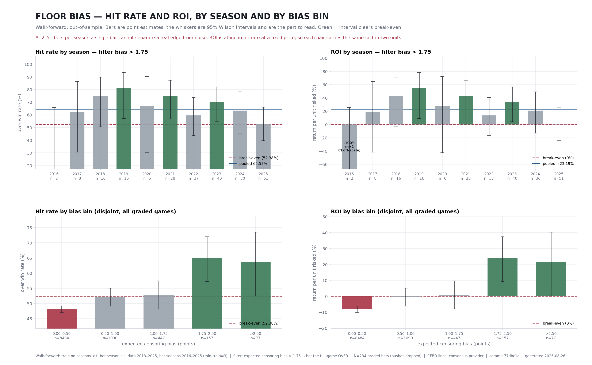

# Hit rate and ROI — by season and by bias bin

Walk-forward, out-of-sample: for season *t* the whole pipeline (Tobit sigmas
+ probit) is fit on seasons *< t* only, then season *t* is graded. Pushes are
dropped. Generated by `monitor/roi_hitrate_doc.py`; the single-number version
of the same bets is in [`roi_report.py`](../monitor/roi_report.py) and
[`figs/roi_report.png`](figs/roi_report.png).

**Read the intervals, not the bars.** Hit rate and ROI are the same fact in
two units — at a fixed price ROI is affine in the win rate — so each pair of
panels carries identical information. Break-even is 52.38% at −110,
which is 0% ROI. A bar is green only when its 95% interval sits entirely
above break-even.

## By season — the deployed filter (bias > 1.75)

| season | N | record | hit rate | hit-rate 95% | ROI | ROI 95% | clears break-even |
|---|---:|---:|---:|---|---:|---|:---:|
| 2016 | 2 | 0–2 | 0.00% | [0.00%, 65.76%] | -100.00% | [-100.00%, +25.55%] | no |
| 2017 | 8 | 5–3 | 62.50% | [30.57%, 86.32%] | +19.32% | [-41.63%, +64.78%] | no |
| 2018 | 16 | 12–4 | 75.00% | [50.50%, 89.82%] | +43.18% | [-3.59%, +71.47%] | no |
| 2019 | 16 | 13–3 | 81.25% | [56.99%, 93.41%] | +55.11% | [+8.80%, +78.33%] | **yes** |
| 2020 | 6 | 4–2 | 66.67% | [30.00%, 90.32%] | +27.27% | [-42.73%, +72.43%] | no |
| 2021 | 28 | 21–7 | 75.00% | [56.64%, 87.32%] | +43.18% | [+8.14%, +66.71%] | **yes** |
| 2022 | 37 | 22–15 | 59.46% | [43.49%, 73.65%] | +13.51% | [-16.98%, +40.61%] | no |
| 2023 | 40 | 28–12 | 70.00% | [54.57%, 81.93%] | +33.64% | [+4.18%, +56.40%] | **yes** |
| 2024 | 30 | 19–11 | 63.33% | [45.51%, 78.13%] | +20.91% | [-13.11%, +49.15%] | no |
| 2025 | 51 | 27–24 | 52.94% | [39.52%, 65.95%] | +1.07% | [-24.55%, +25.90%] | no |

Pooled: **234 bets, 151–83, 64.53%** hit rate ([58.21%, 70.38%]), **+23.19%** ROI ([+11.13%, +34.36%]).

9/10 seasons profitable on the point estimate, but only 3 clear break-even on their own interval — which is what 2–51 bets a season buys you. Single seasons are not the unit of evidence here; the pooled row is.

Two things worth naming rather than leaving for the reader to find:

- **2025 is the largest sample and the flattest result**: 27–24, +1.07% ROI on n=51, against a pooled +23.19%. Its interval [-24.5%, +25.9%] contains both the pooled estimate and break-even, so it is not evidence of decay on its own. `run_monitor.py` is the test that measures decay directly, and as of its last run it finds none.
- **The sample is back-loaded**: 2–51 bets per season, with 68% of all bets coming from 2022 onward. The pooled figure is mostly recent data.

## By bias bin — every graded game, disjoint bands

| bias bin | N | record | hit rate | hit-rate 95% | ROI | ROI 95% | clears break-even |
|---|---:|---:|---:|---|---:|---|:---:|
| 0.00–0.50 | 8484 | 4081–4403 | 48.10% | [47.04%, 49.17%] | -8.17% | [-10.20%, -6.14%] | no |
| 0.50–1.00 | 1090 | 568–522 | 52.11% | [49.14%, 55.06%] | -0.52% | [-6.18%, +5.12%] | no |
| 1.00–1.75 | 447 | 236–211 | 52.80% | [48.16%, 57.38%] | +0.79% | [-8.05%, +9.55%] | no |
| 1.75–2.50 | 157 | 102–55 | 64.97% | [57.23%, 71.99%] | +24.03% | [+9.26%, +37.44%] | **yes** |
| >2.50 | 77 | 49–28 | 63.64% | [52.48%, 73.49%] | +21.49% | [+0.19%, +40.31%] | **yes** |

This is the mechanism check, not a menu of bets. Censoring theory predicts that more expected bias means more mispricing, so the metrics should **rise across the bins**; a single bin popping while its neighbours sit flat is noise, not a strategy. 2 of 5 bins clear break-even on their own interval.

Note the bins are disjoint, so the 1.00–1.75 row is the band *excluded* by the deployed rule — it is shown precisely because it demonstrates no edge, which is why the operational threshold moved from 1.0 to 1.75 (MODEL_GUIDE §3).

## Caveats that apply to every number above

- The 1.75 threshold was chosen partly on this data, so the pooled point estimate is inflated by selection. **Plan on the lower bound** (+11.13% ROI), not the point estimate.
- Every ROI here is priced at −110 flat. The operational rule says −120 or
  better; see the price-sensitivity panel in `figs/roi_report.png` for what
  the vig costs.
- Wilson intervals assume independent bets. Games on the same slate are not
  fully independent, so the true intervals are somewhat wider than shown.

---

Walk-forward: train on seasons < t, bet season t  |  data 2013–2025, bet seasons 2016–2025 (min-train=3)  |  filter: expected censoring bias > 1.75 → bet the full-game OVER  |  N=234 graded bets (pushes dropped)  |  CFBD lines, consensus provider  |  commit 77dbc1c  |  generated 2026-08-26
