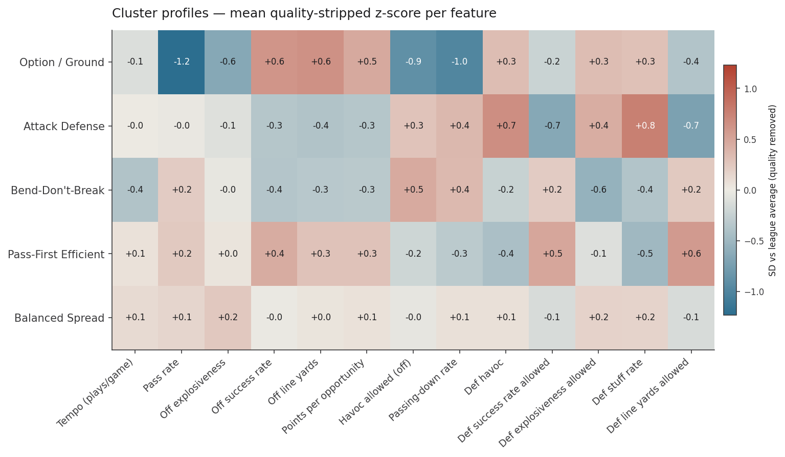
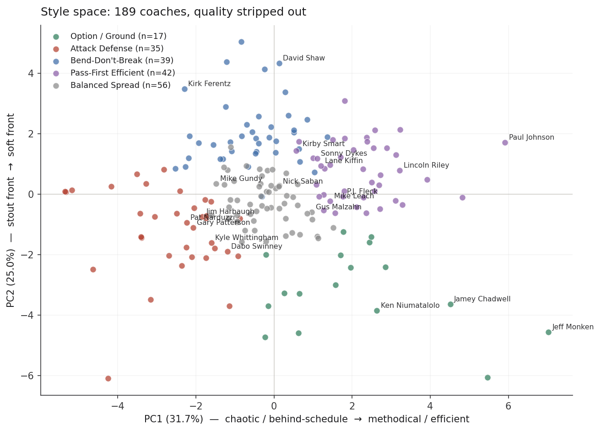
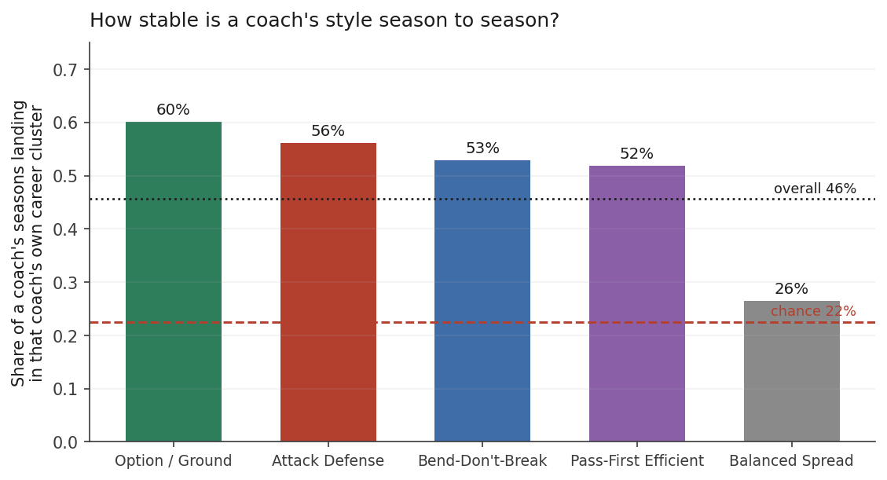
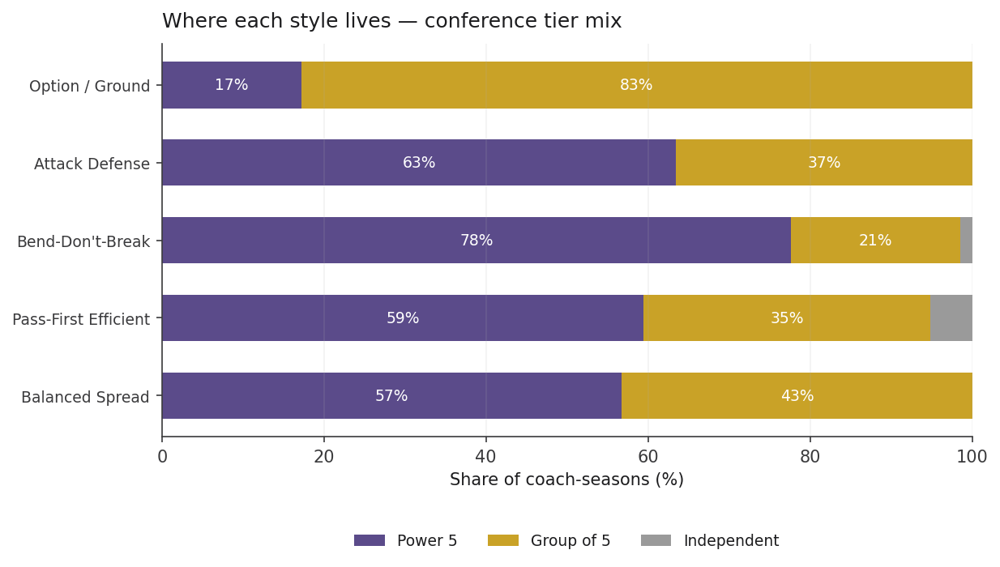
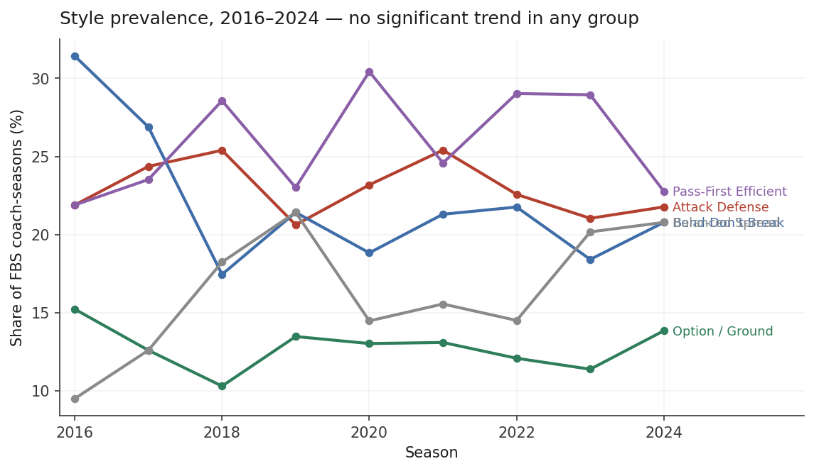
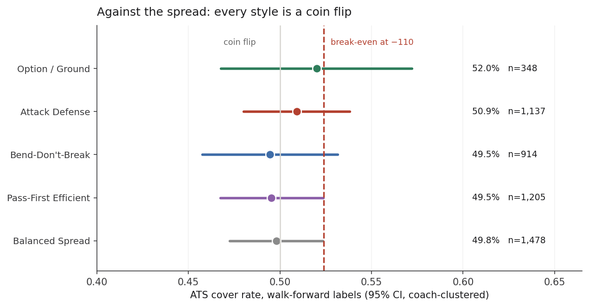
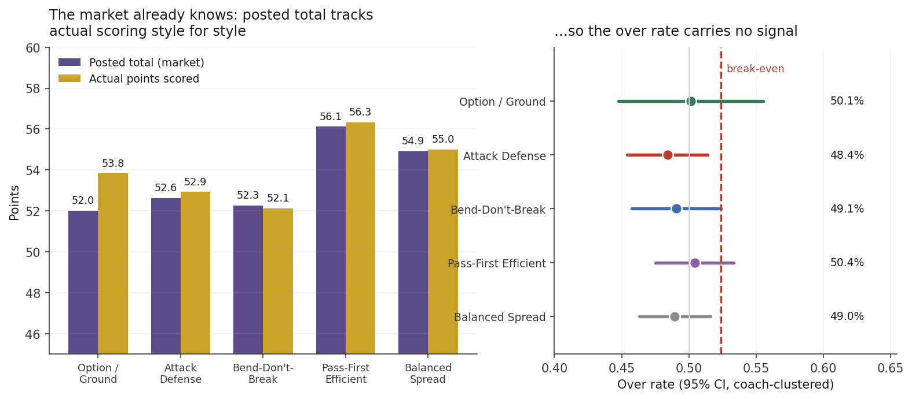
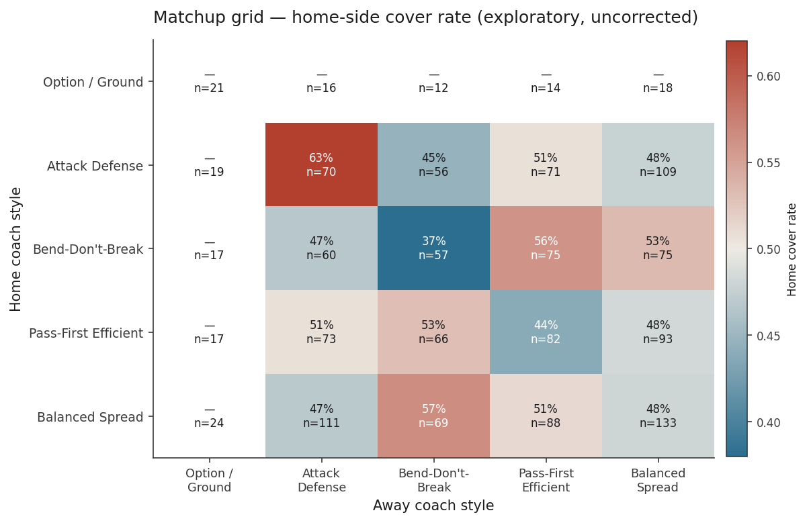

# Coach playstyle clusters — what they measure, and what they don't

Analysis behind the `coach_style_cluster` registry feature (shipped `e7efd7c`). Re-runnable:

```bash
python scripts/build_coach_style_clusters.py     # regenerate cfb_system_maker/coach_style.py
python scripts/analyze_coach_styles.py           # regenerate every number and chart below
```

The generator produces the labels; this note records what they're worth. Formatted version
(same content, better typography): https://claude.ai/code/artifact/a436d6fd-e659-4167-b497-fbcc45abc557

**Bottom line.** Five styles fall out of 2016–2024 advanced team stats once team quality is
stripped. Exactly one of them (option/ground) is discrete; the rest are soft regions of a
continuum. A coach's label holds for fewer than half his own seasons. And the betting market has
priced all of it — nothing in a fixed ten-test family survives multiplicity correction.

Window is 2016–2024 throughout: havoc front-seven/DB splits are constant (broken) in the CFBD feed
before 2016, and 2025 has no havoc at all. 1,110 team-seasons, 264 coaches, 189 labeled
(3-season minimum).

## Why the features are residualized on SP+

The first attempt clustered raw advanced stats and produced a PC1 holding **42%** of variance that
was simply *team quality*. Saban and Smart clustered together because they win, not because they
coach alike. That taxonomy is a power ranking in costume.

Two-step fix, both in `build_coach_style_clusters.py`:

1. z-score each feature **within its season** (removes era drift as league-wide tempo/scoring move)
2. regress on that team's **same-season SP+ overall** and keep the residual

The correlations show why step 2 is load-bearing — and why the feature is quarantined:

| Feature | r with SP+ | Reading |
|---|---:|---|
| Off success rate | +0.67 | mostly quality |
| Def success rate allowed | −0.58 | mostly quality |
| Off havoc allowed | −0.53 | mostly quality |
| Def line yards allowed | −0.47 | mostly quality |
| Off pass rate | −0.10 | style |
| Off explosiveness | +0.01 | style |
| Tempo | +0.02 | style |

After residualizing, PC1 falls to **31.7%** and describes *how* a team plays instead of how well.
PC2 adds 25.0%.

Because SP+ is a full-season outcome measure, and because the label is fit across a coach's whole
tenure, `coach_style_cluster` is grouped `result_lookahead` in the registry. Candidate search
excludes it. Any outcome test has to refit walk-forward — see below.

## The five groups



Cells are mean quality-stripped z-scores. Cluster **names are assigned from profile signatures**,
not k-means indices, so regeneration yields the same five names rather than a reshuffle.

| Style | n | Signature | Representative coaches |
|---|---:|---|---|
| `option_ground` | 17 | pass rate −1.2, line yards +0.6, havoc allowed −0.9 | Monken, Calhoun, Niumatalolo, Chadwell, Paul Johnson |
| `attack_defense` | 35 | stuff +0.8, havoc +0.7, line yards allowed −0.7 | Narduzzi, Harbaugh, Gary Patterson, Franklin, Whittingham |
| `bend_dont_break` | 39 | slow, low havoc, explosiveness allowed −0.6 | Ferentz, Smart, Stoops, Fitzgerald, Wilcox, Shaw |
| `pass_first_efficient` | 42 | success rate +0.4, soft front, line yards allowed +0.6 | Riley, Kiffin, Leach, Sitake, Fleck, Leipold |
| `balanced_spread` | 56 | within ±0.2 SD on all thirteen features | Gundy, Malzahn, Saban, Norvell, Brohm, Clawson |



PC1 runs methodical/on-schedule → chaotic/behind-schedule; PC2 runs stout front → soft front. Mike
Leach sits alone at the pass-rate extreme; the service academies are the only visually isolated
island.

## How much weight the label bears

**Not much, and this is the part to remember.** Silhouette peaks at 0.17 across k = 2–9 and sits at
0.13 for k = 5 — far below the ~0.5 usually read as strong structure. Bootstrap ARI (resample
coaches, recluster) has median ≈ 0.50. Mean within-cluster spread 0.44 SD against mean
between-centroid distance 2.23. Only `option_ground` survives every choice of k as a distinct group.

The sharper test assigns each individual coach-season to its nearest career centroid:



**45.6%** of 1,006 coach-seasons land in that coach's own career cluster, against a **22.5%** chance
baseline. Twice chance — real structure — but a *minority*. Only **15 of 189** coaches are
consistent in every season; **66 of 189** in a majority of theirs. Style drifts with personnel and
coordinators.

`balanced_spread` at 26.5% is barely above chance. **It is a residual bucket, not a style** — read
it as "no strong tendency detected," and don't use it as a filter value in its own right.

Refitting the whole pipeline on prior seasons only reproduces the career label for **72.9%** of 790
coach-seasons. The *procedure* is reproducible; the thing it measures is what moves.

## Where the styles live (and the confound this creates)



Style vs conference tier is the strongest association in the analysis: **χ²(8) = 135.3,
p ≈ 2×10⁻²⁵**. `option_ground` is 83% Group of 5 — the strategy of resource-constrained programs.
`bend_dont_break` inverts at 78% Power 5.

**Consequence:** style correlates with talent tier, so no outcome comparison across styles is a
clean comparison of style alone. Residualization removes SP+ from the *features*; it cannot stop
option coaches from being G5 coaches.



No style shows a significant trend (Spearman vs season; `balanced_spread` ρ = 0.58 p = 0.10 is the
largest). The "college football is converging on one style" claim isn't visible here — though note
that within-season z-scoring means this measures *relative* dispersion, so a league-wide speed-up
would not show up.

## Market test — walk-forward, and null

Career labels are unusable here (they'd let a 2019 game read 2023 results). So the entire pipeline
refits per season on **prior seasons only**, and that label is applied to that season's games.
790 labeled coach-seasons, 6,498 games, 2019–2024.

### Against the spread

Each game contributes two rows, one per team slot. **The two are exact mirrors** — one side covers
iff the other doesn't — so the pooled rate is 50% by construction and only the between-style splits
carry information.



5,082 decided team-slots. Nothing clears the 52.38% break-even. `option_ground` is nominally
highest at 52.0% but spans 46.8–57.2% on 348 slots (raw p = 0.89). Intervals are Wilson widened by
the design effect from coach-level ICC; measured ICC is at or near zero for four of five styles
(the estimator floors negative values at zero), so the correction barely moves them.

### Totals — where the market visibly wins



Style affects scoring enormously: mean posted total runs **52.0** for `option_ground` up to
**56.1** for `pass_first_efficient`, a 4.1-point spread. And the market has it — posted totals track
actual points to within one point in four of five groups. Sportwide, mean posted total **54.24**
against **54.38** actual: a miscalibration of 0.14 points.

So over rates carry nothing: 48.4%–50.4%, every interval containing 50%, none at break-even.

### Multiplicity

Ten tests across the ATS and totals families, the family fixed before any were run. Two return raw
p < 0.05 (`attack_defense` unders p = 0.009, `balanced_spread` unders p = 0.012) — almost exactly
what noise produces. **After Holm, the smallest adjusted p is 0.093. Nothing survives.**



The matchup grid is exploratory and uncorrected (cells under 30 games suppressed) — it adds sixteen
more comparisons on top of the ten. The extremes (63% on 70 games, 37% on 57) are what small-n noise
looks like when you examine enough cells.

## What the feature is actually good for

A null on the betting question isn't a null on the feature. It buys description and segmentation:

- **Slicing existing systems** by opponent type, in plain English.
- **Interaction terms, not main effects.** Main effects are priced. Whether a pace or weather system
  behaves differently against option teams is priced far less precisely. 348 team-slots is too thin
  to answer that here, but it's the right shape of question.
- **UI context.** "Bend-don't-break coach, 78% Power 5" beats another rating number next to a matchup.

## Limits

- **Tempo is plays per game**, contaminated by possession count. Seconds per play would be cleaner
  and needs drive-level timing data.
- **Attribution is team-level.** A coordinator change under a stable head coach reads as the head
  coach changing style.
- **2016 is a hard floor**, 2024 a hard ceiling, for the havoc reasons above.
- **Tier confound** (see above) touches every outcome comparison.
- **`balanced_spread` is not a style.**
- Unlabeled coaches (under 3 seasons in window, FCS, pre-2016-only tenures) read `None` and fail
  closed, like every other feature. In the built sidecar 8,546 of 13,014 games carry a home-coach
  label.
