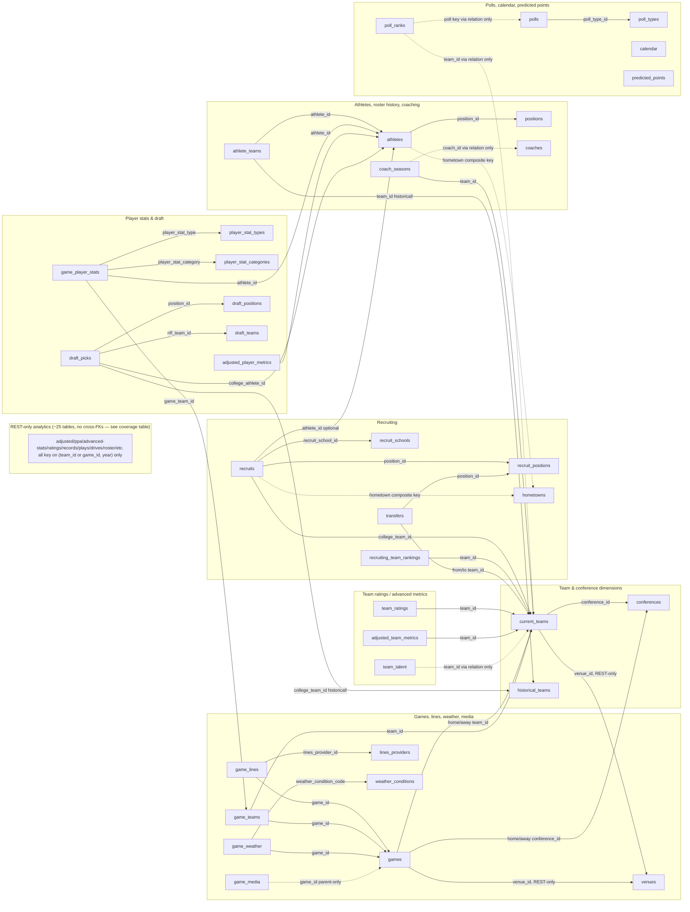

# CFBD API — Draft DB Schema (REST + GraphQL)

Source: live introspection of both CFBD access paths — the REST client via the vendored
`cfbd-python` pydantic models (walked through `AdjustedMetricsApi`, `GamesApi`, ... per
`cfb_system_maker/scrapers.py`'s `ENDPOINTS` registry, 61 endpoints), and
`https://graphql.collegefootballdata.com/v1/graphql` (documented at
`graphqldocs.collegefootballdata.com`) via a full-depth `__schema` introspection query run
through `cfb_system_maker/graphql_client.py`'s poster. Cross-checked against pulled samples in
`data/raw/*.json` (REST) and `data/graphql/*.json` (GraphQL, 24 tables via `GQL_DEFAULT_TABLES`).

## Access paths — REST is canonical here

CFBD exposes the **same underlying data through two APIs**, and this repo uses both, but not
symmetrically:

- **REST** (`scrapers.py`, `cfbd_client.py`) is the project's primary path. `fetch`/`build`/
  `backtest` run on it today (`games`+`lines` → `normalize.py` → `GameRecord`), and `scrape` bulk-pulls
  all 61 endpoints to `data/raw/*.json`. No Patreon tier gate.
- **GraphQL** (`graphql_client.py`) is a **Tier-3-only** bulk alternative that collapses REST's
  per-row fan-out into a handful of paginated queries. It is not wired into `build`/`backtest`.

Where an entity exists in both, REST is the source of truth for shape (it's what the pipeline
actually reads); GraphQL's version is noted as a same-grain alternate with its own quirks — the
two are **not identical shape**, only overlapping data. See the coverage table below for the
full map, and the "Domain groups" DDL is written against the REST shape where the two diverge.

This is a **draft normalized schema** for a future Postgres load — it sits downstream of the
JSONB staging layer `scrapers.py`/`graphql_client.py` already write to `data/raw/` and
`data/graphql/` (see `CLAUDE.md` pipeline notes).

## REST ↔ GraphQL endpoint coverage

One row per REST endpoint (the 61 in `scrapers.ENDPOINTS`). "Maps to" points at the table in
this doc that holds the data; "GQL" says whether a GraphQL equivalent exists and, if so, whether
its shape matches. `Bulk mode` repeats the scraper's mode (`once`/`season`/`season_week`/`grid`/
`per_game`/`per_player`/`on_demand`) so you can see at a glance what's excluded from the default
bulk pull.

| REST endpoint | REST model | Bulk mode | Maps to table | GQL equivalent |
|---|---|---|---|---|
| `adjusted_player_passing` | PlayerWeightedEPA | season | `player_weighted_epa` (metric='passing') | none |
| `adjusted_player_rushing` | PlayerWeightedEPA | season | `player_weighted_epa` (metric='rushing') | none |
| `adjusted_team_season` | AdjustedTeamMetrics | season | `adjusted_team_metrics` | `adjustedTeamMetrics` — same fields, nested differently (see note) |
| `kicker_paar` | KickerPAAR | season | `kicker_paar` | none |
| `lines` | BettingGame (nests `lines[]`) | season | `games` + `game_lines` | `gameLines` — flat per-provider rows; REST nests under a parent game (see note) |
| `coaches` | Coach (nests `seasons[]`) | season | `coaches` + `coach_seasons` | `coach`/`coachSeason` — GraphQL splits into two root tables; REST nests seasons under coach |
| `conferences` | Conference | once | `conferences` | `conference` — near-identical; REST has `classification`, GraphQL has `division`/`srName` |
| `draft_picks` | DraftPick | season | `draft_picks` | `draftPicks` — REST nests `hometownInfo{}`, uses name strings for college/nfl team; GraphQL uses relations |
| `draft_positions` | DraftPosition | once | `draft_positions` | `DraftPosition` — REST has no `id`, natural-keyed by name |
| `draft_teams` | DraftTeam | once | `draft_teams` | `DraftTeam` — REST has no `id` either, natural-keyed by `displayName` |
| `drives` | Drive | season | `drives` | none (GraphQL doesn't expose drives) |
| `advanced_box_score` | AdvancedBoxScore | per_game (opt-in) | `advanced_box_score_raw` (JSONB) | none |
| `calendar` | CalendarWeek | season | `calendar` | `calendar` — REST adds `firstGameStart`/`lastGameStart` |
| `game_player_stats` | GamePlayerStats | season_week | `game_player_stats_raw` (JSONB) | `gamePlayerStat` — GraphQL flattens to one row per athlete/stat-type; REST nests a category/type tree per team |
| `game_team_stats` | GameTeamStats | season_week | `game_team_stats_raw` (JSONB) | none flat — `gameTeam` covers score/elo/win-prob only, not this stat tree |
| `games` | Game | season | `games` (canonical) | `game` — same `id` space; GraphQL splits home/away team into `current_teams` vs implicit; REST is flatter |
| `media` | GameMedia | season | `game_media` | `gameMedia` — GraphQL's has no `gameId` scalar at all (relation-only); REST's is flat and complete |
| `records` | TeamRecords | season | `team_records` | none |
| `scoreboard` | ScoreboardGame | on_demand | *(live only, not in bulk schema)* | root field exists in GraphQL schema too, also live-only |
| `weather` | GameWeather | season | `game_weather` | `gameWeather` — near-identical; Patreon-gated on both paths |
| `user_info` | UserInfo | once | *(account metadata, not game data — skip)* | none |
| `field_goal_ep` | FieldGoalEP | once | `field_goal_ep` | none |
| `predicted_points` | PredictedPointsValue | grid | `predicted_points` | `predictedPoints` — same shape, REST lacks a `down` column oddity noted below |
| `ppa_games` | TeamGamePredictedPointsAdded | season | `team_game_ppa` | none |
| `ppa_players_games` | PlayerGamePredictedPointsAdded | season_week | `player_game_ppa` | none |
| `ppa_players_season` | PlayerSeasonPredictedPointsAdded | season | `player_season_ppa` | none |
| `ppa_teams` | TeamSeasonPredictedPointsAdded | season | `team_season_ppa` | none |
| `pregame_win_prob` | PregameWinProbability | season | `pregame_win_probability` | none |
| `win_probability` | PlayWinProbability | per_game (opt-in) | `play_win_probability` | none |
| `player_season_overview` | PlayerSeasonOverview | per_player (opt-in) | `player_season_overview_raw` (JSONB) | none |
| `player_usage` | PlayerUsage | season | `player_usage` | none |
| `returning_production` | ReturningProduction | season | `returning_production` | none |
| `transfer_portal` | PlayerTransfer | season | `transfers` | `transfer` — GraphQL uses team-id FKs; REST uses team-name strings for origin/destination (see note) |
| `player_search` | PlayerSearchResult | on_demand | *(live lookup only, not in bulk schema)* | none |
| `live_plays` | LiveGame | on_demand | *(live only, not in bulk schema)* | none |
| `play_stat_types` | PlayStatType | once | `play_stat_types` | `PlayerStatType` — different dimension (play-level vs. player-boxscore-level stat names) |
| `play_stats` | PlayStat | season_week | `play_stats` | none |
| `play_types` | PlayType | once | `play_types` | none |
| `plays` | Play | season_week | `plays` | none |
| `rankings` | PollWeek (nests `polls[].ranks[]`) | season | `polls` + `poll_ranks` | `poll`/`pollRank` — GraphQL splits into rows with a `pollType` FK; REST nests poll name as a string under each week |
| `conference_sp` | ConferenceSP | season | `conference_sp` | none |
| `elo` | TeamElo | season | `team_elo` | none (GraphQL's `game.homeStartElo` etc. are per-game snapshots, not this season table) |
| `fpi` | TeamFPI | season | `team_fpi` | none |
| `sp` | TeamSP | season | `team_sp` | `ratings` — GraphQL's `ratings` table flattens sp/fpi/elo/srs into one row; REST's `sp` is SP+-only but far more detailed (offense/defense/special-teams breakdown) |
| `srs` | TeamSRS | season | `team_srs` | none standalone (folded into GraphQL `ratings.srs`) |
| `recruiting_groups` | AggregatedTeamRecruiting | once | `recruiting_position_group_ratings` | none |
| `recruits` | Recruit | season | `recruits` | `recruit` — REST nests `hometownInfo{}` and uses name strings (`committedTo`); GraphQL uses relations (`college`, `hometown`, `position`, `recruitSchool`) |
| `recruiting_teams` | TeamRecruitingRanking | season | `recruiting_team_rankings` | `recruitingTeam` — GraphQL has a `team` relation; REST just has a `team` name string |
| `advanced_game_stats` | AdvancedGameStat | season | `advanced_game_stats` | none |
| `advanced_season_stats` | AdvancedSeasonStat | season | `advanced_season_stats` | none |
| `stat_categories` | `list[str]` | once | `stat_categories` (name-only lookup) | none |
| `game_havoc_stats` | GameHavocStats | season | `game_havoc_stats` | none |
| `player_season_stats` | PlayerStat | season | `player_season_stats` | none |
| `team_stats` | TeamStat | season | `team_stats` | none |
| `fbs_teams` | Team | season | `current_teams` (FBS subset) | `currentTeams` — REST embeds the full `Venue` object inline; GraphQL has no venue at all |
| `matchup` | Matchup | on_demand | *(live/lookup only, not in bulk schema)* | none |
| `roster` | RosterPlayer | season | `roster_players` | none — **different grain than `athletes`**: one row per team-season snapshot, not per career |
| `talent` | TeamTalent | season | `team_talent` | `teamTalent` — GraphQL has no `teamId` scalar (relation-only) |
| `teams` | Team | season | `current_teams` | `currentTeams` — see `fbs_teams` note; same model, unfiltered |
| `teams_ats` | TeamATS | season | `team_ats` | none |
| `venues` | Venue | once | `venues` | **none — GraphQL doesn't expose venues at all** |

Endpoints marked `on_demand` (`scoreboard`, `player_search`, `live_plays`, `matchup`) are
live/lookup-by-key calls, excluded from `scrape`'s bulk run today, and out of scope for a
historical-data schema — they're listed for completeness only.

## GraphQL-specific quirks worth knowing before building DDL

- **Two team dimensions, not one.** `game.homeTeamId/awayTeamId` and most "current" FKs
  (`ratings`, `adjustedTeamMetrics`, `recruitingTeam`, `teamTalent`, `coachSeason`, `pollRank`,
  `transfer.fromTeam/toTeam`) resolve to **`currentTeams`** (keyed by `teamId`, present-day
  name/conference only). But `athleteTeam.team` and `draftPicks.collegeTeam` resolve to
  **`historicalTeam`** (keyed by `id`, tracks renames/relocations over time — e.g. a school that
  changed conference or name mid-history has multiple rows). Any join across career history vs.
  current-season data must go through both dimensions.
- **Several join tables hide their scalar FK.** `gameTeam` has no queryable `id` field — it's
  only reachable via `gamePlayerStat.gameTeamId`. `poll` has no `id` — join via
  `(season, seasonType, week, pollType)`. `pollRank.poll`/`pollRank.team`,
  `coachSeason.coach`/`coachSeason.team`, and `teamTalent.team` expose the **relation only**. To
  materialize these as normal FK columns you must nest-select the id, e.g.
  `pollRank { poll { season week } team { teamId } }` — the flat `data/graphql/*.json` dumps
  (scalars-only) are missing these columns entirely.
- **Natural-key, no-id tables:** `Hometown` (city+state+country+countyFips), `transfer` (no id
  at all — closest natural key is `firstName, lastName, season, fromTeam, toTeam`),
  `PlayerStatType`/`PlayerStatCategory` (name is the key), `draftPicks` (no id — use
  `(year, round, pick)`), `predictedPoints` (a league-wide model table keyed by
  `(down, distance, yardLine)`, no team/season dimension).
- **Two separate position dimensions:** `Position` (on-field, linked from `Athlete`) vs.
  `RecruitPosition` (recruiting-specific groupings, linked from `Recruit`/`Transfer`/`DraftPicks`
  uses yet another, `DraftPosition`). Don't collapse these into one `positions` table.
- **`gamePlayerStat`** is excluded from the default bulk pull (~6.7M rows) and is fetched
  separately per-season via `pull_game_player_stats` (see memory: gamePlayerStat pull deferred
  until base data is downloaded).
- **CFBD field casing is inconsistent** — same convention already called out in the main
  `CLAUDE.md` for the REST client; the GraphQL side is cleaner (consistent camelCase) but still
  mixes `season`/`year` as the season column name across tables.

## REST-specific quirks worth knowing before building DDL

- **One team-id space, not two.** Unlike GraphQL's `currentTeams`/`historicalTeam` split, REST's
  `Game.homeId`/`awayId`, `Team.id`, and every other team FK all point at the **same** id space —
  there is no historical/current divergence to reconcile on the REST side.
- **Most endpoints identify teams by name string, not id.** `AdjustedTeamMetrics.team`,
  `TeamElo.team`, `ConferenceSP.conference`, `PlayerUsage.team`, `Recruit.committedTo`,
  `PlayerTransfer.origin`/`.destination` etc. carry the team/conference **name**, not `team_id`.
  Only a handful of endpoints (`adjusted_team_season`, `records`, `teams_ats`, `games`,
  `game_team_stats`) expose a `teamId`/`homeId`/`awayId` int. Loading these into normalized tables
  requires a name→id lookup against `current_teams`, which is lossy across renames/relocations —
  same underlying problem the GraphQL quirks section flags, inverted (name-keyed instead of
  wrong-dimension-keyed).
- **Several models reuse the same nested shape** across endpoints: `StatsByQuarter`
  (`total`/`quarter1..4`) appears in `advanced_box_score`; the `{explosiveness, successRate,
  totalPPA, ppa}` group appears in both `advanced_game_stats` and `advanced_season_stats`
  (season adds a `.rate` field); `{db, frontSeven, total}` havoc appears in `sp`, `conference_sp`,
  and `advanced_season_stats`. These are flattened as prefixed columns in the DDL below rather
  than given one-off names, to keep the repetition visible.
- **A few endpoints have no natural id and reuse a REST convention of string ids for
  cross-referencing player-shaped rows**: `Recruit.id`, `PlayerUsage.id`,
  `PlayerSeasonPredictedPointsAdded.id`, `RosterPlayer.id`, `PlayerSearchResult.id` are all
  `StrictStr` (stringified numbers) rather than `StrictInt` — pick a consistent cast on load.
- **`game_player_stats`/`game_team_stats`/`advanced_box_score` are report-shaped, not
  relational** — each returns one row per game with a `teams[]` array nesting a
  category→stat-type→athlete tree (or, for `advanced_box_score`, team/quarter breakdowns with no
  fixed cardinality). These are modeled as JSONB blobs below rather than exploded into columns —
  see "REST-only domain tables."
- **`weather` is Patreon-gated on the REST side too** (`scrapers.py` comment: "may 4xx") — same
  caveat as the GraphQL `gameWeather` root.
- **`predicted_points`'s response rows don't carry their own `down`/`distance`** — the model
  (`PredictedPointsValue`) is just `{yardLine, predictedPoints}`; the scraper's `GRID` mode loops
  `down`×`distance` as query params and those values never come back on the row. They must be
  stamped from the loop variables at load time, not read off the response.

## Domain groups

Tables below are written against the REST shape (per the canonicity note above). Where GraphQL
covers the same entity with a materially different shape, a one-line note says so; full detail
is in the coverage table.

- `current_teams` — REST's `Team`/`fbs_teams` model is richer than GraphQL's `currentTeams`
  (adds mascot/colors/logos/twitter/alternate names and embeds a full `Venue`); columns below
  include those extras plus a `venue_id` FK, which GraphQL has no equivalent for at all.
- `conferences` — REST has `classification` where GraphQL has `division`/`sr_name`; both kept.
- `games` — same numeric `id` space on both paths (a rare point of full agreement); REST is
  flatter (no separate `linesAggregate`/`mediaInfo` relations) and adds `completed` and
  `highlights` columns GraphQL's `game` type lacks. REST's `homePregameElo`/`homePostgameElo`
  are the same concept as GraphQL's `homeStartElo`/`homeEndElo`, just renamed.
- `game_lines` — REST's `BettingGame` nests `lines: [GameLine]` (fields: `provider`, `spread`,
  `formatted_spread`, `spread_open`, `over_under`, `over_under_open`, `home_moneyline`,
  `away_moneyline`) as a child array of the parent game; GraphQL's `gameLines` is the same data
  as flat top-level rows. Same target table once unnested; REST has an extra
  `formatted_spread` display string GraphQL lacks.
- `game_media` — REST's is flat and complete (`game_id` present); GraphQL's `GameMedia` type has
  no `game_id` scalar at all (parent-only, dashed edge in the flowchart) — REST is strictly
  better here.
- `team_talent`, `recruiting_team_rankings` — REST exposes `team`/`team_id` directly; GraphQL
  hides these behind relation-only fields (see GraphQL quirks above).
- `coaches`/`coach_seasons` — REST's `Coach` nests `seasons: [CoachSeason]` under the coach;
  GraphQL splits them into two root tables (`coach`, `coachSeason`) with hidden join keys. Same
  two target tables either way.
- `draft_picks`, `recruits`, `transfers` — REST nests a small `hometownInfo{}`/`recruitHometownInfo{}`
  object and uses name strings for team references (`collegeTeam`, `committedTo`, `origin`/
  `destination`); GraphQL uses relations/FKs for the same. Column-compatible after a name→id
  resolution pass.

### 1. Team & conference dimensions

```sql
-- current, present-day team identity (what most FKs point to)
CREATE TABLE current_teams (
    team_id         INT PRIMARY KEY,
    school          TEXT,
    mascot          TEXT,
    abbreviation    TEXT,
    alternate_names JSONB,          -- REST Team.alternateNames[]
    classification  TEXT,
    conference_id   INT REFERENCES conferences(id),
    conference      TEXT,          -- denormalized name, present alongside conference_id
    division        TEXT,
    color           TEXT,
    alternate_color TEXT,
    logos           JSONB,          -- REST Team.logos[]
    twitter         TEXT,
    venue_id        INT REFERENCES venues(id)  -- REST Team.location; no GraphQL equivalent
);

-- historical team identity — tracks renames/relocations, used by athlete_teams & draft_picks
CREATE TABLE historical_teams (
    id                      INT PRIMARY KEY,
    school                  TEXT,
    display_name            TEXT,
    short_display_name      TEXT,
    mascot                  TEXT,
    nickname                TEXT,
    abbreviation            TEXT,
    classification          TEXT,
    conference_id           INT,
    conference              TEXT,
    conference_abbreviation TEXT,
    conference_short_name   TEXT,
    division                TEXT,
    color                   TEXT,
    alt_color               TEXT,
    alt_name                TEXT,
    ncaa_name               TEXT,
    country_code            TEXT,
    twitter                 TEXT,
    images                  JSONB,
    start_year              INT,
    end_year                INT,
    active                  BOOLEAN
);

CREATE TABLE conferences (
    id            INT PRIMARY KEY,
    name          TEXT,
    abbreviation  TEXT,
    short_name    TEXT,
    sr_name       TEXT,
    division      TEXT
);
```

### 2. Games, lines, weather, media

```sql
CREATE TABLE games (
    id                      INT PRIMARY KEY,
    season                  INT,
    season_type             TEXT,
    week                    INT,
    start_date              TIMESTAMPTZ,
    start_time_tbd          BOOLEAN,
    completed               BOOLEAN,        -- REST only
    status                  TEXT,
    neutral_site            BOOLEAN,
    conference_game         BOOLEAN,
    venue_id                INT REFERENCES venues(id),
    attendance              INT,
    highlights              TEXT,           -- REST only (video URL)
    notes                   TEXT,
    excitement               NUMERIC,
    home_team_id            INT REFERENCES current_teams(team_id),
    home_conference_id      INT REFERENCES conferences(id),
    home_classification     TEXT,
    home_points             INT,
    home_start_elo          NUMERIC,
    home_end_elo            NUMERIC,
    home_postgame_win_prob  NUMERIC,
    home_line_scores        JSONB,
    away_team_id            INT REFERENCES current_teams(team_id),
    away_conference_id      INT REFERENCES conferences(id),
    away_classification     TEXT,
    away_points             INT,
    away_start_elo          NUMERIC,
    away_end_elo            NUMERIC,
    away_postgame_win_prob  NUMERIC,
    away_line_scores        JSONB
);

CREATE TABLE lines_providers (
    id    INT PRIMARY KEY,
    name  TEXT
);

CREATE TABLE game_lines (
    game_id             INT REFERENCES games(id),
    lines_provider_id   INT REFERENCES lines_providers(id),
    spread              NUMERIC,
    formatted_spread    TEXT,      -- REST only, e.g. "Home -3.5"
    spread_open         NUMERIC,
    over_under          NUMERIC,
    over_under_open     NUMERIC,
    moneyline_home      INT,
    moneyline_away      INT,
    PRIMARY KEY (game_id, lines_provider_id)
);

-- surrogate id not exposed by the API — synthesize one on load (e.g. serial),
-- since game_player_stats.game_team_id references it and has no other way in
CREATE TABLE game_teams (
    id          SERIAL PRIMARY KEY,      -- synthesized; API's internal id is opaque
    game_id     INT REFERENCES games(id),
    team_id     INT REFERENCES current_teams(team_id),
    home_away   TEXT,
    points      INT,
    line_scores JSONB,
    start_elo   NUMERIC,
    end_elo     NUMERIC,
    win_prob    NUMERIC,
    UNIQUE (game_id, team_id)
);

CREATE TABLE weather_conditions (
    id           INT PRIMARY KEY,
    description  TEXT
);

CREATE TABLE game_weather (
    game_id                 INT PRIMARY KEY REFERENCES games(id),
    weather_condition_code  INT REFERENCES weather_conditions(id),
    temperature             NUMERIC,
    dewpoint                NUMERIC,
    humidity                NUMERIC,
    precipitation           NUMERIC,
    snowfall                NUMERIC,
    pressure                NUMERIC,
    wind_direction          NUMERIC,
    wind_speed              NUMERIC,
    wind_gust               NUMERIC
);

-- no gameId scalar exposed on GameMedia itself — only reachable as game.mediaInfo[];
-- must carry game_id through at load time from the parent query, not from this type alone
CREATE TABLE game_media (
    game_id     INT REFERENCES games(id),  -- populated from parent, not a GraphQL field
    media_type  TEXT,
    name        TEXT
);
```

### 3. Team ratings / advanced metrics

```sql
CREATE TABLE team_ratings (
    team_id  INT REFERENCES current_teams(team_id),
    year     INT,
    elo      NUMERIC,
    fpi                              NUMERIC,
    fpi_offensive_efficiency         NUMERIC,
    fpi_defensive_efficiency         NUMERIC,
    fpi_special_teams_efficiency     NUMERIC,
    fpi_overall_efficiency           NUMERIC,
    fpi_average_win_probability_rank INT,
    fpi_game_control_rank            INT,
    fpi_remaining_sos_rank           INT,
    fpi_resume_rank                  INT,
    fpi_sos_rank                     INT,
    fpi_strength_of_record_rank      INT,
    sp_offense    NUMERIC,
    sp_defense    NUMERIC,
    sp_special_teams NUMERIC,
    sp_overall    NUMERIC,
    srs           NUMERIC,
    PRIMARY KEY (team_id, year)
);

CREATE TABLE adjusted_team_metrics (
    team_id  INT REFERENCES current_teams(team_id),
    year     INT,
    epa NUMERIC, epa_allowed NUMERIC,
    passing_epa NUMERIC, passing_epa_allowed NUMERIC,
    rushing_epa NUMERIC, rushing_epa_allowed NUMERIC,
    success NUMERIC, success_allowed NUMERIC,
    standard_downs_success NUMERIC, standard_downs_success_allowed NUMERIC,
    passing_downs_success NUMERIC, passing_downs_success_allowed NUMERIC,
    explosiveness NUMERIC, explosiveness_allowed NUMERIC,
    line_yards NUMERIC, line_yards_allowed NUMERIC,
    second_level_yards NUMERIC, second_level_yards_allowed NUMERIC,
    open_field_yards NUMERIC, open_field_yards_allowed NUMERIC,
    highlight_yards NUMERIC, highlight_yards_allowed NUMERIC,
    PRIMARY KEY (team_id, year)
);

-- no team_id scalar exposed — join key comes only from the `team` relation
CREATE TABLE team_talent (
    team_id  INT REFERENCES current_teams(team_id),  -- populated via nested `team { teamId }`
    year     INT,
    talent   NUMERIC,
    PRIMARY KEY (team_id, year)
);
```

### 4. Recruiting

```sql
CREATE TABLE recruit_positions (
    id             INT PRIMARY KEY,
    position       TEXT,
    position_group TEXT
);

CREATE TABLE recruit_schools (
    id    INT PRIMARY KEY,
    name  TEXT
);

-- natural key, no surrogate id exposed
CREATE TABLE hometowns (
    city         TEXT,
    state        TEXT,
    country      TEXT,
    county_fips  TEXT,
    latitude     NUMERIC,
    longitude    NUMERIC,
    PRIMARY KEY (city, state, country, county_fips)
);

CREATE TABLE recruits (
    id                INT PRIMARY KEY,
    year              INT,
    name              TEXT,
    recruit_type      TEXT,
    height            NUMERIC,
    weight            NUMERIC,
    stars             INT,
    rating            NUMERIC,
    ranking           INT,
    overall_rank      INT,
    position_rank     INT,
    position_id       INT REFERENCES recruit_positions(id),
    recruit_school_id INT REFERENCES recruit_schools(id),
    college_team_id   INT REFERENCES current_teams(team_id),
    hometown_city     TEXT,   -- FK into hometowns (composite)
    hometown_state    TEXT,
    hometown_country  TEXT,
    athlete_id        INT REFERENCES athletes(id)  -- null until the recruit enrolls/matches
);

CREATE TABLE recruiting_team_rankings (
    id       INT PRIMARY KEY,
    year     INT,
    team_id  INT REFERENCES current_teams(team_id),
    rank     INT,
    points   NUMERIC
);

-- no id exposed; natural key only
CREATE TABLE transfers (
    first_name       TEXT,
    last_name        TEXT,
    season           INT,
    from_team_id     INT REFERENCES current_teams(team_id),
    to_team_id       INT REFERENCES current_teams(team_id),
    position_id      INT REFERENCES recruit_positions(id),
    stars            INT,
    rating           NUMERIC,
    eligibility      TEXT,
    transfer_date    DATE,
    PRIMARY KEY (first_name, last_name, season, from_team_id, to_team_id)
);
```

### 5. Athletes, roster history, coaching

```sql
CREATE TABLE positions (
    id            INT PRIMARY KEY,
    name          TEXT,
    abbreviation  TEXT,
    display_name  TEXT
);

CREATE TABLE athletes (
    id                INT PRIMARY KEY,
    first_name        TEXT,
    last_name         TEXT,
    name              TEXT,
    jersey            INT,
    height            NUMERIC,
    weight            NUMERIC,
    team_id           INT,                          -- current team; no relation object exposed
    position_id       INT REFERENCES positions(id),
    hometown_id       INT,                           -- FK concept only; Hometown has no surrogate id
    hometown_city     TEXT,
    hometown_state    TEXT,
    hometown_country  TEXT
);

-- career team history — keyed against historical_teams, NOT current_teams
CREATE TABLE athlete_teams (
    athlete_id  INT REFERENCES athletes(id),
    team_id     INT REFERENCES historical_teams(id),
    start_year  INT,
    end_year    INT,
    PRIMARY KEY (athlete_id, team_id, start_year)
);

CREATE TABLE coaches (
    id          INT PRIMARY KEY,
    first_name  TEXT,
    last_name   TEXT
);

-- no coach_id/team_id scalars exposed — populate from nested `coach { id }`, `team { teamId }`
CREATE TABLE coach_seasons (
    coach_id          INT REFERENCES coaches(id),
    team_id           INT REFERENCES current_teams(team_id),
    year              INT,
    wins              INT,
    losses            INT,
    ties              INT,
    games             INT,
    preseason_rank    INT,
    postseason_rank   INT,
    PRIMARY KEY (coach_id, team_id, year)
);
```

### 6. Player stats & draft

```sql
CREATE TABLE player_stat_types (
    name  TEXT PRIMARY KEY
);

CREATE TABLE player_stat_categories (
    name  TEXT PRIMARY KEY
);

-- ~6.7M rows at full scale; pulled per-season on demand, not part of the bulk default
CREATE TABLE game_player_stats (
    id                INT PRIMARY KEY,
    game_team_id      INT REFERENCES game_teams(id),
    athlete_id        INT REFERENCES athletes(id),
    player_stat_type      TEXT REFERENCES player_stat_types(name),
    player_stat_category  TEXT REFERENCES player_stat_categories(name),
    stat              TEXT   -- value stored as string by the API; cast per stat_type at query time
);

CREATE TABLE adjusted_player_metrics (
    athlete_id    INT REFERENCES athletes(id),
    year          INT,
    metric_type   TEXT,
    metric_value  NUMERIC,
    plays         INT,
    PRIMARY KEY (athlete_id, year, metric_type)
);

CREATE TABLE draft_positions (
    id            INT PRIMARY KEY,
    name          TEXT,
    abbreviation  TEXT
);

CREATE TABLE draft_teams (
    id                    INT PRIMARY KEY,
    display_name          TEXT,
    short_display_name    TEXT,
    location              TEXT,
    nickname              TEXT,
    mascot                TEXT,
    logo                  TEXT
);

-- no id exposed; natural key is (year, round, pick)
CREATE TABLE draft_picks (
    year               INT,
    round              INT,
    pick               INT,
    overall            INT,
    overall_rank       INT,
    position_rank      INT,
    name               TEXT,
    height             NUMERIC,
    weight             NUMERIC,
    grade              NUMERIC,
    position_id        INT REFERENCES draft_positions(id),
    college_team_id    INT REFERENCES historical_teams(id),  -- note: historical, not current
    college_athlete_id INT REFERENCES athletes(id),
    nfl_team_id        INT REFERENCES draft_teams(id),
    PRIMARY KEY (year, round, pick)
);
```

### 7. Polls, calendar, predicted points

```sql
CREATE TABLE poll_types (
    id             INT PRIMARY KEY,
    name           TEXT,
    abbreviation   TEXT,
    short_name     TEXT
);

-- no id exposed; natural key
CREATE TABLE polls (
    season       INT,
    season_type  TEXT,
    week         INT,
    poll_type_id INT REFERENCES poll_types(id),
    PRIMARY KEY (season, season_type, week, poll_type_id)
);

-- poll/team join keys only available via nested relations, not flat scalars
CREATE TABLE poll_ranks (
    season           INT,
    season_type      TEXT,
    week             INT,
    poll_type_id     INT,
    team_id          INT REFERENCES current_teams(team_id),
    rank             INT,
    points           INT,
    first_place_votes INT,
    FOREIGN KEY (season, season_type, week, poll_type_id) REFERENCES polls(season, season_type, week, poll_type_id)
);

CREATE TABLE calendar (
    year         INT,
    week         INT,
    season_type  TEXT,
    start_date   TIMESTAMPTZ,
    end_date     TIMESTAMPTZ,
    PRIMARY KEY (year, week, season_type)
);

-- league-wide model, no team/season dimension at all
CREATE TABLE predicted_points (
    down              INT,
    distance          INT,
    yard_line         INT,
    predicted_points  NUMERIC,
    PRIMARY KEY (down, distance, yard_line)
);
```

## REST-only domain tables

Entities REST exposes with no GraphQL equivalent (see coverage table for the full "none" list).
Grouped by family; most are keyed on `(team-or-team_id, year)` or `(game_id, ...)` with no
further cross-table FKs, so they're kept out of the flowchart as individual nodes (see the note
there) — the coverage table is the map for these.

### R1. Adjusted & derived player metrics

```sql
-- same endpoint model (PlayerWeightedEPA) backs both adjusted_player_passing and
-- adjusted_player_rushing; the response itself doesn't say which — stamp `metric` from
-- which endpoint you called
CREATE TABLE player_weighted_epa (
    year         INT,
    athlete_id   TEXT,   -- API types this StrictStr, not int
    athlete_name TEXT,
    position     TEXT,
    team         TEXT,
    conference   TEXT,
    metric       TEXT,   -- 'passing' | 'rushing'
    wepa         NUMERIC,
    plays        INT,
    PRIMARY KEY (year, athlete_id, metric)
);

CREATE TABLE kicker_paar (
    year         INT,
    athlete_id   TEXT,
    athlete_name TEXT,
    team         TEXT,
    conference   TEXT,
    paar         NUMERIC,
    attempts     INT,
    PRIMARY KEY (year, athlete_id)
);
```

### R2. Predicted points added (PPA) family

```sql
CREATE TABLE team_game_ppa (
    game_id            INT REFERENCES games(id),
    season INT, week INT, season_type TEXT,
    team TEXT, conference TEXT, opponent TEXT,
    offense_overall NUMERIC, offense_passing NUMERIC, offense_rushing NUMERIC,
    offense_first_down NUMERIC, offense_second_down NUMERIC, offense_third_down NUMERIC,
    defense_overall NUMERIC, defense_passing NUMERIC, defense_rushing NUMERIC,
    defense_first_down NUMERIC, defense_second_down NUMERIC, defense_third_down NUMERIC,
    PRIMARY KEY (game_id, team)
);

CREATE TABLE player_game_ppa (
    season INT, week INT, season_type TEXT,
    athlete_id TEXT, name TEXT, position TEXT, team TEXT, opponent TEXT,
    avg_ppa_all NUMERIC, avg_ppa_pass NUMERIC, avg_ppa_rush NUMERIC,
    PRIMARY KEY (season, week, athlete_id, team)
);

CREATE TABLE player_season_ppa (
    season INT, athlete_id TEXT, name TEXT, position TEXT, team TEXT, conference TEXT,
    avg_ppa_all NUMERIC, avg_ppa_pass NUMERIC, avg_ppa_rush NUMERIC,
    avg_ppa_first_down NUMERIC, avg_ppa_second_down NUMERIC, avg_ppa_third_down NUMERIC,
    avg_ppa_standard_downs NUMERIC, avg_ppa_passing_downs NUMERIC,
    total_ppa_all NUMERIC, total_ppa_pass NUMERIC, total_ppa_rush NUMERIC,
    total_ppa_first_down NUMERIC, total_ppa_second_down NUMERIC, total_ppa_third_down NUMERIC,
    total_ppa_standard_downs NUMERIC, total_ppa_passing_downs NUMERIC,
    PRIMARY KEY (season, athlete_id)
);

CREATE TABLE team_season_ppa (
    season INT, team TEXT, conference TEXT,
    offense_cumulative_rushing NUMERIC, offense_cumulative_passing NUMERIC, offense_cumulative_total NUMERIC,
    offense_overall NUMERIC, offense_passing NUMERIC, offense_rushing NUMERIC,
    offense_first_down NUMERIC, offense_second_down NUMERIC, offense_third_down NUMERIC,
    defense_cumulative_rushing NUMERIC, defense_cumulative_passing NUMERIC, defense_cumulative_total NUMERIC,
    defense_overall NUMERIC, defense_passing NUMERIC, defense_rushing NUMERIC,
    defense_first_down NUMERIC, defense_second_down NUMERIC, defense_third_down NUMERIC,
    PRIMARY KEY (season, team)
);
```

### R3. Advanced & situational stats

Reused shapes flattened with a prefix: `{explosiveness, successRate, totalPPA, ppa}` per
passing/rushing play type, `{explosiveness, successRate, ppa}` (+ `rate` at season grain) per
down type, `{db, frontSeven, total}` havoc. Offense and defense mirror each other field-for-field
except where the upstream API itself is asymmetric (noted inline).

```sql
CREATE TABLE advanced_game_stats (
    game_id INT REFERENCES games(id),
    season INT, season_type TEXT, week INT,
    team TEXT, opponent TEXT,
    offense_passing_plays_explosiveness NUMERIC, offense_passing_plays_success_rate NUMERIC,
    offense_passing_plays_total_ppa NUMERIC, offense_passing_plays_ppa NUMERIC,
    offense_rushing_plays_explosiveness NUMERIC, offense_rushing_plays_success_rate NUMERIC,
    offense_rushing_plays_total_ppa NUMERIC, offense_rushing_plays_ppa NUMERIC,
    offense_passing_downs_explosiveness NUMERIC, offense_passing_downs_success_rate NUMERIC, offense_passing_downs_ppa NUMERIC,
    offense_standard_downs_explosiveness NUMERIC, offense_standard_downs_success_rate NUMERIC, offense_standard_downs_ppa NUMERIC,
    offense_open_field_yards_total INT, offense_open_field_yards NUMERIC,
    offense_second_level_yards_total INT, offense_second_level_yards NUMERIC,
    offense_line_yards_total INT, offense_line_yards NUMERIC,
    offense_stuff_rate NUMERIC, offense_power_success NUMERIC,
    offense_explosiveness NUMERIC, offense_success_rate NUMERIC,
    offense_total_ppa NUMERIC, offense_ppa NUMERIC,
    offense_drives INT, offense_plays INT,
    defense_passing_plays_explosiveness NUMERIC, defense_passing_plays_success_rate NUMERIC,
    defense_passing_plays_total_ppa NUMERIC, defense_passing_plays_ppa NUMERIC,
    defense_rushing_plays_explosiveness NUMERIC, defense_rushing_plays_success_rate NUMERIC,
    defense_rushing_plays_total_ppa NUMERIC, defense_rushing_plays_ppa NUMERIC,
    defense_passing_downs_explosiveness NUMERIC, defense_passing_downs_success_rate NUMERIC, defense_passing_downs_ppa NUMERIC,
    defense_standard_downs_explosiveness NUMERIC, defense_standard_downs_success_rate NUMERIC, defense_standard_downs_ppa NUMERIC,
    defense_open_field_yards_total INT, defense_open_field_yards NUMERIC,
    defense_second_level_yards_total INT, defense_second_level_yards NUMERIC,
    defense_line_yards_total INT, defense_line_yards NUMERIC,
    defense_stuff_rate NUMERIC, defense_power_success NUMERIC,
    defense_explosiveness NUMERIC, defense_success_rate NUMERIC,
    defense_total_ppa NUMERIC, defense_ppa NUMERIC,
    defense_drives INT, defense_plays INT,
    PRIMARY KEY (game_id, team)
);

-- season grain: passing/rushing plays and downs add a `rate` column; note the upstream API is
-- asymmetric — defense.passingDowns/rushingPlays reuse the "has totalPPA" shape while
-- offense.passingDowns/standardDowns don't (kept faithfully below, not "fixed")
CREATE TABLE advanced_season_stats (
    season INT, team TEXT, conference TEXT,
    offense_passing_plays_explosiveness NUMERIC, offense_passing_plays_success_rate NUMERIC,
    offense_passing_plays_total_ppa NUMERIC, offense_passing_plays_ppa NUMERIC, offense_passing_plays_rate NUMERIC,
    offense_rushing_plays_explosiveness NUMERIC, offense_rushing_plays_success_rate NUMERIC,
    offense_rushing_plays_total_ppa NUMERIC, offense_rushing_plays_ppa NUMERIC, offense_rushing_plays_rate NUMERIC,
    offense_passing_downs_explosiveness NUMERIC, offense_passing_downs_success_rate NUMERIC,
    offense_passing_downs_ppa NUMERIC, offense_passing_downs_rate NUMERIC,
    offense_standard_downs_explosiveness NUMERIC, offense_standard_downs_success_rate NUMERIC,
    offense_standard_downs_ppa NUMERIC, offense_standard_downs_rate NUMERIC,
    offense_havoc_db NUMERIC, offense_havoc_front_seven NUMERIC, offense_havoc_total NUMERIC,
    offense_field_position_avg_predicted_points NUMERIC, offense_field_position_avg_start NUMERIC,
    offense_points_per_opportunity NUMERIC, offense_total_opportunities INT,  -- API field is "totalOpportunies" (upstream typo)
    offense_open_field_yards_total INT, offense_open_field_yards NUMERIC,
    offense_second_level_yards_total INT, offense_second_level_yards NUMERIC,
    offense_line_yards_total INT, offense_line_yards NUMERIC,
    offense_stuff_rate NUMERIC, offense_power_success NUMERIC,
    offense_explosiveness NUMERIC, offense_success_rate NUMERIC,
    offense_total_ppa NUMERIC, offense_ppa NUMERIC,
    offense_drives INT, offense_plays INT,
    defense_passing_plays_explosiveness NUMERIC, defense_passing_plays_success_rate NUMERIC,
    defense_passing_plays_total_ppa NUMERIC, defense_passing_plays_ppa NUMERIC, defense_passing_plays_rate NUMERIC,
    defense_rushing_plays_explosiveness NUMERIC, defense_rushing_plays_success_rate NUMERIC,
    defense_rushing_plays_total_ppa NUMERIC, defense_rushing_plays_ppa NUMERIC, defense_rushing_plays_rate NUMERIC,
    defense_passing_downs_explosiveness NUMERIC, defense_passing_downs_success_rate NUMERIC,
    defense_passing_downs_total_ppa NUMERIC, defense_passing_downs_ppa NUMERIC, defense_passing_downs_rate NUMERIC,
    defense_standard_downs_explosiveness NUMERIC, defense_standard_downs_success_rate NUMERIC,
    defense_standard_downs_ppa NUMERIC, defense_standard_downs_rate NUMERIC,
    defense_havoc_db NUMERIC, defense_havoc_front_seven NUMERIC, defense_havoc_total NUMERIC,
    defense_field_position_avg_predicted_points NUMERIC, defense_field_position_avg_start NUMERIC,
    defense_points_per_opportunity NUMERIC, defense_total_opportunities INT,
    defense_open_field_yards_total INT, defense_open_field_yards NUMERIC,
    defense_second_level_yards_total INT, defense_second_level_yards NUMERIC,
    defense_line_yards_total INT, defense_line_yards NUMERIC,
    defense_stuff_rate NUMERIC, defense_power_success NUMERIC,
    defense_explosiveness NUMERIC, defense_success_rate NUMERIC,
    defense_total_ppa NUMERIC, defense_ppa NUMERIC,
    defense_drives INT, defense_plays INT,
    PRIMARY KEY (season, team)
);

CREATE TABLE game_havoc_stats (
    game_id INT REFERENCES games(id),
    season INT, season_type TEXT, week INT,
    team TEXT, conference TEXT, opponent TEXT, opponent_conference TEXT,
    offense_db_havoc_rate NUMERIC, offense_front_seven_havoc_rate NUMERIC, offense_havoc_rate NUMERIC,
    offense_db_havoc_events NUMERIC, offense_front_seven_havoc_events NUMERIC, offense_total_havoc_events NUMERIC,
    offense_total_plays NUMERIC,
    defense_db_havoc_rate NUMERIC, defense_front_seven_havoc_rate NUMERIC, defense_havoc_rate NUMERIC,
    defense_db_havoc_events NUMERIC, defense_front_seven_havoc_events NUMERIC, defense_total_havoc_events NUMERIC,
    defense_total_plays NUMERIC,
    PRIMARY KEY (game_id, team)
);

-- long-format name/value tables — CFBD's own shape (TeamStat.statValue is a string|number union;
-- cast per stat_name at query time rather than fixing a type here)
CREATE TABLE team_stats (
    season INT, team TEXT, conference TEXT,
    stat_name TEXT, stat_value TEXT,
    PRIMARY KEY (season, team, stat_name)
);

CREATE TABLE player_season_stats (
    season INT, player_id TEXT, player TEXT, position TEXT, team TEXT, conference TEXT,
    category TEXT, stat_type TEXT, stat TEXT,
    PRIMARY KEY (season, player_id, category, stat_type)
);
```

### R4. Ratings detail (REST breaks out what GraphQL's `ratings` flattens into one row)

```sql
CREATE TABLE team_elo (
    year INT, team TEXT, conference TEXT, elo INT,
    PRIMARY KEY (year, team)
);

CREATE TABLE team_fpi (
    year INT, team TEXT, conference TEXT, fpi NUMERIC,
    resume_game_control_rank INT, resume_remaining_sos_rank INT, resume_sos_rank INT,
    resume_avg_win_probability_rank INT, resume_fpi_rank INT, resume_strength_of_record_rank INT,
    efficiency_special_teams NUMERIC, efficiency_defense NUMERIC,
    efficiency_offense NUMERIC, efficiency_overall NUMERIC,
    PRIMARY KEY (year, team)
);

CREATE TABLE team_sp (
    year INT, team TEXT, conference TEXT,
    rating NUMERIC, ranking INT, second_order_wins NUMERIC, sos NUMERIC,
    offense_pace NUMERIC, offense_run_rate NUMERIC, offense_passing_downs NUMERIC, offense_standard_downs NUMERIC,
    offense_passing NUMERIC, offense_rushing NUMERIC, offense_explosiveness NUMERIC, offense_success NUMERIC,
    offense_rating NUMERIC, offense_ranking INT,
    defense_havoc_db NUMERIC, defense_havoc_front_seven NUMERIC,
    defense_passing_downs NUMERIC, defense_standard_downs NUMERIC, defense_passing NUMERIC, defense_rushing NUMERIC,
    defense_explosiveness NUMERIC, defense_success NUMERIC, defense_rating NUMERIC, defense_ranking INT,
    special_teams_rating NUMERIC,
    PRIMARY KEY (year, team)
);

CREATE TABLE team_srs (
    year INT, team TEXT, conference TEXT, division TEXT, rating NUMERIC, ranking INT,
    PRIMARY KEY (year, team)
);

CREATE TABLE conference_sp (
    year INT, conference TEXT,
    rating NUMERIC, second_order_wins NUMERIC, sos NUMERIC,
    offense_pace NUMERIC, offense_run_rate NUMERIC, offense_passing_downs NUMERIC, offense_standard_downs NUMERIC,
    offense_passing NUMERIC, offense_rushing NUMERIC, offense_explosiveness NUMERIC, offense_success NUMERIC, offense_rating NUMERIC,
    defense_havoc_db NUMERIC, defense_havoc_front_seven NUMERIC,
    defense_passing_downs NUMERIC, defense_standard_downs NUMERIC, defense_passing NUMERIC, defense_rushing NUMERIC,
    defense_explosiveness NUMERIC, defense_success NUMERIC, defense_rating NUMERIC,
    special_teams_rating NUMERIC,
    PRIMARY KEY (year, conference)
);
```

### R5. Team performance & win probability

```sql
CREATE TABLE team_records (
    year INT, team_id INT REFERENCES current_teams(team_id), team TEXT,
    classification TEXT, conference TEXT, division TEXT,
    expected_wins NUMERIC,
    total_games INT, total_wins INT, total_losses INT, total_ties INT,
    conference_games INT, conference_wins INT, conference_losses INT, conference_ties INT,
    home_games INT, home_wins INT, home_losses INT, home_ties INT,
    away_games INT, away_wins INT, away_losses INT, away_ties INT,
    neutral_site_games INT, neutral_site_wins INT, neutral_site_losses INT, neutral_site_ties INT,
    regular_season_games INT, regular_season_wins INT, regular_season_losses INT, regular_season_ties INT,
    postseason_games INT, postseason_wins INT, postseason_losses INT, postseason_ties INT,
    PRIMARY KEY (year, team_id)
);

CREATE TABLE team_ats (
    year INT, team_id INT REFERENCES current_teams(team_id), team TEXT, conference TEXT,
    games INT, ats_wins INT, ats_losses INT, ats_pushes INT, avg_cover_margin NUMERIC,
    PRIMARY KEY (year, team_id)
);

CREATE TABLE pregame_win_probability (
    game_id INT PRIMARY KEY REFERENCES games(id),
    season INT, season_type TEXT, week INT,
    home_team TEXT, away_team TEXT, spread NUMERIC, home_win_probability NUMERIC
);

CREATE TABLE play_win_probability (
    game_id INT REFERENCES games(id),
    play_id TEXT,
    play_text TEXT, play_number INT,
    home_id INT, home TEXT, away_id INT, away TEXT, spread NUMERIC,
    home_ball BOOLEAN, home_score INT, away_score INT,
    yard_line INT, down INT, distance INT, home_win_probability NUMERIC,
    PRIMARY KEY (game_id, play_id)
);
```

### R6. Plays & drives

```sql
CREATE TABLE drives (
    id                  TEXT PRIMARY KEY,
    game_id             INT REFERENCES games(id),
    drive_number        INT,
    offense TEXT, offense_conference TEXT,
    defense TEXT, defense_conference TEXT,
    is_home_offense     BOOLEAN,
    scoring             BOOLEAN,
    start_period INT, start_yardline INT, start_yards_to_goal INT,
    start_time_minutes INT, start_time_seconds INT,
    end_period INT, end_yardline INT, end_yards_to_goal INT,
    end_time_minutes INT, end_time_seconds INT,
    elapsed_minutes INT, elapsed_seconds INT,
    plays INT, yards INT,
    drive_result        TEXT,
    start_offense_score INT, start_defense_score INT,
    end_offense_score   INT, end_defense_score INT
);

CREATE TABLE plays (
    id                TEXT PRIMARY KEY,
    drive_id          TEXT REFERENCES drives(id),
    game_id           INT REFERENCES games(id),
    drive_number INT, play_number INT,
    offense TEXT, offense_conference TEXT, offense_score INT,
    defense TEXT, defense_conference TEXT, defense_score INT,
    home TEXT, away TEXT,
    period INT, clock_minutes INT, clock_seconds INT,
    offense_timeouts INT, defense_timeouts INT,
    yardline INT, yards_to_goal INT,
    down INT, distance INT, yards_gained INT,
    scoring           BOOLEAN,
    play_type         TEXT,   -- name only; Play has no play_type_id FK (unlike LiveGame.plays)
    play_text         TEXT,
    ppa               NUMERIC,
    wallclock         TIMESTAMPTZ   -- API types this as a plain string; parse on load
);

CREATE TABLE play_stats (
    game_id       INT REFERENCES games(id),
    season INT, week INT,
    team TEXT, conference TEXT, opponent TEXT,
    team_score INT, opponent_score INT,
    drive_id      TEXT REFERENCES drives(id),
    play_id       TEXT REFERENCES plays(id),
    period INT, clock_minutes INT, clock_seconds INT,
    yards_to_goal INT, down INT, distance INT,
    athlete_id    TEXT, athlete_name TEXT,
    stat_type     TEXT, stat NUMERIC
);

CREATE TABLE play_stat_types (
    id    INT PRIMARY KEY,
    name  TEXT
);

CREATE TABLE play_types (
    id            INT PRIMARY KEY,
    text          TEXT,
    abbreviation  TEXT
);
```

### R7. Player-level detail

```sql
CREATE TABLE player_usage (
    season INT, player_id TEXT, name TEXT, position TEXT, team TEXT, conference TEXT,
    usage_overall NUMERIC, usage_pass NUMERIC, usage_rush NUMERIC,
    usage_first_down NUMERIC, usage_second_down NUMERIC, usage_third_down NUMERIC,
    usage_standard_downs NUMERIC, usage_passing_downs NUMERIC,
    PRIMARY KEY (season, player_id)
);

CREATE TABLE returning_production (
    season INT, team TEXT, conference TEXT,
    total_ppa NUMERIC, total_passing_ppa NUMERIC, total_receiving_ppa NUMERIC, total_rushing_ppa NUMERIC,
    percent_ppa NUMERIC, percent_passing_ppa NUMERIC, percent_receiving_ppa NUMERIC, percent_rushing_ppa NUMERIC,
    usage NUMERIC, passing_usage NUMERIC, receiving_usage NUMERIC, rushing_usage NUMERIC,
    PRIMARY KEY (season, team)
);

-- season-snapshot roster row — different grain than `athletes` (career row); recruit_ids links
-- forward into `recruits` where a match was found
CREATE TABLE roster_players (
    id                TEXT PRIMARY KEY,
    team TEXT, year INT,
    first_name TEXT, last_name TEXT,
    height NUMERIC, weight INT, jersey INT, position TEXT,
    home_city TEXT, home_state TEXT, home_country TEXT,
    home_latitude NUMERIC, home_longitude NUMERIC, home_county_fips TEXT,
    recruit_ids       JSONB
);
```

### R8. Recruiting extras

```sql
-- aggregated over whatever [start_year, end_year] window was queried — the response has no
-- year column at all; stamp the window bounds from the query params, not the row
CREATE TABLE recruiting_position_group_ratings (
    team TEXT, conference TEXT, position_group TEXT,
    query_start_year INT, query_end_year INT,
    average_rating NUMERIC, total_rating NUMERIC,
    commits INT, average_stars NUMERIC,
    PRIMARY KEY (team, position_group, query_start_year, query_end_year)
);
```

### R9. Venues (new dimension — GraphQL has no equivalent)

```sql
CREATE TABLE venues (
    id                 INT PRIMARY KEY,
    name               TEXT,
    city TEXT, state TEXT, zip TEXT, country_code TEXT, timezone TEXT,
    latitude NUMERIC, longitude NUMERIC,
    elevation          TEXT,   -- API types this as a string, not numeric
    capacity           INT,
    construction_year  INT,
    grass              BOOLEAN,
    dome               BOOLEAN
);
```

### R10. Misc lookups

```sql
CREATE TABLE field_goal_ep (
    yards_to_goal    INT,
    distance         INT,
    expected_points  NUMERIC,
    PRIMARY KEY (yards_to_goal, distance)
);

CREATE TABLE stat_categories (
    name  TEXT PRIMARY KEY
);
```

### R11. Report-shaped tables (JSONB — no relational analog)

Genuinely variable-shape trees (category → stat-type → athlete, or team → quarter breakdowns)
with no fixed column set. Kept as JSONB blobs rather than exploded — see REST-specific quirks.

```sql
CREATE TABLE game_player_stats_raw (
    game_id  INT PRIMARY KEY REFERENCES games(id),
    season INT, week INT, season_type TEXT,
    payload  JSONB    -- GamePlayerStats.teams[] verbatim
);

CREATE TABLE game_team_stats_raw (
    game_id  INT PRIMARY KEY REFERENCES games(id),
    season INT, week INT, season_type TEXT,
    payload  JSONB    -- GameTeamStats.teams[] verbatim (category/stat pairs per team)
);

CREATE TABLE advanced_box_score_raw (
    game_id  INT PRIMARY KEY REFERENCES games(id),
    payload  JSONB    -- AdvancedBoxScore.gameInfo/teams/players verbatim (quarter-by-quarter trees)
);

CREATE TABLE player_season_overview_raw (
    season      INT,
    athlete_id  TEXT,
    payload     JSONB,  -- boxScoreStats.categories[].stats[] verbatim (variable stat set per position)
    PRIMARY KEY (season, athlete_id)
);
```

## Flowchart



Dashed edges (`-.->`) mark joins where the GraphQL API does not expose a flat scalar FK — the
key must be pulled via a nested relation selection (or synthesized, for `game_teams.id`) at
load time. The ~25 REST-only analytics tables (adjusted metrics, PPA, advanced/season/havoc
stats, ratings detail, records, ATS, win probability, plays/drives, roster snapshots, recruiting
groups) are collapsed into one cluster box rather than drawn individually — each keys on
`(team_id_or_name, year)` or `(game_id, ...)` with no further cross-table FKs, so exploding them
into ~50 more nodes would add noise, not information. Full field-level DDL for each is in
"REST-only domain tables"; the coverage table is the index.

## Open questions before this becomes real DDL

1. Confirm whether `current_teams` or `historical_teams` should be the canonical `teams` table
   for the eventual backtest join — the REST pipeline (`normalize.py`/`GameRecord`) currently
   only knows team names as strings, not either of these id spaces.
2. Decide whether natural-key tables (`transfers`, `draft_picks`, `polls`, `hometowns`) get
   synthetic surrogate keys on load, or stay natural-keyed.
3. `game_player_stats` at full scale (~6.7M rows) probably wants partitioning by season if it
   ever lands in Postgres — out of scope for this draft.
4. Most REST-only tables (R1–R8) identify teams/players by **name string**, not id — a
   name→`team_id`/`athlete_id` resolution pass is needed before the FK columns in those tables
   (`team_records.team_id`, `team_ats.team_id`, etc.) can actually be populated, and that
   resolution is lossy across team renames (same underlying issue as the GraphQL
   current/historical split, from the opposite direction).
5. Decide whether the four JSONB "raw" tables (R11) are a permanent home for that data or a
   staging step before a future dedicated normalization pass (they mirror the existing
   `data/raw/*.json` convention rather than introducing a new one).
