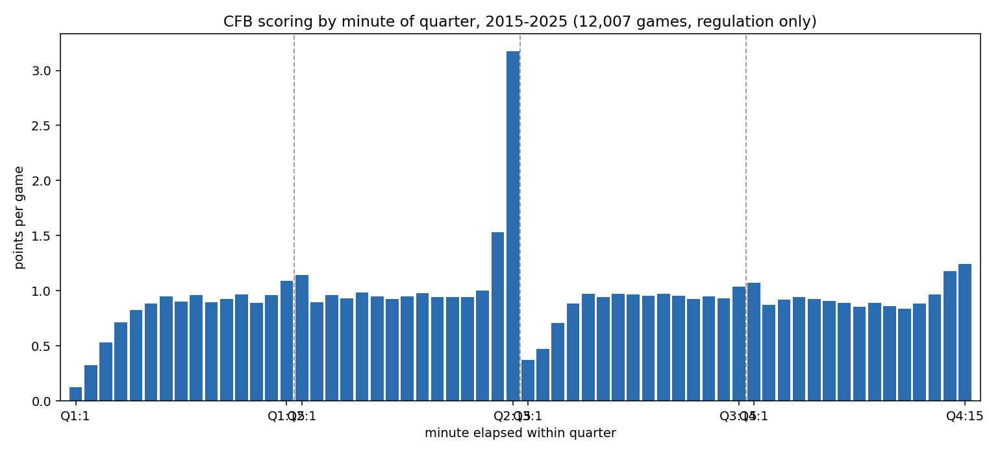

# Scoring by minute of quarter (2015-2025)

**Question.** Within a quarter, when do points actually land? Is the end-of-half
spike as big as it feels, and how dead is the start of a quarter?

**Method.** `stg.plays`, regulation only (`period` 1-4), seasons 2015-2025,
12,007 distinct games. Points on a play = change in `offenseScore+defenseScore`
from the previous play in the game (score fields are post-play), ordered by
`period, driveNumber, playNumber`, clamped to 1..8. Bucketed by
`minute = 15 - clock_minutes`, so minute 1 = 15:00-14:01 remaining. Totals
56.50 pts/game, which matches the known regulation scoring level.

Reproduce: `python scripts/analyze_scoring_by_minute.py` (writes
`docs/assets/scoring-by-minute-2015-2025.csv` and `.png`).

## Points per game, by minute within quarter

| minute | Q1 | Q2 | Q3 | Q4 |
| --- | --- | --- | --- | --- |
| 1 | 0.13 | 1.14 | 0.37 | 1.07 |
| 2 | 0.33 | 0.90 | 0.47 | 0.87 |
| 3 | 0.53 | 0.96 | 0.71 | 0.92 |
| 4 | 0.71 | 0.93 | 0.88 | 0.94 |
| 5 | 0.82 | 0.98 | 0.97 | 0.93 |
| 6 | 0.88 | 0.95 | 0.95 | 0.91 |
| 7 | 0.95 | 0.93 | 0.97 | 0.89 |
| 8 | 0.90 | 0.95 | 0.97 | 0.85 |
| 9 | 0.96 | 0.98 | 0.96 | 0.89 |
| 10 | 0.90 | 0.94 | 0.97 | 0.86 |
| 11 | 0.93 | 0.95 | 0.95 | 0.84 |
| 12 | 0.97 | 0.95 | 0.93 | 0.88 |
| 13 | 0.89 | 1.00 | 0.95 | 0.97 |
| 14 | 0.96 | 1.53 | 0.93 | 1.18 |
| 15 | 1.09 | 3.17 | 1.04 | 1.25 |
| **total** | **11.96** | **17.26** | **13.03** | **14.26** |

## Findings

- **The two-minute drill is the single biggest effect.** The last minute of Q2
  is 3.17 pts/game, 3.3x the game-wide per-minute average (~0.94) and more than
  double the last minute of Q4 (1.25). Minutes 14-15 of Q2 together are 4.70
  pts/game, 27% of all Q2 scoring.
- **Quarter openings after a kickoff are dead.** Q1 minute 1 is 0.13 and Q3
  minute 1 is 0.37 — mechanically, a drive has to start before anyone scores.
  Q2 and Q4 minute 1 look normal (1.14, 1.07) because drives carry over the
  quarter break.
- **The middle of a quarter is flat.** Minutes 5-13 sit in a 0.84-1.00 band in
  every quarter. Scoring rate is essentially constant once drives are underway.
- **Q4 sags before it spikes.** Minutes 8-12 of Q4 (0.84-0.89) are the lowest
  non-opening stretch in the game — clock-killing by leaders — then minutes
  14-15 rise to 1.18/1.25.

## What this does not support

- No team, score-margin, or spread split. A trailing team's Q4 profile and a
  leading team's are pooled here; the Q4 sag is an average over both.
- No overtime (periods > 4 excluded), so this is regulation scoring only.
- Points are attributed to the play that changed the score, so a touchdown and
  its PAT land in one minute bucket, and the ~2.4% of scoring plays whose score
  delta was non-positive or out of the 1..8 range are dropped.
- Game coverage is whatever `stg.plays` holds (FBS plus some FCS); this is not a
  clean FBS-only population.
- Nothing here is a live-betting edge on its own — it is the unconditional base
  rate, not a rate conditional on game state.
