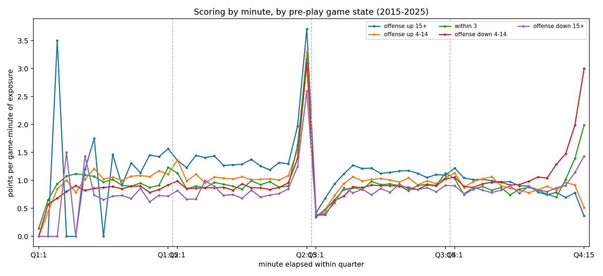
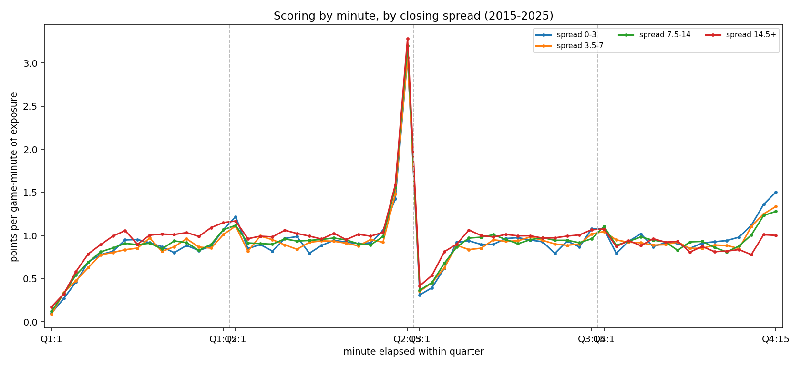

# Scoring by minute of quarter (2015-2025)

**Question.** Within a quarter, when do points actually land? Is the end-of-half
spike as big as it feels, and how dead is the start of a quarter?

**Method.** `stg.plays`, regulation only (`period` 1-4), seasons 2015-2025,
12,007 distinct games. Points on a play = change in `offenseScore+defenseScore`
from the previous play in the game (score fields are post-play), ordered by
`period, driveNumber, playNumber`, clamped to 1..8. Bucketed by
`minute = 15 - clock_minutes`, so minute 1 = 15:00-14:01 remaining. Totals
56.50 pts/game, which matches the known regulation scoring level.

Reproduce: `python scripts/analyze_scoring_by_minute.py` (writes
`docs/assets/scoring-by-minute-2015-2025.csv` and `.png`).

## Points per game, by minute within quarter

| minute | Q1 | Q2 | Q3 | Q4 |
| --- | --- | --- | --- | --- |
| 1 | 0.13 | 1.14 | 0.37 | 1.07 |
| 2 | 0.33 | 0.90 | 0.47 | 0.87 |
| 3 | 0.53 | 0.96 | 0.71 | 0.92 |
| 4 | 0.71 | 0.93 | 0.88 | 0.94 |
| 5 | 0.82 | 0.98 | 0.97 | 0.93 |
| 6 | 0.88 | 0.95 | 0.95 | 0.91 |
| 7 | 0.95 | 0.93 | 0.97 | 0.89 |
| 8 | 0.90 | 0.95 | 0.97 | 0.85 |
| 9 | 0.96 | 0.98 | 0.96 | 0.89 |
| 10 | 0.90 | 0.94 | 0.97 | 0.86 |
| 11 | 0.93 | 0.95 | 0.95 | 0.84 |
| 12 | 0.97 | 0.95 | 0.93 | 0.88 |
| 13 | 0.89 | 1.00 | 0.95 | 0.97 |
| 14 | 0.96 | 1.53 | 0.93 | 1.18 |
| 15 | 1.09 | 3.17 | 1.04 | 1.25 |
| **total** | **11.96** | **17.26** | **13.03** | **14.26** |

## Findings

- **The two-minute drill is the single biggest effect.** The last minute of Q2
  is 3.17 pts/game, 3.3x the game-wide per-minute average (~0.94) and more than
  double the last minute of Q4 (1.25). Minutes 14-15 of Q2 together are 4.70
  pts/game, 27% of all Q2 scoring.
- **Quarter openings after a kickoff are dead.** Q1 minute 1 is 0.13 and Q3
  minute 1 is 0.37 — mechanically, a drive has to start before anyone scores.
  Q2 and Q4 minute 1 look normal (1.14, 1.07) because drives carry over the
  quarter break.
- **The middle of a quarter is flat.** Minutes 5-13 sit in a 0.84-1.00 band in
  every quarter. Scoring rate is essentially constant once drives are underway.
- **Q4 sags before it spikes.** Minutes 8-12 of Q4 (0.84-0.89) are the lowest
  non-opening stretch in the game — clock-killing by leaders — then minutes
  14-15 rise to 1.18/1.25.

## What this does not support

- No team, score-margin, or spread split. A trailing team's Q4 profile and a
  leading team's are pooled here; the Q4 sag is an average over both.
- No overtime (periods > 4 excluded), so this is regulation scoring only.
- Points are attributed to the play that changed the score, so a touchdown and
  its PAT land in one minute bucket, and the ~2.4% of scoring plays whose score
  delta was non-positive or out of the 1..8 range are dropped.
- Game coverage is whatever `stg.plays` holds (FBS plus some FCS); this is not a
  clean FBS-only population.
- Nothing here is a live-betting edge on its own — it is the unconditional base
  rate, not a rate conditional on game state.

---

# Conditional splits: game state and spread

**Question.** The minute profile above is unconditional. Does it hold once you
condition on who is ahead, or on how big a favourite the market made?

**Method.** Unit of exposure is a **game-minute cell** — `(gameId, period,
minute)` — and every game contributes all 60 regulation cells, including minutes
with no snap. Each cell is assigned one bucket by the state at its first play,
carried forward from the last observed play when a minute has no snap. Points in
the cell are attributed to that bucket. The denominator is therefore cells, not
games, and the unconditional series recomputed this way totals **0.942 pts per
game-minute** (= 56.50 / 60), so bucket numbers are directly comparable to it.

Game state is from the **offense's** perspective, measured *before* the first
play of the minute. Spread is `core.fact_game.selected_spread`, absolute value;
93% of games in the play population join to a spread. 720,420 cells,
12,007 games.

Reproduce: `python scripts/analyze_scoring_by_minute_splits.py`.

## The last minute of Q4, by game state

| state of team with the ball | pts / game-minute | cells |
| --- | --- | --- |
| offense down 4-14 | **3.00** | 1,720 |
| within 3 | 1.99 | 1,831 |
| offense down 15+ | 1.43 | 2,558 |
| offense up 4-14 | 0.51 | 2,357 |
| offense up 15+ | 0.37 | 3,539 |

The pooled Q4 minute-15 figure of 1.25 is an average over an 8x range. A trailing
offense in the last minute of regulation scores at 3.00 pts/game-minute — as hot
as the Q2 two-minute drill — while a leading offense is at 0.37 to 0.51.

## The last minute of Q2, by game state

| state of team with the ball | Q2 min 13 | min 14 | min 15 |
| --- | --- | --- | --- |
| offense up 15+ | 1.30 | 1.97 | 3.70 |
| offense up 4-14 | 1.08 | 1.54 | 3.30 |
| within 3 | 0.90 | 1.63 | 3.17 |
| offense down 4-14 | 0.96 | 1.39 | 3.09 |
| offense down 15+ | 0.85 | 1.25 | 2.60 |

Every state spikes. Nobody kneels out the first half, so the two-minute drill is
close to state-independent — a 2.60-3.70 band against a 0.37-3.00 band in Q4.

## Pooled pts / game-minute, by state and quarter

| state | Q1 | Q2 | Q3 | Q4 |
| --- | --- | --- | --- | --- |
| offense up 15+ | 1.38 | 1.65 | 1.07 | 0.87 |
| offense up 4-14 | 1.07 | 1.23 | 0.90 | 0.90 |
| within 3 | 0.99 | 1.09 | 0.82 | 0.96 |
| offense down 4-14 | 0.86 | 1.05 | 0.80 | 1.18 |
| offense down 15+ | 0.71 | 1.01 | 0.78 | 0.90 |

The ordering inverts across the game. Early, the offense that is already ahead
scores fastest (1.38 in Q1 vs 0.71 for a team down 15+). By Q4 it reverses:
trailing by 4-14 is the top bucket (1.18) and leading buckets fall to ~0.87-0.90.

## Spread does much less work

| bucket | pooled | Q4 min 8-12 | Q4 min 15 | cells |
| --- | --- | --- | --- | --- |
| spread 0-3 | 0.925 | 0.92 | 1.50 | 115,620 |
| spread 3.5-7 | 0.913 | 0.87 | 1.34 | 157,620 |
| spread 7.5-14 | 0.935 | 0.88 | 1.28 | 175,800 |
| spread 14.5+ | 0.972 | 0.83 | 1.00 | 241,560 |

Pooled, the four spread buckets span 0.913-0.972 — a 6% range, against a 22%
range across state buckets (0.872-1.064) and an 8x range in the Q4 final minute.
Big favourites score slightly faster overall and noticeably slower late, which is
the same clock-killing effect showing up weakly through a pre-game proxy. **The
live margin, not the closing spread, is what carries the signal.**

## What the splits do not support

- **State buckets are confounded with game total.** A blowout is usually a
  high-scoring game, so "offense up 15+" inherits that. The Q1 ordering
  (1.38 vs 0.71) is largely this, not a causal effect of leading.
- **Carry-forward state is approximate.** Minutes with no snap inherit the last
  observed play's margin. Roughly 34% of cells have no snap.
- **No possession or field-position control.** "Points in the minute" counts
  points by either team, bucketed by whoever had the ball at the minute's start.
- **Not a market study.** No live odds were joined, so nothing here says a
  live total or a live spread is mispriced at any of these moments — only that
  the realised scoring rate varies a lot by state.
- **Spread coverage is 93% of games**, and `selected_spread` mixes providers.
