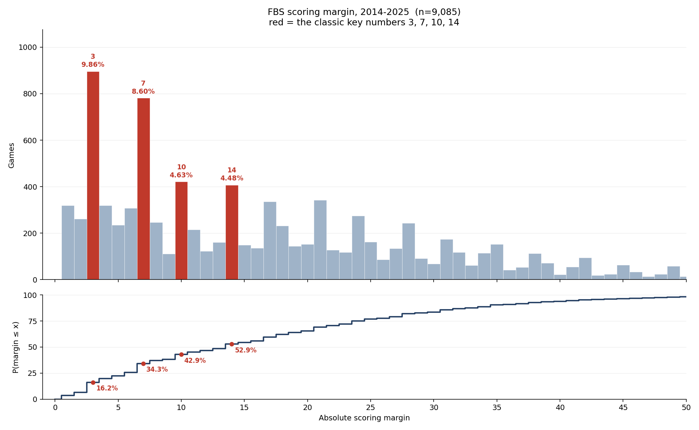

# Scoring margin per FBS game: the distribution and its key numbers

**Question.** How is the final scoring margin distributed in FBS, which exact margins come up
often enough to matter, and is home-field advantage moving?

**Method.** One bin per integer point. Rank exact margins by frequency and read them beside the
cumulative curve `P(margin ≤ k)`, which is the quantity a spread is priced against. Home-field
advantage is tested by regressing the *signed* home margin on season, with and without 2020.
Script: [`scripts/analyze_scoring_margin_distribution.py`](../scripts/analyze_scoring_margin_distribution.py).

No neighbour-lift correction here, unlike the [totals study](total-points-distribution-2026-09-17.md).
3 and 7 stand roughly three times above their immediate neighbours, so exact frequency carries
the argument unaided — and a same-parity baseline would beg the question, because the scoring
arithmetic that shapes margins is exactly what such a baseline assumes away.

**Data.** `stg.game` in the local warehouse, seasons 2014–2025, FBS vs FBS only, both scores
present. n = 9,085 games — the same population as the totals study, so the two entries are
directly comparable. Classification is read per season, not from `core.dim_team.is_fbs`
(current-state, and would misclassify teams that moved FBS↔FCS inside the window). 2026 is
excluded: only 100 of its FBS-vs-FBS games are final. Regular season and postseason are pooled.



## The numbers

Mean **16.73**, median **14**, sd **13.12**, max **78**. **Zero ties** — overtime has settled
every game since 1996.

Most frequent exact margins:

| Margin | Games | Share | Cumulative ≤ |
| --- | --- | --- | --- |
| **3** | 896 | 9.86% | 16.25% |
| **7** | 781 | 8.60% | 34.32% |
| 10 | 421 | 4.63% | 42.89% |
| 14 | 407 | 4.48% | 52.87% |
| 21 | 342 | 3.76% | 69.28% |
| 17 | 335 | 3.69% | 59.69% |
| 4 | 319 | 3.51% | 19.76% |
| 1 | 319 | 3.51% | 3.51% |
| 6 | 307 | 3.38% | 25.72% |
| 24 | 274 | 3.02% | 75.00% |

**3 and 7 are in a class of their own.** 3 takes 9.86% of all games against 2.87% at margin 2
and 3.51% at margin 4 — a 3.1× step over the average of its neighbours. 7 takes 8.60% against
3.38% at 6 and 2.72% at 8, a 2.8× step. Nothing else in the distribution behaves like this;
10 and 14, the next two classic key numbers, sit at 4.63% and 4.48%, which is elevated but
roughly half the height of 3 and 7.

Read exact and cumulative together — the step size is the whole argument:

| k | P(margin = k) | P(margin ≤ k) |
| --- | --- | --- |
| 1 | 3.51% | 3.51% |
| 2 | 2.87% | 6.38% |
| **3** | **9.86%** | **16.25%** |
| 4 | 3.51% | 19.76% |
| 6 | 3.38% | 25.72% |
| **7** | **8.60%** | **34.32%** |
| 8 | 2.72% | 37.04% |
| 10 | 4.63% | 42.89% |
| 13 | 1.77% | 48.39% |
| 14 | 4.48% | 52.87% |
| 17 | 3.69% | 59.69% |
| 21 | 3.76% | 69.28% |

Moving a spread from 2.5 to 3.5 crosses 9.86% of the distribution; moving it from 12.5 to 13.5
crosses 1.77%. That ratio is what "key number" means.

One-score and two-score games: **37.04%** of games finish within 8 points, **56.00%** within 16.

## Parity is the same statistic as in the totals study

55.05% of margins are odd. That is not independent confirmation of the odd-total finding — it
is the *same number by construction*. Total and margin differ by twice the away score,
`(h+a) − (h−a) = 2a`, so a game's total and its margin always share parity. The measured
anti-correlation between the two teams' score parities is written up once, in the
[totals entry](total-points-distribution-2026-09-17.md#); it explains both shares at once. Do
not count it as two results.

## Home-field advantage: no detectable trend

Home teams win **57.84%** of these games and the mean signed home margin is **+3.99** points.

The per-season figures look like they climb — +3.63 in 2014 to +5.10 in 2025 — but that
apparent rise does not survive a test:

| Series | Slope (pts/season) | SE | t | Implied change over 11 seasons |
| --- | --- | --- | --- | --- |
| All seasons | +0.0542 | 0.0625 | +0.87 | +0.60 |
| Excluding 2020 | +0.0587 | 0.0626 | +0.94 | +0.65 |

Both are comfortably inside noise, and dropping 2020 — the empty-stadium season, and the
series' most influential point at +2.09 — moves nothing. **Treat home-field advantage as flat
at roughly +4 over this window.** The endpoint seasons carry the eye; the slope does not.

## Per-season detail

| Season | Games | Home win% | Mean signed | =3% | =7% | ≤3% | ≤7% | ≤14% |
| --- | --- | --- | --- | --- | --- | --- | --- | --- |
| 2014 | 760 | 55.92% | +3.63 | 9.47% | 8.68% | 15.39% | 33.03% | 52.50% |
| 2015 | 765 | 56.99% | +3.97 | 8.37% | 7.97% | 14.64% | 32.68% | 51.50% |
| 2016 | 760 | 58.03% | +4.18 | 8.55% | 9.74% | 15.26% | 35.66% | 51.84% |
| 2017 | 776 | 56.83% | +3.99 | 9.79% | 8.76% | 15.46% | 33.38% | 51.55% |
| 2018 | 772 | 59.20% | +4.24 | 8.03% | 8.29% | 14.77% | 31.99% | 49.74% |
| 2019 | 774 | 59.17% | +4.43 | 10.59% | 8.27% | 15.76% | 33.85% | 51.16% |
| 2020 | 534 | 56.18% | +2.09 | 10.86% | 7.49% | 17.42% | 33.71% | 52.25% |
| 2021 | 770 | 57.53% | +3.26 | 9.87% | 8.57% | 16.10% | 34.55% | 53.64% |
| 2022 | 776 | 57.73% | +3.73 | 11.34% | 9.02% | 19.72% | 38.79% | 56.31% |
| 2023 | 792 | 57.95% | +3.82 | 11.62% | 9.60% | 16.79% | 33.84% | 55.93% |
| 2024 | 798 | 58.40% | +4.78 | 8.65% | 8.15% | 16.04% | 34.71% | 55.14% |
| 2025 | 808 | 59.53% | +5.10 | 11.39% | 8.29% | 17.82% | 35.40% | 52.48% |

The `=3%` column ranges 8.03%–11.62% with no trend. **Unlike combined totals, which fell ~5.7
points across this window, the margin distribution is stable enough that pooling twelve seasons
is defensible.** That difference is the main reason to keep the two studies separate rather than
reusing one set of caveats.

## What this does not support

- **It is not a market study.** These are realised margins. Nothing is joined to a posted
  spread, so this says nothing about closing-line value, ATS records, how often a number is
  bought on or off, or whether any spread is mispriced. "Key number" here means *frequent
  margin*, not *profitable side*.
- **The cumulative curve is not a push table.** `P(margin = 3) = 9.86%` is the push rate only
  for a game laid at exactly 3 and only for the favourite that actually won. Turning these into
  push probabilities requires conditioning on the posted number, which this analysis does not do.
- **The home-field null is a null, not a proof of constancy.** With ±0.06 per season of
  resolution, a true drift of a point per decade would not be detectable here. The claim is that
  no trend is *measurable* in this window, not that none exists.
- **Home advantage is not split by venue.** Neutral-site games are pooled with true home games,
  which biases the +3.99 downward by an unquantified amount.
- **Postseason is pooled in.** Bowl and playoff margins — neutral sites, opt-outs, uneven
  motivation — differ from the regular season and were not separated.
- **FBS vs FBS only.** Games against FCS opponents, 149 to 222 per season, are excluded; their
  margins are far larger and would distort every number here.

## Reproduce

```
python scripts/analyze_scoring_margin_distribution.py --start 2014 --end 2025
```

Writes `docs/img/scoring-margin-distribution.png` (committed) and the full per-integer
frequency and cumulative table to `docs/data/scoring-margin-frequency.csv` (generated on each
run, not committed — `docs/data/` is covered by the repo's `data/` ignore rule). Prints every
number quoted above.
