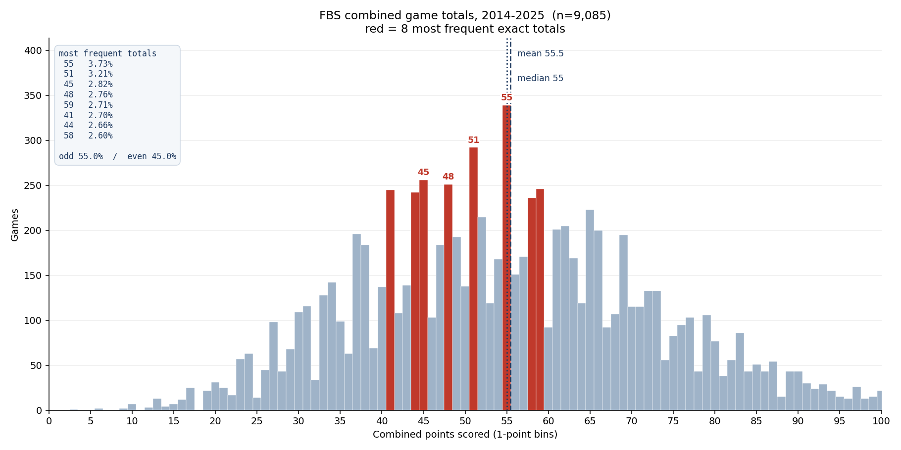

# Combined points per FBS game: the distribution and its key numbers

**Question.** How are total points scored per game distributed in FBS, and which exact
totals come up often enough to matter — the "key numbers" for a totals market?

**Method.** One bin per integer point (never wider: a 2-point bin smears out the exact-value
spikes the question is about). Rank exact totals by raw frequency, then re-rank by lift over
same-parity neighbours to separate genuine spikes from the bell envelope and the odd/even
effect. Script: [`scripts/analyze_total_points_distribution.py`](../scripts/analyze_total_points_distribution.py).

**Data.** `stg.game` in the local warehouse, seasons 2014–2025, FBS vs FBS only,
both scores present. n = 9,085 games. Classification is read per season from
`stg.game."homeClassification"/"awayClassification"`, not from `core.dim_team.is_fbs` —
`is_fbs` is current-state and would misclassify the teams that moved FBS↔FCS inside the
window (James Madison, Sam Houston, Jacksonville State, Liberty). 2026 is excluded: only
100 of its FBS-vs-FBS games are final. Regular season and postseason are pooled.



## The numbers

Range 3–146. Mean **55.45**, median **55**, sd **18.02**.

Most frequent exact totals:

| Total | Games | Share |
| --- | --- | --- |
| 55 | 339 | 3.73% |
| 51 | 292 | 3.21% |
| 45 | 256 | 2.82% |
| 48 | 251 | 2.76% |
| 59 | 246 | 2.71% |
| 41 | 245 | 2.70% |
| 44 | 242 | 2.66% |
| 58 | 236 | 2.60% |

Raw frequency confounds three things: where the bell sits, an odd/even parity effect, and
real single-value spikes. Comparing each value to its same-parity neighbours (v−4, v−2, v+2,
v+4) removes the parity effect, and — because the window is symmetric about v — removes any
*linear* slope in the envelope exactly: a least-squares line through those four points,
evaluated at v, is just their mean. Only local curvature leaks through, so the last column
re-runs the baseline as a quadratic fit through six same-parity neighbours. Restricted to
totals 20–90 with at least 100 games, so the ranking isn't Poisson noise in thin bins:

| Total | Games | Lift (4-point mean baseline) | Lift (quadratic baseline) |
| --- | --- | --- | --- |
| 30 | 109 | 1.65× | 1.98× |
| 55 | 339 | 1.64× | 1.85× |
| 38 | 184 | 1.64× | 1.84× |
| 44 | 242 | 1.62× | 1.90× |
| 58 | 236 | 1.53× | 1.73× |
| 41 | 245 | 1.48× | 1.68× |
| 66 | 200 | 1.47× | 1.50× |
| 34 | 142 | 1.46× | 1.81× |

Curvature correction moves the absolute lifts up by 0.03–0.35× but reshuffles only
neighbouring ranks — the set of flagged totals is the same either way.

**55, 41 and 44 survive both rankings.** They are spikes, not just bins near the peak.

**Odd totals are the majority: 55.05% odd, 44.95% even** — and that is not what the naive
arithmetic predicts. Each side's own score is close to a parity coin flip (home odd 49.37%,
away odd 49.64%). If the two teams' parities were independent, even totals would come in at
50.00%, because *any* pair of independent parities favours agreement. Observing 44.95% means
the two teams' score parities are **anti-correlated**: one side landing odd while the other
lands even happens about 5 points more often than chance. Why that is, this analysis does not
establish.

Exceedance, for sizing a line:

| Line | P(total > line) |
| --- | --- |
| 40 | 79.79% |
| 45 | 68.89% |
| 50 | 59.33% |
| 55 | 46.86% |
| 60 | 37.00% |

## Scoring is drifting down

Pooling 12 seasons hides a real trend. Season means:

| Season | n | Mean | Median |
| --- | --- | --- | --- |
| 2014 | 760 | 56.90 | 56 |
| 2015 | 765 | 56.97 | 56 |
| 2016 | 760 | 58.07 | 56 |
| 2017 | 776 | 55.86 | 55 |
| 2018 | 772 | 56.60 | 55 |
| 2019 | 774 | 55.79 | 55 |
| 2020 | 534 | 57.51 | 56 |
| 2021 | 770 | 54.98 | 54 |
| 2022 | 776 | 54.36 | 54 |
| 2023 | 792 | 53.33 | 53 |
| 2024 | 798 | 53.69 | 52 |
| 2025 | 808 | 52.34 | 51 |

Peak 58.07 (2016) to 52.34 (2025): the mean is down **~5.7 points** and the median down 5.
The pooled mean of 55.45 is therefore about 3 points above where 2025 actually sat.

## What this does not support

- **It is not a market study.** Every number here is realised scores. Nothing was joined to
  a posted total, so this says nothing about where books hang lines, how often a line is
  beaten, or whether any number is mispriced. "Key number" here means *frequent outcome*,
  not *pivotal line*, and the two are not the same claim.
- **The pooled distribution is not a 2026 forecast.** Given the drift above, using the
  12-season mean as a prior for the current season is off by roughly a field goal.
- **Lift is descriptive, not tested.** No multiple-comparison correction was applied across
  ~70 candidate bins, so individual lift values in the 1.4–1.5× band should not be treated as
  established effects on their own. 55 (n=339) is the only entry with both rankings and
  sample size behind it. 30 tops the lift table on 109 games — thin enough that its ordering
  is not reliable even though its lift survives the curvature check.
- **The parity anti-correlation is measured, not explained.** No mechanism was tested. Game
  script, garbage-time scoring, and two-point-conversion decisions are all candidates and
  none were separated.
- **Postseason is pooled in.** Bowl and playoff scoring profiles differ from regular season;
  that was not separated.
- **FBS-vs-FBS only.** Games against FCS opponents (149–222 per season) are excluded, and
  their scoring profile is different.

## Reproduce

```
python scripts/analyze_total_points_distribution.py --start 2014 --end 2025
```

Writes `docs/img/total-points-distribution.png` (committed) and the full per-integer
frequency table to `docs/data/total-points-frequency.csv` (generated on each run, not
committed — `docs/data/` is covered by the repo's `data/` ignore rule). Prints every number
quoted above.
