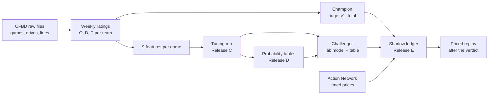

# Tuning lab: what it actually does

A plain guide to the model tuning lab as built today (`models/tuning/`, its GUI, and the
scheduled jobs that feed it). The [plan](model-tuning-lab-plan.md) says what the lab is
meant to become; this page says what exists. When they disagree about the present, trust
this page and the code, and fix whichever is stale.

Out of scope: the rest of the repo (the system-maker Flask app, over-zero, spread research,
the warehouse). The lab reads raw data files; it never opens `cfb.duckdb`.

---

## In one minute

- **What it predicts:** the total points of every FBS-vs-FBS regular-season game from week
  2 on. Nothing else: no spreads, no winners.
- **When:** each week, before that week's first kickoff (the "cutoff"), using only games
  that kicked off earlier.
- **How:** team ratings for offense, defense and pace, refit every week, feed two models:
  - the **champion**, a fixed formula on the ratings (`ridge_v1_total`);
  - the **challenger**, a tuned regression on the same ratings plus a full probability
    table of possible totals (`run-de1927346ab0` + `dist-0b0cc0382eca`).
- **Live test now:** both models predict 2026 weeks 5–8 automatically, locked in a
  tamper-evident ledger before kickoff. Verdict around 2026-10-26.
- **What it has found:** the models beat simple baselines, but they do **not** beat the
  sportsbook's opening total. Ridge trails the open by about a third of a point of average
  error. The probability tables are well calibrated, but they can't pick the over or under
  against the open any better than a coin flip.
- **Betting:** none. The lab can price bets, but it has never priced a real one. The first
  priced look is the replay after the verdict.

---

## How data flows



Each box is described below, in order.

### 1. Data in

- **CFBD files** in `data/raw/`: `games_<season>.json`, `drives_<season>.json`,
  `lines_<season>.json`, and more. Refreshed every day at 05:00 ET by the `CFB-CFBD-Daily`
  task (`scripts/refresh_cfbd.cmd`), which also runs the shadow tick (section 7).
- **Action Network history** (`CFB-AN-History`, and hourly on Saturdays via
  `CFB-AN-History-Saturday`): every book's line and price with the time it changed. This is
  the only source of prices with a clock, and it starts 2026-04-02.
- **The "market line" before 2026** is Bovada's `overUnderOpen` from CFBD. It is a label
  with no capture time and no price
  ([pregame-replay-2026-09-22](pregame-replay-2026-09-22.md)). The lab compares against it
  as a forecast, never as a price.

### 2. Weekly ratings (Release B)

Every week, each FBS team gets three numbers, fit only on games before the cutoff
(`scripts/weekly_ratings.py`):

- **O (offense):** points per possession above or below league average.
- **D (defense):** points per possession allowed, above or below average.
- **P (pace):** possessions per game above or below average.

"Ridge" means each rating is pulled toward average until the team has enough games to
earn it. That pull is the penalty λ: 40 possessions for O and D, 8 games for pace.

**The champion's total forecast**, in words:

> expected possessions per team × (home points per possession + away points per
> possession) + an overtime allowance

Expected possessions per team is league pace plus both teams' P. Each side's points per
possession is league average plus its offense plus the opponent's defense, with a small
home edge that cancels in the total.

Record: [weekly-ratings-2026-09-23](weekly-ratings-2026-09-23.md). Snapshots for every
season-week 2014–2025 are in `data/processed/ratings/weekly_ratings_snapshots.csv`.

### 3. Features and the catalog

A game's row has 9 inputs, all from the ratings snapshot at its cutoff
(`models/tuning/catalog.py`):

| Feature | Meaning |
| --- | --- |
| `rv1_off_home`, `rv1_def_home`, `rv1_pace_home` | Home team's O, D, P |
| `rv1_off_away`, `rv1_def_away`, `rv1_pace_away` | Away team's O, D, P |
| `rv1_total` | The champion's forecast |
| `min_prior_games` | The fewer of the two teams' games so far |
| `neutral` | Neutral-site flag |

Every feature has an **availability class**. Only `historical_replayable` can be used:
its value can be rebuilt exactly as it was before kickoff. The other classes are refused,
each with a stated reason. For example, `open_total` is `provider_opaque` because it has no
capture time. The loader also drops any value dated after the row's decision time.

### 4. Tuning runs (Release C)

A run is one JSON file, a `RunSpec` (`models/tuning/specs/total_ratings_v1.json`). Its hash
is the run's identity, so the same spec always gets the same `run_id`.

- **Folds:** season holdouts in time order.
  - **Inner seasons 2015–2019** choose the settings.
  - **Outer seasons 2021–2025** evaluate the chosen model once each.
  - 2020 is excluded.
  - A fold trains only on earlier seasons.
- **Search:** Optuna tries Ridge and Elastic Net at different strengths (60 trials), scored
  on inner-fold average error (MAE). All trials are kept, including failed and pruned ones.
- **Worker:** runs detached from the GUI. It claims the job with a lease and survives a
  crash: a restarted run resumes without redoing or overwriting finished trials. A run only
  resumes on the same code and data it started with. Results are written to a temporary
  folder, checksummed, then moved into place in one step.
- **Outputs** (`runs/<run_id>/`):
  - a model card (`card.md`);
  - predictions;
  - per-fold results with the fitted coefficients;
  - paired comparisons against each baseline on the same games;
  - a manifest with the sha256 of every input file.
- **Gates:** bias within ±1 point, at most 20 features, no convergence warnings, every
  feature passed the as-of screen, no market-derived feature, and the outer seasons locked.

**Result (`run-de1927346ab0`, 3,488 outer games):**

| Compared with | Lab model minus baseline, average error | Verdict |
| --- | ---: | --- |
| Train-period mean | −0.72 points | better |
| Champion `ridge_v1_total` | −0.04 (interval −0.10 to +0.03) | same |
| Bovada open (untimed) | +0.38 (interval +0.23 to +0.53) | worse, descriptive |

Tuning adds nothing measurable over the champion: the difference's interval straddles zero.

### 5. Probability tables (Release D)

A run on top of the tuning run (`dist_total_v1.json`) turns each point forecast into a
probability for every possible total from 0 to 150, overtime included.
- **Three candidates:** a normal curve, the forecast plus past errors, and a joint
  home/away version.
- **Selection:** the lowest CRPS (a score for whole probability tables) on 2018–19, which
  picked the joint home/away table.
- **Gate:** a calibration gate on 2021–25, declared before scoring.

**Result:** calibrated. 80% intervals cover 80.8% of games, 79.7–82.8% in every season.
Its P(over) against the open has no skill: Brier 0.257, against 0.25 for always saying 50%.
Abstaining on games predicted to be hard didn't help.
Record: [total-distributions-2026-09-23](total-distributions-2026-09-23.md).

### 6. Pricing engine

`models/tuning/market.py` prices totals bets, and only against a **quote**: a specific
book's line and price with the time it was captured. A number without a price or a clock
can't become a quote, so it can never be bet, settled or backtested.
- **What it computes:** win, push and loss chances at the exact line from the probability
  table, expected value including pushes, and the market's de-vigged probability.
- **What it records:** a flat one-unit ledger, with edge, closing-line value, realized
  result and availability kept as separate views.
- **The frozen policy for the live test:** bet a side only if its expected value is at
  least 3%. Use the best book's quote no older than 24 hours at the cutoff.

It is tested on fixtures only. It has priced no real game yet.

### 7. The shadow test (Release E)

The live test of the whole system. Spec: `shadow_2026_w05_08.json`; id
`shadow-3be5383c3469`.

- **Frozen before it started** (`shadow_2026_w05_08.freeze.json`, committed): the champion,
  and the challenger refit on 2014–2025 with its table built from 2023–25 errors.
- **Every day at 05:00 ET** the tick:
  1. checks the ledger chain and the frozen files;
  2. between weeks, predicts the next week and writes a snapshot;
  3. marks a week missed if its cutoff passed with no snapshot;
  4. scores finished games against the last prediction made before each kickoff;
  5. logs any later data revision;
  6. copies and hashes the week's price files;
  7. once the period is over, writes the verdict;
  8. writes `status.md`.
- **Pinned code:** the tick runs from `../cfb-shadow-pin` at commit `f0420699`, so edits in
  the main repo can't change live predictions mid-test.
- **The ledger** (`ledger.sqlite3`): append-only, and each record is hashed with the one
  before it. The database refuses edits, and any tampering breaks the chain.
- **Pass/fail:** every game predicted before its cutoff, no untracked data revisions, no
  missing files. It is about the system working, not about accuracy. About 230 games is
  too few to separate the two models.
- **Windows (ET):**
  - Week 5: Sun 9/27 – Thu 10/1
  - Week 6: Mon 10/5 – Tue 10/6
  - Week 7: Sun 10/11 – Tue 10/13
  - Week 8: Sun 10/18 – Tue 10/20
  - Week 4 is a rehearsal and never counts.

Design and counting rules:
[release E design](superpowers/specs/2026-09-23-tuning-lab-release-e-design.md).

### 8. The priced replay

After the verdict, `python -m models.tuning replay` prices the recorded predictions against
the archived price files. It uses the frozen policy and never regenerates a forecast. All of
its rules were committed before week 5 (`replay_2026_w05_08.json`, `models/tuning/replay.py`):
- **Decision time:** the week cutoff.
- **Stale quotes:** a price unchanged for more than 24 hours counts as stale.
- **CLV:** counted only where the file proves the close with a tick after kickoff. Only a
  download during the game can prove it, because a settled game's history comes back empty.
- **Framing:** the output always carries its framing: one declared period, trial count 1,
  descriptive only.

---

## The GUI

Full manual, with every control, walkthroughs, alerts and troubleshooting:
[tuning-lab-gui.md](tuning-lab-gui.md). Summary:

**Start:**
```text
.venv-lab-ui\Scripts\python -m streamlit run models/tuning/ui/app.py
```
Then open http://127.0.0.1:8501, or pick "Tuning Lab" in the app's preview list. It listens
only on this PC. It runs in its own venv so the shadow tick's `.venv` never changes.

| Page | What it does |
| --- | --- |
| Shadow | The live test: alerts, weeks, snapshots, scores, aliases, `status.md` |
| Distributions | Each game's probability table. What-ifs: P(over/under/push) at a line you enter, and each team's pace (2021–25 games) |
| Betting | Reads replay files; hides a period replay until the verdict exists. Prices nothing |
| New run | Build a spec, Validate, then Launch a tuning run |
| Jobs | Running and finished jobs, trials, the worker log, and cancel |
| Runs | Each run's card, trials, comparisons and spec; pin runs for Compare |
| Compare | Two runs game by game; blocked unless data, target, population and folds match |
| Registry | Published runs, champion and challenger, every alias move |
| Replay | A past week as the lab saw it at its cutoff, with each forecast beside the result |
| Data | Freshness of live inputs, whether each run's source files have changed, excluded games by reason |
| Hypotheses | Every question the lab tested, nulls included |

Only New run launches anything. Freezing, the daily tick, alias moves and replays stay on
the command line. The GUI writes only `drafts/` and `logs/`, and deletes nothing.

---

## Commands

Every command needs `CFB_DATA_ROOT` set, for example `C:\Users\mckel\dev\cfb\data`. Run from
the repo root with the main `.venv`.

| Command | Does |
| --- | --- |
| `python -m models.tuning run --spec models/tuning/specs/total_ratings_v1.json` | Tuning run (Release C) |
| `python -m models.tuning dist --spec models/tuning/specs/dist_total_v1.json` | Probability tables (Release D) |
| `python -m models.tuning shadow tick --spec models/tuning/specs/shadow_2026_w05_08.json` | One shadow tick (the daily task runs this) |
| `python -m models.tuning shadow alias --spec ... --alias champion --model M --reason "..."` | Move an alias, recorded in the ledger |
| `python -m models.tuning replay --spec models/tuning/specs/replay_2026_w05_08.json [--rehearsal]` | Priced replay (after the verdict; `--rehearsal` prices week 4 only) |

`--root DIR` points any of these at a scratch lab.

## Where things live

| Path | Holds |
| --- | --- |
| `models/tuning/` | Lab code; `specs/` holds the committed specs; `hypotheses.json` the question ledger |
| `models/tuning/ui/` | The GUI, outside the run fingerprint so GUI edits never alter a run's identity |
| `$CFB_DATA_ROOT/processed/tuning/jobs.sqlite3` | Jobs and their state changes |
| `$CFB_DATA_ROOT/processed/tuning/optuna.sqlite3` | Every Optuna trial |
| `$CFB_DATA_ROOT/processed/tuning/runs/<run_id>/` | Published runs |
| `$CFB_DATA_ROOT/processed/tuning/shadow/<shadow_id>/` | Ledger, frozen models, snapshots, archived price files, replays, `status.md` |
| `$CFB_DATA_ROOT/processed/tuning/drafts/`, `logs/` | GUI drafts and worker logs |

---

## What it has found

| Question | Answer | Record |
| --- | --- | --- |
| Can a past week be rebuilt from what was known then? | Yes, for data and results. Lines before 2026 have no clock or price | [pregame-replay](pregame-replay-2026-09-22.md) |
| Do opponent-adjusted ratings beat simple baselines? | Yes, by 1.14 (raw) and 0.84 (mean) points in all five seasons. They trail the open by 0.33 | [weekly-ratings](weekly-ratings-2026-09-23.md) |
| Do preseason priors help early weeks? | Not robustly: no-go. `prior_v3` is frozen for one 2026 look after the regular season | [weekly-priors](weekly-priors-2026-09-23.md), [prior-scale](prior-scale-2026-09-23.md) |
| Does tuning a regression on the ratings beat the champion? | No, it matches it | card for `run-de1927346ab0` |
| Are the probability tables calibrated? Do they pick the over against the open? | Calibrated, yes. No P(over) skill | [total-distributions](total-distributions-2026-09-23.md) |
| Do week-to-week drifting ratings beat weekly ridge? | No, 0.08 points worse in every season | [dynamic-ratings](dynamic-ratings-2026-09-23.md) |

Every 2021–25 number above is descriptive, because those seasons have been used many times.
2026 stays sealed until the shadow verdict and the `prior_v3` look are recorded. It is the
one clean test left for whatever is built next.

## What it does not do

- **No betting.** It places nothing and claims no edge. The first priced look is the
  replay after ~10/26.
- **One target.** Full-game totals only.
- **Thin inputs.** All 9 features come from the same ratings. No weather, injuries,
  efficiency stats (success rate, explosiveness), or roster data yet.
- **No drift or thin-sample warnings,** and no per-feature evidence ledger.
- **No warehouse.** It reads raw files; the plan's DuckDB tables are mapped onto the lab's
  own files (plan §38).

## Weather: what the files hold

Weather is not a lab input yet. What exists:

- `data/raw/weather_<season>.json`, 2012–2026: one row per game, with temperature, wind
  speed and direction, precipitation, snowfall, humidity, pressure, conditions, and an
  indoors flag.
- **No capture time on any row.** That matters because of what the rows contain:
  - The 2026 file was downloaded 2026-09-17. It already held values for 272 games played
    after that date, so for an upcoming game the source serves a **forecast**.
  - Past seasons were downloaded 2026-08-28. The files don't say whether those values are
    observations or the last forecast before the game.
- **The timing problem:** a model trained on past weather may be learning from the real
  conditions, while each live week it would see a forecast made days earlier. Wherever
  those two differ, the model would be fed a different kind of number than it learned from.
- Under the lab's rules, weather can only be used once that is settled. The likely route:
  - archive each daily weather download with its time, so live forecasts have a clock;
  - decide and declare how the undated historical values are treated before scoring
    anything.

## Glossary

| Term | Meaning |
| --- | --- |
| Cutoff / decision time | A week's earliest kickoff; forecasts use only games before it |
| Champion / challenger | The live model and the one trying to replace it |
| Inner / outer fold | Seasons used to choose settings / to evaluate the choice once |
| Holdout, spent | Seasons already used to evaluate; new results on them are descriptive |
| Sealed | Off-limits for tuning until named tests finish (2026) |
| Descriptive | A real number that can't count as evidence of improvement |
| Snapshot | One week's predictions, written before its cutoff |
| Ledger | Append-only, hash-chained record of every snapshot, prediction and score |
| Rehearsal | A practice week outside the period; never counts |
| MAE | Average absolute miss, in points |
| CRPS | Error score for a whole probability table, in points; lower is better |
| CLV | Closing-line value: how the bet's line compares with the final line before kickoff |
