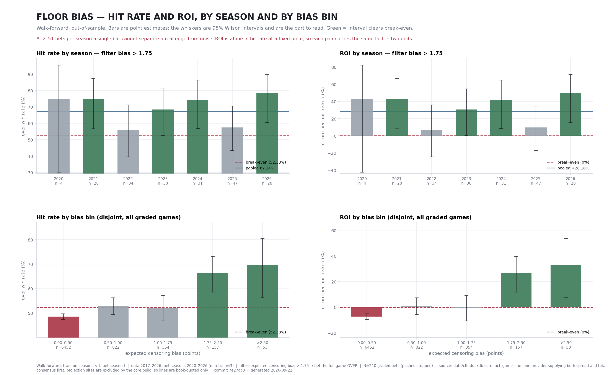

# Hit rate and ROI — by season and by bias bin

Walk-forward, out-of-sample: for season *t* the whole pipeline (Tobit sigmas
+ probit) is fit on seasons *< t* only, then season *t* is graded. Pushes are
dropped. Generated by `monitor/roi_hitrate_doc.py`; the single-number version
of the same bets is in [`roi_report.py`](../monitor/roi_report.py) and
[`figs/roi_report.png`](figs/roi_report.png).

**Read the intervals, not the bars.** Hit rate and ROI are the same fact in
two units — at a fixed price ROI is affine in the win rate — so each pair of
panels carries identical information. Break-even is 52.38% at −110,
which is 0% ROI. A bar is green only when its 95% interval sits entirely
above break-even.

## By season — the deployed filter (bias > 1.75)

| season | N | record | hit rate | hit-rate 95% | ROI | ROI 95% | clears break-even |
|---|---:|---:|---:|---|---:|---|:---:|
| 2020 | 4 | 3–1 | 75.00% | [30.06%, 95.44%] | +43.18% | [-42.61%, +82.21%] | no |
| 2021 | 28 | 21–7 | 75.00% | [56.64%, 87.32%] | +43.18% | [+8.14%, +66.71%] | **yes** |
| 2022 | 34 | 19–15 | 55.88% | [39.45%, 71.12%] | +6.68% | [-24.68%, +35.77%] | no |
| 2023 | 38 | 26–12 | 68.42% | [52.54%, 80.92%] | +30.62% | [+0.31%, +54.48%] | **yes** |
| 2024 | 31 | 23–8 | 74.19% | [56.75%, 86.30%] | +41.64% | [+8.35%, +64.75%] | **yes** |
| 2025 | 47 | 27–20 | 57.45% | [43.28%, 70.49%] | +9.67% | [-17.37%, +34.57%] | no |
| 2026 | 28 | 22–6 | 78.57% | [60.46%, 89.79%] | +50.00% | [+15.43%, +71.41%] | **yes** |

Pooled: **210 bets, 141–69, 67.14%** hit rate ([60.53%, 73.14%]), **+28.18%** ROI ([+15.56%, +39.63%]).

7/7 seasons profitable on the point estimate, but only 4 clear break-even on their own interval — which is what 4–47 bets a season buys you. Single seasons are not the unit of evidence here; the pooled row is.

Two things worth naming rather than leaving for the reader to find:

- **2026 is the most recent season**: 22–6, +50.00% ROI on n=28, against a pooled +28.18%. Its interval [+15.4%, +71.4%] does not contain both the pooled estimate and break-even — read it against `run_monitor.py` before treating it either way. `run_monitor.py` is the test that measures decay directly, and as of its last run it finds none.
- **The sample is back-loaded**: 4–47 bets per season, with 69% of all bets coming from 2023 onward. The pooled figure is mostly recent data.

## By bias bin — every graded game, disjoint bands

| bias bin | N | record | hit rate | hit-rate 95% | ROI | ROI 95% | clears break-even |
|---|---:|---:|---:|---|---:|---|:---:|
| 0.00–0.50 | 6452 | 3132–3320 | 48.54% | [47.32%, 49.76%] | -7.33% | [-9.65%, -5.00%] | no |
| 0.50–1.00 | 822 | 435–387 | 52.92% | [49.50%, 56.31%] | +1.03% | [-5.50%, +7.50%] | no |
| 1.00–1.75 | 354 | 184–170 | 51.98% | [46.78%, 57.13%] | -0.77% | [-10.69%, +9.07%] | no |
| 1.75–2.50 | 157 | 104–53 | 66.24% | [58.54%, 73.17%] | +26.46% | [+11.75%, +39.69%] | **yes** |
| >2.50 | 53 | 37–16 | 69.81% | [56.46%, 80.48%] | +33.28% | [+7.79%, +53.65%] | **yes** |

This is the mechanism check, not a menu of bets. Censoring theory predicts that more expected bias means more mispricing, so the metrics should **rise across the bins**; a single bin popping while its neighbours sit flat is noise, not a strategy. 2 of 5 bins clear break-even on their own interval.

Note the bins are disjoint, so the 1.00–1.75 row is the band *excluded* by the deployed rule — it is shown precisely because it demonstrates no edge, which is why the operational threshold moved from 1.0 to 1.75 (MODEL_GUIDE §3).

## Caveats that apply to every number above

- The 1.75 threshold was chosen partly on this data, so the pooled point estimate is inflated by selection. **Plan on the lower bound** (+15.56% ROI), not the point estimate.
- **2026 is a partial season**: 409 graded games so far against a ~887-game full season, so its row is a few weeks of results and will move as the season fills in. It is pooled in with the rest.
- Every ROI here is priced at −110 flat. The operational rule says −120 or
  better; see the price-sensitivity panel in `figs/roi_report.png` for what
  the vig costs.
- Wilson intervals assume independent bets. Games on the same slate are not
  fully independent, so the true intervals are somewhat wider than shown.

## Reproducing these tables

Every row above comes out of `backtest_bets.csv` — one line per graded
walk-forward game, all of them, not just the ones clearing the filter. Group
by `season` (filtering `passes_filter == 1`) for the first table, bucket
`bias` on the bin edges for the second. The file's `threshold` column records
which filter produced it. Regenerate both file and doc with
`python monitor/roi_report.py --season 2017 2018 2019 2020 2021 2022 2023 2024 2025 2026` then
`python monitor/roi_hitrate_doc.py --season 2017 2018 2019 2020 2021 2022 2023 2024 2025 2026`
(both default to 2013-2025, so the range is not optional).

The `kelly_units` / `kelly_units_pnl` columns are live only on rows where
`passes_filter == 1`; elsewhere they are what Kelly would have staked, not
money wagered, so don't sum them across the excluded bins.

---

Walk-forward: train on seasons < t, bet season t  |  data 2017–2026, bet seasons 2020–2026 (min-train=3)  |  filter: expected censoring bias > 1.75 → bet the full-game OVER  |  N=210 graded bets (pushes dropped)  |  source: data/cfb.duckdb core.fact_game_line, one provider supplying both spread and total, consensus first; projection sites are excluded by the core build, so lines are book-quoted only  |  commit 7e27dc8  |  generated 2026-09-22
