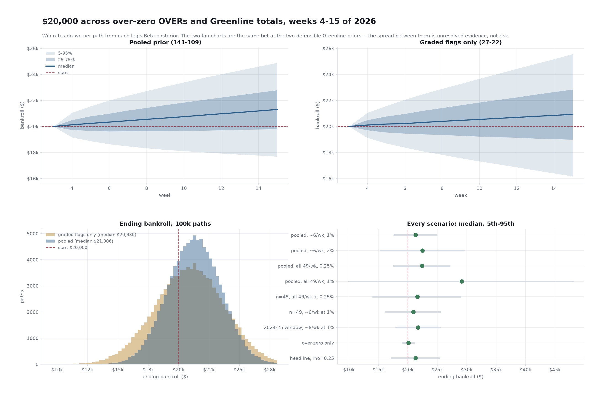

# Monte Carlo: $20,000 bankroll across over-zero + Greenline totals, weeks 4–15 of 2026

Completed September 17, 2026. Revised the same day to pool the personal under history
into the Greenline prior, then again to bracket the headline between the pooled and
graded-flags-only priors. Reproduce with
`python research/bankroll/scripts/mc_combined_totals.py --paths 100000 --gl-volume constant`
(`--self-check` runs the copula, prior and coverage assertions).

**Volume and staking note, later the same day.** Every table here assumes a constant
49 Greenline flags a week and flat stakes off the starting bankroll. Greenline in fact
flags every FBS-vs-FBS game, so the weekly count is the slate (56–67 through week 14,
9 in championship week); and the plan is 6–12 unders a week with units re-sized each
Monday. The simulator's defaults are now `--gl-volume range`, weekly re-sizing, and the
half-pooled planning prior (κ = 0.5); the tables below reproduce with
`--gl-volume constant --flat-stakes --gl-prior pooled` (or `n49`). The re-swept numbers
are in [bankroll-config-sweep-2026-09-17.md](bankroll-config-sweep-2026-09-17.md) and
the proposal. Medians rise ~$200 at the recommended unit; the conclusions do not move.

## The question

Starting from a $20,000 bankroll on September 17, 2026 — week 3 played, weeks 4–15
of the regular season ahead — what does the ending bankroll distribution look like
if both totals strategies are bet: the over-zero floor-bias OVERs and the PFF
Greenline totals flags?

**Scope is the regular season only.** Bowls and the playoff are excluded: they run
on a different calendar and Greenline's flag volume is not established for them.

## The answer in one paragraph

**The answer is bracketed, not resolved, and the bracket is the Greenline prior.**
Betting the Greenline unders at the rate they have historically been bet (~6 a week)
at 1% units, alongside the over-zero OVERs:

| Greenline prior | median | 90% band | P(down) |
|---|---:|---|---:|
| `pooled` — 141–109, the 2026 flags **plus** 201 personal unders | **$21,306** (+6.5%) | $17,685 – $24,888 | **27.7%** |
| `n49` — 27–22, the 2026 graded flags alone | **$20,930** (+4.7%) | $16,164 – $25,564 | **37.4%** |

Neither is the answer on its own. The pooled prior adds **114–87 from the 201
full-game unders in the personal book export, 2023-08 to 2025-12**, which were mostly
PFF Greenline flags — the same signal in earlier seasons. That drops the probability
of drawing a losing Greenline win rate from 35% to 10%. But
[`under-selection-profile-2026-09-17.md`](under-selection-profile-2026-09-17.md) shows those 201 unders
sit at a **median total of 58.5 against 52.5 for the 2026 under flags** — a six-point
gap — so the two populations are not the same and the pooled prior probably
overstates. Greenline's
2023–25 flag distribution is unobserved, so how much it overstates cannot be settled
from what exists. Plan between the two rows.

## Method

One path = one whole remainder-of-season, 100,000 paths. Win rates are drawn per
path from a Jeffreys Beta posterior, never fixed at a point estimate.

### The Greenline prior

| prior | record | source | posterior mean | P(below break-even) |
|---|---|---|---:|---:|
| `n49` | 27–22 | 2026 week 2 graded flags | 55.0% | 35% |
| **`pooled`** | **141–109** | **+ 201 personal unders, 2023–2025 (114–87)** | **56.4%** | **10%** |
| `pff-window` | 99–72 | + the 2024-25 slice only (72–50) | 57.9% | 7% |

The personal unders come from `data/ingest/bet_history/history.csv` —
201 full-game NCAAF unders, 114–87, no pushes, mean price **−110.1**, which is why
the Greenline leg stays priced at −110. By season: 2023 42–37, 2024 18–12,
2025 54–38. Summarised in `docs/bet-history-analysis-2023-2025.md` (114-87, 56.7%,
CI 49.8–63.4, +19.0u) and profiled game by game in
[`under-selection-profile-2026-09-17.md`](under-selection-profile-2026-09-17.md).

**This is pooled as prior evidence, not as independent confirmation.** Those unders
were mostly PFF Greenline flags — the same signal in earlier seasons, bet by the same
person. Pooling it is legitimate; presenting it as an outside check on PFF is not,
and no row in this document does.

The `pff-window` row exists because the 2024-25 slice is the one most strongly
identified as PFF-driven. It is a sensitivity, not the headline: "mostly" is not
"only", 2023 is the same bettor in the same market, and splitting on a qualitative
recollection to reach a higher prior is exactly the move to avoid. It moves the
median by $439.

### Coverage: the population question

The 201-bet record is **not** a record of betting every flag. In 2025 it covers ~92
unders against roughly 690 flags at the current rate — about **13% by count, and at a
materially different distribution of totals**, not a subset. The selection profile
puts the bet unders at a median total of 58.5 against 52.5 for the 2026 under flags,
with 39% of the bets at 60 or above where the flags put 5.7%, and finds the selection
is a genuine rule: 78% of the bets are on totals of 55 or more against 31% of the
available slate (z +13.1). A +0.47-point mean line-shopping edge does not close a
six-point gap. So the pooled 56.4% describes *a different, higher-total population of
unders* than the one the Greenline leg would actually bet.

So coverage is a scenario, not a constant:

- **Historical rate (13%, ~6 bets/week, ~77 over 12 weeks)** — matches volume to the
  evidence. This is the headline.
- **Every flag (~49/week, ~590 over 12 weeks)** — assumes the 56.4% transfers to the
  flags that were passed on. Nothing in the data supports that, and selection makes
  it unlikely to hold in full.

### The over-zero leg

151–83 walk-forward, 2016–2025 (`models/over_zero/docs/ROI_HITRATE.md`), with
MODEL_GUIDE.md's selection haircut applied: 64.5% → **58.2%**, because the 1.75
threshold was chosen on the same data. Priced at −120, its operational rule.

Volume is front-loaded into the FCS-cupcake weeks already played. Week-4-and-later
counts by season, 2021–2025: 8, 11, 9, 11, 14. Paths resample that and Poisson it —
**~11 bets for the entire rest of the season**, not the 12–14/week the board showed
in weeks 1–2. Check on that: 2026 published 25 picks in weeks 1–2 against 26 in the
2025 backtest over the same weeks. Different constructions (published per-book union
vs market-consensus qualifiers), so read the agreement as reassurance, not validation.

### Correlation, prices, pushes, staking

Bets inside a week share one scoring-environment shock through a Gaussian copula.
**ρ = 0.10 is assumed, not estimated** — one graded Greenline week cannot measure it —
so a ρ = 0.25 row runs alongside. Because over-zero is all overs and Greenline is
~85% unders, the shared factor correlates the two legs *negatively*: a high-scoring
Saturday pays over-zero and hurts Greenline.

Prices are per leg: over-zero −120 (break-even 54.55%), Greenline −110 (52.38%).
**Pushes are not modelled** — all 234 graded over-zero bets, all 49 graded Greenline
totals and all 201 personal unders sat on half-point lines. Realised push rate: zero.
**Staking is flat off the starting $20,000**, no compounding; MODEL_GUIDE.md warns off
compounded figures because simultaneous Saturday kickoffs make them unachievable.

## Results



*Top row: the same bet under the two defensible Greenline priors. The gap between the
two panels is unresolved evidence, not risk — it does not shrink by betting more
carefully. Bottom left: the terminal distributions overlap heavily, which is the point.
Bottom right: every scenario, median and 5th–95th; the one long whisker is the
every-flag-at-1% row, which is also the least supported.*

Regenerate with
```
python research/bankroll/scripts/mc_combined_totals.py --paths 100000 \
  --figs research/bankroll/docs/figs/mc-combined-totals-2026-09-17.png
```

100,000 paths, ρ = 0.10, over-zero at 1% ($200/bet) throughout.

| scenario | GL bets | staked | median | 5th | 95th | P(down) | P(−25%) | busts |
|---|---:|---:|---:|---:|---:|---:|---:|---:|
| **Pooled, historical rate (~6/wk), 1% — headline** | ~77 | $17.4k | **$21,306** | $17,685 | $24,888 | **27.7%** | 0.2% | 0.0% |
| Pooled, historical rate, 2% | ~77 | $32.7k | $22,473 | $15,348 | $29,518 | 28.5% | 4.2% | 0.0% |
| Pooled, every flag (~49/wk), 0.25% | ~590 | $31.5k | $22,400 | $17,597 | $27,083 | 20.6% | 0.6% | 0.0% |
| Pooled, every flag, 1% | ~590 | $119.7k | $29,161 | $9,988 | $48,012 | 21.6% | 11.3% | 0.9% |
| `n49` prior, every flag, 0.25% *(previous headline)* | ~590 | $31.5k | $21,644 | $14,018 | $28,979 | 36.0% | 7.6% | 0.0% |
| `n49` prior, historical rate, 1% | ~77 | $17.4k | $20,930 | $16,164 | $25,564 | 37.4% | 2.0% | 0.0% |
| `pff-window` prior, historical rate, 1% | ~77 | $17.4k | $21,745 | $18,009 | $25,433 | 22.1% | 0.2% | 0.0% |
| Over-zero only | 0 | $2.1k | $20,133 | $19,100 | $21,133 | 39.4% | 0.0% | 0.0% |
| Headline at ρ = 0.25 | ~77 | $17.4k | $21,305 | $17,209 | $25,300 | 29.7% | 0.6% | 0.0% |

Headline, full percentiles:

| pct | 1% | 5% | 10% | 25% | 50% | 75% | 90% | 95% | 99% |
|---|---:|---:|---:|---:|---:|---:|---:|---:|---:|
| ending bankroll | $16,191 | $17,685 | $18,473 | $19,812 | $21,306 | $22,785 | $24,106 | $24,888 | $26,385 |

Worst single week: median −$833, 5th percentile −$1,452.

## What the numbers say

**1. The Greenline prior is the whole projection, and it is the thing least
settled.** Pooling moves the posterior from 55.0% (sd 0.07) to 56.4% (sd 0.031) and
the probability of drawing a losing win rate from 35% to 10%; P(down) drops
36.0% → 20.6% and 37.4% → 27.7% at matched volumes and stakes. But the selection
profile shows the pooled half comes from a higher-total population than the flags,
so 56.4% is an upper reading and 55.0% a lower one. Everything else in this document
is stable across that choice; the headline is not.

**2. Volume, not stake, is the live decision — and it points the opposite way from
intuition.** Betting every flag at 0.25% *lowers* P(down) to 20.6% versus 27.7% at the
historical rate, despite a similar amount staked. More bets means less sampling noise
around a parameter that is 90% likely to be profitable. If the 56.4% genuinely applies
to all 49 flags, betting all of them is strictly better.

**But that is the assumption the evidence cannot carry.** The 56.4% was earned on ~13%
of the flags — the picked ones. The unpicked 87% are unpriced. Everything in the
"every flag" rows is conditional on a transfer the data does not demonstrate, and
PFF's own `value` ranking failing to order outcomes (top half 13–11 vs bottom half
14–11 on totals) means there is no published filter that reconstructs the selection
either. **The headline uses the historical rate because that is the population the
evidence came from.**

**3. Over-zero is a rounding error from here.** ~11 bets × $200 at 58.2% is a median
of **+$133** across twelve weeks; its whole 5th–95th band is $19,100–$21,133. Its
season was decided in weeks 1–3. Keep betting it — it is nearly free — but nothing
about the rest of 2026 turns on it.

**4. The 1% / every-flag row is the one to distrust.** Median $29,161 (+45.8%) reads
best on the table and is the least supported cell in it: 0.9% of paths pass through
zero, 11.3% end down 25%+, and it compounds the unproven coverage transfer with a
stake that puts ~49% of bankroll on one Saturday of ~85% same-direction unders.

**5. Correlation still only bites the tail.** Median flat across ρ ($21,306 at 0.10,
$21,305 at 0.25) while the 5th percentile runs $17,685 → $17,209 and the worst
expected week −$833 → −$1,000. Direction and rough magnitude are robust; the specific
tail number is not, because ρ is assumed.

## What this does not support

- **Greenline as independently validated.** The pooled prior is 80% personal-betting
  history of the same signal. It is prior evidence, not an outside check. The 2026
  graded flags alone remain n=49, CI 41–68%.
- **The pooled prior as transferable in full.** The 201 unders sit ~6 points higher in
  total than the 2026 under flags and load a band (60+) the flags barely touch. That is
  a different population, so pooling probably overstates. By how much is unknowable
  from what exists — the 2023–25 flag distribution was never captured.
- **The "every flag" rows as achievable.** They assume the picked-flag win rate
  transfers to the 87% that were passed on.
- **Any claim about the selection rule.** The personal record is price-shopped and
  hand-filtered by criteria this repo does not encode. "Bet at the historical rate"
  is a volume assumption, not a reproducible strategy — there is no script that picks
  which 6 of 49 flags to take.
- **Greenline spreads or moneylines.** Totals only; spreads went 21–28 in week 2 with
  worse-than-coin calibration.
- **Repriced results.** Greenline grades at PFF's captured number and
  `match_greenline_books.py` shows books hang a different number on a third of the
  slate. The personal record, by contrast, is at prices actually taken.
- **Ruin dynamics.** Flat stakes come off a fixed $20,000 with no stop-loss. The
  "busts" column reports how often a path passes through zero; those rows' percentiles
  still assume betting continued.

## Open items

1. **No conflict rule exists.** Week 2, Rice @ Notre Dame: over-zero published OVER
   54.5, Greenline flagged UNDER 55.5. Same game, opposite sides — a hedge paying
   juice twice, not two bets. Rare so far only because over-zero's early picks are FCS
   cupcakes PFF does not flag; that changes as its remaining bets move to FBS
   matchups. **"Combined" needs a stated rule before it is bet.**
2. **Record which flags get bet, starting now.** The join that would settle coverage —
   bet unders against the flags that produced them — **cannot be run**: Greenline
   captures start at 2026 week 2, the warehouse holds no Greenline projections, and the
   bet history ends 2025-12. There is no season where both exist. From week 2 forward
   there is, so logging which flags get taken answers coverage and the distribution gap
   in a few weeks, where no further work on 2023–25 can.
3. **Keep grading.** Four more graded weeks gets the 2026 flags to n ≈ 250 on their
   own, at which point the prior stops doing the work. Capture Wednesday
   (`scripts/pull_pff_scoreboard.py --greenline`), grade Monday
   (`research/totals/scripts/grade_greenline.py`), rerun this script.

The logging in item 2 now exists: [`../scripts/greenline_bet_log.py`](../scripts/greenline_bet_log.py) holds
one row per totals flag per week, seeded from the captures. Weeks 2 and 3 of 2026 are
seeded and **unmarked** — 106 flags waiting on which ones were bet.

## Data and dates

over-zero: 234 walk-forward graded bets 2016–2025 from
`models/over_zero/docs/backtest_bets.csv`; 2026 published record 17–8 through week 2
from `models/over_zero/site/lib/weekly-results.json` (not used as a prior). Greenline:
49 graded totals flags, 2026 week 2, `data/ingest/pff_scoreboard/greenline_graded.csv`;
week-3 volume `data/ingest/pff_scoreboard/pff_greenline_2026_w3.csv`; 201 personal
full-game unders 2023-08 → 2025-12, `data/ingest/bet_history/history.csv`. Projection
span: weeks 4–15, 2026 regular season. Seed 20260917.
