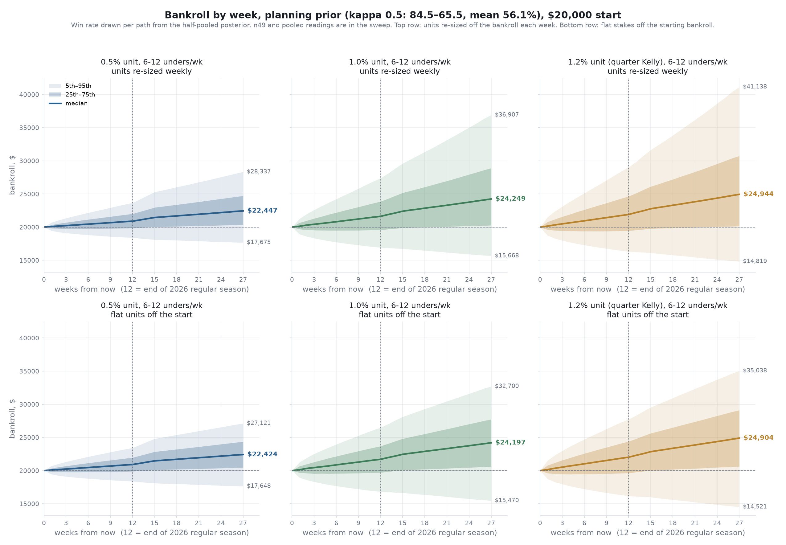

# Bankroll growth by week, two seasons, planning prior

Generated 2026-09-17 by
`research/bankroll/scripts/pooled_growth_chart.py --paths 100000 --seasons 2 --flat-stakes`.
Earlier the same day this chart was pooled-prior, one season; it now runs on the
planning prior (κ = 0.5) over the rest of 2026 plus a full 2027-style season.

## Question

Starting from $20,000 before week 4 of 2026, drawing the Greenline win rate from the
planning posterior (84.5–65.5, mean 56.1%), betting 6–12 unders a week with units
re-sized off the bankroll each Monday, what does the bankroll path look like across
the rest of 2026 and all of 2027 at three unit sizes? And does re-sizing matter?

## Numbers (100,000 paths, ρ = 0.10, over-zero at 1%, 27 weeks)

Top row: units re-sized each week (the simulator's default). Bottom row: flat units
off the starting $20,000. Within a week stakes are flat either way. The dotted line
at week 12 is the end of the 2026 regular season; 2027 runs on 2025's schedule with
over-zero at full-season volume (30–51 bets, two-thirds in weeks 1–3).

| config | staking | median | 5th | 25th | 75th | 95th | P(down) | busts |
|---|---|---:|---:|---:|---:|---:|---:|---:|
| 0.5% unit | weekly re-size | $22,447 (+12.2%) | $17,675 | $20,361 | $24,716 | $28,337 | 21.2% | 0 |
| 1.0% unit | weekly re-size | $24,249 (+21.2%) | $15,668 | $20,276 | $28,902 | $36,907 | 23.4% | 0 |
| 1.2% unit (≈ quarter Kelly) | weekly re-size | $24,944 (+24.7%) | $14,819 | $20,157 | $30,737 | $41,138 | 24.3% | 0 |
| 0.5% unit | flat | $22,424 (+12.1%) | $17,648 | $20,470 | $24,358 | $27,121 | 20.2% | 0 |
| 1.0% unit | flat | $24,197 (+21.0%) | $15,470 | $20,609 | $27,733 | $32,700 | 21.5% | 0 |
| 1.2% unit | flat | $24,904 (+24.5%) | $14,521 | $20,623 | $29,107 | $35,038 | 22.0% | 0 |

## Reading

- **The median is a straight line with a kink at week 12.** The kink is over-zero
  coming back at full volume in 2027's first three weeks. Over the rest of 2026 it is
  ~11 bets; in 2027 it is 30–51.
- **Re-sizing starts to matter over two seasons.** Medians are flat (+$50 to +$40),
  but the 95th percentile rises by $1,200 to $6,100 and the 5th percentile falls by
  $30 to $300. Within one season it was noise; across two it is the compounding the
  bankroll exists for.
- **P(down) falls with horizon** (28–30% for 2026 alone, 21–24% through 2027) because
  more bets average out the draw of the win rate. P(−25%) at the end of two seasons at
  1% is 3.6%, above the 3% per-season cap, which is why the unit is re-derived weekly
  rather than fixed.
- **1.2% is the quarter-Kelly neighborhood** (1.31% exactly, off the planning prior
  with the simultaneous-bets shrink). It buys +3.5 points of median over 1% through
  2027 for a 5th percentile $850 lower.

## What this does not support

- The planning prior's 56.1% as the true rate. n49 gives 55.0%, pooled 56.4%; the
  sweep doc carries both.
- 2027 as a forecast. It is 2025's schedule with the current record's win-rate draws.
  Nothing about the edge is re-estimated, and golf is not in it.
- Any per-bet compounding or full-Kelly figure.

## Data

Same inputs as `mc_combined_totals.py`: 234 over-zero walk-forward bets 2016–25 and
the 2022–25 season counts, 49 graded 2026 Greenline flags, 201 personal unders 2023–25;
FBS-vs-FBS slate per week from `core.fact_game` (2026 weeks 4–13; 2025 for the rest and
for 2027). Seed 20260917.
