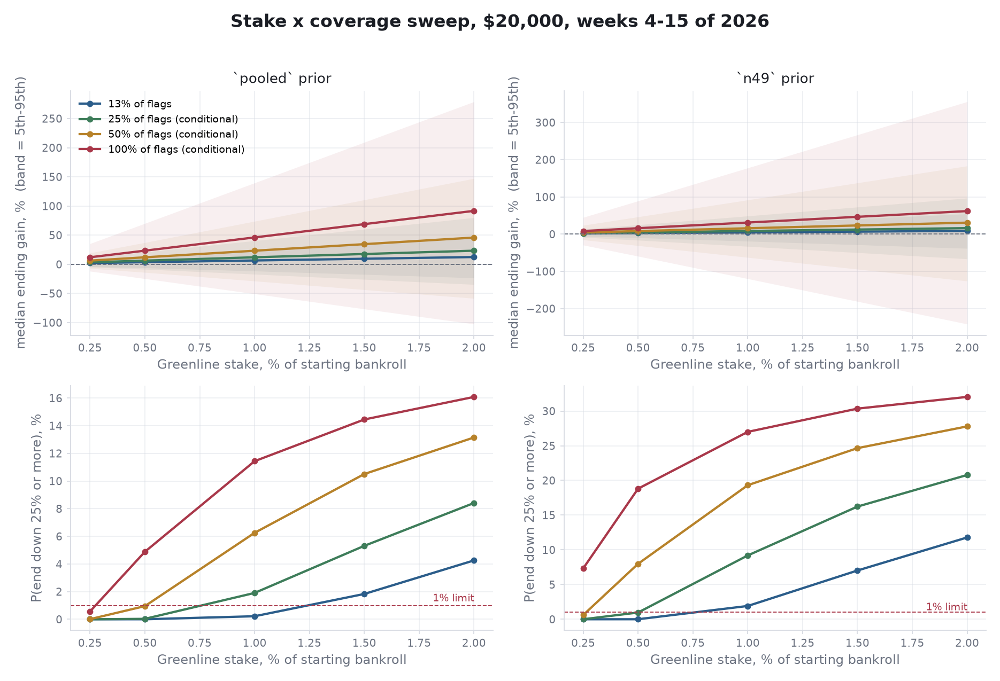

# Seed bankroll proposal: $20,000 for the rest of the 2026 college football season

Prepared September 17, 2026. This is a private request to family for a **gift** that
funds a betting bankroll. Nothing is owed back. It is not an investment, not a loan,
and not a security. What follows is what the money would fund, what has been earned
so far, and what the model says is likely to happen to it.

Every number below comes out of a script in this repository. Reproduce with:

```
python research/bankroll/scripts/mc_combined_totals.py --paths 100000
python research/bankroll/scripts/bankroll_config_sweep.py --paths 50000 --out research/bankroll/docs
```

---

## 1. The ask

| item | value |
|---|---|
| amount | **$20,000** |
| horizon | weeks 4–15 of the 2026 regular season, September 24 to December 12. Twelve weeks. Week 3 (this weekend) is not in the projection |
| what it funds | two totals strategies, both already running, units re-sized off the bankroll each week |
| expected bets | ~118: 6–12 Greenline unders a week (~107) and ~11 over-zero overs |
| recommended unit | Greenline **0.5% of bankroll per bet** ($100 at the start), over-zero **1%** ($200). Re-sized each Monday |
| what happens after | bankroll and profit stay in the operation for 2027, where the larger of the two edges does most of its work |

## 2. The answer in one paragraph

**Median outcome is a gain of $670 to $950 over twelve weeks. Roughly one season in
three ends below $20,000. No modeled path loses a quarter of the money, and none goes
to zero.** The range is bracketed because the main strategy's win rate rests on two
defensible readings of the record, and neither can be ruled out yet. Everything below
reports both.

| Greenline prior | median | 90% band | P(down) | P(−25%) | busts |
|---|---:|---|---:|---:|---:|
| `pooled` (141–109) | **$20,945** (+4.7%) | $18,598 – $23,541 | 26.0% | 0 of 50,000 | 0 of 50,000 |
| `n49` (27–22) | **$20,673** (+3.4%) | $17,600 – $24,112 | 36.9% | 23 of 50,000 | 0 of 50,000 |

## 3. What gets bet

Two strategies. One bankroll. Units re-sized off the bankroll at the start of each
week, flat within the week.

### Over-zero (floor-bias OVERs)

A model built in this repository. It finds games where the market total is pinned
too low by the way books price a heavy favorite's opponent, and bets the OVER when
the expected bias clears a threshold.

| fact | value | source |
|---|---|---|
| walk-forward record, 2016–2025 | **151–83, 64.5%** (95% CI 58.2–70.4%) | `models/over_zero/docs/ROI_HITRATE.md` |
| ROI at −110 | +23.2% (CI +11.1 to +34.4%) | same |
| planning win rate | **58.2%**, the CI floor, because the threshold was picked on this data | `MODEL_GUIDE.md` |
| price rule | −120 or better | same |
| bets left in 2026 | **~11**. Volume is front-loaded into weeks 1–3, already played | `mc-combined-totals-2026-09-17.md` |
| 2026 so far | 17–8 through week 2 | `site/lib/weekly-results.json` |

This is the better-evidenced edge, and it is nearly spent for 2026. Its median
contribution from here is **+$133**. It matters for 2027, when it fires 30–50 times.

### Greenline totals (PFF vendor flags, unders)

PFF publishes a projection per game and flags totals where it disagrees with the
market. Flags are captured Wednesday, graded Monday. ~85% of flags are unders.

| fact | value | source |
|---|---|---|
| 2026 graded flags | **27–22, 55.1%** (CI 41–68%), one week | `greenline-season-review-2026-09-16.md` |
| 2023–25 personal unders, mostly the same flags | **114–87, 56.7%** (CI 49.8–63.4%), 201 bets | `bet-history-analysis-2023-2025.md` |
| pooled prior | 141–109, posterior mean 56.4%, P(losing) 10% | `mc-combined-totals-2026-09-17.md` |
| 2026-only prior | 27–22, posterior mean 55.0%, P(losing) 35% | same |
| planned volume | **6–12 unders a week**, ~107 over 12 weeks. Mean 9 is ~16% of a typical slate, a little above the 13% rate the record was earned at | `bankroll_config_sweep.py` |
| price | −110, break-even 52.38% | same |

The 2023–25 record is the same signal in earlier seasons, bet by the same person. It
is legitimate prior evidence. It is **not** independent confirmation of PFF, and this
document never treats it as one. Those 201 unders also sat six points higher in total
than the 2026 flags (median 58.5 vs 52.5), so the pooled 56.4% probably reads high.
That is why the 2026-only prior is carried alongside it everywhere.

### Conflict rule

Rare, but it has happened: week 2, Rice @ Notre Dame, over-zero said OVER 54.5 and
Greenline flagged UNDER 55.5. Betting both pays juice twice for a hedge. **Rule:
Greenline takes the game, over-zero skips it.** Greenline carries the volume.

### Excluded

The spread model in `research/spread/` is research, not a bet. Greenline spreads and
moneylines went 21–28 and 21–25 in week 2 and are not funded.

## 4. How the projection works

One simulated path is one whole remainder-of-season. 100,000 paths for the headline,
50,000 per cell of the sweep.

- **Win rates are never fixed.** Each path draws its own win rate from the Beta
  posterior of the graded record, so the spread of outcomes includes not knowing the
  true rate, not just luck.
- **Bets on the same Saturday are correlated** through one scoring-environment
  shock (Gaussian copula, ρ = 0.10 assumed, ρ = 0.25 as sensitivity). Because
  over-zero is all overs and Greenline is mostly unders, a high-scoring day helps one
  and hurts the other.
- **Volume is the plan: 6–12 unders a week**, drawn uniformly and capped by the
  week's slate. Greenline flags every FBS-vs-FBS game (week 2: 49 games, 49 flags;
  week 3: 57 and 57), and the slate runs 56–67 a week through week 14, then 9 in
  championship week. Mean 9 a week is ~16% of flags, a little above the 13% rate
  the personal record was earned at. Over-zero resamples its week-4+ history
  (8, 11, 9, 11, 14 bets in 2021–25).
- **Units re-sized off the bankroll at the start of each week**, flat within the
  week because Saturday kickoffs are simultaneous. No stop-loss; a path at zero stops.
  The bust rate is reported on every row.
- Pushes not modeled: zero realized on all 484 graded bets, all on half-point lines.

## 5. Choosing the stake: the sweep

Greenline unit from 0.25% to 2% of bankroll at 6–12 unders a week, both priors.
Over-zero held at 1%. The coverage grid (13% of flags up to every flag) is one flag
away, `--gl-volume slate`. Full grid in
[`bankroll-config-sweep-2026-09-17.md`](bankroll-config-sweep-2026-09-17.md).



**Objective (a):** largest median gain such that at most 1% of paths end down 25% and
none go through zero, under **both** priors.
**Objective (b):** downside ratio = median gain ÷ (median − 5th percentile). Shown as
a column; higher is better.

Every row at 6–12 unders a week, units re-sized weekly:

| GL stake | median (pooled / n49) | 5th pct (pooled / n49) | P(−25%) (pooled / n49) | ratio (pooled / n49) | passes (a) |
|---:|---|---|---|---|:---:|
| 0.25% | $20,544 / $20,405 | $19,124 / $18,652 | 0.0% / 0.0% | 0.38 / 0.23 | yes |
| **0.50%** | **$20,945 / $20,673** | **$18,598 / $17,600** | **0.0% / 0.0%** | **0.40 / 0.22** | **yes** |
| 1.00% | $21,714 / $21,157 | $17,296 / $15,432 | 0.4% / 3.6% | 0.39 / 0.20 | pooled only |
| 1.50% | $22,431 / $21,565 | $15,949 / $13,426 | 2.7% / 10.4% | 0.38 / 0.19 | no |
| 2.00% | $23,115 / $21,906 | $14,634 / $11,606 | 5.9% / 16.2% | 0.37 / 0.19 | no |

Three things the grid says:

1. **0.5% is the largest unit that passes under the conservative prior.** 1% passes
   only if the pooled prior is right. Recommended: **0.5% of bankroll per Greenline
   bet**, $100 at the start, with 1% as the upgrade once the 2026 flags alone reach
   ~250 graded (four more weeks).
2. **Stake does not change the downside ratio.** It runs 0.37–0.40 under pooled and
   0.19–0.23 under n49 at every stake. Staking more buys a bigger median and a
   bigger 5th-percentile loss in the same proportion. There is no free stake.
3. **Volume is what improves the ratio, and it is the assumption to watch.** At
   6–12 a week (~107 bets) the pooled ratio is 0.40 against 0.38 at the 13% rate
   (~88 bets), because more bets average out the draw of the win rate. But 9 a week
   is ~16% of flags, above the 13% the record was earned at, so a slice of every
   week's bets falls on flags the record never covered. The ledger is what prices
   that; until it does, treat the volume as a plan, not evidence.
4. **The recommendation survives a more skeptical model.** An outside review asked
   whether 0.5% holds when the over-zero haircut is uncertain, the Greenline prior is
   only partly pooled, bets 7–12 each week are weaker, and same-slate correlation is
   up to five times the assumed value. It passes all 25 stress cases, including all
   of them at once (worst case: median +1.8%, 0.33% of paths down 25%, no busts).
   1% fails 13 of 25. Details in
   [bankroll-stress-2026-09-17.md](bankroll-stress-2026-09-17.md).

## 6. Risk, stated plainly

At the recommended 0.5% / 1% units, re-sized weekly:

| measure | pooled | n49 |
|---|---:|---:|
| P(season ends below $20,000) | 26.0% | 36.9% |
| P(ends below $15,000) | 0.0% | 0.0% |
| P(passes through $0) | 0 of 50,000 | 0 of 50,000 |
| 5th-percentile ending bankroll | $18,598 | $17,600 |
| mean of the worst 5% of endings | $18,039 | $16,905 |
| largest mid-season drawdown, median / 95th pct | $794 / $1,996 | $876 / $2,671 |
| P(a drawdown deeper than 10% at some point) | 5.0% | 12.7% |
| weeks below the start, median | 2 | 3 |
| worst single week, median | −$534 | −$551 |
| total staked over 12 weeks | ~$13,100 | ~$13,100 |

The 5th percentile means one season in twenty ends worse than about −$1,400 to
−$2,400. The
30-ish percent chance of a losing season is mostly parameter uncertainty: the true
Greenline win rate has a 10–35% chance of being below break-even, and the season is
too short to average that away.

Correlation only bites the tail. Median is flat across ρ; the 5th percentile moves
by a few hundred dollars. ρ is assumed, not measured.

## 7. What this does not support

- **Greenline as independently validated.** n=49 in 2026, CI 41–68%. The pooled prior
  is 80% personal history of the same signal.
- **The pooled prior transferring in full.** The 201 unders sit ~6 points higher in
  total than the 2026 flags. Pooling probably overstates; by how much is unknowable
  from what exists.
- **Any coverage above 13%.** Every conditional row assumes the picked-flag win rate
  applies to flags that were passed on.
- **A reproducible selection rule.** "Bet 6–12 of the week's flags" is a volume
  assumption. No script picks which six. The historical picks were hand-filtered and
  price-shopped.
- **A 2027 projection.** Not modeled. Over-zero at full-season volume and a full
  graded Greenline season are what it needs, and neither exists yet.
- **Within-week compounding.** Units re-size on Monday, not per bet; Saturday
  kickoffs are simultaneous. Weekly re-sizing moves the twelve-week median by less
  than $100 against flat stakes either way.

## 8. What the money does each week

| day | step | command |
|---|---|---|
| Wednesday | capture Greenline flags | `scripts/pull_pff_scoreboard.py --greenline` |
| Wednesday | seed the bet ledger | `research/bankroll/scripts/greenline_bet_log.py --seed` |
| Thursday–Saturday | bet 6–12 unders at −110 or better, over-zero board at −120 or better | `models/over_zero` site |
| Monday | grade flags, mark which were bet | `grade_greenline.py`; `greenline_bet_log.py --mark` |
| Monday | re-size units off the bankroll; rerun the projection with the new record | `mc_combined_totals.py` |

Marking which flags get bet is the one step that is not automated and the one that
resolves the biggest open question.

**Updating rule, fixed now.** The projection is rerun each Monday with the graded
record. The Greenline unit does not change during the season except by this rule:
it moves from 0.5% to 1% only when the 2026 flags alone (no pooling) pass
P(−25%) ≤ 1% with no busts at 1%, which needs roughly four more graded weeks at the
current rate. It moves from 0.5% to 0.25% if the 2026-only record falls below
break-even on its posterior mean. No other in-season changes.

## Data and dates

over-zero: 234 walk-forward bets 2016–2025, `models/over_zero/docs/backtest_bets.csv`.
Greenline: 49 graded flags, 2026 week 2, `data/ingest/pff_scoreboard/greenline_graded.csv`;
201 personal unders 2023-08 to 2025-12, `data/ingest/bet_history/history.csv`.
Projection span weeks 4–15, 2026. Seeds 20260917. Sweep: 50,000 paths per cell,
10 cells; headline table §2 from the sweep's 0.5% rows. Greenline volume 6–12 a
week, uniform, capped by the FBS-vs-FBS slate from `core.fact_game` (weeks 14–15
from 2025), queried 2026-09-17. Units re-sized weekly.

Related: [`mc-combined-totals-2026-09-17.md`](mc-combined-totals-2026-09-17.md),
[`under-selection-profile-2026-09-17.md`](under-selection-profile-2026-09-17.md),
[`bankroll-config-sweep-2026-09-17.md`](bankroll-config-sweep-2026-09-17.md).
