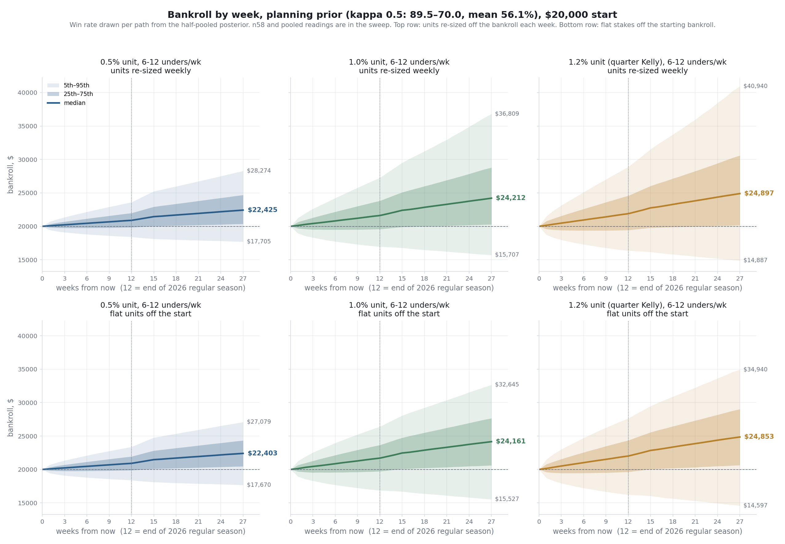
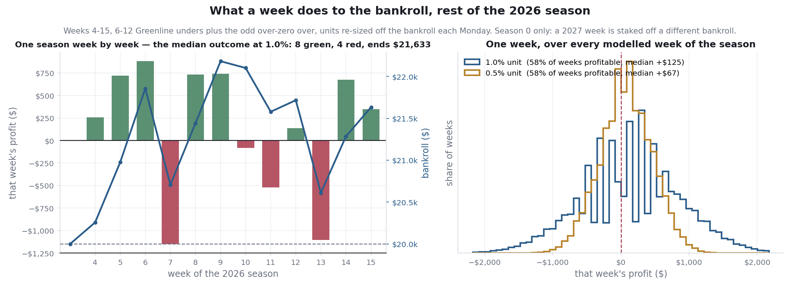

# Seed bankroll proposal: $20,000 to grow across seasons

Prepared September 21, 2026. Supersedes the September 17 version: week 3 has now
played and been graded, and the Greenline planning prior has been rebuilt on the
population that actually gets bet. This is a private request to family for a
**gift** that seeds a betting bankroll. Nothing is owed back. It is not an
investment, not a loan, and not a security. The bankroll is meant to **grow
across seasons**: the rest of 2026, all of 2027, and golf strategies once they
have a graded record. What follows is what the money funds, what has been earned
so far, how bets are sized, and what the model says is likely to happen.

Every number below comes out of a script in this repository. Reproduce with:

```
python research/totals/scripts/grade_unders_list.py --week 2 --week 3
python research/bankroll/scripts/bankroll_config_sweep.py --paths 50000 --out research/bankroll/docs
python research/bankroll/scripts/bankroll_config_sweep.py --paths 50000 --seasons 2
python research/bankroll/scripts/pooled_growth_chart.py --paths 100000 --seasons 2 --flat-stakes --out research/bankroll/docs
python research/bankroll/scripts/bankroll_stress.py --paths 50000 --out research/bankroll/docs
python research/bankroll/scripts/mc_combined_totals.py --growth --paths 50000 --gl-unit 0.01
python research/bankroll/scripts/mc_combined_totals.py --weekly-fig research/bankroll/docs/figs/weekly-pnl-2026-09-21.png --paths 50000
```

---

## 1. The ask

| item | value |
|---|---|
| amount | **$20,000** |
| horizon | the rest of 2026 (weeks 4–15, September 24 to December 12), then 2027 and onward. Bowls excluded. Weeks 1–3 have played; they are the record in §3, not part of the projection |
| what it funds | two totals strategies already running; units re-sized off the bankroll each Monday; golf added once graded |
| expected bets, rest of 2026 | ~118: 6–12 Greenline unders a week (~107) and ~11 over-zero overs |
| expected bets, 2027 | ~250: ~134 Greenline unders and ~40 over-zero overs |
| recommended unit today | Greenline **1% of bankroll per bet** ($200 at the start), over-zero **1%** ($200). Re-derived weekly by the rule in §6 |
| what happens to profit | stays in the bankroll |

## 2. The answer in one paragraph

**Median outcome is +8% by the end of 2026 and +21% by the end of 2027. About
three seasons in ten end down; one in four two-season runs ends down. Fewer than
1% of runs lose a quarter of the money by the end of 2026, and none goes to
zero.** The unit is the largest that keeps that quarter-loss chance under 3% per
season, and it is three-quarters of what fractional Kelly would allow. The main
strategy's win rate is the planning number in a bracket; the bracket is reported
everywhere.

| horizon | unit | median | 90% band | P(down) | P(−25%) | busts |
|---|---:|---:|---|---:|---|---|
| rest of 2026 | 1% | **$21,633** (+8.2%) | $16,951 – $27,307 | 29.8% | 337 of 50,000 (0.7%) | 0 of 50,000 |
| rest of 2026 | 0.5% | $20,903 (+4.5%) | $18,425 – $23,629 | 28.2% | 1 of 50,000 | 0 of 50,000 |
| through 2027 | 1% | **$24,155** (+20.8%) | $15,740 – $36,608 | 23.3% | 3.4% | 0 of 50,000 |
| through 2027 | 0.5% | $22,410 (+12.0%) | $17,710 – $28,200 | 21.2% | 0.3% | 0 of 50,000 |

Planning prior throughout; the bracket is in §4 and §7.

### The same thing as a rate

| measure | 1% unit | 0.5% unit |
|---|---:|---:|
| rest of 2026, 12 weeks | **+8.2%** (5th–95th −15.2% to +36.5%) | +4.5% (−7.9% to +18.1%) |
| a full 2027 season | **+11.9%** (−15.9% to +47.5%) | +7.3% (−9.3% to +26.6%) |
| **CAGR, 1.21 calendar years to Dec 2027** | **+16.8%** (−17.9% to +64.6%) | +9.8% (−9.5% to +32.7%) |

Medians, computed per simulated path rather than by dividing one median by
another, because medians do not compound.

**Why there is no annualised number for 2026 alone.** The rest of this season is
79 days of betting followed by 259 days in which the money does nothing. Scaling
a 12-week result up to a year would invent compounding that never happens and
would turn +8.2% into something near +43%. The CAGR row is the only annualised
figure here, and it spans the whole funded window with the idle months counted
in. A season is the unit that actually compounds, which is why the middle row is
the one to watch across years.

**What changed since September 17.** Week 3 added 22 graded Greenline under picks
(11–11) and 5 over-zero overs (4–1). The Greenline record the prior is built on
went from 27–22 all-flags to **32–26 on the published under list** — a different
and more honest population, explained in §4. The planning prior's mean is
essentially unchanged (56.1% both times) on a sample 18% larger, so the
recommendation is the same 1% and the bracket around it is narrower.

## 3. What gets bet

Two strategies. One bankroll. Units re-sized off the bankroll at the start of each
week, flat within the week.

### Over-zero (floor-bias OVERs)

A model built in this repository. It finds games where the market total is pinned
too low by the way books price a heavy favorite's opponent, and bets the OVER when
the expected bias clears a threshold.

| fact | value | source |
|---|---|---|
| walk-forward record, 2016–2025 | **151–83, 64.5%** (95% CI 58.2–70.4%) | `models/over_zero/docs/ROI_HITRATE.md` |
| ROI at −110 | +23.2% (CI +11.1 to +34.4%) | same |
| planning win rate | **58.2%**, the interval's lower endpoint, because the threshold was picked on this data | `MODEL_GUIDE.md` |
| price rule | −120 or better | same |
| bets left in 2026 | **~11**. Volume is front-loaded into weeks 1–3, already played | `mc-combined-totals-2026-09-17.md` |
| bets in a full season | 30–51 (2022–25), ~68% in weeks 1–3 | `ROI_HITRATE.md` |
| 2026 so far | **21–9** through week 3 (10–4, 7–4, 4–1), +10.09u at −110 | `models/over_zero/docs/week3-grade-2026-09-21.md` |

The better-evidenced edge. Nearly spent for 2026; it is roughly a third of 2027's
expected profit. The 2026 record is **not** folded into the prior — it is 30
published picks off blowout-shaped early-season boards, and its own grading doc
says not to quote the 70% as model performance. The projection still plans on
58.2%.

### Greenline totals (PFF vendor flags, unders)

PFF publishes a projection per game and flags totals where it disagrees with the
market. Flags are captured Wednesday, a filtered under list is published, and
everything is graded Monday. ~85% of flags are unders.

| fact | value | source |
|---|---|---|
| **published under list, 2026 weeks 2–3** | **32–26, 55.2%** (CI 42.5–67.3%), 58 picks. Identical at PFF's number and at DraftKings' | `grade_unders_list.py --week 2 --week 3` |
| all 2026 totals flags, same weeks | 58–48, 54.7% (106 flags; the over flags went 12–6 and are not bet) | `grade_greenline.py --all` |
| under flags only | 46–42, 52.3% | same |
| 2023–25 personal unders, mostly the same flags | **114–87, 56.7%** (CI 49.8–63.4%), 201 bets | `bet-history-analysis-2023-2025.md` |
| **planning prior** | the published under list plus the 2023–25 unders at **half weight**: 89–69.5, mean **56.1%**, P(losing) 17% | `mc_combined_totals.py` |
| planned volume | **6–12 unders a week**, ~107 over the rest of 2026, ~134 in 2027 | `bankroll_config_sweep.py` |
| price | −110, break-even 52.38% | same |

### Conflict rule

Week 2, Rice @ Notre Dame: over-zero said OVER 54.5 and Greenline flagged UNDER 55.5.
Betting both pays juice twice for a hedge. **Rule: over-zero takes the game, Greenline
skips it.** The skipped Greenline flag is marked not bet in the ledger with a note, so the
control still grades it. Week 3 produced no conflict — over-zero's five picks were all
FBS-vs-lower-tier games, which Greenline does not flag.

### Excluded, for now

The pred-tracker-model in `research/spread/` is research, not a bet. Greenline spreads and
moneylines went 21–28 and 21–25 in week 2 and are not funded. **Golf** enters at zero
until it has a graded record, then at the same rule as every other leg.

## 4. The planning prior, its population, and its bracket

Two choices go into this number, and both are stated rather than assumed.

**Which 2026 population.** The September 17 version used all 49 graded totals
flags from week 2 (27–22). Week 2 was ~80% unders, so that was a fine proxy. It
is not any more: across weeks 2–3 the over flags are 17% of the sample and went
12–6, and the strategy never bets them — over-zero is the over leg. Counting them
would price a plan on games it does not play. The prior is therefore built on the
**published under list, 32–26**, the filtered list actually posted each week and
the closest thing on record to what gets staked. The two flag-level readings are
carried as bracket endpoints below.

**How much of the personal history to count.** The 2023–25 unders were mostly
Greenline flags in earlier seasons, bet by the same person. That is prior evidence
for the same signal, not independent confirmation. They also sat six points higher
in total than the 2026 flags (median 58.5 vs 52.5), so counting them in full
probably overstates and ignoring them throws away 201 bets. **The planning prior
counts them at half weight** (κ = 0.5). Every recommendation in this document is
made on it.

| prior | record | posterior mean | P(true rate below break-even) | median at 1%, rest of 2026 | P(−25%) at 1% |
|---|---|---:|---:|---:|---:|
| `n58`, published under list only | 32–26 | 55.1% | 34% | $21,174 (+5.9%) | 2.9% |
| **planning**, κ = 0.5 | **89–69.5** | **56.1%** | **17%** | **$21,633 (+8.2%)** | **0.7%** |
| `pooled`, κ = 1 | 146–113 | 56.4% | 10% | $21,725 (+8.6%) | 0.4% |

The mean column is the Jeffreys posterior mean the simulator draws from, which is why
the under list reads 55.1% here and 55.2% as a raw record in §3.

Two flag-level sensitivities, not used for any recommendation: all 106 totals
flags (58–48) put the κ = 0.5 mean at 55.7%, and under flags only (46–42) put it
at 54.6% — the pessimistic reading, and the one to watch if the published list
stops beating the raw under board.

The n58 endpoint now passes the §6 drawdown cap at 1% (2.9% against a 3% cap),
which the old 27–22 endpoint did not (3.6%). That is what 9 extra graded picks
bought: the same recommendation, defensible under every prior in the bracket
rather than two of three.

## 5. How the projection works

One simulated path is one run through every remaining week. 50,000 paths per cell of
the sweep, 100,000 for the fan charts.

- **Win rates are never fixed.** Each path draws its own true win rate from the Beta
  posterior of the record, so the spread of outcomes includes not knowing the true
  rate, not just luck.
- **Bets on the same Saturday are correlated** through one scoring-environment shock
  (Gaussian copula, ρ = 0.10 assumed; 0 to 0.5 in the stress tests). Over-zero is all
  overs and Greenline mostly unders, so a high-scoring day helps one and hurts the other.
- **Volume is the plan: 6–12 unders a week**, drawn uniformly and capped by the week's
  FBS-vs-FBS slate (56–67 games a week, 9 in championship week). Over-zero resamples
  its history: ~11 bets for the rest of 2026, 30–51 in a full season with two-thirds
  in weeks 1–3.
- **Units re-sized off the bankroll each Monday**, flat within the week because Saturday
  kickoffs are simultaneous. No stop-loss; a path at zero stops.
- Pushes not modeled: zero realized on all 493 graded bets, all on half-point lines.
- **2027 is modeled as 2025's schedule** with the same win-rate draws. It assumes the
  edge persists and nothing about it is re-estimated. That is the assumption a
  multi-season projection cannot avoid; the weekly rule in §6 is how it gets corrected.

Full method, written for outside review: [`mc-method-2026-09-17.md`](mc-method-2026-09-17.md).
The method is unchanged since it was written; only the priors it is fed have moved.

## 6. Choosing the unit

For a bankroll meant to grow, the right objective is expected log growth and the right
frame is fractional Kelly. The constraint is a per-season drawdown cap.

**The rule.** Each Monday, the Greenline unit is the smaller of:

1. **quarter Kelly off the planning prior**, shrunk for 9 simultaneous bets that share
   an outcome correlation of ~0.06: today **1.3%** (single-bet quarter Kelly is 2.0%);
2. **the largest unit at which no more than 3% of seasons end down 25% or more**, with
   no busts, under the planning prior: today **1.0%**.

Over-zero stays at 1%. The cap binds first, so the unit is **1%**. It will rise toward
1.3% as the 2026 record tightens the prior, and fall if it sours.

Unit sweep, rest of 2026, planning prior (bracket columns in the sweep doc):

| unit | median | 5th pct | 95th pct | P(down) | P(−25%) | max drawdown, 95th pct | passes 3% cap |
|---:|---:|---:|---:|---:|---:|---:|:---:|
| 0.25% | $20,519 (+2.6%) | $19,046 | $22,078 | 28.6% | 0.0% | — | yes |
| 0.50% | $20,903 (+4.5%) | $18,425 | $23,629 | 28.2% | 0.0% | $2,090 | yes |
| **1.00%** | **$21,633 (+8.2%)** | **$16,951** | **$27,307** | **29.8%** | **0.7%** | **$3,966** | **yes** |
| 1.2% (≈ quarter Kelly) | $21,916 (+9.6%) | $16,354 | — | 30.3% | 1.6% | $4,736 | yes, but fails the combined stress case |
| 1.50% | $22,314 (+11.6%) | $15,485 | $31,536 | 31.1% | 3.7% | — | no |

Through 2027 the same units give medians of +12% (0.5%), +21% (1%), +24% (1.2%); the
2-season P(−25%) at 1% is 3.4%, which is why the rule re-derives each week rather than
fixing 1% for two seasons.



Three things the sweep says:

1. **Unit size does not change the downside ratio.** Median gain ÷ (median − 5th pct)
   runs 0.33–0.36 at every unit under the planning prior. Staking more buys a bigger
   median and a bigger 5th-percentile loss in the same proportion.
2. **Volume is what improves the ratio** (0.35 for one season, 0.49 for two), because
   more bets average out the draw of the win rate. 9 a week is ~16% of flags, above
   the 13% the record was earned at, so a slice of every week's bets is on flags the
   record never covered. The bet ledger is what prices that.
3. **Weekly re-sizing is nearly neutral within a season** and is what lets the bankroll
   compound across seasons (two-season median $24,212 re-sized vs $24,161 flat at 1%).

## 7. Risk, stated plainly

At the recommended 1% / 1% units, rest of 2026:

| measure | planning prior | n58 bracket | pooled bracket |
|---|---:|---:|---:|
| P(season ends below $20,000) | 29.8% | 37.5% | 27.3% |
| P(ends below $15,000) | 0.7% | 2.9% | 0.4% |
| P(passes through $0) | 0 of 50,000 | 0 of 50,000 | 0 of 50,000 |
| 5th-percentile ending bankroll | $16,951 | $15,684 | $17,309 |
| mean of the worst 5% of endings | $15,966 | $14,551 | $16,335 |
| largest mid-season drawdown, median / 95th pct | $1,600 / $3,966 | $1,723 / $4,848 | $1,574 / $3,776 |
| P(a drawdown deeper than 10% at some point) | 35.9% | 41.7% | 33.6% |
| P(a drawdown deeper than 20%) | 4.8% | 10.1% | 3.8% |
| weeks below the start, median | 2 | 3 | 2 |
| worst single week, median | −$1,055 | −$1,073 | −$1,050 |
| total staked over 12 weeks | ~$24,500 | ~$24,300 | ~$24,600 |

At 1% a season will spend time under water and a 10% drawdown happens in about a
third of seasons. That is the price of the growth frame; 0.5% halves both.

### What a week looks like

The table above is the season. This is the unit of experience: 6–12 unders and
the odd over-zero bet settle within a few hours on a Saturday, and the bankroll
moves once a week.

| measure | 1% unit | 0.5% unit |
|---|---:|---:|
| weeks in the rest of 2026 | 12 | 12 |
| **median week** | **+$125** | +$67 |
| mean week | +$151 | +$79 |
| middle half of weeks | −$328 to +$669 | −$171 to +$341 |
| 5th to 95th percentile week | −$1,080 to +$1,360 | −$556 to +$703 |
| worst week of the season, median | −$1,055 | −$536 |
| share of weeks that end in profit | 58.1% | 58.2% |
| weeks ending below $20,000, median | 2 of 12 | 2 of 12 |
| median week, as a % of that week's bankroll | +0.56% | +0.32% |
| 5th to 95th percentile week, same basis | −5.27% to +6.27% | −2.68% to +3.44% |



On the left, one season week by week: the simulated path whose ending bankroll
lands closest to the median of all 50,000, picked by that rule rather than by
eye. Green bars are winning Saturdays, red are losing ones, and the blue line is
the bankroll they add up to. On the right, the spread of a single week at both
units, pooled over every modelled week of the season.

Three things worth saying plainly about that table and that picture.

1. **A typical week is small and a bad week is not.** The median week makes $125
   and the worst week of a typical season loses $1,055 — eight times the median
   in the other direction. The season median is positive because the good weeks
   are frequent, not because the bad ones are mild.
2. **Four weeks in ten lose money.** 58.1% of weeks end in profit. At a 56% win
   rate against −110 juice that is what the arithmetic gives; a run of two or
   three losing Saturdays is ordinary and is not a signal that anything broke.
3. **Doubling the unit doubles the week in both directions and changes nothing
   else.** The share of winning weeks is identical at 0.5% and 1%. Stake size
   moves the size of the swing, never its frequency — the same point the sweep
   makes about the downside ratio in §6.

Dollar rows are the 2026 leg only. Stakes re-size weekly, so pooling a 2027 week
with a 2026 one would make "a week" look bigger than any week being funded; the
percent rows are scale-free and pool every modelled week. The worst-week row is
the same number as "worst single week, median" in the table above.

**The recommendation was stress-tested.** An outside review asked whether the unit
holds when the over-zero haircut is uncertain, the Greenline prior is weaker, bets 7–12
each week are worse, and same-slate correlation is up to five times the assumed value.
Under the 3% cap: 0.5% passes all 25 scenarios; **1% passes 17 of 25**, failing at
ρ ≥ 0.2 on the under-list prior, at ρ = 0.5 on any prior, on the under-list prior
combined with a weaker over-zero or a marginal-bet penalty, and on the two harsher
combined cases; 1.2% passes 13. 1% passes the combined skeptical case built on the
planning prior (P(−25%) 1.7%). The full regenerated grid is
[`bankroll-stress-table-2026-09-21.md`](bankroll-stress-table-2026-09-21.md); the
reasoning behind the scenarios is [`bankroll-stress-2026-09-17.md`](bankroll-stress-2026-09-17.md),
written when 1% passed 15 of 25 on the thinner week-2 prior.

## 8. What this does not support

- **Greenline as independently validated.** n=58 in 2026, CI 42.5–67.3%, break-even
  inside it. The planning prior is half personal history of the same signal.
- **The published under list as a better population than the raw flags.** It is the
  one that gets bet, which is why it is the prior. Whether the hand filter adds
  anything is a separate question the ledger has not yet answered: the list beat the
  under board 55.2% to 52.3% over two weeks, on 58 picks. That is not a finding.
- **The 2027 numbers as a forecast.** They assume the edge persists unchanged on 2025's
  schedule. They are what the current record implies, not what will happen.
- **The CAGR as an investment return.** +16.8% over 1.21 years is what the model
  says this bankroll does if the edge holds; it is not a yield, not a rate anyone
  is offering, and not comparable to a market return. The 5th percentile of the
  same distribution is −17.9% a year. It is in the document because "what rate
  does it compound at" is a fair question, not because the answer is a promise.
- **The weekly table as a schedule.** A median week of +$125 is the middle of a
  distribution, not an expectation for any particular Saturday. Four weeks in ten
  lose money and the worst week of a typical season is −$1,055.
- **Over-zero's 2026 record as model performance.** 21–9 is a settled-bet record of a
  published board, not walk-forward folds, on early-season boards the signal selects
  for. The projection plans on 58.2%, not 70%.
- **Golf.** No record, no price, no volume. It is a placeholder leg.
- **A reproducible selection rule.** "Bet 6–12 of the week's flags" is a volume plan.
  No script picks which ones. The historical picks were hand-filtered and price-shopped.
- **Kelly as the operative rule today.** Quarter Kelly is 1.3%; the drawdown cap binds
  at 1%. The Kelly number is where the unit is headed if the record holds.
- **The negative cross-leg correlation as a hedge.** The shared shock is scoring
  environment. A common model-or-market failure that hurts both legs is not modeled.

## 9. What the money does each week, and the updating rule

| day | step | command |
|---|---|---|
| Wednesday | capture Greenline flags; publish the under list; seed the bet ledger | `pull_pff_scoreboard.py --greenline`; `greenline_bet_log.py --seed` |
| Thursday–Saturday | bet 6–12 unders at −110 or better, over-zero board at −120 or better | `models/over_zero` site |
| Monday | grade the list and the board; mark which were bet | `grade_unders_list.py`; `grade_greenline.py`; `greenline_bet_log.py --mark` |
| Monday | re-derive the unit: min(quarter Kelly off the planning posterior, largest unit under the 3% cap); re-size off the bankroll | `bankroll_config_sweep.py` |

**Updating rule, fixed now.** The planning prior is the published 2026 under list plus
the 2023–25 unders at half weight, always. The unit is re-derived each Monday by the
rule in §6 and applied to the following week. No other in-season changes. A new
strategy (golf) enters only with a graded record and at the same rule. Marking which
flags get bet is the one manual step, and it is what turns "6–12 a week" from a plan
into evidence.

## Data and dates

over-zero: 234 walk-forward bets 2016–2025, `models/over_zero/docs/backtest_bets.csv`;
full-season counts 2022–25 from `ROI_HITRATE.md`; 2026 board record from
`site/lib/weekly-results.json`, finals pulled from CFBD 2026-09-21. Greenline: 58
published under picks over 2026 weeks 2–3,
`data/ingest/pff_scoreboard/greenline_unders_2026_w{2,3}.csv`, repriced against
`*_draftkings.csv`; 106 totals flags graded by `grade_greenline.py --all` on the PFF
schedule refreshed 2026-09-21 10:16 ET, with warehouse-score fallback on 11 flags —
that run grades 57 of 57 week-3 flags, where
[`greenline-w3-grade-2026-09-21.md`](../../totals/docs/greenline-w3-grade-2026-09-21.md)
reports 52 of 57 from the earlier pull, which is the difference between the two docs.
201 personal unders 2023-08 to 2025-12, `data/ingest/bet_history/history.csv`. Slate
per week from `core.fact_game` FBS-vs-FBS counts: 2026 weeks 4–13, 2025 for weeks 14–15
and for the 2027 season shape, queried 2026-09-17. Seeds 20260921. Sweep: 50,000 paths
per cell, 15 cells per horizon.

Related: [`mc-method-2026-09-17.md`](mc-method-2026-09-17.md),
[`bankroll-stress-2026-09-17.md`](bankroll-stress-2026-09-17.md),
[`bankroll-config-sweep-2026-09-21.md`](bankroll-config-sweep-2026-09-21.md),
[`pooled-bankroll-growth-2026-09-17.md`](pooled-bankroll-growth-2026-09-17.md),
[`mc-combined-totals-2026-09-17.md`](mc-combined-totals-2026-09-17.md),
[`seed-bankroll-proposal-2026-09-17.md`](../../../archive/docs/seed-bankroll-proposal-2026-09-17.md)
(superseded).
