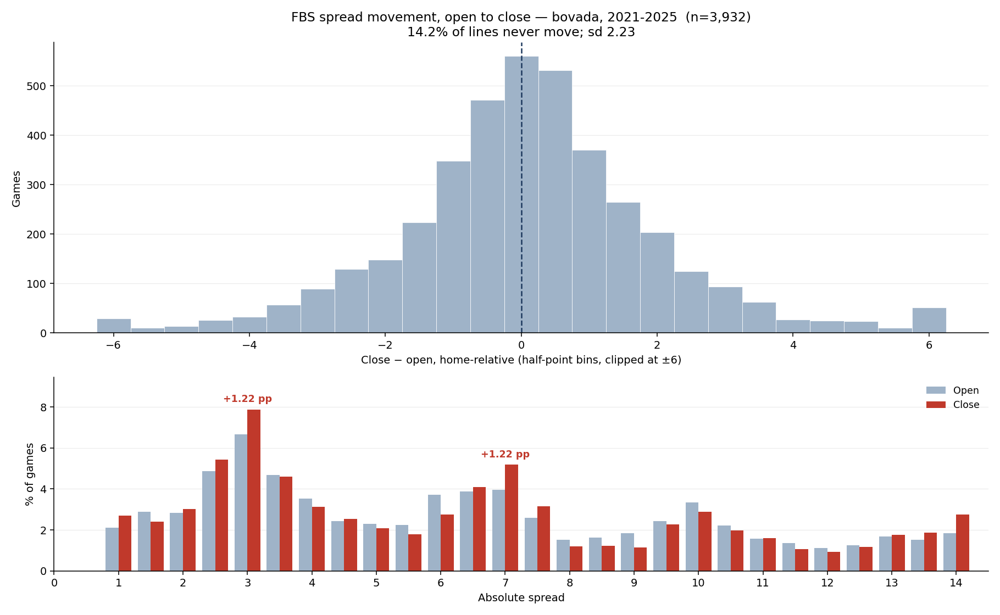

# How far spreads actually move, and where they settle

**Question.** Descriptively: how far does an FBS spread travel between the opener and the close,
how often does it not move at all, and which numbers does it end on? This is the *move itself*,
not whether anything forecasts it — that question belongs to
[`prereg-line-movement.md`](prereg-line-movement.md) and
[`line-movement-results.md`](line-movement-results.md), and nothing here restates their numbers.

**Method.** `move = spread_close − spread_open`, home-relative, so a positive move means the home
side got worse. Exact-move frequency, the share of lines that never move, and a comparison of
where lines sit at the opener against where they sit at the close. For the two key numbers, inflow
(`moved onto k`), outflow (`moved off k`) and retention (`opened on k and closed on k`) are
computed separately, because they turn out to say different things. Drift is a mean test on the
move, run with and without the season that carries it.
Script: [`analyze_line_movement_distribution.py`](../scripts/analyze_line_movement_distribution.py).

**Data.** `core.fact_game_line` in the warehouse — a real book open and close per provider —
filtered to FBS vs FBS, seasons **2021–2025**, **Bovada only**. n = **3,932** games.

Two constraints forced that window and that book, and both matter when reading this against the
other distribution studies:

- Open/close pairs do not exist in the warehouse before 2021. There is no way to run this on the
  2014–2025 window the [totals](../../../docs/total-points-distribution-2026-09-17.md) and
  [margin](../../../docs/scoring-margin-distribution-2026-09-18.md) studies use.
- Bovada is the only provider spanning the whole window (770–808 games a season). DraftKings
  enters in 2023 and ESPN Bet in 2024, so a median-across-books series would change composition
  mid-window and confound any trend with the basket. One stated book beats a moving basket.

**This is therefore a different population from the totals and margin entries** — 5 seasons and
one book against 12 seasons and all books. Do not read season-over-season differences here as
comparable to those.



## Most lines barely move

| Statistic | Value |
| --- | --- |
| Mean move | +0.134 |
| sd of move | 2.23 |
| Median move | 0.0 |
| Mean \|move\| | 1.46 |
| Median \|move\| | 1.0 |
| 90th pct \|move\| | 3.0 |
| Max \|move\| | 36.5 |

**14.24% of lines never move at all**, and the distribution is tight around zero:

| Band | Share of games |
| --- | --- |
| \|move\| = 0 | 14.24% |
| \|move\| ≤ 0.5 | 39.78% |
| \|move\| ≤ 1 | 58.04% |
| \|move\| ≤ 2 | 79.43% |
| \|move\| ≤ 3 | 90.54% |
| \|move\| ≤ 5 | 97.38% |

Direction is close to balanced: the favourite gets **more** favoured in 42.17% of games and
**less** favoured in 38.38%, and the line flips sides entirely in 4.07%.

The sd of 2.23 here sits alongside the **2.48** that `line-movement-results.md` reports from the
Prediction Tracker archive over 14,068 games, 2006–2025. Different source, different window,
different definition of "close" — they agree in magnitude, and neither supersedes the other.

## The market moves onto the key numbers

The margin study found that **3 and 7 hold 18.5% of all games between them**. The market ends up
concentrated on those same two numbers, and it is more concentrated at the close than at the open:

| Absolute spread | Open | Close | Change |
| --- | --- | --- | --- |
| 2.5 | 4.88% | 5.44% | +0.56 |
| **3** | **6.66%** | **7.88%** | **+1.22** |
| 3.5 | 4.68% | 4.60% | −0.08 |
| 6 | 3.71% | 2.75% | −0.97 |
| 6.5 | 3.89% | 4.09% | +0.20 |
| **7** | **3.97%** | **5.19%** | **+1.22** |
| 7.5 | 2.59% | 3.15% | +0.56 |

Games closing on 3 or 7 exactly: **13.07%**, up from **10.63%** at the open. This is specific to
those numbers, not a general pull toward whole numbers — the share of lines sitting on *any* whole
number is 52.80% at the open and 52.72% at the close, unchanged.

## 3 and 7 get there by different routes

Both gain exactly +1.22 points of share, which invites the assumption that the same thing is
happening at each. It is not.

| | 3 | 7 |
| --- | --- | --- |
| Moved onto it | 6.38% | 4.15% |
| Moved off it | 5.16% | 2.92% |
| Net | +1.22 | +1.22 |
| Jumped through without settling | 3.33% | 3.46% |
| **Retention** — opened on it and closed on it | **22.52%** (n=262) | **26.28%** (n=156) |
| Retention at k−0.5 | 22.40% (n=192) | 21.57% (n=153) |
| Retention at k+0.5 | 19.57% (n=184) | 13.73% (n=102) |

**7 is sticky. 3 is not.** A line that opens on 7 stays there 26.28% of the time against 21.57%
at 6.5 and 13.73% at 7.5. A line that opens on 3 stays 22.52% of the time — indistinguishable
from 2.5's 22.40%. So 3's net gain is **pure inflow**: it attracts lines from elsewhere without
holding them any better than its neighbours do. 7's gain is inflow *and* retention.

The retention cells are thin (n=102–262), so treat the ordering within each column as indicative
rather than established.

## No stable drift

The pooled mean move is +0.134 points, home-relative — lines drift very slightly toward the away
side. It does not survive scrutiny:

| Series | Mean move | SE | t | n |
| --- | --- | --- | --- | --- |
| All seasons | +0.1344 | 0.0356 | +3.77 | 3,932 |
| Excluding 2024 | +0.0808 | 0.0410 | +1.97 | 3,137 |

One season carries most of it, and the per-season means alternate sign:

| Season | n | Mean move | sd | No-move % | Closed on 3 or 7 |
| --- | --- | --- | --- | --- | --- |
| 2021 | 770 | +0.157 | 2.03 | 16.75% | 13.12% |
| 2022 | 769 | −0.027 | 1.97 | 15.99% | 10.79% |
| 2023 | 790 | +0.112 | 3.04 | 9.87% | 13.54% |
| 2024 | 795 | +0.346 | 1.97 | 14.84% | 12.83% |
| 2025 | 808 | +0.080 | 1.95 | 13.86% | 14.98% |

Even taken at face value, +0.134 points is smaller than the half-point tick the line is quoted in
and far inside the vig. **Treat the move as centred on zero.**

## What this does not support

- **It is not a forecasting result.** Nothing here predicts the move, tests an edge, or measures
  closing-line value. Whether the PT panel anticipates any of this is the separate, preregistered
  question in `line-movement-results.md`; this study neither supports nor undercuts it.
- **The key-number concentration is not a betting edge.** That the market ends on 3 and 7 more
  often than it starts there says the market agrees those numbers matter. It says nothing about
  whether a line sitting on 3 is priced correctly, or about which side of it to take.
- **One book, five seasons.** Bovada is not the market. A different book, or the median across
  books, could settle on different numbers; the 2023–2025 overlap with DraftKings and ESPN Bet was
  not used to check that, and doing so would confound the comparison with composition change.
- **"Open" and "close" are the warehouse's fields, not timestamps.** There is no tick path here —
  the move is one number, and this says nothing about the path between them, when it happened, or
  how many times the line changed direction. The tick-path limitation is documented in
  `tick-anchored-model-infeasible-2026-09-17.md`.
- **Retention cells are thin.** n runs 102–262 for the key-number retention comparisons. The
  3-versus-2.5 null (22.52% against 22.40%) is a null on small samples, not a demonstration of
  equality.
- **No multiple-comparison correction** across the 14 spread values in the open-versus-close
  table. 3 and 7 were named in advance by the margin study; the rest of the rows are descriptive.

## Reproduce

```
python research/spread/scripts/analyze_line_movement_distribution.py
```

Writes `research/spread/docs/img/line-movement-distribution.png` (committed) and the full exact-move
frequency table to `research/spread/docs/data/line-movement-frequency.csv` (generated on each run,
not committed — covered by the repo's `data/` ignore rule). Prints every number quoted above.
