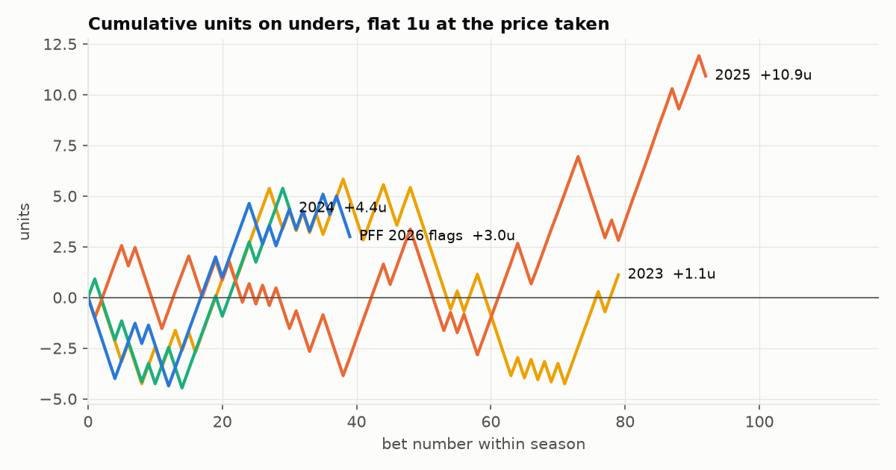
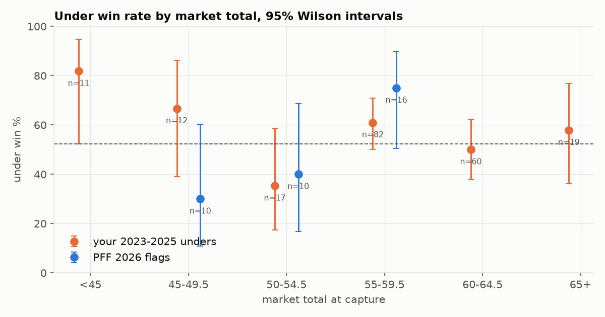
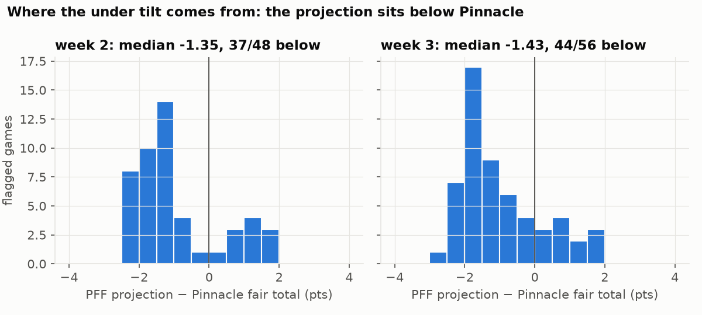

# PFF Greenline totals, 2026 season to date

Generated 2026-09-16 by `research/totals/scripts/greenline_season_review.py`. Graded at the line in the capture, -110 on spreads and totals, market price on moneylines. Intervals are 95% Wilson. Pushes excluded from win% and calibration.

**Graded weeks:** 2. **Pending:** week 3 (57 flags)

## Record by market

| market | record | win% | 95% CI | units | ROI |
|---|---|---:|---|---:|---:|
| total | 27-22 | 55.1% | 41–68% | +2.55u | +5.2% |

Break-even at -110 is 52.4%. At n=49 pooled, the smallest true win rate a one-sided test would reliably detect is 70%; per market it is total 70%. Anything short of that is not evidence either way.

## By side

| market | side | record | win% | 95% CI | units | ROI |
|---|---|---|---:|---|---:|---:|
| total | over | 5-5 | 50.0% | 24–76% | -0.45u | -4.5% |
| total | under | 22-17 | 56.4% | 41–71% | +3.00u | +7.7% |

## Closing-line value (PFF board close)

- **total**: mean +0.36 ± 0.32 pts (n=44); beat close 19, lost 12, flat 13

Positive means the number moved toward PFF's side after the capture. This is the board PFF shows, not Pinnacle, so it measures whether PFF's flags lead their own displayed market.

## Does PFF's own ranking work?

| market | top half by value | bottom half |
|---|---|---|
| total | 13-11 | 54.2% | 35–72% | +0.82u | +3.4% | 14-11 | 56.0% | 37–73% | +1.73u | +6.9% |

## Calibration of PFF's stated probabilities

| market | n | mean stated p | actual win% | Brier (PFF) | Brier (market) |
|---|---:|---:|---:|---:|---:|
| total | 49 | 55.0% | 55.1% | 0.2478 | 0.2500 |

Market Brier uses 0.5 for spreads and totals (a flag is a bet against a -110 line) and the vig-free price for moneylines. PFF beating the market column means its stated probabilities carry information; a stated-p above the actual win% means the numbers are overconfident.

## Method and data

- **Flags**: every game PFF Greenline priced, captured from a live Pro session before kickoff via `scripts/pull_pff_scoreboard.py --greenline`. PFF deletes the props at kickoff, so only captured weeks exist: week 2 (2026-09-09), week 3 (2026-09-16).
- **Grading**: at PFF's displayed line in the capture, -110, pushes returned. Finals from the refreshed PFF schedule, falling back to the warehouse (`core.fact_game`) where PFF never posts a score. Row-level results: `data/ingest/pff_scoreboard/greenline_results_<season>.csv`.
- **Personal history**: full-game NCAAF over/unders from the book export (`data/ingest/bet_history/history.csv`), 231 bets, graded at the price taken. Mostly Greenline unders as bet, so prior evidence on the same signal.
- **Pinnacle**: `greenline_vs_pinnacle.py` on the oddspapi snapshot nearest the capture; fair total is the vig-free midpoint. Bands follow `greenline_unders.py`.
- **Inference**: 95% Wilson intervals; break-even 52.4% at -110; MDE is the smallest true win rate a one-sided 5% test detects with 80% power. At n=49 that is 70%; at n=250 it is 60%; at n=500, 58%. Games within a week share weather and slate-wide scoring shocks, so intervals are, if anything, slightly narrow.

## Totals in depth

| split | record | win% | 95% CI | units | ROI |
|---|---|---:|---|---:|---:|
| week 2 | 27-22 | 55.1% | 41–68% | +2.55u | +5.2% |
| all weeks | 27-22 | 55.1% | 41–68% | +2.55u | +5.2% |
| your 2023 totals | 51-43 | 54.3% | 44–64% | +3.34u | +3.5% |
| your 2023 unders | 42-37 | 53.2% | 42–64% | +1.11u | +1.4% |
| your 2023 overs | 9-6 | 60.0% | 36–80% | +2.23u | +14.8% |
| your 2024 totals | 21-14 | 60.0% | 44–74% | +5.07u | +14.5% |
| your 2024 unders | 18-12 | 60.0% | 42–75% | +4.38u | +14.6% |
| your 2024 overs | 3-2 | 60.0% | 23–88% | +0.69u | +13.8% |
| your 2025 totals | 62-40 | 60.8% | 51–70% | +16.11u | +15.8% |
| your 2025 unders | 54-38 | 58.7% | 48–68% | +10.92u | +11.9% |
| your 2025 overs | 8-2 | 80.0% | 49–94% | +5.19u | +51.9% |
| your 2023-2025 totals (baseline) | 134-97 | 58.0% | 52–64% | +24.52u | +10.6% |
| your 2023-2025 unders | 114-87 | 56.7% | 50–63% | +16.41u | +8.2% |

| unders by market total | your 2023-2025 | PFF 2026 flags | pooled | pooled 95% CI |
|---|---|---|---|---|
| <45 | 9-2 (82%) | 1-0 (100%) | 10-2 (83%) | 55–95% |
| 45-49.5 | 8-4 (67%) | 3-7 (30%) | 11-11 (50%) | 31–69% |
| 50-54.5 | 6-11 (35%) | 4-6 (40%) | 10-17 (37%) | 22–56% |
| 55-59.5 | 50-32 (61%) | 12-4 (75%) | 62-36 (63%) | 53–72% |
| 60-64.5 | 30-30 (50%) | 1-0 (100%) | 31-30 (51%) | 39–63% |
| 65+ | 11-8 (58%) | 1-0 (100%) | 12-8 (60%) | 39–78% |

| under flags by PFF value | record | win% | 95% CI | units | ROI |
|---|---|---:|---|---:|---:|
| <2% | 2-3 | 40.0% | 12–77% | -1.18u | -23.6% |
| 2-3% | 4-2 | 66.7% | 30–90% | +1.64u | +27.3% |
| 3-4% | 13-6 | 68.4% | 46–85% | +5.82u | +30.6% |
| 4%+ | 3-6 | 33.3% | 12–65% | -3.27u | -36.4% |

## Figures







## Pending: week 3

- 57 flagged games; totals 49 under / 8 over; spreads 36 away / 21 home; moneylines 21 away / 32 home.
- mean stated edge: totals +2.50%, spreads +4.07%.

### Week 3 under list (43 positive-edge flags, repriced at DraftKings)

| # | game | PFF line | PFF edge | DK line | DK odds | DK edge | band | your history |
|---:|---|---:|---:|---:|---:|---:|---|---|
| 1 | NDSU @ SAC | 50.5 | +3.7% | 51.5 | -102 | +10.0% | 50-54.5 | 6-11 (35%) |
| 2 | HOU @ TT | 52.5 | +5.2% | 53.5 | -105 | +9.5% | 50-54.5 | 6-11 (35%) |
| 3 | SMU @ LOU | 59.5 | +3.6% | 59.5 | -102 | +5.8% | 55-59.5 | 50-32 (61%) |
| 4 | LAT @ BAY | 53.0 | +3.6% | 53.5 | -108 | +5.4% | 50-54.5 | 6-11 (35%) |
| 5 | UTSA @ TEX | 58.5 | +3.8% | 58.5 | -105 | +4.9% | 55-59.5 | 50-32 (61%) |
| 6 | MRSH @ MOST | 52.5 | +4.9% | 52.5 | -108 | +4.8% | 50-54.5 | 6-11 (35%) |
| 7 | TROY @ MIZZ | 50.5 | +3.7% | 50.5 | -108 | +4.8% | 50-54.5 | 6-11 (35%) |
| 8 | FRES @ SJSU | 50.5 | +3.7% | 50.5 | -108 | +4.8% | 50-54.5 | 6-11 (35%) |
| 9 | NEV @ MTSU | 50.5 | +4.3% | 50.5 | -112 | +4.7% | 50-54.5 | 6-11 (35%) |
| 10 | UVA @ WVU | 53.5 | +4.3% | 53.5 | -110 | +4.6% | 50-54.5 | 6-11 (35%) |
| 11 | SYR @ PITT | 51.5 | +5.3% | 51.5 | -110 | +4.6% | 50-54.5 | 6-11 (35%) |
| 12 | CHAR @ APP | 51.5 | +4.7% | 51.5 | -108 | +4.2% | 50-54.5 | 6-11 (35%) |
| 13 | UNM @ OKLA | 46.5 | +4.3% | 46.5 | -115 | +4.1% | 45-49.5 | 8-4 (67%) |
| 14 | BALL @ LIB | 49.5 | +4.1% | 49.5 | -112 | +4.1% | 45-49.5 | 8-4 (67%) |
| 15 | CCAR @ DEL | 57.5 | +3.7% | 57.5 | -110 | +3.9% | 55-59.5 | 50-32 (61%) |
| 16 | KU @ ASU | 50.5 | +3.7% | 50.5 | -112 | +3.9% | 50-54.5 | 6-11 (35%) |
| 17 | UF @ AUB | 53.5 | +4.0% | 53.5 | -112 | +3.7% | 50-54.5 | 6-11 (35%) |
| 18 | MST @ SCAR | 58.5 | +4.1% | 58.5 | -112 | +3.6% | 55-59.5 | 50-32 (61%) |
| 19 | FIU @ FAU | 62.5 | +2.8% | 62.5 | -110 | +3.5% | 60-64.5 | 30-30 (50%) |
| 20 | UNT @ TXST | 63.5 | +2.5% | 63.5 | -110 | +3.4% | 60-64.5 | 30-30 (50%) |
| 21 | ARST @ TCU | 56.5 | +3.0% | 56.5 | -110 | +3.3% | 55-59.5 | 50-32 (61%) |
| 22 | JMU @ SDSU | 46.5 | +2.3% | 46.5 | -105 | +3.1% | 45-49.5 | 8-4 (67%) |
| 23 | TEM @ TOL | 50.5 | +4.0% | 50.5 | -118 | +3.0% | 50-54.5 | 6-11 (35%) |
| 24 | UTEP @ MICH | 49.5 | +3.8% | 49.5 | -115 | +3.0% | 45-49.5 | 8-4 (67%) |
| 25 | MIA @ WF | 55.5 | +3.9% | 55.5 | -115 | +2.7% | 55-59.5 | 50-32 (61%) |
| 26 | LSU @ MISS | 58.5 | +3.8% | 58.5 | -115 | +2.6% | 55-59.5 | 50-32 (61%) |
| 27 | KENN @ TENN | 59.5 | +2.4% | 59.5 | -110 | +2.6% | 55-59.5 | 50-32 (61%) |
| 28 | UAB @ ULL | 56.5 | +2.7% | 56.5 | -112 | +2.5% | 55-59.5 | 50-32 (61%) |
| 29 | GASO @ JVST | 52.5 | +4.3% | 52.5 | -115 | +2.5% | 50-54.5 | 6-11 (35%) |
| 30 | TUL @ KSU | 49.5 | +2.9% | 49.5 | -112 | +2.4% | 45-49.5 | 8-4 (67%) |
| 31 | WKU @ IND | 60.5 | +2.9% | 60.5 | -115 | +2.4% | 60-64.5 | 30-30 (50%) |
| 32 | USC @ RUTG | 59.5 | +3.0% | 59.5 | -115 | +2.2% | 55-59.5 | 50-32 (61%) |
| 33 | UK @ TXAM | 49.5 | +3.2% | 49.5 | -115 | +2.1% | 45-49.5 | 8-4 (67%) |
| 34 | EMU @ WIS | 45.5 | +2.7% | 45.5 | -108 | +2.0% | 45-49.5 | 8-4 (67%) |
| 35 | USU @ UTAH | 56.5 | +2.7% | 56.5 | -115 | +1.9% | 55-59.5 | 50-32 (61%) |
| 36 | UGA @ ARK | 54.5 | +1.7% | 54.5 | -108 | +1.8% | 50-54.5 | 6-11 (35%) |
| 37 | VT @ UMD | 53.5 | +2.2% | 53.5 | -115 | +0.8% | 50-54.5 | 6-11 (35%) |
| 38 | ECU @ ODU | 49.5 | +4.6% | 48.5 | -112 | +0.8% | 45-49.5 | 8-4 (67%) |
| 39 | CONN @ USM | 54.5 | +1.1% | 54.5 | -112 | +0.2% | 50-54.5 | 6-11 (35%) |
| 40 | AKR @ MINN | 49.5 | +0.5% | 49.5 | -108 | -0.2% | 45-49.5 | 8-4 (67%) |
| 41 | GAST @ UCF | 50.5 | +0.8% | 50.5 | -112 | -0.3% | 50-54.5 | 6-11 (35%) |
| 42 | FSU @ BAMA | 48.5 | +0.4% | 48.5 | -110 | -1.9% | 45-49.5 | 8-4 (67%) |
| 43 | STAN @ DUKE | 51.5 | +2.4% | 50.5 | -115 | -4.8% | 50-54.5 | 6-11 (35%) |

## Reading

**What "whole season" covers.** Weeks 2 and 3 of 2026, plus your own 2023-25 unders as prior evidence. PFF removes Greenline props at kickoff: probed weeks 0, 1 and 2 through a live premium session on 2026-09-16 and every `greenline_total_prop` came back null, including week 2 games we had captured live. Capture began 2026-09-10, so weeks 0-1 (102 games) are gone and cannot be backfilled.

**Bottom line.** PFF's 2026 totals flags: 27-22 (55.1%, CI 41-68%), unders 22-17. Break-even sits inside the interval. One graded week detects nothing below a 70% true win rate. Your 2023-25 unders, which were mostly these same flags as you bet them: 114-87 (56.7%, CI 50-63%). Pooled with week 2: 136-104, 56.7%, CI 50-63%. The lower bound touches break-even; the point estimate is a real but modest edge, worth roughly 8% ROI at -110 if it holds.

**Why the personal history is prior evidence, not a baseline.** Those unders were mostly Greenline flags, filtered by which ones you chose to take and shopped for price. Same signal, earlier seasons, selection on top. It says the flags were profitable to bet across three seasons; it does not say your selection added nothing, and it does not confirm PFF from outside.

**Structure that recurs**

- Under share: 39/49 (week 2), 49/57 (week 3). The projection sits below Pinnacle's fair total on 37/48 (w2) and 44/56 (w3) flagged games, median shade -1.35 and -1.43 points (`figs/pinnacle_shade.png`). A model with a low mean, not game-by-game reads.
- PFF's stated under probabilities were calibrated in week 2 (55.0% stated, 55.1% actual; Brier 0.248 vs 0.250 for a coin). Small information content, correctly sized.
- `value` does not rank outcomes: 4%+ bucket 3-6, 3-4% bucket 13-6, top half vs bottom half 13-11 vs 14-11. Do not size by it.
- The 55-59.5 band is the one split that was on the table before week 2 was graded (band table built 2026-09-10 from 2023-25 history: 50-32). Week 2 went the same way (12-4). Pooled 62-36, 63.3%, CI 53-72%, n=98 (`figs/band_winrate.png`). Strongest single thread here.
- 50-54.5 is the mirror: 6-11 in history, 4-6 in week 2, pooled 10-17 (37%, CI 22-56%). Week 3 has 19 of its 43 repriced unders in that band and 12 in 55-59.5.
- CLV on PFF's own board: +0.36 +/- 0.32 points, 19 beat / 12 lost / 13 flat. Barely excludes zero; the reference is PFF's displayed number, not a sharp close.
- Season shape (`figs/cumulative_units.png`): 2023 spent 60 bets under water before finishing +1.1u; 2025 was +10.9u. Drawdowns of 4-5 units mid-season are normal at this edge and sample size.

**What this does not support**

- Betting every Greenline under as a system. Pooled lower bound is at break-even, and the pooled sample is selection-filtered.
- Sizing by PFF's edge number. Its ranking has not ordered outcomes in any split so far.
- Treating the band pattern as settled: 98 games in the good band, 27 in the bad one.
- Any claim about weeks 0-1, or about spreads and moneylines (see `greenline-season-review-2026-09-16.md`).

**What settles it.** Four more graded weeks brings 2026 flags to n~250 (MDE 60%); with the history pooled, n~450 (MDE 58%). The band split needs the 50-54.5 cell to keep losing and 55-59.5 to keep winning for another ~50 games each before it is more than a lean. Week 3 grades Monday.

**Reproduce**

```
python scripts/pull_pff_scoreboard.py --season 2026
python research/totals/scripts/greenline_unders.py --week <w> && python research/totals/scripts/match_greenline_books.py --week <w>
python research/totals/scripts/greenline_season_review.py --totals --figs --out research/totals/docs/greenline-totals-season-<date>.md
```
The script regenerates the tables and figures; this section is hand-written and lives in the dated copy.

## Lower bound to bet

`research/totals/scripts/greenline_bet_bounds.py`. The conservative test: take each split's Wilson lower bound as the true win rate and ask whether it still beats 52.4% at -110. Point-estimate EV shown beside it so the price of caution is visible.

| split (unders) | record | win% | 95% floor | EV at floor | EV at point | 1/4 Kelly at floor | worst price | bet at floor? |
|---|---|---:|---:|---:|---:|---:|---:|---|
| all, history + 2026 flags | 136-104 | 56.7% | 50.3% | -3.9% | +8.2% | 0 | -101 | no |
| PFF 2026 flags only | 22-17 | 56.4% | 41.0% | -21.8% | +7.7% | 0 | +144 | no |
| band <45, pooled | 10-2 | 83.3% | 55.2% | +5.4% | +59.1% | 1.5% | -123 | yes, n=12 |
| band 55-59.5, pooled | 62-36 | 63.3% | 53.4% | +1.9% | +20.8% | 0.5% | -115 | yes |
| band 50-54.5, pooled | 10-17 | 37.0% | 21.5% | -58.9% | -29.3% | 0 | +364 | no |
| PFF value 3-4% | 13-6 | 68.4% | 46.0% | -12.2% | +30.6% | 0 | +117 | no |

At a 90% interval the pooled all-unders floor is 51.4% (still short), 55-59.5 rises to 55.0% (EV +5.0%, quarter-Kelly 1.4%, worst price -122).

**Answer.** No split clears at the floor once you account for how it was chosen. The pooled all-unders floor is 50.3%, two points short; a true 56% edge needs about 720 games before its 95% floor clears break-even, and there are 240. The two bands that clear (55-59.5 at 53.4%, <45 on 12 games) are 2 of 8 looks at one sample, and the 2023-25 history that picked 55-59.5 as the band to watch is inside its own pooled floor. The clean pre-registered test for that band is 2026 alone: 12-4, floor 51%, not there yet.

**If betting anyway**, the floor gives the sizing and the price discipline: 55-59.5 unders at quarter-Kelly of the floor is 0.5% of bankroll per bet, and nothing worse than -115. Everything outside that band is entertainment-priced at the floor, whatever the point estimate says.

## Lower bound of PFF's own edge

Is there a minimum PFF `value` below which flags should be skipped? Sweep on the 2026 under flags (`greenline_bet_bounds.py`, second table):

| min PFF edge | record | win% | 95% floor |
|---:|---|---:|---:|
| any (>0) | 21-15 | 58.3% | 42% |
| 2% | 20-14 | 58.8% | 42% |
| 3% | 16-12 | 57.1% | 39% |
| 3.5% | 12-10 | 54.5% | 35% |
| 4% | 3-6 | 33.3% | 12% |

Spearman between stated edge and win: -0.11. Bottom half by edge 12-7, top half 10-10 (all 39 flags, including three PFF listed as under with a negative value). Repriced at DraftKings the picture is the same: every positive-edge flag 15-8, 4%+ only 5-5.

**Answer.** No floor is supported. The win rate is flat from any-positive through 3.5% and then falls, so raising the cutoff removes bets without improving the ones left. The only cutoff the data backs is zero after repricing: skip a flag when the book's number erases the edge (`match_greenline_books.py` does this), not when PFF's number is small. Thirty-nine games; a threshold effect worth 5 points of win rate would need several hundred to show.

## PFF edge window: upper and lower bound

`research/totals/scripts/greenline_edge_window.py`, on the 36 positive-edge under flags graded so far (week 2).

| stated edge | record | win% | 95% CI |
|---|---|---:|---|
| 0-2% | 1-1 | 50.0% | 9–91% |
| 2-3% | 4-2 | 66.7% | 30–90% |
| 3-3.5% | 4-2 | 66.7% | 30–90% |
| 3.5-4% | 9-4 | 69.2% | 42–87% |
| 4-5% | 2-5 | 28.6% | 8–64% |
| 5%+ | 1-1 | 50.0% | 9–91% |

Logistic fit of win on edge: slope -0.33 per point (se 0.39, p=0.40); quadratic term -0.35 (se 0.36, p=0.33). Neither distinguishable from zero. Stated edge correlates -0.54 with how far the projection sits below Pinnacle, but the biggest disagreements did not lose (shade < -2: 5-3), so a cap cannot be justified as "don't fade Pinnacle by more than X" either.

**Window.** Best contiguous range by lower bound: **2% to 4%**, 17-8 (68%), floor 48.4%. Dropped flags 4-7. That is the best of 21 ranges searched on 36 games; its floor is optimistic by construction and still does not clear break-even.

**Operating bounds, if betting now:** lower 2%, upper 4%, at PFF's number after repricing at the book (a flag that reprices below zero is out regardless). Flat stakes, half a unit, no Kelly: the floor is below break-even so Kelly at the floor is zero and Kelly at the point estimate is fitting to noise. Week 3 has 24 flags inside the window (of 45). Revisit at n=150, where a 15-point gap between the window and the tails would be a real difference.
